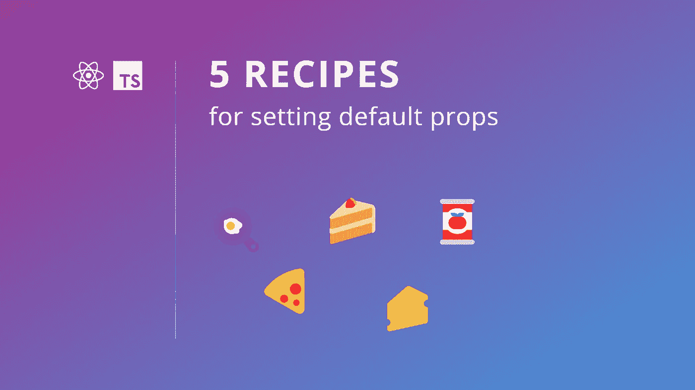

# 在 React 和 TypeScript 中设置默认属性的 5 种方法

> 原文：<https://betterprogramming.pub/5-recipes-for-setting-default-props-in-react-typescript-b52d8b6a842c>

## 让我们学习如何正确烹饪我们的道具！



作者图片

函数参数和对象属性中的默认值非常强大。它们允许消费者保持代码简单，同时为定制敞开大门。

在本文中，我将分享我设置默认属性的五个最佳方法——每个都有自己的用例。

# 简单的道具🍳

我将从最简单的开始，您可能已经在使用了。这个模式将覆盖 80%的用例。

假设您想要实现一个在列表中查找对象的函数，允许调用者指定一个可选的索引开始搜索。因为索引是可选的，所以您可以直接在函数的头部为它指定一个默认值。代码如下:

请注意，您不必为`fromIndex`指定类型，因为由于默认值(`0`)，TypeScript 隐式假定它是一个`number`。

同样的技术也适用于功能组件(它们毕竟是功能)。因此，为了完整起见，我们也来看一个简单的例子。

有问题的组件有一个可选的`variant`属性，用于确定对它应用什么样式。您也可以直接在函数头中设置默认值。看起来是这样的:

注意`Props`是一个对象，我们将它析构为三个变量:

1.  `value`，不可选
2.  `variant`，可选，初始化为默认值(`"filled"`)
3.  `others`，对象中的其余属性

## **奖金**

如果你的可选属性是一个`boolean`并且它的默认值是`false`，那么调用代码可以被简化。

例如，如果您有一个`Button`组件，其`disabled`属性默认设置为`false`，例如:

```
export function Button({ disabled = false } : Props) { /* ... */ }
```

然后，您可以向`Button`添加一个无值的`disabled`属性:

```
<Button disabled />
```

如果该属性存在，该属性将自动设置为`true`，如果省略，则为`false`(感谢默认值)。

# 分层道具🍰

从这一点开始，我将不再区分函数和组件，因为正如我们已经看到的，它们是相同的(它们都是函数)。

现在让我们假设你想接受一个更复杂的参数:一个对象。该对象本身是可选的，其属性也是可选的。因此，您希望确保来电者能够通过以下任一方式给您打电话:

*   包含所有属性的对象
*   包含一些属性的对象—对其余属性使用默认值
*   无对象—始终使用默认值

当您想要提供选项或接受 param 中的配置时，通常会这样做。然后，开发人员可以使用您的代码的普通版本，或者调整它以获得更大的粒度。

现在，让我们实现一个定制的钩子(它仍然是一个函数)。这个挂钩提供了一个计数器，您可以使用选项对其进行定制，例如增加的步数或最小/最大边界。

最终的代码可能如下所示:

我们创建了一个`CounterOptions`类型的第 3 行，其中所有字段都被标记为可选，其中`bounds`是一个对象(因为我们喜欢挑战)。

接下来，第 11 行我们声明了`useCounter`函数。它有两个参数:一个可选的`initial`值(默认设置为`0`—第 14 行)和一个带有`CounterOptions`的可选对象(设置为空对象`{}` —第 19 行)。

神奇的事情发生在第 13-19 行。在那里，我们析构了选项，并给它们赋了一个默认值。由于`bounds`是一个可选对象，我们也确保在默认情况下给它分配一个空对象`{}`，这样人们就可以不用设置`bounds`就可以使用我们的选项。`bounds`中的每个属性也被赋予一个默认值(第 16–17 行)。

> 无论嵌套级别如何，都可以为嵌套对象中的属性设置默认值。

钩子本身的实现很简单:代码不需要检查参数是否被初始化(它们总是被初始化)，它可以直接访问嵌套的 props(我们已经将它们析构到单独的变量中——不需要键入`props.bounds.max`来访问`max`)。

现在您可以在代码中最灵活地使用`useCounter`钩子了！这些都是有效的用例:

```
const counter = useCounter();
const counter = useCounter(1);
const counter = useCounter(0, { steps: 2 });
const counter = useCounter(10, { bounds: { min: 0 } });
const counter = useCounter(0, { bounds: { max: 10 } });
const counter = useCounter(
  0,
  { steps: 2, bounds: { min: 0, max: 10 } }
);
```

你可以在[这个沙盒](https://codesandbox.io/s/usecounter-oqhhb9)中看到它的运行。

如果您想导出默认值，也可以为它们创建常量。例如，看看这段代码:

老实说，我不喜欢这种设置默认值的方式。我们失去了一些声明性语法，并且引入了冗余。所以，如果你要用它，确保你有一个好的理由。

最后，你可能还想知道为什么我们不用:

```
export function useCounter(initial = 1, options = defaultOptions)
```

好吧，如果我们这样做，我们让开发人员负责使用他们自己的选项来确保他们提供对象中的每一个属性…这是一个要么接受要么放弃的情况。我们不能再依赖于初始化所有的选项，我们也失去了对象析构的好处。

# 充值道具🍕

有时，您的组件充当另一个组件的包装。在这种情况下，您可能希望返回一个带有默认属性的组件，并让消费者添加他们自己的属性。

为了演示这一点，让我们为 YouTube 视频创建一个包装器。如果你去 YouTube 点击“嵌入”按钮，你会得到一个代码片段，里面有一个 iframe 和视频的 URL。

在这个例子中，我们将把视频的 ID 提取到一个属性中，并自己编写其余的标记。由于嵌入的视频是一个 iframe，我们将让消费者覆盖它的属性。下面是实际运行中的代码:

*   第 4 行，我们扩展了“iframe”组件，以便继承它的属性。然后我们添加了一个`vid`属性来指定视频的标识符，以及另一个接收`start`时间的可选属性。
*   第 12 行，我们提取了我们的`vid`和`start`属性，以及剩余的属性(`others`)。我们还为`start`设置了一个默认值`0`，这样我们就可以再一次练习设置简单的道具。我们还添加了一个`ref`参数，但我们稍后会回到它。
*   第 14 行，我们返回了一个 iframe，带有计算的`src`，以及 YouTube 给我们的一些默认属性(`width`、`height`、`title`等)。).
*   但是有趣的部分在第 23 行:`{…others}`。得益于此，调用者可以向我们的组件提供任何支持的 iframe 属性，并让它们覆盖我们的默认值(包括`width`、`height`、`title`等)。).因为`{…others}`在 iframe 的所有其他道具之后，它将总是覆盖我们的值。如果我们想防止我们的值被覆盖，我们可以将它们移动到`{…others}`之后(例如:`<iframe {…others} src={`https…`} />`)。

该模式支持以下所有用例:

```
<YouTubeVideo vid="eX2qFMC8cFo" />
<YouTubeVideo vid="eX2qFMC8cFo" start={10} />
<YouTubeVideo vid="eX2qFMC8cFo" width="800" height="600" />
<YouTubeVideo vid="eX2qFMC8cFo" allowFullScreen={false} />
<YouTubeVideo vid="eX2qFMC8cFo" style={{border: '1px solid red'}} />
```

你可以在[这个沙盒](https://codesandbox.io/s/youtubevideo-bt298u?file=/src/YouTubeVideo.tsx)里玩。

使用这个方法，您可以扩展任何 HTML 元素(iframe、button、div 等)。)，甚至更高级的组件，如 [MUI 按钮](https://mui.com/material-ui/react-button/)或[文本字段](https://mui.com/material-ui/react-text-field/)。

## 裁判怎么了？

如果您查看代码，您可能想知道`ref`参数是什么(第 12 行)？没错。最容易理解的方法就是把它和`React.forwardRef`(第 9 行)一起去掉。

然后尝试[在你的应用程序中获取对 iframe 元素](https://reactjs.org/docs/hooks-reference.html#useref)的引用，就像你对“普通”iframe 所做的那样:

```
const ref = useRef<HTMLIframeElement>();
// ...
<YouTubeVideo vid="eX2qFMC8cFo" ref={ref} />
```

您将在控制台中得到一个警告:

```
Warning: Function components cannot be given refs. Attempts to access this ref will fail. Did you mean to use React.forwardRef()?Check the render method of `App`.
 at YouTubeVideo ([https://bt298u.csb.app/src/YouTubeVideo.tsx:25:18](https://bt298u.csb.app/src/YouTubeVideo.tsx:25:18))
 at div
 at App
```

我们添加到组件中的代码修复了这个问题。因此，如果您希望您的消费者使用 ref，不要忘记将其转发给包装的元素，因为它不是自动的。你可以在 React 文档中了解更多信息。

# 带孔道具🧀

与前面的例子类似，有时您只想创建一个带有默认属性的组件，并让调用者根据需要覆盖它们。

这是我喜欢在单元测试中使用的模式。它使用 TypeScript 的[分部类型](https://www.typescriptlang.org/docs/handbook/utility-types.html#partialtype)使所有属性成为可选的(甚至那些没有被标记为可选的)。

因此，让我们为之前实现的`YouTubeVideo`组件编写一些测试:

第 4–6 行，我们定义了一个`renderVideo`函数，它是流行的 [React 测试库](https://testing-library.com/docs/react-testing-library/intro/)的包装器。在其中，我们简单地用默认道具(`vid=eX2qFMC8cFo`)呈现了一个`YouTubeVideo`组件，并让调用者用部分`YouTubeVideoProps`覆盖它们。

然后我们能够在每个测试用例中调用`renderVideo`。我们可以在没有属性的情况下调用它，以验证组件使用默认值工作(第 8-10 行)，或者我们可以单独覆盖每个属性，并测试它的行为是否正常(`vid`第 12-18 行和`start`第 20-26 行)。

当然，你可以在单元测试之外使用这个方法。只要记住，如果你想提供一种方法来给一个物体提供‘洞’，那么`[Partial](https://www.typescriptlang.org/docs/handbook/utility-types.html#partialtype)`就是你的朋友。

# 加工过的道具🥫

你知道道具的默认值可以在调用时动态计算吗？是的，你可以用一个函数来计算它。还可以实例化一个新对象或使用模板字符串。您甚至可以访问早期的参数来计算它！

在这个例子中，我们调用`Date.now()`函数来初始化时间戳，如果调用者没有提供的话:

```
function addEntry(text: string, timestamp = Date.now())
```

整洁！

由于我们在设置默认值时可以访问早期的参数，因此我们也可以这样做:

```
function addEvent(
  title: string,
  start = new Date(),
  end = addMinutes(start, 30)
)
```

在这个例子中，我们将可选的开始日期初始化为当前日期(`start = new Date()`)，然后我们用一个函数将可选的结束日期初始化为开始日期加 30 分钟(`end = addMinutes(start, 30)`)。

下面是另一个使用模板字符串初始化用户全名的示例:

```
function createUser(
  name: string, 
  surname: string, 
  fullname = `${name} ${surname}`
)
```

我还想提一下，你也可以在一个析构的对象中访问早期的属性。这意味着下面的方法也有效(注意花括号——这次我们在 param 中取一个对象):

```
function createUser({
  name: string, 
  surname: string, 
  fullname = `${name} ${surname}`
})
```

今天就到这里吧！

如果你喜欢我的食谱，跟着我做更多这样的。🧑‍🍳

# 参考

[](https://developer.mozilla.org/en-US/docs/Web/JavaScript/Reference/Functions/Default_parameters) [## 默认参数— JavaScript | MDN

### 在 JavaScript 中，函数参数默认为。但是，设置不同的默认值通常很有用。这是…

developer.mozilla.org](https://developer.mozilla.org/en-US/docs/Web/JavaScript/Reference/Functions/Default_parameters) [](https://developer.mozilla.org/en-US/docs/Web/JavaScript/Reference/Operators/Destructuring_assignment) [## 析构赋值 JavaScript | MDN

### 基本赋值给新变量名一个属性可以从一个对象中解包并赋给一个变量…

developer.mozilla.org](https://developer.mozilla.org/en-US/docs/Web/JavaScript/Reference/Operators/Destructuring_assignment)