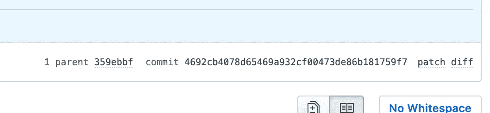

# 5 个超级有用的 Git 命令

> 原文：<https://betterprogramming.pub/5-simple-git-commands-to-supercharge-productivity-3bbd31da4abb>

## 一个简明的 Git 命令列表，可以提高源代码控制的速度和准确性


在 [Unsplash](https://unsplash.com/s/photos/github?utm_source=unsplash&utm_medium=referral&utm_content=creditCopyText) 上由 [Brina Blum](https://unsplash.com/@brina_blum?utm_source=unsplash&utm_medium=referral&utm_content=creditCopyText) 拍摄的照片

我们都知道 Git 有时很难理解。每个人最终都学会了用自己特别的充满仇恨的方式去爱 Git。为了帮助减轻痛苦，我收集了一些我最喜欢的 Git 命令。

您可能以前遇到过这些命令，或者您可能是 Git 新手，这些命令看起来很吓人。如果你是 Git 或 GitHub 的新手，我强烈建议你通读一下乔治·赛义夫写的[这篇文章](https://medium.com/@george.seif94/a-full-tutorial-on-how-to-use-github-88466bac7d42)。

如果你以前接触过 Git，并且已经有了基本的基础，那么请继续阅读！

# 1.修改现有提交

```
git commit --amend
```

这一个经常和这个列表中的第二个一起使用。您可以向现有提交添加新的更改，修改提交并强制将您的分支推送到新版本。这是在 GitHub 上更新现有 PR (Pull Request)的一种方式，本质上是将 PR 分支移到不同的提交。

如果您打错了字或者想要添加更多信息，这个命令也可以用来简单地修改现有的提交消息。

[*git-commit 帮助*](https://git-scm.com/docs/git-commit)

# 2.力推

```
git push origin --force
```

这种方法的使用取决于您的首选工作流程。如果你喜欢修改和强制推动现有的提交，而不是挤压或添加更多的提交，那么这是给你的。就我个人而言，我一直把它作为我的 GitHub 工作流程的一部分，因为当你完成时，它会产生一个更简单、更清晰的历史。

尝试此工作流之前，请确保您位于本地同一现有分支上。您需要添加您所做的任何新的更改，利用第一步来修改提交，然后执行这个命令来完成这个过程。

如果您需要对 PR 进行小的增量更改，这是目前最快的签入方式。

[*git-推送帮助*](https://git-scm.com/docs/git-push)

# 3.获取当前提交哈希

```
git rev-parse --short HEAD
```

如果你在 GitHub 中引用一个 commit 或 tag，你会注意到在右上角有一个特殊的部分，里面有一些 commit hash 信息。它看起来像这样:



GitHub 提交哈希信息。

有几种方法可以获得当前的短提交散列，但是这个命令是一个快速简单的方法，它只产生*短提交散列*，不产生其他任何东西。如果您想知道当前的提交散列是多少，它会向您显示。

[*git-rev-parse 帮助*](https://git-scm.com/docs/git-rev-parse)

# 4.差分或记录两点

```
git diff <branch_name_1>..<branch_name_2>
git log <tag_1>..<tag_2>
```

想要快速看出两个分支之间的区别吗？对两个标签之间的提交感到好奇？就这么简单。

如果您想快速查看您知道名称的两个分支之间的更改或提交，这将非常有用。如果你正在开发一个依赖于其他分支变化的新特性，你可以快速区分它们，并立即看到变化，而不必切换分支。

使用第二个命令也可以生成快速而肮脏的 changelog。您将能够很容易地看到 Git 历史中两点之间的提交。

[*git-log 帮助*](https://git-scm.com/docs/git-log)

[*git-diff 帮助*](https://git-scm.com/docs/git-diff)

# 5.重置一切

```
git reset --hard HEAD
```

你有没有开始在一个分支工作，做出改变，但你改变了主意，想完全重新开始？答对了。

使用此命令删除所有更改，并将分支重置为干净状态。

将会有一条消息显示提交`HEAD`被返回以及它包含的消息。

[*git-reset 帮助*](https://git-scm.com/docs/git-reset)

我希望您喜欢这些有用的命令，并在自己的工作流中实现它们，以获得更强大、更高效的 Git 体验！