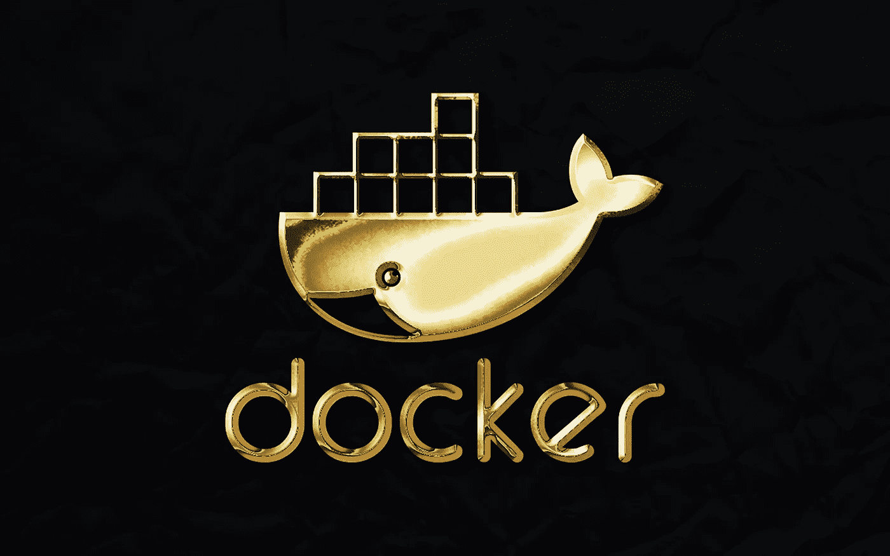

# 调试 Docker 容器的 5 个简单技巧

> 原文：<https://betterprogramming.pub/5-simple-tips-for-debugging-docker-containers-271cb3dee77a>

## 用最少的疯狂熏出恼人的容器问题



照片由 [Rubaitul Azad](https://unsplash.com/@rubaitulazad?utm_source=unsplash&utm_medium=referral&utm_content=creditCopyText) 在 [Unsplash](https://unsplash.com/s/photos/docker?utm_source=unsplash&utm_medium=referral&utm_content=creditCopyText) 上拍摄

有时候 Docker 容器可以是一个黑盒。无论您是构建底层映像还是使用公共映像，摆动的容器都令人沮丧。由于容器的执行方式和它们处理日志的方式，弄清楚发生了什么可能很困难。

在本文中，我们将探索一些基本的命令和参数，您可以使用它们来对特别复杂的容器进行故障诊断。如果容器无法启动，间歇性爆炸，或者您只是想要更多地了解图像细节，这些简单的选项是真正的游戏规则改变者。

# 1.更好的日志和时间戳

第一个也是最简单的例子是使用 Docker 已经提供的日志工具。大多数人已经知道如何查看容器中的日志:

```
docker logs <container_id>
```

但是，如果这个特定的容器已经运行了很长时间，并且有一个德克萨斯州大小的日志呢？在这种情况下，您可以简单地添加额外的`--tail`参数:

```
docker logs --tail 10 <container_id>
```

使用`--tail`选项，您可以看到日志的最后几行`n`。传入您想要查看的行数，可以让您直接跳转到最相关和最近的信息。

如果容器中的日志输出默认不包含时间戳，您也可以添加时间戳。Docker 允许您将`-t`标志传递给`log`，它将在每一行前面加上时间戳:

```
docker logs -t <container_id>
```

这些选项也可以结合起来，形成一个精确的故障诊断工具。现在，您将能够准确地说出事情发生的时间，而不必改变容器内的任何内容。

# 2.以 root 用户身份执行命令

如果您使用的是作为默认根用户运行的映像，那么这不是问题。当您不以 root 用户身份运行，而是使用非特权用户时，这是一个很好的故障排除工具。

如果你跑步:

```
docker exec -it <container_id> /bin/sh
```

这将始终以底层映像中定义的用户身份运行。如果这个用户没有 root 权限，那么就很难尝试进入一个正在运行的容器进行故障排除(特别是当您需要安装任何东西的时候)。

如果您想以 root 用户的身份进入容器，您所要做的就是传递以下内容:

```
docker exec -u 0 -it <container_id> /bin/sh
```

这将告诉 Docker 使用 ID 为`0`的用户。这是根。现在，当您进入容器时，您就可以使用全部权限进行调试了。

# 3.将容器提交为图像

这是 Docker 一个经常被忽略的特性。实际上，您可以从现有的容器创建一个新的图像。这意味着，如果你一直在摆弄一个容器，并做了一些修改来修复一些错误，你可以马上从它旋转出新的容器。你甚至不用去重建 docker 文件。

以下命令将提交现有容器中的新映像:

```
docker commit <container_name> <new_image>
```

这将使用您指定的任何名称创建一个新的映像，并且您可以立即使用它来旋转新的容器。

`commit`命令的另一个好处是，您可以在提交过程中将 Dockerfile 语法传递给它。如果您想要提交一个现有的容器，但是更改了其中的一个环境变量，那么您可以使用`--change`标志来传递它:

```
docker commit --change="ENV foo=bar" <container_name> <new_image>
```

您可以将多个不同的`changes`传递给`commit`命令，以便在命令行上创建令人印象深刻的精细图像。

# 4.匹配图像哈希

如果您正在对已经存在一段时间的容器进行故障诊断，您可能不知道它是用哪个特定版本的映像构建的。如果您使用像 Docker Hub 或 Elastic Container Registry 这样的容器注册中心，您可以很容易地获得图像的散列，并将其与您的容器进行比较。

获取容器所有元数据的一种快速方法是使用`inspect`命令。这很好，但是它给了你大量的信息。如果您想要的只是图像散列，那么您可以使用如下的一点格式化魔法来得到它:

```
docker inspect --format "{{ .Image }}" <container_id>
```

这应该会输出容器正在运行的映像的 sha256 哈希。哈希可以与注册表中的哈希进行比较，以确定它是何时构建的。

现在你可以完全确定哪个版本在哪里运行。

# 5.跳过构建缓存

如果你真的很难理解为什么构建会失败，有问题或者只是没有包含你做的一些更改，那么可能是时候放弃缓存了。虽然 Docker 应该识别对层的更改并根据需要重建，但有时您需要从头开始的安心。

如果希望在不利用任何现有构建缓存的情况下构建映像，可以运行以下命令:

```
docker build --tag <tag> --no-cache .
```

这将忽略缓存中任何以前构建的项目，并强制所有内容从零开始构建。如果您正在处理一个图像的多次迭代，并希望确保对一些图层进行非常细微的更改，这将非常方便。

感谢您的阅读！你最喜欢的码头工人建议是什么？看看我其他的一些 Docker 帖子:

*   [*如何在 Docker 容器之间共享 Postgres 套接字*](/how-to-share-a-postgres-socket-between-docker-containers-ad126e430de7)
*   [*用 Ansible* 部署码头集装箱](https://levelup.gitconnected.com/deploying-docker-containers-with-ansible-2a74a420e2b1)