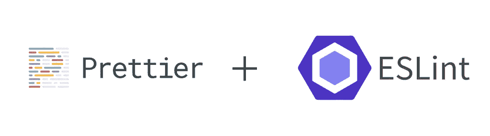

# 5 个简单而有效的反应练习

> 原文：<https://betterprogramming.pub/5-simple-yet-effective-react-practices-c6b906224526>

## 编写有效 React 代码的简单方法

React 是当今用于创建用户界面的最流行的前端库之一。代码是基于 JavaScript 的，通常，在编写 React 代码时，在如何编写方面有很大的余地。然而，这种自由也可能转化为缺乏标准化和糟糕的代码质量。

首先，查看这篇文章，其中 [Caelin Sutch](https://medium.com/u/f580c817199e?source=post_page-----c6b906224526--------------------------------) 提供了一些关于 React 最佳实践的好建议。在本文中，我将以这些技巧为基础，探索可以帮助您编写更干净、更有效的代码的其他最佳实践。

再一次，以下是我在 React 中编程多年积累的技巧和建议。我希望它们能成为你的良好指南。在你觉得合适的地方，随意适应和即兴创作。

所以让我们开始吧！

# 代码林挺和格式

第一个技巧是在 React 项目中使用代码林挺和格式化工具。这样做最明显的原因是，它有助于维护代码的标准，尤其是对于多个参与者。想象一个开发团队，他们每个人都以不同的风格编写代码——这将是一场噩梦。

我最喜欢的选择是同时使用 ESLint 和 Prettier。

> 更漂亮的是代码格式化程序，它负责你的代码应该是什么样子。ESLint 是一个 linter，它不仅仅是格式化，它还有助于发现可能导致 bug 的代码错误。

如果你对 ESLint 和 Prettier 都不熟悉，我在这里写了一篇[文章](https://javascript.plainenglish.io/4-step-guide-to-setting-up-eslint-prettier-d87904a7746e)，告诉你如何在两分钟内让它在你的项目中运行起来！

# 条件渲染技巧

Caelin Sutch 在他的文章中也谈到了这个问题，但这是一个关键的技巧，我想详细解释一下。

谈到有条件渲染，我们有两种基本情况要处理:

*   仅在满足条件时渲染组件，或者不渲染任何内容
*   满足条件时呈现组件 A，否则呈现组件 B

这两种情况的关键区别在于，在一种情况下，我们要么渲染一个组件，要么什么都不渲染。为了编写符合这种情况的干净代码，我们可以在代码中使用一种叫做短路的方法。让我们来看看一个坏的例子和一个好的例子。

## 坏榜样

## 好榜样

在这个糟糕的例子中，我们正在检查`showModal`条件，如果它是真的就呈现一个模态，否则就呈现`null`。相反，在这个好例子中，我们使用了一种使用`&&`符号的短路方法。如果`showModal`为假，则不会评估该条件之后的任何内容。

# 使用功能组件

React 钩子是在 React 16.8 中引入的，这允许我们编写功能组件，而不需要我们声明基于类的组件。我强烈建议使用功能组件，因为它们可以保持代码的可读性和简单性。主要的区别当然是在语法上。作为一个例子，让我们看看一个简单的`Title` React 组件。

## 基于类的组件

## 功能成分

David jch 在他的文章[这里](https://djoech.medium.com/functional-vs-class-components-in-react-231e3fbd7108)中提供了为什么功能组件应该优先于类组件的充分理由。总结一下:

*   更容易阅读和测试
*   较少代码
*   更容易实施最佳实践
*   未来 React 版本中可能的性能提升

# 创建布局组件

更多的时候，我们发现自己在重复 React 页面中的一些组件。例如，几乎每个页面都需要一些标题属性和 meta 标签。类似地，`footer`是在许多组件中发现的另一个部分。

我们可以创建一个布局组件来为我们处理组合，而不是在每个页面级组件中重复组件组合。这可能看起来像这样:

在这个`SiteLayout`组件中，我们通过用通用组件组合页面，为我们的页面提供了一个预定义的结构。现在，为了呈现一个页面，比如一个讨论您的应用程序的“关于”页面，我们可以创建一个页面组件，如下所示:

这种创建页面和组件的结构化方法保持了代码的模块化和可组合性。它还可以防止重复编码。

# 布尔道具

清理 React 代码的另一个技巧是当布尔属性为真时隐式高亮显示它们。考虑以下代码:

当`showModal`为真时，我们不需要显式地将 prop 作为`showModal={true}`传递。相反，我们可以隐式地声明道具的名称，它将被传递给值为 true 的子组件。

# 结论

将上述指南添加到您的编码实践中，将有助于确保编码风格的更大标准化，并保持您的代码库干净和精简。请随意根据提示进行即兴创作，一如既往，祝您编码愉快！