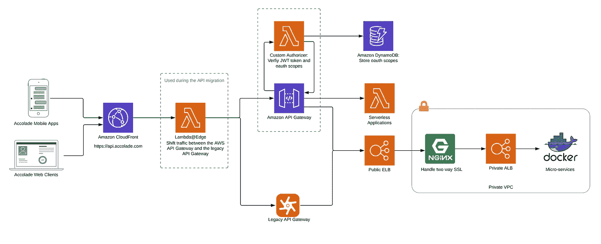

# 2021 年将出现的 5 大软件发展趋势

> 原文：<https://betterprogramming.pub/5-software-development-trends-to-embrace-in-2021-a63d6a23dc93>

## 过去一年发生了很多变化，但还有更多值得期待的

凯利·西克玛在 [Unsplash](https://unsplash.com?utm_source=medium&utm_medium=referral) 上的照片

在许多方面，2020 年感觉像是失落的一年。远程工作和没有旅行已经对我们中最好的人造成了损害。2020 年对我们几乎所有人来说都是过山车，但当涉及到数字转型和软件时，事情一如既往地多事。疫情迫使许多企业以这样或那样的方式在网上开展业务。软件开发服务对企业来说从未如此重要。这就是为什么了解行业当前趋势如此重要的原因。

以下是将主导 2021 年软件开发的一些趋势:

# 无服务器架构

图片在[https://AWS . Amazon . com/lambda/resources/customer-references/accolade-server less-architecture/](https://aws.amazon.com/lambda/resources/customer-testimonials/accolade-serverless-architecture/)

无服务器计算是无状态功能即服务(FaaS)和有状态存储后端即服务(BaaS)的结合，前者如 AWS Lambda，后者如 AWS S3。

> 在我们的定义中，对于被视为无服务器的服务，它必须在不需要显式资源调配的情况下自动扩展，并根据使用情况计费—伯克利对无服务器计算的看法

*   无服务器计算是完全管理云服务的地方。它允许您编写代码来构建应用程序，而无需管理或维护底层基础设施，如服务器。
*   无服务器计算支持现收现付的计费方式，允许用户只为消耗的资源付费。与传统计算平台相比，无服务器计算允许用户基于特定场景选择计费方式，这有助于他们降低成本。
*   无服务器计算是面向应用的，这使得它不同于面向资源的计算平台，如虚拟机和容器。

查看典型的 100 %无服务器应用程序的[架构图，您会对其工作原理有一个很好的了解。](https://medium.com/serverless-transformation/what-a-typical-100-serverless-architecture-looks-like-in-aws-40f252cd0ecb)

# 多平台框架

多平台开发意味着相同的代码将能够在各种不同的平台上运行。多平台正变得越来越普遍，因为你可以重用许多开发人员的代码和其他工作。Jetbrains 团队使用 Kotlin 在这方面做得很好。

现在您的应用程序可以使用 Kotlin/JVM 作为后端，使用 Kotlin/JS 作为前端。这有很多好处:除了语法，它还允许我们在前端和后端共享我们的库和编程范例(比如使用协程)。在整个堆栈中使用 Kotlin 还使得编写可以在应用程序的 JVM 和 JS 目标中使用的类和函数成为可能。不仅如此，你还可以使用 KMM (Kotlin Multiplatform Mobile)来创建一个适用于 iOS 和 Android 的移动应用程序！

所以实际上，你可以只用一种编程语言来创建一个成熟的应用程序。最近开始使用 KMM 的应用之一是[现金应用](https://cash.app/)。在这里你可以[读到他们的经历](https://blog.jetbrains.com/kotlin/2021/03/cash-app-case-study/)。

https://kotlinlang.org/docs/multiplatform.html[图片](https://kotlinlang.org/docs/multiplatform.html)

# 低代码/无代码技术

低代码开发使企业能够快速构建和部署软件应用程序，而无需使用专业程序员。低代码或无代码平台的用户不用为给定的应用程序编写每一行代码，而是可以用点击式界面来构建他们的项目。通过这种方式，企业可以从预先开发的构建模块创建网站，建立与 CRM 解决方案的数据交换，通过 Stripe 添加在线支付，甚至通过 Google Forms 或其他提供商收集客户反馈。

Gartner [预测](https://www.gartner.com/doc/reprints?ct=190711&id=1-1FKNU1TK)在未来两年内，超过一半的大中型企业将采用低代码应用平台。

Salesforce Flow Builder 等工具可帮助用户创建端到端的数字工作流。该工具还可以实现流程和流程的自动化。该工具具有用户可以选择和重用的组件和服务。该公司还有一个庞大的、得到良好支持的应用程序开发者社区。

# 本地应用的统治地位

由于跨平台的争论和 Flutter 的兴起，听起来有些反直觉，但当涉及到提供更好的用户体验和更强大的性能时，您必须进行本地化。因此，越来越多的企业投资于 iOS 和 Android 的多种原生应用，以使他们能够为用户提供更好的体验。展望未来，软件开发人员可以预期本地应用程序开发将主导软件开发服务。

说到这里，我确实觉得 Flutter 很有前途。它已经获得了很大的势头，结果是好的。你可以在这里找到 Flutter 和原生应用的深度对比[。而如果你是一个有原生 app 开发经验的开发者，接触一下 Flutter 也无妨。](https://inveritasoft.com/blog/flutter-vs-react-native-vs-native-deep-performance-comparison)

随着 iOS 和 Android 操作系统在市场上日益占据主导地位，对应用开发的投资似乎不会很快减少。

# AI 和 ML

人工智能和机器学习已经成为一个热点很长一段时间了，并且由于可能的用例，仍然会继续下去。老实说，它比世界上任何东西都更有潜力。我们才刚刚开始探索它的可能性。有了自动驾驶汽车，我们看到的未来将会有一个无人驾驶出租车车队。在疫情期间使用无人机监控社交距离。 [Klarna](https://g.co/kgs/5xiYR8) ，欧洲最大的独角兽之一，[利用人工智能和人工智能为顾客提供个性化的结账体验。](https://read.hyperight.com/how-klarna-personalises-the-checkout-experience-with-data-and-ml/)人工智能工具和平台已经到位，可以帮助企业了解客户适应新现实的方式。

> “我们最新的人工智能研究显示，86%的企业目前正通过人工智能获得更好的客户体验，25%广泛采用人工智能的公司预计在 2021 年期间将看到技术带来的收入增加。疫情已经发现了人工智能的价值，致力于增强与劳动力规划、模拟建模和需求预测相关的任务。”
> 
> *Rohan Amin，* [*大通*](https://www.chase.com/) *:* 的首席信息官

今年，将尖端人工智能能力添加到项目和业务流程中的能力对组织来说将是至关重要的，特别是如果他们希望在行业中取得长足进步。

如有任何问题或讨论，请随时联系我。我在推特上有空。就给我发 DM 吧。感谢阅读。这里有几篇你可能会喜欢的文章！

 [## 初级和高级开发人员之间的 6 个关键区别

### 知道他们之间的区别以及如何达到下一个层次

better 编程. pub](/6-key-differences-between-a-junior-and-a-senior-developer-cf2b3d868dd9)  [## 给刚起步的软件工程师的 5 个建议

### 这可能令人望而生畏，但这里有一些建议可以帮助你在混乱中导航

better 编程. pub](/5-tips-for-software-engineers-who-are-just-starting-out-72ab2329bc8)  [## 你可能不知道的 13 个 iPhone 隐藏功能

### Facetime 眼神交流，快速拍摄视频只是其中的一部分

medium.com](https://medium.com/macoclock/13-iphone-hidden-features-you-might-not-know-about-25cc561017c7) 

# 资源

1.  [科特林 MPP](https://kotlinlang.org/docs/multiplatform.html)
2.  [Gartner 报告](https://www.gartner.com/doc/reprints?ct=190711&id=1-1FKNU1TK)
3.  【2020 年无服务器日