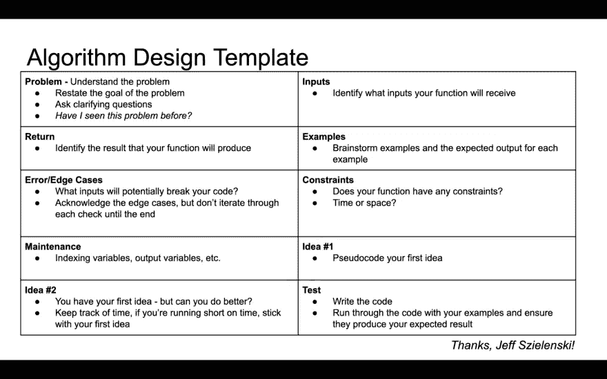

# 你可以在下一次编码面试中使用的 5 步策略

> 原文：<https://betterprogramming.pub/5-step-strategy-you-can-use-for-your-next-coding-interview-492a70e21662>

## 一种减少编码面试中尴尬沉默的方法

由[路](https://unsplash.com?utm_source=medium&utm_medium=referral)上[车头](https://unsplash.com/@headwayio?utm_source=medium&utm_medium=referral)拍摄

不像编码测试，你用键盘默默地解决算法问题，编码面试超越了键盘交流。

这可能是一项艰巨的任务，因为面试官可以在共享屏幕上看到你的每个动作。

如果这还不够伤脑筋的话，你还需要说出来，表达你的思考过程，不仅能从面试官那里得到一些暗示，还能保持对话的流畅。

这就是为什么当我参加由圣地亚哥编码妇女[主办的编码实践时，看到这个算法设计模板时我很激动:](https://www.meetup.com/Women-Who-Code-San-Diego/)

通过圣地亚哥的女性编码

在多次实践中遵循模板中的每个步骤后，我开发了一种方法来减少我的编码面试中尴尬的沉默。

这是我的综合五步战略。

# 第一步。澄清问题

很多编码面试都涉及写出一个函数来解决问题。有时面试官可能会对任务有不同的理解。

为了确保你们都在同一页上，你可以从确认问题的目标开始，然后是给你的输入，然后是面试官希望看到的输出。

# 第二步。头脑风暴示例

为了进一步表明你理解问题，你也可以创造一些例子，并与面试官确认。

如果您仍然不确定问题或指导，现在是一个要求一些测试用例的好时机。

# 第三步。询问约束条件

为了涵盖所有的基础，你也可以头脑风暴一些无效的输入，并询问面试官是否应该考虑这些输入。

你可以问的另一个后续问题是关于时间/空间的复杂性，即使你最初的方法可能是蛮力的。

不要害怕问问题。有些情况下，在我澄清问题后，面试官意识到他们忽略了一些关键部分，并相应地修改了任务。

# 第四步。伪代码你的想法

现在你已经确认了你能想到的一切，是时候开始编码了。

作为我的编码习惯的一部分，我经常从伪代码开始，或者将我的方法写成注释(例如，*我将这些值存储为变量*，*这是我将迭代数组*的地方，并且*我将在这里返回值*)。

# 第五步:编码、讨论、优化

一旦你开始伪代码，你将对你的方法形成一个更具体的想法，这给你信心去编码你的解决方案。

这是你可以边编码边说话的地方，大声读出你正在输入的代码。做完一个代码块，可以暂停一下，向面试官寻求反馈。

通常，在你找到正确的解决方案后，面试官会问你是否能优化你的方法。

如果您当场想不出任何进一步的优化，那么从一个强力的方法开始，而不是一开始就奔向优化的解决方案，可能会有所帮助。

上面的策略和模板导致了我最近进行的最好的编码面试。我希望它们也能帮助你构建自己的方式来应对下一次编码面试。

你还有其他的建议吗？你经历过的最好和最差的编码面试是什么？请在评论中告诉我！