# 实现您喜欢使用的漂亮终端的 5 个步骤

> 原文：<https://betterprogramming.pub/5-steps-to-a-beautiful-terminal-that-youll-love-using-9e94ecb4191b>

## 让我们给你的命令行改头换面


照片由[卢卡·布拉沃](https://unsplash.com/@lucabravo?utm_source=medium&utm_medium=referral)在 [Unsplash](https://unsplash.com?utm_source=medium&utm_medium=referral) 拍摄

如果您在这里，很可能您不是终端的狂热爱好者，作为一名开发人员，输入命令可能是您最痛苦的事情之一。去过那里。但是我们在那里花了大量的时间，所以我们最好尽可能地让它变得有趣。

你可能花了大量的时间定制你的代码编辑器——选择最好的字体，安装材料图标主题以获得好看的文件和文件夹，并选择最好的扩展——那么，没有理由不给你的终端一点改造。

我参考了网络、文档和故障排除论坛上的几篇不同的文章来定制我的。我总是发现那些文章在技术上走得太远了，而我想要的只是让我的终端更容易使用。所以我想本着为每个人保持简单的精神写一篇文章。

在本文的最后，您也将寻找任何理由来点击命令行，所以让我们开始吧！

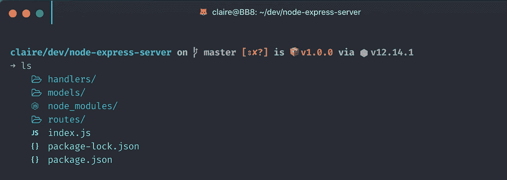

应用此处说明的配置后，我的定制终端的屏幕截图

# 1.终端:设置 Hyper

目前有几种终端仿真器，尽管其他仿真器如 iTerm2 看起来更快(在撰写本文时)，但它仅适用于 Mac 用户。我想让这个帖子对每个人都有用，所以我选择 Hyper。

Hyper 是跨平台的(它是用[电子](https://www.electronjs.org/)打包实现的)，3 版在性能上是一个巨大的提升。这确实是他们构建 v3 的首要考虑——你可以在他们的博客上了解更多关于 Hyper 的新版本。它的图标变得越来越漂亮。所以[下载 Hyper，](https://hyper.is/)让我们继续。

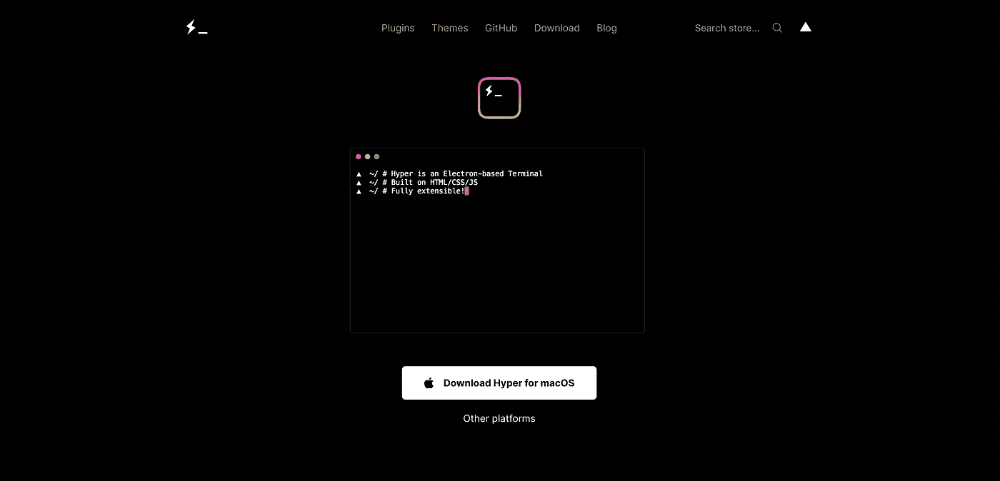

超级终端下载页面

现在，稍微配置一下。首先，我们需要转到`.hyper.js`文件(注意文件名开头的`.`，它位于您的`/Users/<your_username>`文件夹中。所以要打开它:

```
code /Users/<your_username>/.hyper.js
```

该文件包含一个配置对象，您可以在其中选择您的字体并添加样式、插件等。当您第一次打开它时，它应该是这样的:

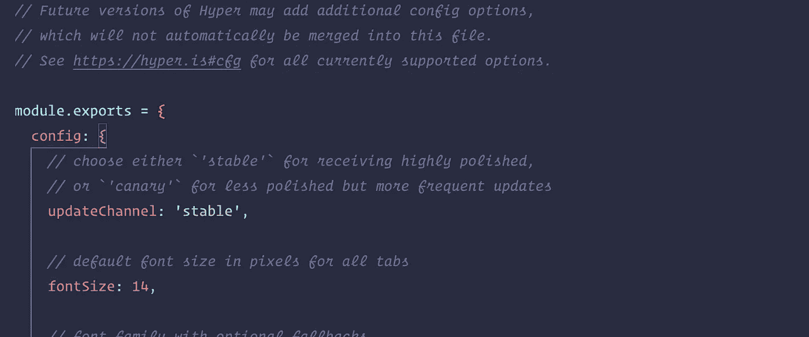

配置 Hyper——Hyper . js 文件的默认内容

## 主题

超级商店有许多主题可供你花数小时浏览。你甚至可以有一个[皮卡丘](https://hyper.is/store/hyper-pokemon)主题。我个人选择`hyper-one-dark`是因为它看起来很像我的 VS 代码主题:

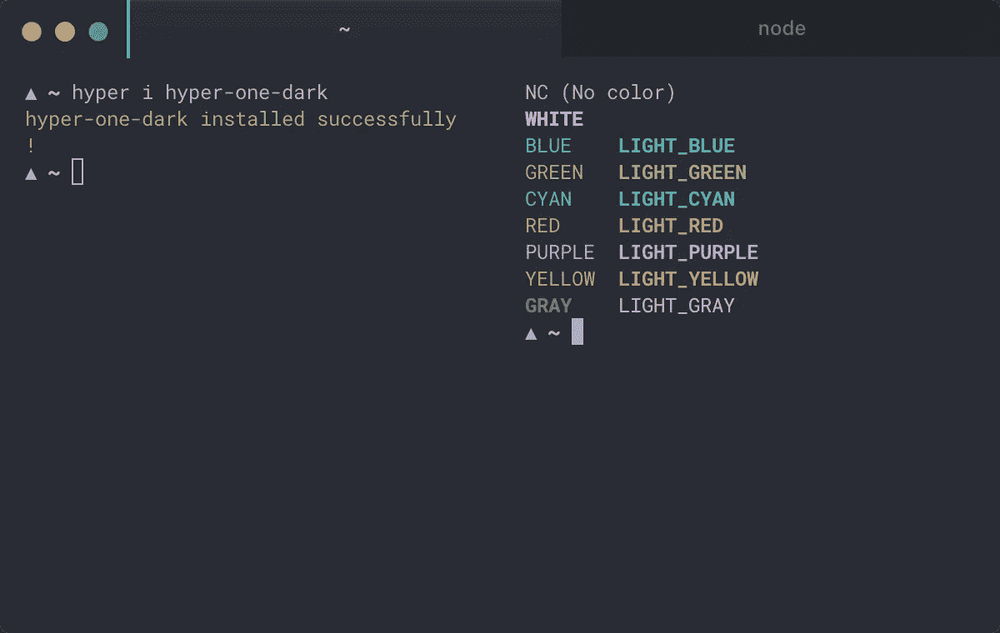

[hyper-one-dark](https://hyper.is/store/hyper-one-dark) 超级主题

要安装它:

```
hyper i hyper-one-dark
```

然后通过将其名称添加到`.hyper.js`文件中 config 对象之外的`plugins`数组中来启用主题:

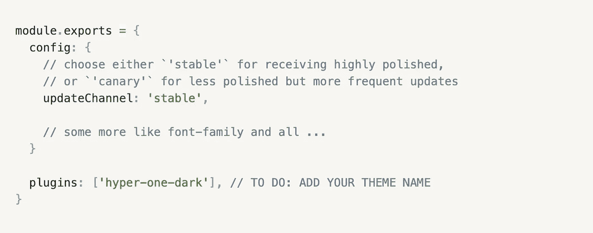

. hyper.js 文件

## 字体

让我们做一些修改，比如将字体大小设置为 13，行高设置为 1.2(如果它们还没有这样设置的话)。

我们还将通过将字体系列设置为**“FIRA code Nerd Font”**来安装我们自己的字体。这是一种很好看的书呆子字体，你可以在这里下载(或者从这个网站上所有可用的字体中选择另一种)，它带有很酷的文件和文件夹名称图标。所以您的`.hyper.js`文件现在应该有这样的设置:

```
module.exports = { config: {
    [...] fontSize: 12, fontFamily: '"FiraCode Nerd Font", Menlo, "DejaVu Sans Mono",  Consolas, "Lucida Console", monospace', lineHeight: 1.2, [...]
  }
}
```

另外，在这里要小心。请注意，字体列表是用单引号括起来的，所以您可以添加用双引号括起来的几个单词名称的字体。确保你的所有字体都用单引号括起来；不然就不行了。

## 绳索

现在我们有了一个很棒的字体，我们想启用*连字，*这是一个很大的单词，用来表示与另一个相关联的两个字符，以形成一个新的单个字符。杰弗里·多恩在这里非常清楚地定义了这个概念[，你可以在这里](https://graphism.fr/typo-quest-ce-quune-ligature/)找到直观的例子[。](https://www.pinterest.fr/chassany/ligatures-typo/)

为了启用它们，我们需要`hyper-font-ligatures`插件。首先，安装它:

```
hyper i hyper-font-ligatures
```

第二，您需要通过将其名称添加到`plugins`数组并禁用`.hyper.js`中的`config`对象内的 WebGL 渲染(如这里的[所解释的](https://github.com/tolbertam/hyper-font-ligatures/issues/8))来启用插件，就像这样:

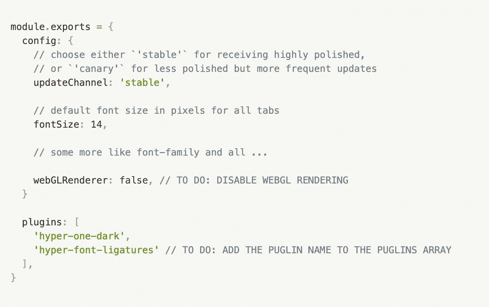

. hyper.js 文件

# 2.Shell:设置 Zsh

从 macOS Catalina 开始，[苹果已经用 Zsh (Z shell)代替 Bash (Bourne-again shell)作为默认 shell](https://www.theverge.com/2019/6/4/18651872/apple-macos-catalina-zsh-bash-shell-replacement-features) 。这对我们来说是一个好消息，因为这是我们想要使用的外壳，它支持主题和插件，具有更高的定制可能性。但是还有更多，如果你想了解更多，本文在比较 Zsh 和 Bash 特性方面做得很好。

如果您还没有安装 macOS Catalina，请继续安装 Zsh(为此您需要 [brew](https://docs.brew.sh/Installation) ):

```
brew install zsh
```

将其添加到`.hyper.js`文件中的配置对象:

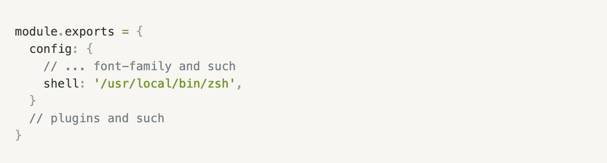

在. hyper.js 文件中将 Zsh 设置为 shell

既然我们都在同一个页面上，我们可以开始定制我们的提示。

# 3.提示符:设置飞船提示符

提示符是您在命令前看到的文本，默认情况下，它非常糟糕，只提供了基本的文件系统信息。使用飞船提示符，您可以获得更多信息，例如:

*   当前 Git 分支和丰富的回购状态
*   当前 Node.js/Ruby/Python/Swift/Docker/…版本
*   包版本(如果有)
*   如果最后一个命令以非零代码退出，提示字符变为红色
*   和[多得多的](https://denysdovhan.com/spaceship-prompt/#features)

您有几个安装选项，包括 npm:

```
npm install -g spaceship-prompt
```

如飞船提示文档所示，该命令应该将`spaceship.zsh`作为`prompt_spaceship_setup`链接到您的`$fpath`，并在`.zshrc`中设置提示`spaceship`。

之后你需要重新加载你的终端。

**注意:**如果你在使用 npm 时没有得到`spaceship`提示，请尝试其他安装——我曾经使用过 [Oh My Zsh](https://ohmyz.sh/) 选项，它非常有效(尽管出于某种疯狂的原因，我很难让它与 npm 一起工作)。

现在，您的提示应该是这样的:

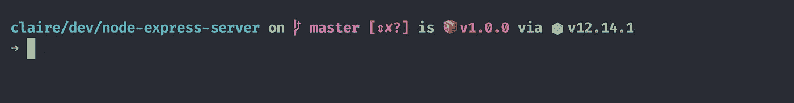

飞船提示

## 语法突出显示

现在我们将安装`zsh-syntax-highlighting`，它可以高亮显示命令，使它们更具可读性，并帮助它们避免输入错误。

遵循 macOS 的[安装说明](https://github.com/zsh-users/zsh-syntax-highlighting/blob/master/INSTALL.md):

```
brew install zsh-syntax-highlighting
```

这个命令应该将源文件添加到您的`.zshrc`文件的末尾，该文件应该位于(至少从 macOS Catalina)您的`/Users/<your_username>`文件夹中。

打开一个新的终端会话，查看突出显示的命令。

如果没有，您需要按照此处[列出的说明](https://github.com/zsh-users/zsh-syntax-highlighting/blob/master/INSTALL.md)在该文件的末尾手动添加它。

# 4.用颜色 LS 给它上色

我们已经到了我最喜欢的部分:使用 [Color LS，](https://github.com/athityakumar/colorls)当你在命令行中使用`ls`命令时，你可以给你的文件和文件夹添加颜色和漂亮的图标。要安装它，我们只需遵循这里描述的说明:

1.  [安装红宝石](https://www.ruby-lang.org/fr/documentation/installation/)。

2.安装[电力线书呆子字体和/或字体牛逼的修补字体](https://github.com/ryanoasis/nerd-fonts#patched-fonts)，我们已经在前面的字体部分做了(我们安装了“FiraCode 书呆子字体”的那个)。

**注意:**此时，**如果在深入查看 StackOverflow 之前，图标没有显示**，请确保您确实在`.hyper.js`文件的字体系列列表中首先添加了 **"FiraCode Nerd Font"** 字体。

3.安装`colorls`红宝石:

```
gem install colorls
```

4.通过在您的`.zshrc` shell 配置文件中输入下面一行来启用标签完成。因此，在您的代码编辑器中打开`/Users/<your-username>/.zshrc` ，并添加以下行:

```
source $(dirname $(gem which colorls))/tab_complete.sh
```

而且颜色 LS 已经可以用了！现在我们可以通过修改默认的`dark_colors.yaml`文件来定制颜色。

首先使用以下命令将`dark_colors.yaml`文件从`$(dirname $(gem which colorls))/yaml`复制到`~/.config/colorls`:

```
$ cd ~/.config/$ mkdir colorls$ cd colorls$ cp $(dirname $(gem which colorls))/yaml/dark_colors.yaml ~/.config/colorls/dark_colors.yaml
```

然后，您可以在代码编辑器中打开该文件，并随意更改颜色。就我个人而言，我喜欢 Robert Cooper 在他的伟大文章[中选择的颜色，这是我进行自己的配置所依赖的几篇文章之一，所以我重用了他非常友好地在](https://www.robertcooper.me/elegant-development-experience-with-zsh-and-hyper-terminal)[中分享的`dark_colors.yaml`文件。](https://gist.github.com/robertcoopercode/031b14a04697413094ea48a725748466)

最后，让我们创建三个别名，根据我们的需要列出不同程度的信息。在代码编辑器中打开您的`.zshrc`文件，并添加以下三行:

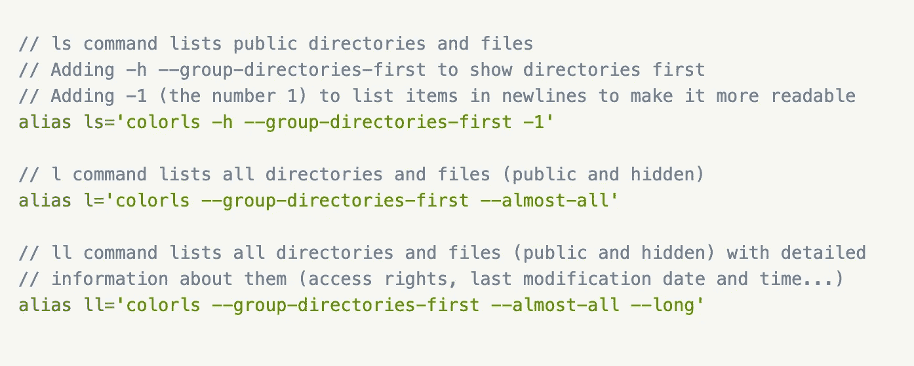

定义在终端中列出文件和目录的别名--。zshrc 文件

现在你的`.zshrc`文件可能看起来像这样(如果你没有在你的设置中使用 Oh My Zsh，你的行数会少很多，因为大部分都来自默认的 OMZ 设置):

现在，如果你点击`ls`命令，你的文件和文件夹会有一个好看的蓝色，就像这样:

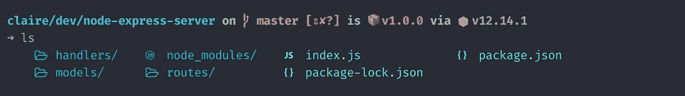

颜色文件和文件夹的颜色效果

关于主题部分，你应该已经准备好了！现在，让我们添加一些功能来增强我们的指挥体验。

# 5.使用插件添加功能

因为我想让这篇文章简单明了，所以我不会在这里讨论太多插件。这里是我最喜欢的三个，如果你想浏览更多，你可以去超级商店查看所有可用的插件。

## 活动标签图标

你可能已经注意到了这篇文章开头的截图中我的标签标题中的小狐狸表情符号？这都要感谢这个插件。

1.  安装`hyper-active-tab`插件:

```
hyper i hyper-active-tab
```

2.将它添加到您的`.hyper.js`文件中的插件数组:

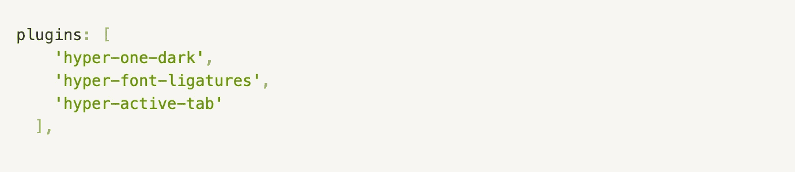

将插件名称添加到插件数组— .hyper.js 文件中

3.在`.hyper.js`文件的`config`对象中添加带有您选择的表情符号的`activeTab`属性:

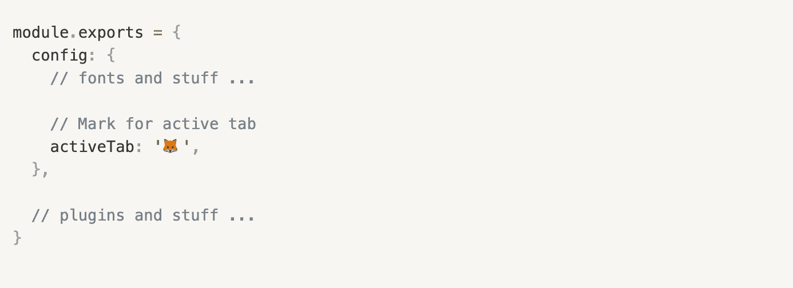

设置活动标签图标— .hyper.js 文件

## 在同一目录中打开新标签

你可能不希望这样，但十有八九，当我在任期内打开一个新标签时，它会对我正在处理的同一个项目执行一个操作。每次都必须导航到文件夹是浪费时间，所以`hypercwd`插件非常受欢迎。

1.  安装它:

```
hyper i hypercwd
```

2.并将它添加到您的`.hyper.js`文件中的插件数组:

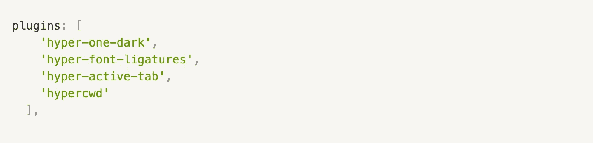

将插件名称添加到插件数组— .hyper.js 文件中

**2020 年 5 月 30 日更新:**看来`hypercwd`大大减缓了新标签页的打开速度！正如你在下面的 gif 上看到的，我数了几秒钟。

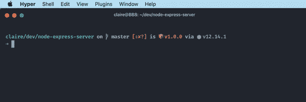

超宽减缓标签打开

这是 Github 上的[公开问题，如果你通读一遍，有人指出`hypercwd`似乎有一段时间没有更新了，所以他创建了另一个插件来做同样的事情(在 Hyper 中打开新标签时保持相同的工作目录)，但速度更快:](https://github.com/hharnisc/hypercwd/issues/58) [hypersamewd](https://github.com/LeanderFS/hypersamewd) 。

所以，用`hyper uninstall hypercwd`卸载`hypercwd`，安装运行`hyper i hyper-samewd`的`hyper-samewd`。

在这之后重启 Hyper，确保你的`.hyper.js`文件中的`plugins`数组现在包含了`hyper-samewd`。如果它仍然很慢，对你来说太痛苦了，我完全理解，我建议你在 [hypersamewd](https://github.com/LeanderFS/hypersamewd) repo 中打开一个问题，同时关闭它。

## 为您的终端 Ctrl-F

在终端中搜索文本。像往常一样:

1.  安装它:

```
hyper i hyper-search
```

2.并将它添加到您的`.hyper.js`文件中的插件数组:

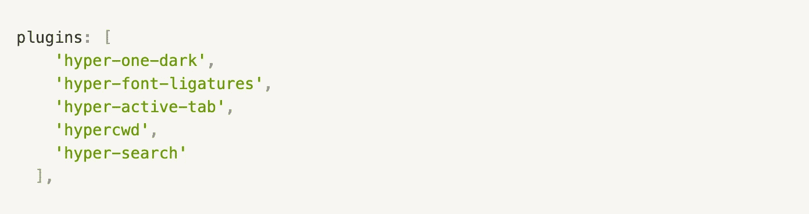

将插件名称添加到插件数组— .hyper.js 文件中

你已经准备好了！我希望您和我一样喜欢这种新的定制终端体验。不要犹豫，在评论中分享你最喜欢的插件、主题或配置。

快乐命令打字！