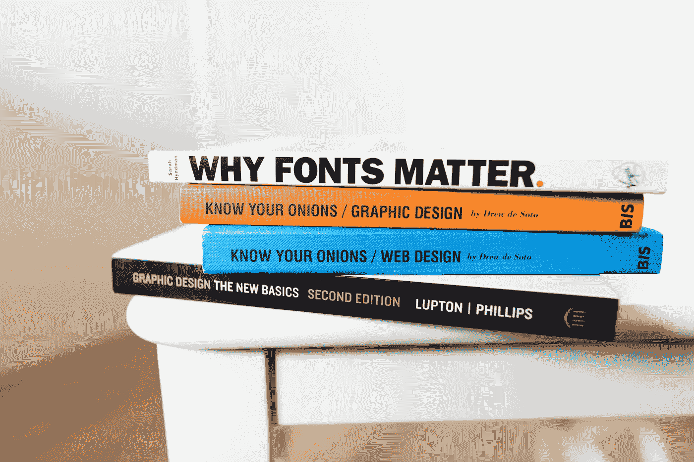
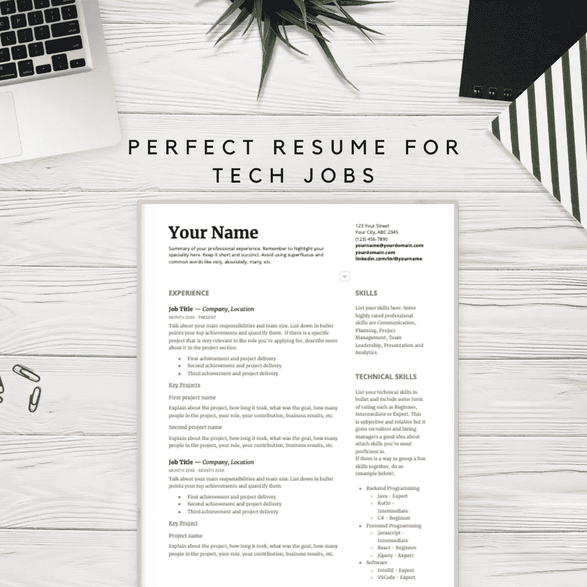

# 2021 年科技工作简历的 5 个步骤

> 原文：<https://betterprogramming.pub/5-steps-to-creating-a-resume-for-tech-jobs-in-2021-8eb16d2a4a0a>

## 润色你的简历，去找那份新工作吧

凯文·巴加特在 [Unsplash](https://unsplash.com?utm_source=medium&utm_medium=referral) 上的照片。

2020 年科技行业最大的转变之一是远程工作的兴起。这种转变既有好的一面，也有不好的一面。先说好的。随着远程工作成为行业常态，你获得技术工作的机会成倍增加，因为你不再受你居住地点的限制。你必须住在离旧金山地区的硅谷、奥斯汀的硅谷山或悉尼 CBD 几英里远的地方，才能在国内知名的科技公司找到一份科技工作，这样的日子已经一去不复返了。这对科技公司来说是个好消息，因为他们将能够接触到以前没有的人才，人才储备突然激增。

那么什么是不好的呢？嗯，这意味着作为求职者，你会有更多的竞争。当然，你可以接触更多的公司，但其他人也可以。因此，接下来的问题是如何比其他候选人更有优势，从而让你得到招聘人员和招聘经理的注意。

作为一名科技行业的招聘经理和许多科技工作的面试官——不仅是[软件开发人员](https://eisabainyo.net/weblog/category/articles/software-engineer-career-growth/)和[工程经理](https://eisabainyo.net/weblog/category/articles/software-development-manager/)，还有网站可靠性工程师、产品经理、UX 设计师、内容作者、项目经理和技术招聘人员——我已经看到了很多科技工作的简历和突出的东西。最棒的是，那些简历出众的人在面试中的表现也高于平均水平。这是因为他们展现了自己最好的一面，强调了重要的信息，让面试官可以深入了解。因此，他们的面试更有针对性，也更流畅。

由[拥有的摄影](https://unsplash.com/@possessedphotography?utm_source=medium&utm_medium=referral)在 [Unsplash](https://unsplash.com?utm_source=medium&utm_medium=referral) 上拍摄。

有五个基本步骤可以让你为科技工作打造出一份完美的脱颖而出的简历。这样的简历既专业又有效，能获得多次面试机会，让你得到你想要的工作。

事不宜迟，以下是五个步骤:

1.  专注于你的专业。
2.  量化你的成就。
3.  出示证明。
4.  让它可以扫描。
5.  丢弃无关信息。

# 1.专注于你的专业

马库斯·斯皮斯克在 [Unsplash](https://unsplash.com?utm_source=medium&utm_medium=referral) 上的照片。

你在业内最出名的一件事是什么？它可能是一项专业技能，也可能是特定类型的公司或环境。比如提升网站性能，或者去金融相关的公司工作。不知道你以什么闻名？回顾过去几年你的职业生涯，你参与过的项目，你工作过的公司，找出一些模式。在任何事情上变得更好的关键是大量的持续练习，所以你的专长很可能是你一直在重复做的事情。

一旦你确定了自己的专长，在简历的简短摘要部分突出它。此外，在你所做的每份工作的工作总结中，要突出你的特长。

# 2.量化你的成就

照片由[乔治·特罗瓦托](https://unsplash.com/@giorgiotrovato?utm_source=medium&utm_medium=referral)在 [Unsplash](https://unsplash.com?utm_source=medium&utm_medium=referral) 拍摄。

比较这三个成就的例子:

1.  作为一名首席前端开发人员，我在 XYZ 公司参与了一个重新设计项目。
2.  作为首席前端开发人员，我参与了 XYZ 公司最大的重新设计项目之一。这个项目持续了三个多月，我在三个不同的代码库上工作，重写了近 100 个 UI 组件。
3.  作为 XYZ 公司的首席前端开发人员，我参与了一个市场网站的重新设计项目，该网站每月接待 300 万独立访问者。该项目的目的是更新市场的外观和感觉，作为项目的一部分，我重写了近 100 个 UI 组件，并确保它们符合可访问性和 web 标准。新的重新设计将第一幅内容丰富的画(FCP)减少了一半，从 3s 减少到 1.5s，并将谷歌的页面速度从 70 增加到 96。

正如您所看到的，第三个例子非常突出，因为它不仅解释了项目的复杂性，还量化了候选人在行业指标中交付的影响。你也可以通过阅读上面的例子来判断候选人的特长是网页表现。

# 3.出示证据

由 [Unsplash](https://unsplash.com?utm_source=medium&utm_medium=referral) 上的[思想目录](https://unsplash.com/@thoughtcatalog?utm_source=medium&utm_medium=referral)拍摄的照片。

招聘经理或招聘人员如何知道你真的有能力做到你在简历中所说的或已经做到的事情？通过看到证据。证明可以通过以下三种方式之一作为简历的一部分:

1.  你过去和现在的同事的评价和 360 度反馈。
2.  你的在线作品(如个人品牌、网站、作品集)。
3.  你获得的奖励，只要与你的职业相关。

# 4.使其可扫描

在 [Unsplash](https://unsplash.com?utm_source=medium&utm_medium=referral) 上的[耶鲁安穴獭](https://unsplash.com/@jeroendenotter?utm_source=medium&utm_medium=referral)摄。

众所周知，招聘人员和招聘经理浏览简历的时间不超过 10 秒钟。但这并不意味着写一份包含重要信息的可靠简历毫无意义。这是因为如果有一份简历引起了他们的注意，招聘人员和招聘经理会花更多的时间来看它。他们可能不会立即看到它，但他们肯定会回来看的。因此，关键是让你的简历易于浏览，这样招聘人员或招聘经理会在十秒钟内做出决定，他们想花更多的时间审查你的简历。

为了使你的简历易于浏览，每个标题使用合适的字体大小和颜色，将某些关键词(如你的专业)加粗，将相关信息分组，用项目符号列出项目，添加空格以提高可读性，最后但同样重要的是，按照重要性从上到下排列信息。这些是一些简单而有效的方法。

# 5.丢弃无关信息

照片由 [Prateek Katyal](https://unsplash.com/@prateekkatyal?utm_source=medium&utm_medium=referral) 在 [Unsplash](https://unsplash.com?utm_source=medium&utm_medium=referral) 上拍摄。

“少即是多。”你可能听过这句话，但是你真的在实践中运用过这个理论吗——尤其是在你的简历中？

当你的简历有四五页那么长，包含了太多的信息，会让招聘经理和招聘人员不知所措。风险是用所有不相关和过时的信息稀释你的重要成就。或者更糟的是，他们可能会完全丢弃你的简历。

例如，如果你在几年前从会计转行到软件开发人员，你不需要列出你作为簿记员的所有就业历史。

同样，如果你已经在这个行业工作了十多年，并且正在申请领导职位，那么把你的第一次实习经历从你的工作经历中去掉也是可以的。

> “完美的实现，不是当没有更多可以添加的时候，而是当没有什么可以拿走的时候。”― [**安托万·德·圣·埃克苏佩里**](https://www.goodreads.com/quotes/19905-perfection-is-achieved-not-when-there-is-nothing-more-to)

# 在简历上投资会有回报的

一份好的简历不仅能让你获得面试机会，还能让你获得工作机会。我们都知道这一点:第一印象很重要。你对潜在雇主的第一印象始于他们看到你简历的那一刻，而不是你第一次面试见到他们的时候。

技术工作的完美简历