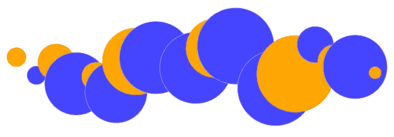
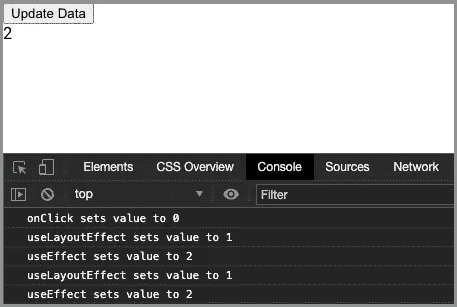

# 用 React 函数组件呈现 D3.js 的 5 个步骤

> 原文：<https://betterprogramming.pub/5-steps-to-render-d3-js-with-react-functional-components-fcce6cec1411>

## 如何在 React 中使用 D3 的完整指南



作者照片

数据可视化是信息和数据的图形化表示。它利用可视化元素来呈现数据中的趋势、异常值和模式。当数据很多时，例如在时间序列中，这是一系列按时间顺序索引的数据点，这种方法特别有效。

[D3.js](https://github.com/d3/d3) 是一个使用 web 标准可视化数据的 JavaScript 库。D3 代表“数据驱动文档”它将任意数据绑定到文档对象模型(DOM ),然后对文档应用数据驱动的转换。我们可以使用 D3 从一组数字中生成一个 HTML 表格。或者我们可以使用相同的数据创建一个交互式的 [SVG(可缩放矢量图形)](https://medium.com/better-programming/create-react-app-and-svgs-70970ac715f2)条形图，具有平滑的过渡和交互。

在之前的文章中，我们注意到 C3 允许我们在不知道 D3 所有复杂性的情况下快速构建图表。使用 C3 创建图表只需要几行代码。然而，使用 D3 实现相同的图表需要额外的努力，因为您必须考虑 X 和 Y 轴、每个数据点的形状、大小和位置等。

为什么我们要深入研究 D3 的复杂性和本质细节？

因为 D3 提供了丰富的特性来构建图形表示。对于图表，D3 可以定制轴、形状、工具提示、文本、颜色和动画的每个细节。

在本文中，我们将建立上面的气泡图像作为一个例子。我们将为工作环境使用 React，并创建一个`svg`标签来托管这些由 D3 管理的橙色和蓝色圆圈。

# 在 React 中渲染 D3 的 5 个步骤

React 是一个声明式的、高效的、灵活的 JavaScript 库，用于构建用户界面。D3 和 React 都是操纵 DOM 的固执己见的库。因为我们在工作环境中使用 React，所以 D3 只在数据可视化区域操作 DOM。对于那些 D3 管理的区域，我们放弃了 React 在性能和效率方面所能提供的。

在 React 中渲染 D3 需要五个步骤:

1.  构建不受控制的组件。
2.  创建 D3 代码。
3.  将 D3 代码放入`useLayoutEffect`。
4.  设置事件监听器。
5.  React 和 D3 代码之间的平衡。

# 1.构建不受控制的组件

我们在本文的[中讨论了受控和非受控组件。受控组件管理其子组件的数据，而非受控组件让其子组件管理自己的数据。](https://medium.com/better-programming/to-be-or-not-to-be-2c372198a01c#ba5c-4b7662162c8e-reply)

D3-管理区域需要作为非受控组件建造。在我们的例子中，对于不受控制的`svg`元素，`[useRef](https://medium.com/better-programming/most-things-you-want-to-know-about-react-refs-29901ebf28c6)`被创建来访问 SVG 组件:

```
const containerRef = useRef(null);
```

这个`containerRef`的`current`被分配给 React 代码中的 SVG 元素:

```
<svg id="content" width="100%" height="350" ref={containerRef}>
  <g transform="translate(0, 100)" />
</svg>
```

有了这个反应`ref`，SVG 元素的宽度就可以用`containerRef.current.clientWidth`得到。

# 2.创建 D3 代码

我们创建一个名为`Circles`的 React 组件，它的`props`是一个指定圆半径的数字数组。奇数编号的圆圈是蓝色的，偶数编号的圆圈是橙色的。

下面是排列这些圆圈的 D3 代码:

画圆需要四个步骤。

## **绑定 D3 数据**(第 1 行)

以下函数用于绑定 D3 数据:

*   `d3.select`选择第一个匹配元素。
*   `d3.selectAll`选择所有匹配的元素。
*   `d3.data`将数据数组连接到选择的每个元素。

第 1 行选择了`g`(组)标签，并选择了该组中的所有`circle`标签来加入数据数组。

## **输入新数据**(第 3-10 行)

以下函数用于输入数据:

*   `d3.enter`返回当连接数组长于选择时需要添加的 DOM 元素。
*   `d3.append`通常跟在`d3.enter`后面，实际上是向 DOM 添加缺失的元素。
*   `d3.attr`更新属性。

第 3-10 行添加了尚未绑定的新数据。新数据由半径(第 6 行)、圆心 *X* 值(第 7 行)、圆心 *Y* 值(第 8 行)、圆描边颜色(第 9 行)、圆填充颜色(第 10 行)配置。

## **更新现有数据**(第 12-17 行)

它使用`d3.attr`函数用半径(第 13 行)、圆心 *X* 值(第 14 行)、圆心 *Y* 值(第 15 行)、圆描边颜色(第 16 行)和圆填充颜色(第 17 行)配置现有元素。

## **删除现有数据**(第 19 行)

以下函数用于删除现有数据:

*   `d3.exit`当连接的数组比选择的短时，返回需要删除的 DOM 元素。
*   `d3.remove`通常跟在`d3.exit`后面，实际上是从 DOM 中移除额外的元素。

第 19 行删除了没有数据要绑定的 DOM 元素。

第二步和第三步(用同样的函数配置圆)不是多余的吗？

是的。它们被编码为允许新的和现有的元素以不同的方式显示或动画化。然而，由于它们是用相同的行为编码的，所以可以使用`d3.merge`将它们组合起来，以处理输入的和现有的数据。

下面是简化的 D3 代码:

通过第 6 行上的`merge`功能，D3 代码被缩短。

# 3.将 D3 代码放入 useLayoutEffect

什么是`useLayoutEffect`？

`[useLayoutEffect](https://reactjs.org/docs/hooks-reference.html#uselayouteffect)`有一个与`useEffect`相同的签名，但是它在所有 DOM 突变后同步触发。这意味着`useEffect`与所有 DOM 突变一起异步触发。

事情是这样的:

*   `props`或状态变化导致组件重新渲染。
*   React 运行代码来更新 DOM。
*   `useLayoutEffect`运行(阻止实际显示)。
*   显示是可视更新的。
*   `useEffect`运行(不阻止实际显示)。

和往常一样，我们使用[创建 React 应用](https://medium.com/better-programming/10-fun-facts-about-create-react-app-eb7124aa3785)来探索 React `useEffect`和`useLayoutEffect`。以下是修改后的`src/App.js`:

当点击`Update Data`按钮时，在控制台中，设置为`0`，然后是`1`和`2`。显示屏显示最终值`2`。我们可以看到`useLayoutEffect`跑在`useEffect`之前。



通过注释掉第 11-14 行并快速重复点击`Update Data`按钮，我们可以看到`0`和`2`之间的切换。

通过注释掉第 6-9 行并快速重复点击`Update Data`按钮，我们可以看到显示的值(`1`)没有任何闪烁。

很多时候要用`useEffect`。但是，如果代码改变了 DOM，应该使用`useLayoutEffect`来阻止显示，直到 DOM 完成改变。这样，我们可以避免显示器闪烁。

既然 D3 代码变异了 DOM，就应该放入`useLayoutEffect`:

第 1 行使用`useLayoutEffect`包装 D3 代码。

第 2 行确保数据是一个数组。

# 4.设置事件监听器

正如我们提到的，对于`svg`元素，我们将 React 的控制权让给 D3。因此，我们可能需要处理一些额外的事情，比如调整大小。

我们已经根据观察区域的宽度均匀地画了圆。因为除非`data`属性改变，否则不受控制的 SVG 组件不会重画，所以当调整显示大小时，这些圆不会被重新排列。需要使用事件侦听器来处理 resize 事件。在这种情况下，`useEffect`是处理调整大小的好选择。

第 6 行添加了`resize`事件处理程序。

第 7 行在效果清理期间移除了`resize`事件处理程序。

这是可行的，但是在调整大小时显示屏会闪烁。事实上，我们不需要显示调整大小的每一步。`Debounce`可以帮助我们延迟更改，直到调整大小稳定下来。我们可以使用 [Create React App 内置的](https://medium.com/better-programming/lodash-create-react-apps-built-in-library-for-debounce-and-throttle-with-hooks-3418087f44d8) `[debounce](https://medium.com/better-programming/lodash-create-react-apps-built-in-library-for-debounce-and-throttle-with-hooks-3418087f44d8)`来实现这一点:

在第 5 行，`debounce`被添加到`resize`事件处理程序中。

现在我们有了 React 中 D3 的完整例子的所有部分。它们由三个文件组成:

*   在`package.json`的`[dependencies](https://medium.com/better-programming/package-jsons-dependencies-in-depth-a1f0637a3129)`内增加的`d3`包:

```
"dependencies": {
  "d3": "^6.3.1",
  ...
}
```

*   新增的`src/Circles.js`:

*   改装过的`src/App.js`:

我们的示例由两个组件组成:`Update Data`按钮(第 17 行)和`Circles`组件(第 18 行)。

单击该按钮时，圆会更新。第 6-13 行实现了点击处理程序。它计算要显示多少个圆以及每个圆的半径。

以下是这个例子的视频剪辑:

# 5.React 和 D3 代码之间的平衡

在前面的例子中，除了`svg`和`g`标记之外，数据可视化是由 D3 处理的，D3 使用许多函数来操作 SVG。

实际上，我们可以使用 React 直接管理 SVG。下面是完成相同示例的代码:

那我们为什么需要 D3 呢？

对于某些操作，D3 提供了有利的方法，以非常简单的方式实现某些效果。例如，`d3.scaleLinear`构建了一个投入与产出成线性关系的标度。在图表中定位数据会节省很多精力。

我们有两个强大的库来管理 DOM。在某些情况下，他们可以实现类似的目标。React 方式是 React 环境中固有的，而 D3 的方法在操纵数据可视化方面更胜一筹。我们展示了一个主要是 D3 的例子和另一个只有 React 的例子。它们可以以不同的比例混合。重要的是找到代码可管理性和效率的平衡点。

# 结论

D3 非常适合数据可视化，React 非常适合通用用户界面。它们都是操纵 DOM 的固执己见的库。将它们恰当地结合起来可以创造出漂亮的用户界面。

在下一篇文章中，我们将在 React 中构建 D3 图表。

感谢阅读。我希望这有所帮助。你可以在这里看到我的其他媒体出版物。