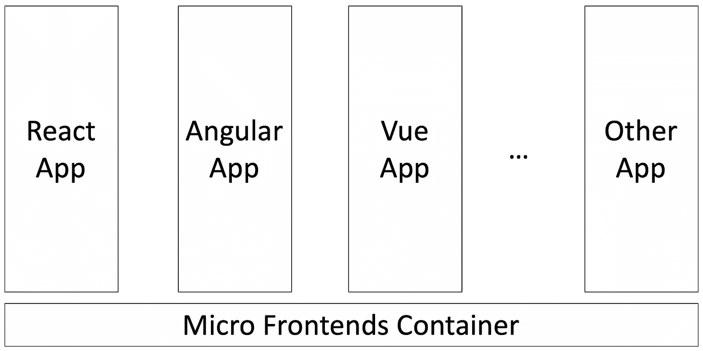
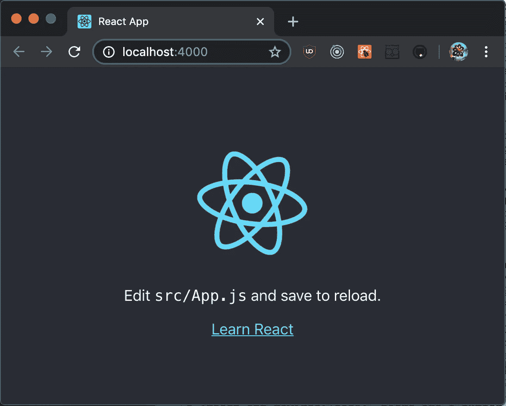
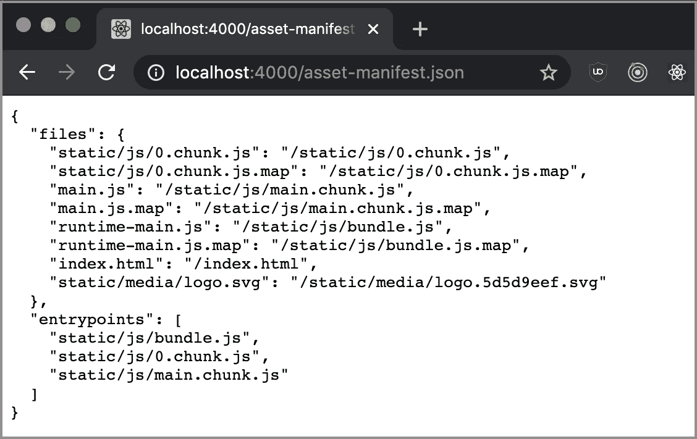
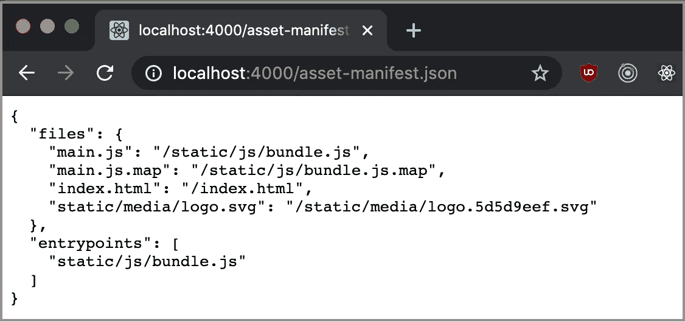
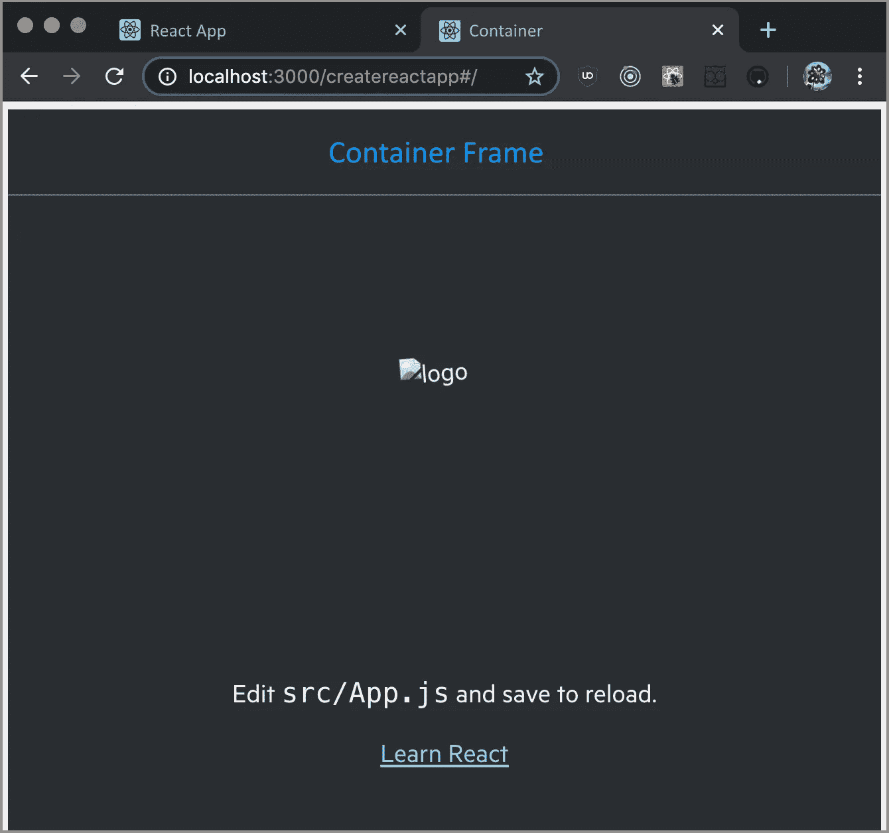
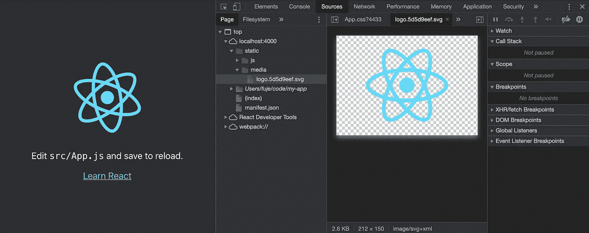
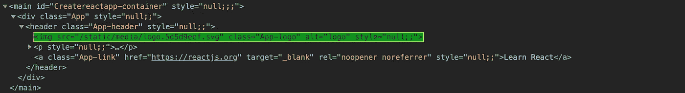
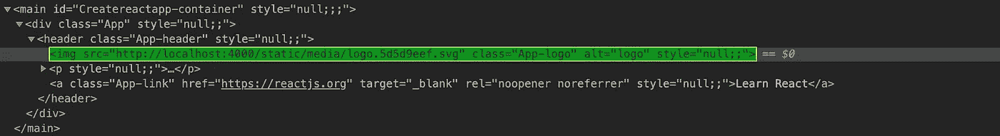
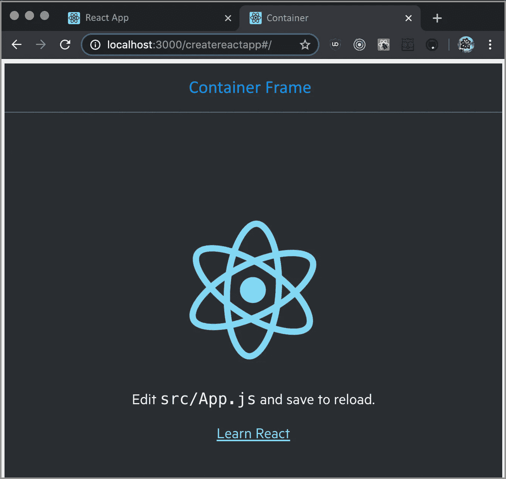

# 将随机 React 应用程序转变为微前端的 5 个步骤

> 原文：<https://betterprogramming.pub/5-steps-to-turn-a-random-react-application-into-a-micro-frontend-946718c147e7>

## 开始使用微前端，这是一种运行多个应用程序的新方法，感觉就像一个应用程序一样


[杜明达·佩雷拉](https://unsplash.com/@duminda?utm_source=unsplash&utm_medium=referral&utm_content=creditCopyText)在 [Unsplash](https://unsplash.com/s/photos/5?utm_source=unsplash&utm_medium=referral&utm_content=creditCopyText) 上的照片

什么是微前端方法？术语*微前端*在 2016 年 11 月的 [ThoughtWorks 技术雷达](https://www.thoughtworks.com/radar/techniques/micro-frontends)中首次出现。它将微服务的概念扩展到前端开发。

方法是通过分解应用程序特性，将基于浏览器的代码拆分成微前端。通过制作更小的、以功能为中心的代码库，我们实现了软件开发的解耦目标。

尽管代码库是分离的，但用户体验是一致的。此外，每个代码库都可以独立实现、升级、更新和部署。

这里是微前端的天堂。JavaScript 应用，不管框架和版本，都是由一个容器启动的。这些应用程序，无论是旧的还是新的，都可以无缝地协同工作，就像一个应用程序一样。



作者图片

在我们的例子中，我们将处理 React 微前端的更简单的情况。


作者图片

# 构建启动 React 应用程序的微型前端容器的前期工作

这个容器需要能够启动一个随机的 React 应用程序，而不需要知道很多细节。此外，由于微前端的想法，这一层需要很薄，几乎没有业务逻辑。

幸运的是， [Cam Jackson](https://camjackson.net/) 发表了他的[微前端作品](https://martinfowler.com/articles/micro-frontends.html)供我们采用。他的作品是在这个[地点](https://github.com/micro-frontends-demo)拍摄的:

*   一个`[Container](https://github.com/micro-frontends-demo/container)`:微前端演示的入口点和容器应用。
*   一个浏览餐厅的微前端:`[Browse](https://github.com/micro-frontends-demo/browse/)`。
*   一个餐厅点餐的微前端:`[Restaurant-order](https://github.com/micro-frontends-demo/restaurant-order)`。
*   一个`[Content](https://github.com/micro-frontends-demo/content)`服务器:为微前端演示存储静态内容的地方。

这是微前端的工作流程:

*   启动`Content`服务器。
*   在特定端口上启动`Browse`和`Restaurant-order`应用。
*   基于 URL，`Container`将路由到一个微前端。
*   选择的微前端到特定的端口获取应用的`asset-manifest.json`。从这个 JSON 文件中，包含的`main.js`被放在一个脚本标签上并被加载。

一个[清单文件](https://github.com/facebook/create-react-app/issues/6436)包含了所有资产文件名到它们相应的输出文件的映射，这样工具就可以在不解析`index.html`的情况下获取它。这个`Container`的核心是下面的`[MicroFrontend.js](https://github.com/micro-frontends-demo/container/blob/master/src/MicroFrontend.js)`:

第 13 到 22 行包含启动微前端的代码。通常，微前端之间没有通信，并且容器和微前端之间的通信有限。

通常，这是从容器到微前端的一种方式。这里，第 34 行传递了`containerId`及其微前端的历史，如下所示:

```
ReactDOM.render(<App history={history} />, document.getElementById(containerId));
```

第 18 行将脚本的`crossOrigin`值设置为空，相当于`anonymous`。这意味着对元素的请求将把它的模式设置为`cors`并且把它的凭证模式设置为`same-origin`。

我们在实际代码中稍微修改了一下 Cam 的例子。无论如何，这是我们使用的基础。基于此，我们可以向您展示如何将应用程序转变为微前端。

# 将随机 React 应用程序转变为微前端的 5 个步骤

我们选择的随机 React 应用程序是 [Create React App](https://github.com/facebook/create-react-app) 。把它变成一个微前端需要五个步骤。

在 [*10 个关于 Create React App*](https://medium.com/better-programming/10-fun-facts-about-create-react-app-eb7124aa3785) 的有趣事实中，描述了脸书皇冠宝石应用的很多原理。在本文中，我们强调应用这些原则。

## 步骤 1:修改 package.json 来设置端口并使用“react-app-rewired”

*   在第 12 行，`react-app-rewired`被添加为一个依赖项——这允许在不弹出的情况下定制应用程序。
*   在第 15 行，应用程序的启动端口已经从默认端口 3000 更改为选定的 4000——这避免了端口冲突，因为`Container`本身运行在端口 3000 上。
*   从第 15 行到第 17 行，`react-scripts`替换为`[react-app-rewired](https://github.com/timarney/react-app-rewired)`。

有了新的端口，Create React App 显示的 UI 如下。(我们作弊了一点。使用`react-app-rewired`需要在应用程序运行前更改步骤 2。)



## 步骤 2:使用 config-overrides.js 禁用代码拆分

默认情况下，启用代码拆分。一个应用程序被分成几个块，可以独立地加载到页面上。

`http://localhost:4000/asset-manifest.json`清楚显示该应用已被分块。



这种加载优化会导致装载和卸载微前端的问题。我们需要通过创建或编辑`config-overrides.js`来禁用分块，如下所示:

之后，`http://localhost:4000/asset-manifest.json`显示没有分块。



如果您没有从 Create React app 生成 React App，则可以通过修改 [webpack](https://webpack.js.org/) 配置来完成步骤 1 和步骤 2。

> *如果使用我们改进的*[*micro frontend . js*](https://gist.github.com/JenniferFuBook/0cd7d34548c76df1837988692880b54c)*，在步骤 1 中就不必使用* `*react-app-rewired*` *，步骤 2 完全可以跳过。5 步减为 3.5 步。详细内容在“* [*微前端*](https://medium.com/better-programming/you-dont-have-to-lose-optimization-for-micro-frontends-60a63d5f94fe) *”中有描述。*
> 
> *本次保存在本* [*回购*](https://github.com/JenniferFuBook/micro-frontend/tree/chunkOptimization) *的* chunkOptimization *分支中捕获。*

## 步骤 3:在 src/index.js 中进行修改，以定义呈现和卸载函数

我们来看看`Browse`微前端的`src/index.js`:

定义了`window.renderBrowse`和`window.unmountBrowse`。这些方法由`Container`的`MicroFrontend.js`调用。需要为 Create React App 的`src/index.js`定义类似的方法。

从第 7 行到第 19 行，增加`window.renderCreatereactapp`和`window.unmountCreatereactapp`。

第 23 行变成有条件的。如果是独立应用，会渲染到`root`元素。如果是微前端，会由`window.renderCreatereactapp`渲染到`containerId`。

## 步骤 4:使用 src/setupProxy.js 来设置 CORS 规则

当在 web 浏览器中启动微前端时，我们得到一个 CORS 错误:

```
Access to fetch at ‘http://localhost:4000/asset-manifest.json' from origin ‘http://localhost:3000' has been blocked by CORS policy: No ‘Access-Control-Allow-Origin’ header is present on the requested resource. If an opaque response serves your needs, set the request’s mode to ‘no-cors’ to fetch the resource with CORS disabled.
```

必须通过创建或编辑`src/setupProxy.js`来设置以下代理。

在进行第 5 步之前，我们为`Container`做一些额外的工作。

在`.env`文件中，需要添加新的主机`REACT_APP_CREATEREACTAPP_HOST`。端口 4000 需要与运行 Create React App 的真实端口相匹配。

也需要对`.env.production`进行类似的更改:

在`AppHeader.js`中添加一个导航链接，使其可被用户界面访问。这是可选的。

将`Createreactapp`及其路线添加到`Container`的`App.js`中:

现在让我们试着展示一下我们的微前端。

*   `Content`服务器:`npm start`。
*   `Browse`微前端:`npm start`。
*   `Restaurant-order`微前端:`npm start`。
*   `Create React App`微前端:`npm start`。
*   `Container` : `npm start`。

转到`localhost:3000/createreactapp`启动页面。



作者图片

哎呀，React 旋转日志在哪里？

让我们重温一下`http://localhost:4000/asset-manifest.json`。微前端的 logo 是一个单独的文件:

我们忘记拿了！



作者图片

看看这个 logo SVG 文件的源码，设置为`/static/media/logo.5d5d9eef.svg`。这个文件在 Create React App(https://localhost:4000)中有，在`Container` (http://localhost: 3000)中没有。



作者图片

这是我们的最后一步。

## 步骤 5:在`.env`文件中配置内容主机，并使用它作为静态内容的前缀

创建或编辑`.env`以设置内容主机:

```
REACT_APP_CONTENT_HOST=http://localhost:4000
```

当微前端使用静态内容时，它需要在 HTML 中给它们加上前缀`%REACT_APP_CONTENT_HOST%`，在 JavaScript 中加上前缀`process.env.REACT_APP_CONTENT_HOST`。

这里我们修改了`src/App.js`中的第 9 行:

通过这种改变，logo SVG 文件以`http://localhost:4000`为前缀。



作者图片

该应用程序现在工作正常。



作者图片

# 结论

微前端方法是一条鲜有人走的路。可以去[微前端网站](https://micro-frontends.org/)了解更多。

这项工作的一部分是由乔纳森马贡献。

感谢阅读。我希望这有所帮助。

这是一个关于微前端的系列。以下是其他文章的列表:

*   "[将随机 React 应用程序转变为微前端容器的 3 个步骤](https://medium.com/better-programming/3-steps-to-turn-a-random-react-application-into-a-micro-frontend-container-a80e33b6a066)"
*   "[打造自己的微前端生态系统](https://medium.com/better-programming/build-your-own-micro-frontend-ecosystem-a05128c74f99)"
*   "[你不必失去对微前端的优化](https://medium.com/better-programming/you-dont-have-to-lose-optimization-for-micro-frontends-60a63d5f94fe)"
*   "[微前端方法的 10 个决策点](https://medium.com/better-programming/10-decision-points-for-micro-frontends-approach-4ebb4b59f40)"
*   "[创建多版本 React 应用程序的 6 个步骤](https://medium.com/better-programming/6-steps-to-create-a-multi-version-react-application-1c3e5b5df7e9)"
*   "[使用 Webpack 5 模块联盟的微前端](https://medium.com/better-programming/micro-frontends-using-webpack-5-module-federation-3b97ffb22a0d)"