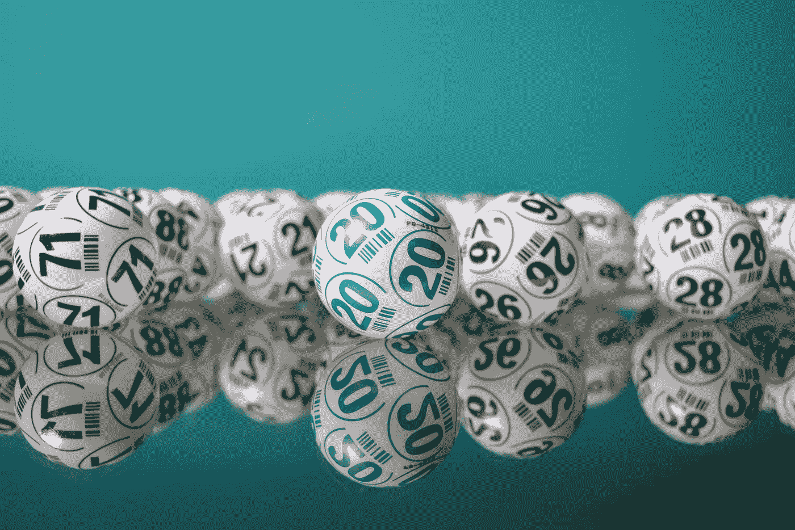

# 生成随机数的 5 个 Swift 扩展

> 原文：<https://betterprogramming.pub/5-swift-extensions-to-generate-randoms-87401ccc60f>

## 使用 Swift 扩展生成随机数、字符等



亚历杭德罗·加雷在 [Unsplash](https://unsplash.com/s/photos/bingo-balls?utm_source=unsplash&utm_medium=referral&utm_content=creditCopyText) 上的照片

两个主要行业定期使用随机数。游戏产业和密码产业。所以我想把一系列随机数程序放在一起可能会成为一篇有趣的文章—

现在，我把生成随机数的代码留给你，因为你肯定已经知道了，让我们开始吧，还有更多。展示的大多数扩展都是加密安全的，苹果的[手册页](https://developer.apple.com/documentation/swift/systemrandomnumbergenerator)上有警告——警告说——加密质量可能会因平台而异。

# 随机字符

除了 Int、Double 和 Bool randoms 之外，我还需要一个随机字符，下面是一个扩展:

# 随机字符串

众所周知，swift 中的字符不是字符串，所以这里有一个例程来返回一个随机字符串[一个或多个字符，是的，这很混乱]。

# 自源随机字符串

现在，也许你想提供你自己的字符串并得到一个随机选择。这里有几个扩展可以做到这一点。第一个接受一个字符串数组。第二个接受单个字符串。

这是对同一件事的另一种理解——以不同的方式。如你所见，这需要一个字符串数组。

# 唯一的随机字符串

当然，如果上面的例程两次传递相同的字符串，那就没什么好说的了——也许这不是您想要的。这个扩展从字符串中移除每个随机出现的元素。

# 整数范围内没有对等重复项

回到数字，这里有一个例程返回给定范围内的整数，防止连续两次返回相同的数字。

# 范围内唯一的整数

这个例程返回一个范围内唯一的整数，将每个使用过的整数添加到一个集合中，防止将同一个整数返回两次。一旦范围用尽，它将重置并重新开始。但是请注意，这是一个不确定的算法，这意味着返回一个数字所需的时间会有所不同，范围越大，变化越大。

# 范围 II 内的唯一整数

这个例程返回一个集合中的整数，用这些整数更新第二个集合。与前一个非常相似，只是这是一个确定性算法，因为它使用时间复杂度为 O(n)的混洗集。范围越大，花费的时间就越长，但与前一个不同，你可以肯定时间长度将是集合大小的一个因素。

当然，对于前面的三种方法，您不仅仅必须使用整数，您还可以扩展双精度或浮点，甚至可以使用一些字符串方法，将它们作为模板使用——具有相同的结果/限制。

# 游戏包

Bon，一个好的开始——但是你知道 GameKit 有它自己版本的随机数生成代码例程吗？对游戏来说很好的数字，但对密码术来说不是。本示例创建一个介于 0 和 20 之间的随机数。尽管事先警告过，Apple 在手册页中告诉我们，如果您需要确保每次运行时都得到随机数，则需要删除生成的初始值，请使用 arc4.drop(1024)来这样做。

```
let arc4 = GKARC4RandomSource()
let t = arc4.nextInt(upperBound: 20)
```

当然，但是由于随机性对游戏来说是至关重要的，你可以在这里做更多的事情，调用这个例程来得到一个更随机的随机数。虽然会比上一部慢一点。

```
let mersenne = GKMersenneTwisterRandomSource()
mersenne.nextInt(upperBound: 20)
```

当然，有一个方法可以得到一个比前面两个更快的随机数，也就是这个。虽然有代价，但是会少一些随意性。

```
let arc4b = GKLinearCongruentialRandomSource()
let u = arc4.nextInt(upperBound: 20)
```

mais——还有更多。你看，如果你掷一个真正的骰子，有可能一次又一次地得到相同的值，这是伪生成器试图避免的。所以如果你想要一些更真实的东西，你可以使用分布。此处显示的随机分布确保您确信序列不太频繁。

```
let rand = GKShuffledDistribution(forDieWithSideCount: 6)
let distribution = GKRandomDistribution(randomSource: rand, lowestValue: 0, highestValue: 20)
```

在这个版本中，您确保了结果是一个钟形曲线，因此您的范围内的中间值将比最高值或最低值出现得更频繁。

```
let rand2 = GKGaussianDistribution(forDieWithSideCount: 6)
let distribution2 = GKRandomDistribution(randomSource: rand2, lowestValue: 0, highestValue: 20)
```

## 随机的不是随机的

还有什么比随机游戏更好的地方来结束随机游戏呢？在这段代码中，你可以看到两个种子。当您使用第一个时，它会生成相同的随机数序列，这对于测试来说非常好。当你使用第二种方法时，你会得到一个不同的随机数序列，每次都是一个随机序列。

# 安全随机数

最后，我不得不用这段代码来结束这篇文章——我承认这段代码不是我写的，而是在这篇关于这个主题的优秀文章中找到的。你确实可以用一个随机整数作为你的密码，当然这不是你自己写的——你用 CryptKit 就像任何一个正常人会做的那样——

所有这些使我想到了本文的结尾。我希望你发现了一些有用的东西和/或确实学到了一些东西。