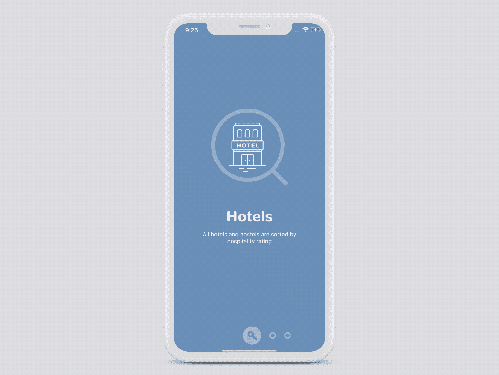
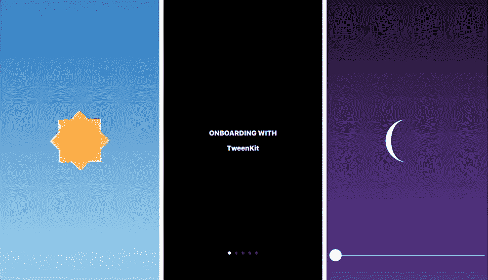
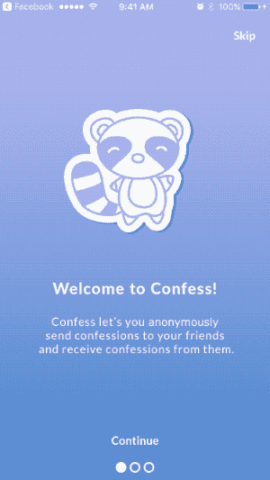

# 用于设计美好入职体验的 5 个 Swift 库

> 原文：<https://betterprogramming.pub/5-swift-libraries-for-designing-a-beautiful-onboarding-experience-2075d05924ea>

## 时尚地欢迎你的用户使用你的应用

照片由 [Unsplash](https://unsplash.com/s/photos/welcome?utm_source=unsplash&utm_medium=referral&utm_content=creditCopyText) 上的[尼克·费因斯](https://unsplash.com/@jannerboy62?utm_source=unsplash&utm_medium=referral&utm_content=creditCopyText)拍摄

App Store 里有两百多万个应用。平均而言，人们可以在智能手机上安装 80-100 个应用程序。

在过去几年中，许多应用程序都提供了很好的入门用户界面，通过在应用程序首次运行时提供应用程序的概述来帮助新用户了解最新情况。

总体而言，入职流程旨在:

1.  向用户介绍应用程序的主要功能。
2.  收集创建个性化内容和体验所需的信息。

除非对于使用应用程序的主要功能是必不可少的，否则不建议用户在使用应用程序之前需要登录或注册。

# **设计原则**

为了给你的应用程序设计一个吸引人且有效的入职页面，开发者想要记住的唯一准则就是*越简单越好。*

这个指导方针有以下含义，您可以考虑。

1.  尽量少用词。如果话太多，入职体验就不会太愉快。不是人们不喜欢阅读，而是在下载之后，用户很想运行应用程序，看看里面有什么。
2.  用大约五页的篇幅展示进度。如果入职时间太长，人们会感到厌烦。因此，在入职培训中使用大约五页纸通常是个好主意。此外，使用页面指示器或其他东西清楚地显示入职进度，让用户随时了解情况。相信我。如果被告知，人们会更宽容。
3.  注重有效的沟通。在页面限制下，展示你的应用最重要的功能或好处是很关键的。把鸡毛蒜皮的事情留到以后用户自己探索。入职后，app 用户可以对 app 有一个整体直观的印象。
4.  允许用户跳过某些自定义设置。对于一些提供内容的应用程序，如阅读、音乐流媒体应用程序，尽管为用户提供定制内容是有益的，但许多用户不喜欢回答一系列关于他们自己行为的问题。因此，有一个允许用户跳过所有这些设置的跳过按钮是很重要的。

# 有用的库

您当然可以开发自己的入职页面，而无需使用第三方库，但其中一些库对于构建清晰、现代的入职页面非常有用。

在这里，我与你分享在 GitHub 上找到的用 Swift 编写的前五个 iOS 库，很大程度上是根据星星的数量。

# 1.公告板(4565 颗星)

 [## alexaubry/公告板

### BulletinBoard 是一个 iOS 库，它生成并管理显示在屏幕底部的上下文卡片。它…

github.com](https://github.com/alexaubry/BulletinBoard) 

这个 iOS 库不是专门为入职开发的。它在屏幕底部生成并管理上下文卡片。

因此，要将这个库用于 onboarding，您可能需要使用它，直到用户已经进入您的应用程序并探索应用程序一段时间。

例如，当用户第一次将要启动一个新功能时，您可以使用上下文卡来提供实时指令，以提供无创和无中断的用户体验。

# **2。入职论文(2，847 颗星)**

 [## ramo tion/paper-入职

### iOS library Paper Onboarding 是一个在 Swift 上编写的材料设计 UI 滑块。我们专门从事设计和编码…

github.com](https://github.com/Ramotion/paper-onboarding) 

这个库是一个[材质设计](https://material.io/design/) UI 滑块。它是由 [Ramotion](https://github.com/Ramotion/swift-ui-animation-components-and-libraries) 开发的，他为 iOS 开发者维护了一个 UI 组件和库的列表。

这个库很容易使用。您可以指定入职培训的页数。对于每个页面，您可以自定义各种元素，包括背景图像、标题、描述、页面图标以及标题和描述的文本字体和颜色。

首次运行应用程序时，您可以使用此库来创建入职页面。

# 3.TweenKit (922 颗星星)

 [## SteveBarnegren/TweenKit

### TweenKit 是一个强大的动画库，允许你制作任何动画。TweenKit 的动画是…

github.com](https://github.com/SteveBarnegren/TweenKit) 

这个库实际上是一个动画库，不是专门为 onboarding 开发设计的。

但是，这是一个可以考虑使用的好库，因为它提供了用几行代码创建漂亮而复杂的动画的便捷途径。我打赌你会喜欢这个库，而且学习曲线一点也不陡。

# 4.SwiftyOnboard (873 颗星)

 [## Juan pablofernandez/swift yon board

### 一个简单的 iOS 框架，允许开发人员创建入职体验。SwiftyOnboard 使添加变得容易…

github.com](https://github.com/juanpablofernandez/SwiftyOnboard) 

这个轻量级库是专门为 onboarding 创建而设计的。

与纸质入职库不同，您需要覆盖一系列函数来创建定制的入职页面，而不是单个函数。

这种方法的好处是它可以使用默认的实现，尽管这种情况很少发生。

# 5.同心滑板(229 颗星)

 [## exyte/ConcentricOnboarding

### iOS 库，用于使用 SwiftUI 编写的带有 tap 操作的演练或入职流程。我们是一家开发机构…

github.com](https://github.com/exyte/ConcentricOnboarding) 

该库通过按底部的按钮在入职页面之间提供独特的动画。这是一个有趣的过渡动画。

但是，您需要编写更多的代码来开发您的个人页面。您可以看看它，它比上面列出的那些更不推荐，因为它需要实现负担。

# 其他图书馆

除了这些库，还有其他几个值得一提。例如， [AMPopTip](https://github.com/andreamazz/AMPopTip) 库对于在用户使用应用程序时提供实时提示非常有用。

[AlertOnboarding](https://github.com/PhilippeBoisney/AlertOnboarding) 和 [OnboardingKit](https://github.com/Athlee/OnboardingKit) 提供了创建 Onboarding 页面的简单实现。由于一些未知的原因，他们的代码没有更新以跟上 Swift 的最新版本。

# 结论

给定可用的库，可能只需要几个小时就可以为您的应用程序开发出良好而有效的入门。所以，你为什么不试试呢？