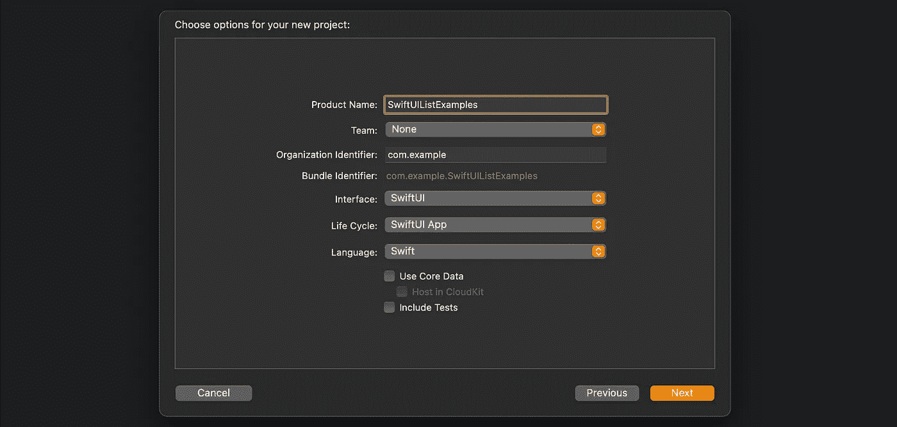
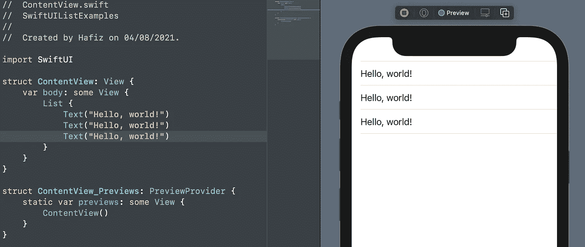
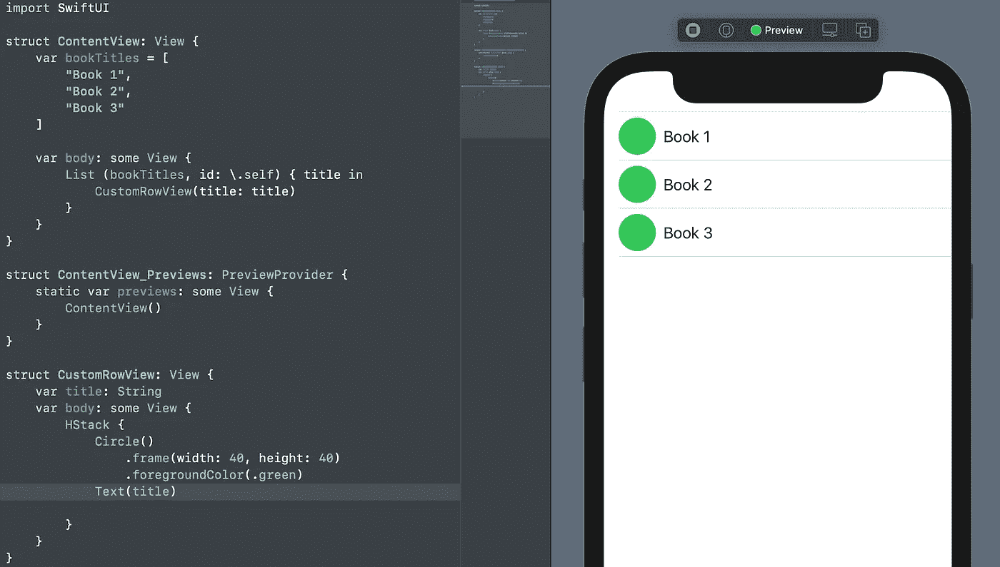
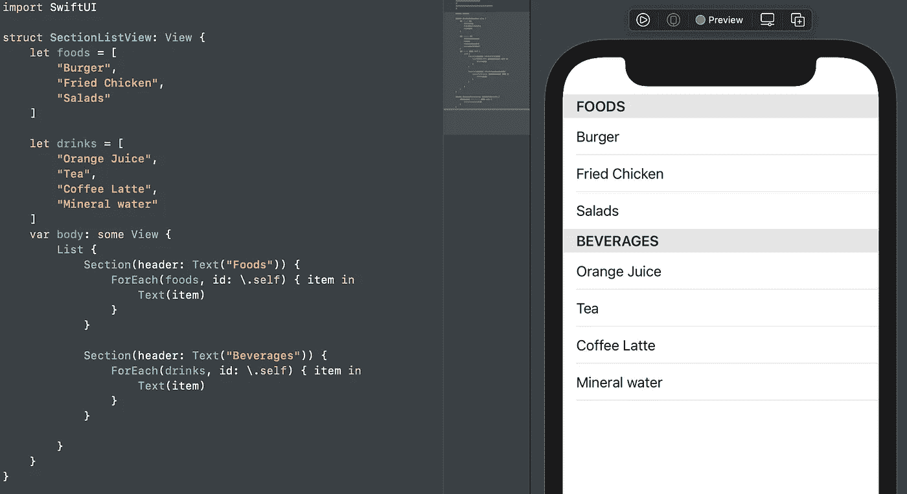
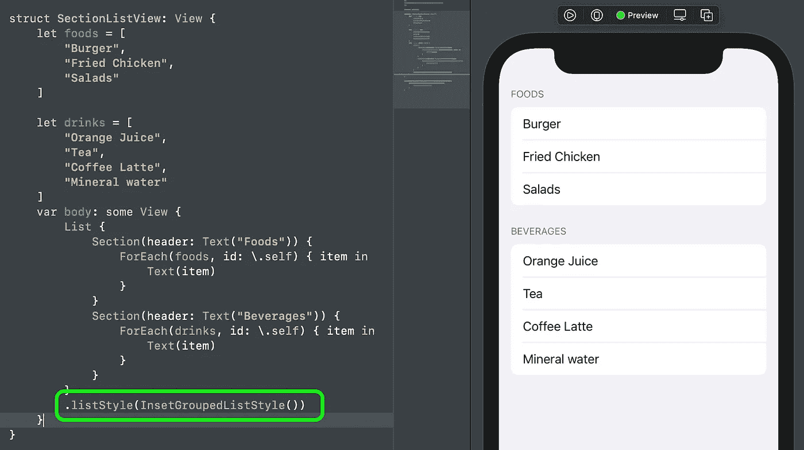
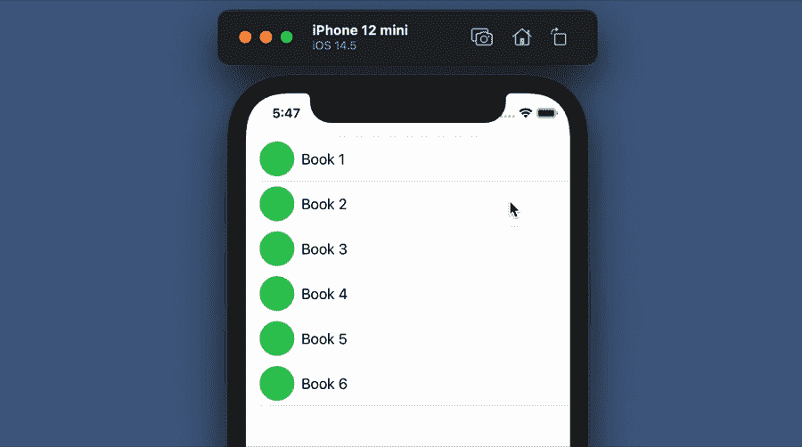
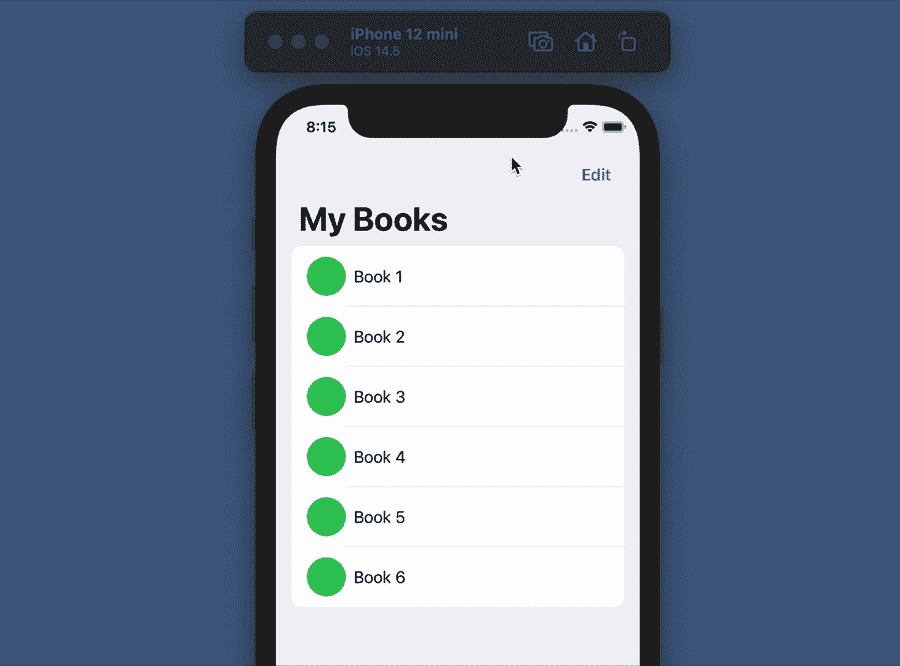
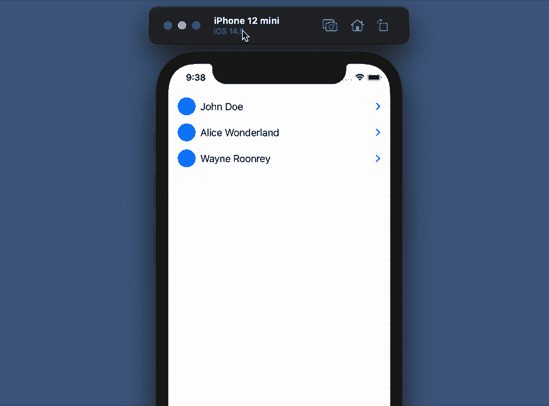

# iOS 14+的 5 个 SwiftUI 列表技巧

> 原文：<https://betterprogramming.pub/5-swiftui-list-tricks-for-ios-13-7431c5347a93>

## 导航、分组样式、批量删除、可扩展列表和部分

作者图片

List 是一个很棒的 SwiftUI 组件，用于创建包含多个行视图的列表视图。它非常类似于 UITableView，但是它有一个完全不同的实现(不再有委托和数据源方法)。

SwiftUI 中的 List 使用声明性代码，这意味着它将观察数据更改，并仅根据更改的内容高效地更新呈现的结果。

在本文中，我们将讨论列表中提供的五个基本特性:

1.  多个部分
2.  分组并插入
3.  删除行项目(单一和批量模式)
4.  可扩展列表
5.  航行

# 了解基本知识

在我们讨论所有这五个特性之前，让我们先来看看这个列表的基本语法和实现。

首先，创建一个新的 SwiftUI 项目来试验一些例子。

## 静态列表

在列表闭包中静态定义所有项目的列表。将以下代码添加到项目中:

静态列表示例

预览静态列表的输出

## 带有自定义行视图的动态列表

首先，我们需要创建`CustomRowView`结构并定义简单的内容。然后，通过在`List()`中传递一个参数来使其动态化。参见下面的代码来显示来自`bookTitles`数组的列表:

动态列表示例的预览输出

## 使用 ForEach

注意，动态内容也可以使用`ForEach`闭包来完成。这里有一个例子:

带有 ForEach 语法的动态列表

酷，我想我们对基本列表的工作方式很满意。现在，让我们继续讨论五个列表特性。

# 1.多个部分

在下面的代码中，我们将创建包含动态项目的两个部分(食品和饮料)。我们只需要做以下事情:

预览带有节示例的列表的输出

# 2.分组并插入

对于分组和插入，SwiftUI 提供了几个选项，包括`InsetGroupedListStyle()`、`GroupedListStyle()`、`InsetListStyle()`。我个人喜欢 InsetGroupedList 风格。它的默认填充已经很好很干净了。代码如下:

包含节和组的列表的预览输出插入

# 3.删除行项目(单一和批量模式)

对于 iOS13 及以上版本，默认支持`onDelete()`，允许用户滑动并点击默认的“删除”按钮。然而，在 iOS15 中，列表中添加了一个更新，以调用新的`swipeActions()`函数，如本文[文章](https://www.appcoda.com/swiftui-swipe-actions/)中详细讨论的。

很好，现在让我们添加`onDelete()`函数。注意，我们将属性包装器`@State`添加到`bookTitles`中，使其在视图结构中可变。此外，一旦我们更新了变量，如添加或删除项目，列表将自动刷新。下面是实现这一点的代码:

滑动以删除示例

## 批量删除

此外，SwiftUI 提供了 [EditButton](https://developer.apple.com/documentation/swiftui/editbutton) 特性，可以在指定范围内启用编辑模式。因此，我们将更新导航，并在右上方添加`EditButton`,以便为列表中的所有内容启用删除选项。请参见下面的代码和输出:

使用编辑按钮批量删除示例

# 4.可扩展列表

List 有一个特性，可以传递相同类型的子项或子项。让我们看看下面的例子:

首先，我们将创建一个用于模拟数据的基本结构。

然后，添加一个列表，并将`subItem`字段作为`children`参数传递。正如我们所看到的，最重要的部分是数据，它决定了列表是否有其子列表。

可扩展列表示例输出

# 5.航行

在这一节中，让我们重温一下我们的基本动态列表，并使用`NavigationLink`闭包使其可点击。

首先，我们将创建一个简单的 DetailView，如下所示:

然后，用以下代码更新`BasicDynamicView`:

列表示例的导航

# 项目已完成

恭喜你！现在，我们已经完成了所有基本的五个功能。完整的源代码可以从我的 GitHub [库](https://github.com/xmhafiz/SwiftUIListExample)下载。希望对你学习 SwiftUI 和提升 iOS 开发技能有所帮助。

感谢阅读。编码快乐！

# 参考

*   [SwiftUI 列表文档](https://developer.apple.com/documentation/swiftui/list)
*   [编辑按钮文档](https://developer.apple.com/documentation/swiftui/editbutton)
*   [列表教程](https://www.appcoda.com/swiftui-swipe-actions/)由 AppCoda 提供
*   [列表教程](https://www.hackingwithswift.com/quick-start/swiftui/working-with-lists)由 HackingWithSwift 提供
*   [GitHub 回购](https://github.com/xmhafiz/SwiftUIListExample)