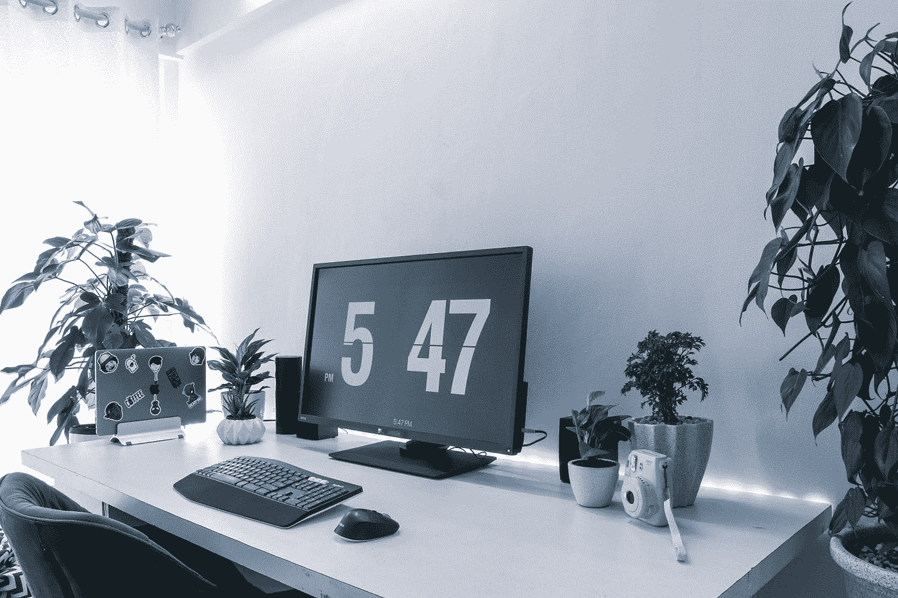

# 除了编码，开发人员还应该做 5 件事

> 原文：<https://betterprogramming.pub/5-things-a-developer-should-do-apart-from-coding-9a740660c132>

## 你肯定不会后悔这些

图片由[像素](https://pixabay.com/?utm_source=link-attribution&amp;utm_medium=referral&amp;utm_campaign=image&amp;utm_content=1834801)上的[像素](https://pixabay.com/users/pexels-2286921/?utm_source=link-attribution&amp;utm_medium=referral&amp;utm_campaign=image&amp;utm_content=1834801)生成

做开发者不容易。漫长的会议、花数小时修复一个 bug，以及当同样的 bug 再次出现时痛恨自己，这些只是程序员每天必须处理的事情中的一部分。如果你没有经历所有这些场景，我会嫉妒你。从好的一面来看，我们有不错的薪水，可以在任何地方工作，并且在下一次 IT 革命中处于领先地位。

长时间坐在椅子上对我们的身体或精神健康有害吗？是的，对两者都有影响。除了磨练我们的技术技能，还有一些事情我们应该留意。开发人员生活的这一方面经常被忽视，因为当我们在工作中筋疲力尽时，我们忘记了为办公室之外的事情腾出时间。

在这篇文章中，我将讨论我认为对于一个从事技术工作的人来说，在工作之外必须从事的五项关键活动。

让我们开始吧。

# 1.你的健康第一

照片由[钱德尔 R](https://unsplash.com/@chanderr?utm_source=medium&utm_medium=referral) 在 [Unsplash](https://unsplash.com?utm_source=medium&utm_medium=referral) 上拍摄

我们在一项任务上投入的时间越多，它就越是在我们的脑海中根深蒂固。程序员也是如此。整天坐在舒适的椅子上除了咔嚓咔嚓咔嚓什么都不做肯定会让你变得邋遢。长时间坐着会带来一系列后果，比如腿部肌肉变弱、体重增加、患糖尿病的风险增加等等。

有一种现象叫做体内平衡。体内平衡是一个生物抵抗环境变化的过程，除非并且直到它是生存所必需的。获取链接？

你不需要获得健身房会员资格来保持健康。健康也可以通过以下方式来保持:

1.  每天做简单的伸展运动
2.  每隔一天锻炼 20 分钟
3.  每天或隔天慢跑 15 分钟

你觉得你一个都做不了吗？

简单的走。走路是任何人都能做的事情。它不需要很多资源，也不需要特殊的装备。如果你边走边听你最喜欢的音乐或播客，那也是一种享受。

# 2.投资一个好的机构

桑尼·萨希尔在 [Unsplash](https://unsplash.com?utm_source=medium&utm_medium=referral) 上的照片

如果你要在一个位置上呆 6-8 个小时，那应该是很舒服的。我见过有人在可能导致长期背痛的条件下工作。背痛是程序员中众所周知的问题，而且是由不良的工作姿势引起的。

一切都很重要，包括椅子的大小，桌子和椅子之间的距离，鼠标和键盘之间的距离。投资购买高质量、舒适的鼠标、键盘、椅子和桌子，可以将你的注意力从痛苦转移到更重要的任务上，从而改善你的工作体验。可选配件包括多显示器设置和耳机。

# 3.吃健康的食物

照片由[斯科特·沃曼](https://unsplash.com/@scottiewarman?utm_source=medium&utm_medium=referral)在 [Unsplash](https://unsplash.com?utm_source=medium&utm_medium=referral) 上拍摄

> 吃和养可能是两个不同的世界

我们经常忽视自制食品，而偏爱即食加工食品。那些薯条和即食餐节省时间，但它们提供的营养远远低于新鲜烹饪的食物。即使是包装好的果汁，被宣传为健康的，也含有很高的糖分。其他包装食品含有大量的钠、防腐剂和添加剂。纤维是我们饮食中的一个重要组成部分，众所周知，加工食品含有较少的纤维，这些纤维在加工过程中会丢失。

我们吃什么对我们的行为和心理健康有直接影响。那么，我们该如何处理这个坏习惯呢？其实挺简单的:每天吃一碗沙拉，满足你的纤维需求；在你的饮食中包括蛋白质，但不要限制自己只吃一种；尝试不同类型的扁豆，豆芽等。我可以继续说下去，但你应该明白。

# 4.找到一个爱好

照片由 [Quino Al](https://unsplash.com/@quinoal?utm_source=medium&utm_medium=referral) 在 [Unsplash](https://unsplash.com?utm_source=medium&utm_medium=referral) 上拍摄

不仅仅是一种爱好，最好是不涉及使用电脑的。数码绘画、视频编辑、照片编辑和博客都需要一台电脑，但是如果你喜欢，就去做吧。为什么我更强调非计算机工作？因为我们每天每一秒都被屏幕包围着，工作的时候被笔记本电脑屏幕包围着，不工作的时候被电视屏幕包围着，到哪里都被手机屏幕跟着。

这似乎是一项艰巨的任务，但非常值得。此外，学习新事物有助于你拓宽知识面，结识新朋友，给你成就感。

# 5.扩大你的网络

布鲁克·卡吉尔在 [Unsplash](https://unsplash.com?utm_source=medium&utm_medium=referral) 上的照片

在销售和营销团队工作的人有一个大的，大多是专业的网络。这些联系有助于他们获得领先信息，了解行业需求，并在竞争环境中保持领先。程序员有必要关心联网吗？这完全取决于你。让我概述一下作为软件开发人员的网络优势:

1.  你可以和和你有共同兴趣的人一起出去玩。
2.  它传播关于你、你的个性和你的能力的信息。
3.  通过推荐找到新工作要容易得多，与从外面申请工作相比，这具有显著的影响。
4.  你可能会找到可以一起做项目的人。
5.  如果你有的话，你可能会遇到潜在的投资者。
6.  你有一个免费宣传的网络。

# 结论

总之，我们讨论了开发人员在工作之外应该做的五件事，包括经常锻炼、创造舒适的工作环境、吃有营养的食物、从事新的爱好和社交。从一个开始，慢慢地试着在你的日常生活中加入更多。

下次再见。

关注更多关于自动化和 Python 等主题的文章。

感谢阅读！