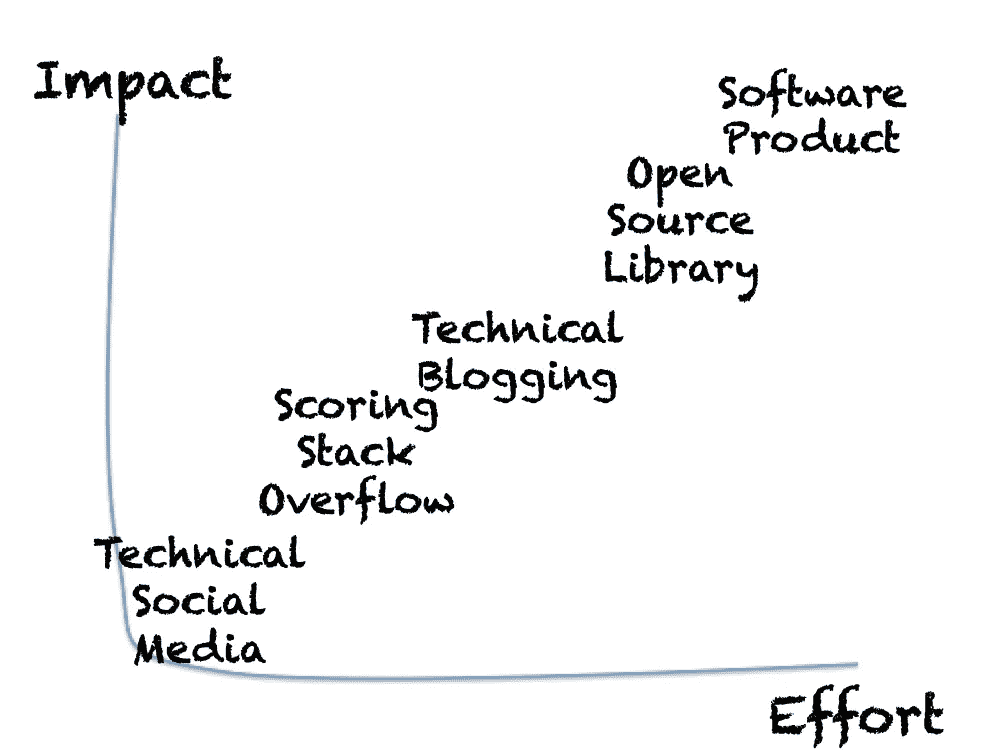

# 比计算机科学学位更好的 5 件事

> 原文：<https://betterprogramming.pub/5-things-better-than-computer-science-degree-f8acb8061c09>

## 高等教育很重要，但有些东西写在简历上会更好看

不要误解我的意思——高等教育很重要，尤其是如果你就读的学校与该行业密切相关的话。它通常为计算机科学提供了很好的指导和坚实的基础。

然而，在我们生活的这个互联网驱动的世界里，如果你想开始你的软件开发职业生涯，你的计算机科学学位不应该是你简历中最重要的一点。

那么，比计算机科学学位更好的 5 样东西是什么呢？下面按从容易到难的顺序列出了它们。

# 技术社交媒体

谁不喜欢社交媒体？如果你不喜欢这些平台，你可能学错了课程。

为了你的职业生涯，加入一些技术论坛。Twitter，LinkedIn，Reddit，Slack 都有很多。

## 将您的个人帐户和技术帐户分开

最好不要把这个账户和你的个人账户混在一起。这是为了确保你和一群对同一话题感兴趣的人联系在一起。

在你的简历中，不要链接你的私人社交媒体账户，因为这不会增加多少价值，而是添加你的技术账户，其中你的追随者不是你的爸爸、妈妈、普通朋友，而是对技术感兴趣的人。

## 技术账户？这会很无聊吗？

不完全是。人们不仅分享技术博客、问题和答案。通常有有趣的故事、漫画或相关的笑话:

## 保持活跃…

当然，不要只是分享笑话或者做一个沉默的参与者。这样你不会获得任何追随者。分享你的发现、想法和对相关帖子的评论。

你会对其他人提出的不同想法和观点感到惊讶。一些你认为完美的想法可能会被其他人认为是完全有缺陷的，理由看起来很充分。这就是你学习的方式。

## 这是一个免费的工具

我个人不会把这个作为我简历中唯一的“除了学位证书以外”的信息。我把它看作是对我其他方面的补充。

我所指的其他方面是我将在下面与你分享的其余 4 件事…

# Stackoverflow 上的得分

这些天我们很幸运有了 stackoverflow，有这么多对我们编程问题的回答。这是一个巨大的社区——在网上搜索一个编程查询，你通常会看到一些 StackOverflow 链接。

当我们查看 StackOverflow 问题和答案时，我们会自动将高分用户视为高关注度用户。

换句话说，如果你有这样的分数，在你的简历上会很好看。这些分数不仅仅由单个机构认可，而是由整个社区认可他们的问题和答案的质量。

## 一点一点

万事始于足下。你在 Stackoverflow 上的第一步可能是问一个你还没有找到任何答案的问题。

你的问题清晰易懂是非常重要的。如果它需要图表来说明，那就画出来；如果你需要显示代码，共享 git repo。

最重要的是，将问题缩小到你感到困惑的特定领域。不要把你的整个项目代码都放在那里，然后期望读者能理解它。你可能会惊讶地发现，在缩小问题范围的同时，你已经找到了解决方案(例如，某处的一个愚蠢的错误)。

一个清晰简洁的问题通常会得到回应，尤其是在一个有很多人感兴趣的领域。即使没有人回应，也没关系——不要放弃。做你自己的研究，你可能会找到答案。如果你有，回答你自己的问题——总有一天会有人从中受益。

换句话说，不要犹豫提出你的问题，即使你正在别处寻找答案。即使你在别的地方找到了解决方案，你也可能在 Stackoverflow 上得到更好的答案。

## 投票时要慷慨

如果有人很好地回答了你的问题，请为他们投票。

尝试找到一个最佳答案，而不是把它留在一个无人知晓你偏好的答案中。此外，你会得到 2 分的上升一个答案。

当然，如果你的问题没有最佳答案，尽管有多个答案，那么不要为了得到 2 分而放弃。对自己诚实。这 2 分不值得用你的诚信去交易。

同样，up 投票好问题。帮助建立一个欣赏他人贡献的良好社区，你会得到你应得的一份。

## 它会超时工作

StackOverflow 中的得分是累积递增的，你贡献得越早，得分就越快。你会惊讶于一些你意想不到的问题和答案变得流行起来。你不用做太多就能继续获得分数。

这也是记录您发现的难题及其解决方案的好地方。很多次我去了一个 StackOverflow 的帖子，为了提取一个我已经忘记的问题的解决方案。

## 这并不难…

这实际上是一个获得社区认可的简单平台——你只需要纪律。即使你的问题写得不是最好的，人们也会努力改进它。

这仍然相对容易，但也是值得的。查看下面的帖子了解更多

 [## 程序员使用 Stackoverflow.com 的 7 种方法

### 你以前用过 Stackoverflow.com 吗？你当然有！但是你充分利用它了吗？你可能没有…让我…

medium.com](https://medium.com/@elye.project/7-uses-of-stackoverflow-com-for-programmer-3ce09a39d2ee) 

# 关于技术主题的博客

学习和记录我们学到的东西是一个好习惯，尤其是当我们发现了在其他地方没有记录的东西时。有时我们从教程和开发文档中学到一些东西，但需要一段时间来消化它们，所以我们添加一些亮点和旁注，使其更容易理解。

为什么不和别人分享这些学习经验呢？让别人的学习体验更轻松。为了大家好写博客！

大约 3 年前，我加入了一家咨询公司，公司鼓励我写博客。从那时起，我开始写博客——现在它已经成为我的一部分。

 [## 我的 Android 博客每月浏览量如何达到 10 万

### 写了两年多一点的博客后，在 2018 年 10 月 10 日晚上，我的中型博客每月的浏览量超过了 100k。谢谢…

medium.com](https://medium.com/@elye.project/how-i-hit-100k-views-a-month-for-my-android-blogs-84059be93259) 

## 对我有什么好处？

如果这听起来像是写博客只是让别人受益，你会惊讶于我从中获得了多少，除了给我的简历增加一些东西:

1.  我注意到我博客中的主题存在学习差距，所以我去学习它们。
2.  很多时候我忘记了我学过的东西。有时我会回到我写的博客，再次想起它。
3.  有时，我会在博客上收到关于我对某个主题的误解或一些缺失信息的反馈。我向我的读者学习！
4.  我经常收到感谢和赞赏，说我的博客帮助了读者。这很有成就感！
5.  我的一些博客已经被翻译成其他语言。看到人们提到他们，让我觉得我花在写作和为社区做贡献的时间是值得的。

## 写什么博客

好吧，我曾经写过一篇关于它的博客，那时我一个月只有 20k 的浏览量和 40k 的浏览量。

 [## 达到每月 20，000+的浏览量。谢谢！

### 我想我应该分享我所做的，这样其他想写博客的人也许会从中受益。

medium.com](https://medium.com/@elye.project/reaching-20-000-views-a-month-thanks-7a443ac3d5b9)  [## 在我生日那天达到每月 40，000+的点击率。谢谢！

### 就在不久前的今年 7 月，我的博客每月有超过 20，000 的浏览量，这让我感到非常谦卑。而在…

medium.com](https://medium.com/@elye.project/hitting-40-000-views-on-my-birthday-thanks-97d8f059652) 

我今天仍然使用同样的方法，我很高兴每个月有大约 14 万的观众。非常感谢我的观众，因为这鼓励我做出贡献！

## 这是最可行的做法..

对我来说，这是最可行的做法，因为…

1.  每个博客平均需要几个小时的努力
2.  写完之后，它的维护几乎为零，除非有人评论修改

这是我的极限。我确实尝试了接下来的两个建议，但只是在有限的范围内。

如果你认为你能比我做得更好，请继续读下去！

# 创建一个开源库

编码作为一种知识产权已经成为历史。如今的新趋势是围绕开源。跨越不同地理位置的协作和工作是前进的方向。

为什么不紧跟潮流，成为开源社区的一员呢？从帮助其他人开源开始。有一天，你会注意到你需要的(也可能是其他人需要的)东西，而这些东西在外面是不容易得到的。然后创建自己的开源，分享给所有人。

## 规模较小的产品

开源库是迷你产品，但与实际产品不同，它的受众是开发者。所以围绕营销，用户设计等等的顾虑就少了。你只需要专注于它的编码方面，所以它的成本要低得多。

与构建实际产品相比，开源成本相对较小。如果你的开源软件变得受欢迎，你会得到其他贡献者想要添加的特性，他们会提出请求。您的工作是审核拉动式请求(PR)并决定是否批准它。

我有一个 3 年前创建的开源软件。从那以后我就没怎么更新了。然而，它仍然会更新，甚至更新到最新的 Android X 版本，而无需我做任何事情。我只需要审查，测试，并重新上传。

## 专注于技术学习

因为它被命名为开源，所以向他人提供你所有的源代码。因此，如果发现任何错误(希望不是愚蠢的错误)，其他贡献者会通知您，甚至制作一个 PR 来修复它。从那里你可以得到免费的测试和修复——太好了！

这些都是技术上的投入和讨论。重点在技术面。你在市场营销、产品和可用性方面的投入会减少。

如果你的开源软件缺少一些可用性，贡献者会自己添加进来——你甚至不需要担心。

## 一些真实案例

开源能成就一个人的事业吗？

在 Android 开发者中，大家都知道杰克·沃顿(Jake Wharton)。他从开源开始，现在他的工作被几乎所有严肃的 Android 开发者所知。他现在为谷歌工作。

 [## 参考博客——杰克·沃顿在行动 GitHub 博客

### GitHub 培训团队最近采访了杰克·沃顿，传奇的 Android 开发者，OSS 贡献者，以及…

github.blog](https://github.blog/2012-08-08-the-reflog-jake-wharton-in-action/) 

## 没那么简单

虽然编写开源软件并不太难维护(因为其他人会帮助维护)，初始成本更低(不需要设计、市场规划等)，并且专注于技术，但它仍然有自己的挑战。

创建一个会被很多人采用的开源软件的可能性并不高。创建每个开源需要时间、精力、思想和编码架构考虑。审查公关，测试和上传也需要时间。

我不认为任何人都能创造出大量受欢迎的开源软件。像杰克·沃顿这样有才华的人不多！

如果这没有挑战你，你认为你可以延伸得更远，想做一些更真实的生活和与每个人相关的事情，试试下一个可能性。

# 构建一个真正的软件产品

在 70 年代，工程学是许多人想学习的热门课程。然而，这些领域很难教会你自己生产有用的东西。即使你能生产它，你也必须把它推销给每个人，否则没人会知道你的产品。

快进到今天。自己创建网页或应用程序要简单得多。独自向全世界推销它可能不容易，但让它接触到 10，000 名用户不再是一个不可能的壮举。

因此，在你的简历上有一个真实的产品(不仅仅是学校或大学的作业)，可以公开获得，有良好的用户反馈，有很大的价值。

## 全面的学习体验

拥有一个实际的产品可以让你体验到构建一个应用程序的完整过程——从基础到发布给公众使用。构建产品所需的每个技术方面都将在这个过程中学习。

除了技术学习，你还将获得营销产品的宝贵见解。突然你意识到设计的每一个细微差别都很重要，你的工作流程可以成就你的设计，也可以毁掉你的设计。这不仅仅是技术方面的问题——为了让它变得更好，你必须了解你的用户行为，以及哪些功能有效，哪些无效。分析是你将进入的另一个主题。你将获得如此宝贵的经验！

然后你意识到你不再能作为一个单独的人做一件伟大的工作。然而，你至少做过一件事来了解把一个产品放在那里是什么。

## 真实的案例

我认识一个韩国朋友，他英语说得不好，想在一个说英语的国家找一份设计师的工作。尽管她有语言障碍，但通过在网上准备好她的简介，她可以很容易地向面试官展示她的作品。她甚至不会说多少英语就得到这份工作！(现在她的英语进步很大。)

众所周知，谷歌、微软、脸书和其他公司的创始人在攻读学位的时候就开始了他们的产品制造，并且他们从那时起就没有回头。

## 这很难…但是

虽然拥有一个成功的产品会给你的个人资料增加很多分量——事实上它本身可能是一个职业生涯和业务——但维持它是一项非常困难的工作，更不用说发展它了。

随着时间的推移，将需要更多的时间和投资。随着技术的变化，你需要更新你的产品。如果你已经有了一份全职工作，也许已经结婚生子，那么定期维护你的个人产品将是一个挑战。

嗯，那是我的借口！看看比尔·盖茨、史蒂夫·乔布斯、马克·扎克伯格、拉里·佩奇、谢尔盖·布林——如果他们能做到，为什么你不能？你可能是下一个！

# 概述

简单回顾一下，你应该做的 5 件事来给你的简历增色:

1.  技术社交媒体
2.  StackOverflow 上的得分
3.  关于技术主题的博客
4.  创建一个开源库
5.  构建一个真正的软件产品

就努力和影响而言(如果努力做得好)，我给出这个图表:

这些事情，如果做得好，可能比你的计算机科学学位更重要。所以不要等到你完成你的教育！

生活学习是一个旅程，它比你的学位更能反映你。