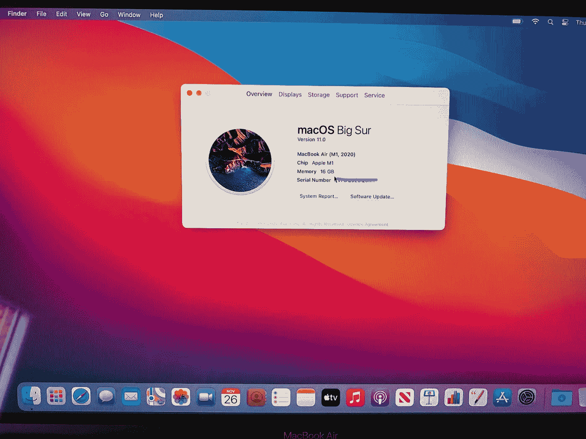
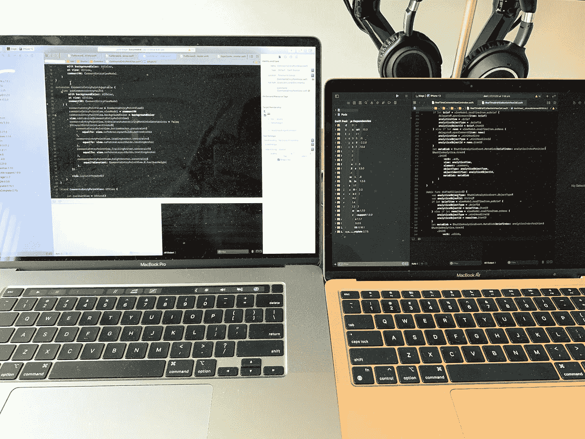
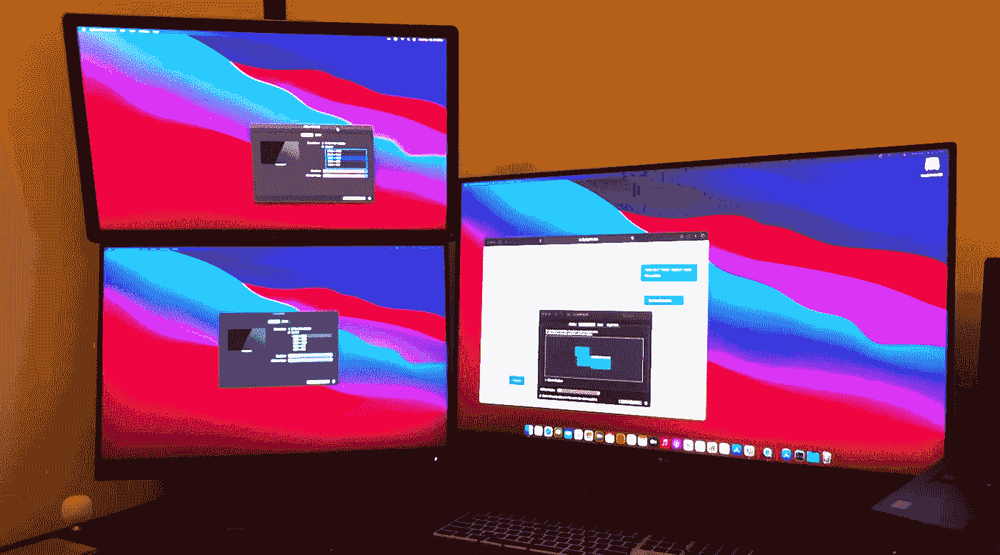
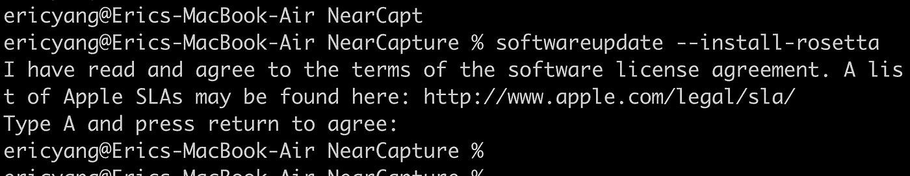
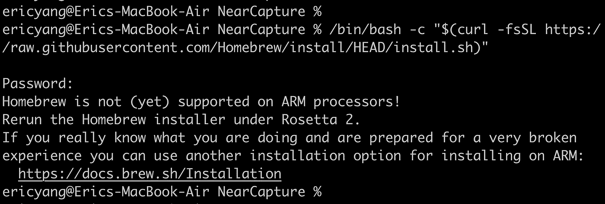
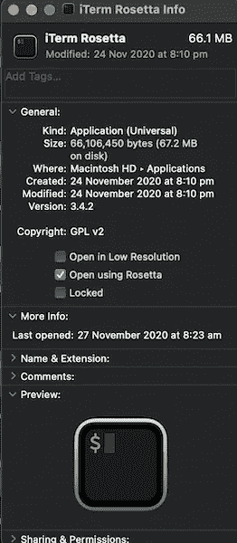

# 我从使用 M1 MacBook Air 中学到的 5 件事

> 原文：<https://betterprogramming.pub/5-things-i-have-learned-when-using-the-m1-chip-macbook-air-a77f93c50381>

## 外部显示器、Rosetta 2、自制软件等等


由 [Ales Nesetril](https://unsplash.com/@alesnesetril?utm_source=medium&utm_medium=referral) 在 [Unsplash](https://unsplash.com?utm_source=medium&utm_medium=referral) 上拍摄的照片。

首款基于苹果硅 ARM 的 M1 芯片因其令人惊叹的性能和效率而广受好评。令人难以置信的性能和集成 CPU、GPU、统一内存、神经引擎等的“片上系统”架构给我留下了深刻的印象。

当我收到我的第一台 M1 芯片 MacBook Air 时，我非常兴奋:



杨梦的 M1 芯片 MacBook Air

在花了几天时间在笔记本电脑上安装了 Ruby、Python、Homebrew 和其他应用程序之后，这里是我学到的五件有趣的事情。

# 1.快，快，快

我工作时有一台 2019 年底的 16 英寸 MacBook Pro，它有六核英特尔 i7 CPU 和 16GB DDR4 内存。与 2019 年末的 MBP 相比，M1 芯片 MacBook Air 在各方面都更快——在点击启动应用程序、用 Safari 浏览互联网以及打开 Adobe Photoshop 和 Xcode 等大型应用程序时。

印象最深刻的是在清理构建文件夹后构建我的 Xcode 项目。用 MBP 启动 iOS 模拟器需要 3 分 50 秒，而用 M1 芯片 MacBook Air 完成同样的任务需要 2 分 40 秒。

大约快了 30%!考虑到这是一款 1000 美元的无风扇 MacBook Air，这就更加令人印象深刻了。



最新 MBP 与杨梦 M1 MBA 的比较

# 2.运行外部显示器

苹果公司表示，M1 MacBook Pro/Air 可以运行一个最高 6K 分辨率、60Hz 的外部显示器。对我来说，我正在使用 CharJen Pro hub 连接我的 2019 年末 MBP 上的两台戴尔 2K 显示器。但现在 MacBook Air 只支持一个外部显示器，要么直接通过 USB4，要么通过 CharJen Pro hub 的 HDMI 端口。

如果您确实需要一个以上的外部显示器，有一些变通办法。 [Nate P](https://www.youtube.com/channel/UCAmuKWJAcOuFVedkhoId5uw) 通过使用 DisplayLink dock，设法在 M1 MacBook Pro 上支持双显示器，display link dock 使用自己的软件图形卡来驱动显示器。通过使用 DisplayPort 适配器和 DisplayLink 软件，Ruslan Tulupov 设法支持 M1 Mac mini 的六个外部显示器和 MacBook Air 和 Pro 的五个外部显示器。



由 [Ruslan Tulupov](https://www.youtube.com/channel/UChaq1vl0Rqm3D3fu1X1e08A) 提供的多显示器支持。

# 3.安装 Rosetta 2

Rosetta 是在苹果的硬件从基于 Power-PC 的 CPU 过渡到基于 Intel 的 CPU 时推出的。现在，基于 ARM 的 MAC 电脑迎来了另一个重要的硬件转变:他们推出了 Rosetta 2。

Rosetta 2 并不像应用程序那样运行，而是在幕后工作。它没有附带 macOS Big Sur，但会在您首次启动基于英特尔的应用程序时自动安装。

要手动安装 Rosetta 2，请使用以下命令:

```
softwareupdate --install-rosetta
```

为了自动同意软件许可协议，我们使用:

```
softwareupdate --install-rosetta --agree-to-license
```



由杨梦安装罗塞塔 2 号

# 4.安装自制软件

在 MAC 电脑中管理软件包时，自制软件很方便。作为一名软件开发人员，我用自制软件安装 Ruby、Python、Git 和许多不同的软件。

在基于英特尔的 MAC 上安装自制软件非常简单:

```
/bin/bash -c "$(curl -fsSL https://raw.githubusercontent.com/Homebrew/install/HEAD/install.sh)"
```

但在 M1 芯片 MacBook Air 上运行该命令时，出现了一个错误:

```
Homebrew is not (yet) supported on ARM processors!
Rerun the Homebrew installer under Rosetta 2.
If you really know what you are doing and are prepared for a very broken
experience you can use another installation option for installing on ARM:
  [https://docs.brew.sh/Installation](https://docs.brew.sh/Installation)
```



安装杨梦自制软件时出错

在基于 ARM 的 MAC 上安装 Homebrew 有不同的方法。

## 使用不稳定的、开发中的基于 ARM 的自制软件

按照[的安装文档](https://docs.brew.sh/Installation)，我们首先制作一个单独的文件夹来安装家酿:

```
% cd /opt
% mkdir homebrew && curl -L https://github.com/Homebrew/brew/tarball/master | tar xz --strip 1 -C homebrew
% sudo chown -R $(whoami) /opt/homebrew
```

并将这些路径添加到环境中:

```
% sudo nano /etc/pathAdd the two paths
/opt/homebrew/bin
/opt/homebrew/opt
```

然后重启终端和`brew update`。

## 以前缀`arch -x86_64 at ARM-based terminal`运行

使用以下命令安装基于英特尔的自制软件:

```
$ arch -x86_64 /bin/bash -c "$(curl -fsSL [https://raw.githubusercontent.com/Homebrew/install/master/install.sh](https://raw.githubusercontent.com/Homebrew/install/master/install.sh))"
```

然后用它加上前缀`arch -x86_64`:

```
arch -x86-64 brew update
```

## 从 Rosetta 2 运行终端

要从 Rosetta 2 运行终端/iTerm，在应用程序中右键单击应用程序，然后选择获取信息并勾选使用 Rosetta 打开。

然后当启动 terminal/iTerm 时，它现在会自动在 Rosetta 2 中运行。用于基于 Intel 的 MAC 的命令现在起作用了！

```
/bin/bash -c "$(curl -fsSL https://raw.githubusercontent.com/Homebrew/install/HEAD/install.sh)"
```



我复制了 iTerm，并将其重命名为`iTerm Rosetta`，以便能够在我的 M1 芯片 MacBook Air 上运行基于 ARM 和英特尔的命令。

# 5.凉爽安静

经过一天运行 Xcode、构建项目和浏览互联网的辛苦工作后，M1 芯片 MacBook Air 仍然很冷——甚至不热！最重要的是，它超级安静，因为它没有风扇！

相比之下，2019 年末的 MBP 在构建 Xcode 项目时会发出很大的风扇噪音，在我完成日常工作时会变得相当温暖。

# 结论

这是我在使用 M1 MacBook Air 的最初几天里学到的五件事。很满足，很有前途。它符合我的日常工作要求，让我的自习室凉爽安静！