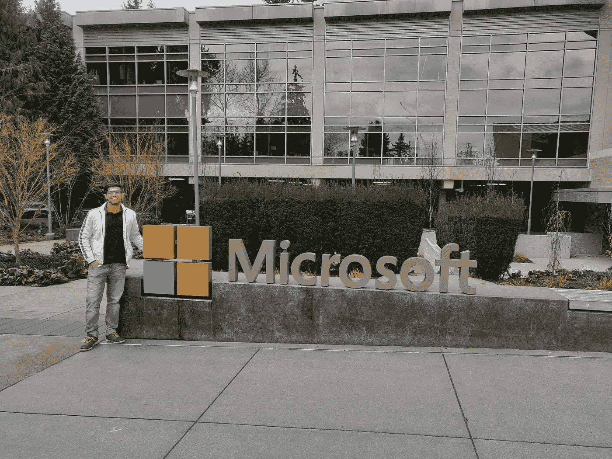

# 在微软做了两年软件工程师后，我学到了 5 件事

> 原文：<https://betterprogramming.pub/5-things-i-learned-after-two-years-as-a-software-engineer-at-microsoft-65e7124651c7>

## 3.一切都可以解决。重要的问题是:先解决什么？

我在微软雷德蒙办公室

作为一名软件工程师，我即将结束在微软印度公司的两年工作，思考我在过去两年中所学到的东西是很自然的。

我从我的大学印度理工学院 Guwahati 直接加入了微软，这是我在这个行业的第一次经历。随着时间的推移，我有了巨大的成长，有了许多新的经历。这个博客试图围绕它来组织我的想法。

所以，这里是我学到的五件关键的事情。

# 1.研究，研究，更多的研究

> "今天的普遍事实是昨天研究的产物."—邓肯·麦克唐纳

当我说研究时，我指的是两件事:

做研究以找到问题的根源。

我很早就意识到了一些事情:很容易养成不深入问题细节或不理解问题真正原因的习惯。如果你不知道问题存在的确切原因，当你几乎解决了问题时，它几乎总是会咬你一口。几乎在这里是一个非常重要的词。

**做研究以找到解决手头问题的最有效的方法。**

重要的是要明白，我们不只是想解决一个问题；同样重要的是以最有效的方式解决它。这就是伟大作品与一般作品的区别。要想出类拔萃，需要一些时间来学习这种心态，而不仅仅是完成工作。这是给你最大的成长。

任何人都知道背景研究或家庭作业在场景中非常重要，但是也很容易不完全做，特别是当你现在正在解决多个问题而不是一个问题的时候。

当你脑子里有很多事情的时候，就很容易妥协，不能深入了解所有事情，或者忘记事情。因此，把这个想法藏在心里是非常重要的。

全面的背景研究不仅有助于我们有效地看待问题并找到最佳解决方案，还能让我们看到更广阔的前景。

要记住的最重要的事情是，我们不是为了快速解决问题而获得报酬，而是为了准确、完整地解决问题。

这需要**研究，研究，再研究**。

# 2.墨菲知道，你也应该知道！

墨菲定律指出:

> “任何可能出错的事情都会出错。”

两年过去了，我对这个规律了如指掌，这就是真理！在我所有的项目中，我一次又一次地观察到，情况总是如此，而那些不知道这一点的人，一定会很难发现这一点。

因此，首先将一个大的解决方案分成非常小的单个块是非常重要的。然后，花时间确保你已经检查了所有的异常/错误，这些异常/错误可能发生在那些更小的单个块中。同时，也要理解这些语块在一起会如何表现，以及由于它们的相互作用会发生什么样的异常/错误。

关键是培养**远视**。

但是当你发展你的远视时，你做什么呢？你创造了很多制衡机制来提前发现这些臭名昭著的问题。

许多这些未来的问题最初可以通过所谓的**单元、集成和性能测试**来发现。当我开始在这个行业工作的时候，我学到的一个关键的技术课程是用适当的**测试覆盖率**编写代码的重要性。这不仅对我有帮助，对整个团队也有帮助，他们会接手我的工作，并在未来扩展它。

为了捕捉我们测试遗漏的问题，还存在称为
**预生产环境**的基础设施，其中的想法是模拟现实世界中的事情如何工作，也称为**生产环境**。确保您的代码在预生产环境中运行一段时间是非常重要的。

即使在所有这些检查和平衡之后，事情仍然可能出错。
最重要的事情是从这些问题中吸取教训，不要为此自责，因为更重要的是不要让这些错误再次发生。

# 3.一切都可以解决。重要的问题是，先解决什么？

在这个行业工作给我带来了一个重要的认识:我们有太多的问题要解决，但时间有限。

这使得适当的**优先顺序**和准确的**评估**成为成功团队的关键组成部分——作为个人也是如此。由于我们不能单独解决任何问题，我开始意识到任何问题最终都是可以解决的，但重要的是要衡量它需要的时间以及它有多重要。

为了回答它有多重要的问题，我们给一个任务分配优先级，这个优先级可以是一个简单的数字来表示它的重要性。我们还分配了一个数字来表示我们估计解决该问题所需的天数。这两个数据点非常重要，原因如下:

*   在大多数情况下，利益相关者不是一个，而是很多。因此，建立全面的沟通总是有帮助的。
*   这些数据点有助于你选择能优化你有限时间的工作。

这就是我们试图回答的重要问题，即
**先解决什么问题？**

# 4.事故管理教会你更多

事件是对使用您服务的客户的意外中断。

> 事件管理是一个尽快记录、记录和解决事件以将业务流程或服务恢复正常的过程

当我在大学的时候，我总是想象我的工作会涉及编写代码来解决手头的问题，也就是创造一些东西。但在过去两年里，我意识到我工作中非常重要的一部分也是通过减轻我们产品中的事故来做出贡献。

为了管理这些事件，我们在团队中轮流对整个产品负责。因此，当这个事件发生时，它可能与我之前创建的内容无关。

这些事件教会了我什么？

过去类似的事件让我意识到了解别人在做什么是非常重要的。

这不仅让我养成了观察这些解决方案的习惯，并在它们产生的最开始就发现问题——而且还从中获得灵感，并在我自己的解决方案中重用关键组件。

这些事件会对我们的客户/利益相关方造成重大干扰，因此快速解决这些问题通常是重中之重。

这些也教会你很多关于事物本质的重要性，所以你可以深入理解事物。这些事件的优先级促进了快速思考，并教会你快速提出干净、可靠的解决方案来解除对客户的封锁。

通常，在解决此类事件时，还会遇到更大的问题，这反过来也有助于我们理解以下内容:

我们的产品缺少什么？
未来我们要解决哪些问题？

# 5.永远假设他人的最佳意图

> “无论任何人说什么或做什么，都要有积极的意图。你会惊奇地发现，你对一个人或一个问题的整个态度变得非常不同。当你有负面意图时，你很生气。如果你消除这种愤怒，并采取积极的态度，你会感到惊讶。”
> 
> —英德拉·努伊

团队协作是一件非常强大的事情，它放大了个人的工作。

只有在专业的环境中，我才明白一群拥有独特优势和经验的人在解决问题时所扮演的角色。

当试图找到任何问题的解决方案时，一双新的眼睛也总是有帮助的。因此，顺利的合作对于应对挑战非常重要。

微软的协作不仅仅是与你办公室的人一起工作，还包括与不同大陆和时区的人一起工作。
现在，如何优化这一点，尤其是当你与素未谋面的人合作时？你既不了解这个人，也不知道他面临的挑战。

更糟糕的是，我们都面临着一生一次的场景，由于新冠肺炎疫情，每个人都不得不在家里工作。在此期间，我们的团队规模大幅增长，我们的许多同事几乎都加入了这个组织。

在所有这些情况下，我学到的最重要的事情是，处理事情的最佳方式是总是假设他人的最佳意图，并始终保持对周围问题的认识。

在这些时候表现出耐心和信心总是有助于建立良好的团队精神和积极的文化。随着时间的推移，这也会在纸上显现出来。

# 结论

我觉得在它的核心，软件工程是关于**解决问题**的，在这里相对容易掌握和理解技术细节，但是理解对待问题的正确态度、观点和方法要困难得多。

我写这篇博客的主要目的是重申很多我们一直都知道，但我们往往一次又一次忽视的事情。把这些点记在心里是专业人士和本科生的区别，过去两年我都在进行这种转变。