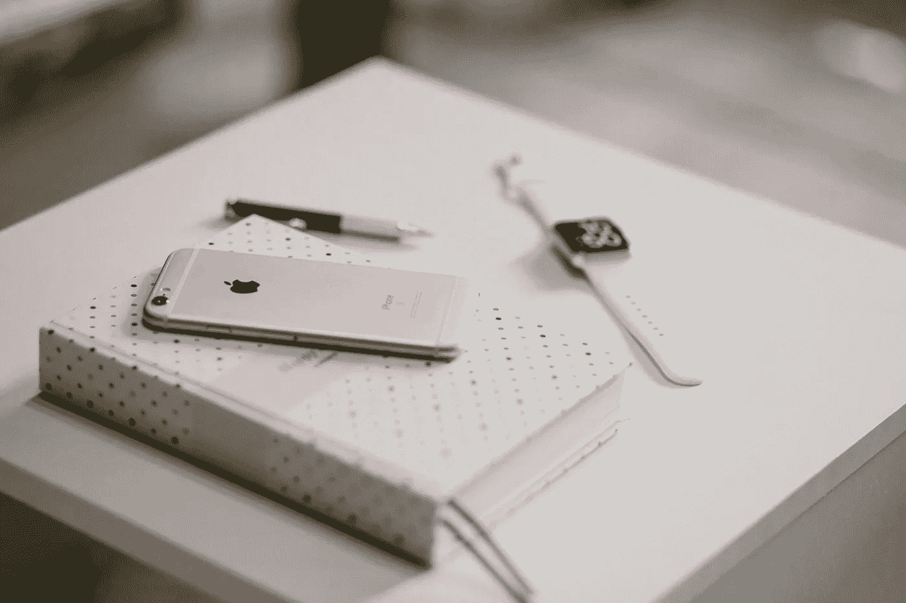

# 我希望在第一次在初创公司实习之前知道的 5 件事

> 原文：<https://betterprogramming.pub/5-things-i-wish-i-knew-before-my-first-ios-internship-at-a-startup-db21d1da1dfd>

## 为 iOS 实习做好准备

由[工作室共和国](https://unsplash.com/@studiorepublic?utm_source=medium&utm_medium=referral)在 [Unsplash](https://unsplash.com?utm_source=medium&utm_medium=referral) 拍摄的照片

去年，我与一家初创公司合作，为 Android 平台开发原生 iOS 应用。

与一家初创公司合作意味着你将会比你想象中做得更多。

我学到了很多东西，但我希望在开始实习之前就知道这五件事，以便获得更好的学习效果。

# 这将是一场忙乱

照片由[马丁·亚当斯](https://unsplash.com/@martinadams?utm_source=medium&utm_medium=referral)在 [Unsplash](https://unsplash.com?utm_source=medium&utm_medium=referral) 拍摄

我决定在奇数学期实习，从 11 月到 1 月。

有时在大学里一天工作八到十个小时以上真的很有压力。

我应该从头开始构建整个 iOS 应用程序:负责开发过程，决定要使用的架构和要实现的库，最后将它发布到 App Store。

当时很忙乱，事先也没有准备。

管理期望在这里变得很重要——从创始人的到后端开发人员的，到设计师的，最终到我自己的期望。

# 没有导师

照片由 [NeONBRAND](https://unsplash.com/@neonbrand?utm_source=medium&utm_medium=referral) 在 [Unsplash](https://unsplash.com?utm_source=medium&utm_medium=referral) 上拍摄

我是一名 iOS 实习生，也是该产品的非官方首席 iOS 开发人员。一开始，这似乎真的很吸引人。感觉很强大。

但慢慢地，我意识到我必须面对什么。

我不得不自己决定最佳实践，查阅大量的媒体文章、开源项目和 YouTube 教程。如果我被困在某个问题上，没有高级 iOS 开发人员来纠缠我的问题，这有时会挫伤我的积极性——我最终也学会了黑客，也就是糟糕的实践。

这就引出了下一点。

# 联系开发人员

由 [Valeriy Khan](https://unsplash.com/@valeriydmi?utm_source=medium&utm_medium=referral) 在 [Unsplash](https://unsplash.com?utm_source=medium&utm_medium=referral) 上拍摄的照片

通过实现将在现实生产应用程序中发布的特性，我学到了很多东西。我会花费大量的时间在栈溢出上进行谷歌搜索，以找到某个特性的自定义实现的答案。

但有时，如果我没有在不同的社交媒体平台上犹豫不决地联系开发者，时间和时间本来可以节省下来并投资到其他事情上。

我记得我花了一周的时间在一个特殊的特性上，这个特性是应用程序 UX 的一个重要方面。我找不到任何实现它的答案，我的第一个关于堆栈溢出的问题以很多反对票告终。

最后，我在脸书的一个 iOS 小组中提出了我的问题。有人对它进行了评论，我们进行了私聊，在两个小时内，我能够完美地实现它。

两个小时。

# 发现需要实验

[freestocks.org](https://unsplash.com/@freestocks?utm_source=medium&utm_medium=referral)在 [Unsplash](https://unsplash.com?utm_source=medium&utm_medium=referral) 上拍照

引用丹尼尔·怀特霍尔《神盾局特工》中的话，我有试验的自由。我应该更多地利用它来发现什么最适合这个项目。

例如，我可以选择使用 Alamofire 或使用标准框架编写自己的网络层。我必须做出选择，是创建自己的刷卡收藏视图，还是使用第三方库。

我以编程方式编写了整个应用程序。没有故事板。这是一个我非常自豪的实验，因为它帮助我快速融入了苹果的最新框架 SwiftUI。

发现需要实验，我太害怕失败和无法在期限内完成工作的可能性。

# 文件编制

[绿色变色龙](https://unsplash.com/@craftedbygc?utm_source=medium&utm_medium=referral)在 [Unsplash](https://unsplash.com?utm_source=medium&utm_medium=referral) 上拍照

当我回过头来写这篇文章时，由于没有记录这三个月的实习经历，我无话可说，也无法比较过去一年我在 iOS 开发方面取得了多大的进步。

介质上的文档。在 Instagram 上发布你一天的收获。在 Twitter 上发布关于你解决的问题的内容。

当你在不久的将来回到你的文档时，你会对你所取得的进步感到满意。

# 结论

去年的冬天令人兴奋，负责一家初创公司的所有 iOS 应用。这些见解帮助我成为了一名更好的 iOS 开发人员。

事先知道这五件事会让我为下一次 iOS 实习做更好的准备，很可能你也是。