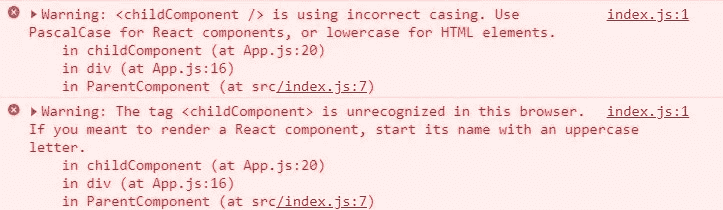
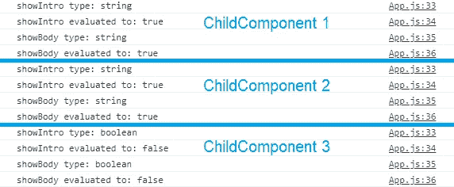
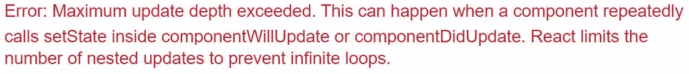
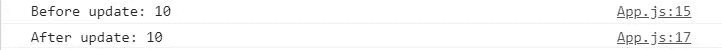
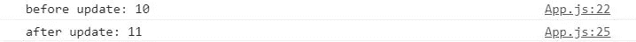

# 新手反应开发者做错的 5 件事

> 原文：<https://betterprogramming.pub/5-things-novice-react-developers-do-wrong-9d97bd6dae95>

## 不要做什么，如果做了该如何改正


由 [Valeriy Khan](https://unsplash.com/@valeriydmi?utm_source=medium&utm_medium=referral) 在 [Unsplash](https://unsplash.com?utm_source=medium&utm_medium=referral) 上拍摄的照片

这篇文章是为完全是 React 新手的开发人员和 React 新手开发人员准备的。我们开始吧！

# **1。忘记大写反应组件**

考虑这段代码。它为父组件创建了一个简单的带有标题的`div`。里面有一个子组件，由带有一些文本的`div`组成。你认为代码运行时会出现什么？


预期与实际

`childComponent`未被渲染。它去哪里了？代码编译成功。终端也没有错误。

再看一下子组件的代码。请注意组件的名称。你注意到什么不同了吗？

在浏览器上打开控制台。(`CTRL + SHIFT + C`Windows 上|`Command + Option + C`Mac 上|右键- >鼠标上的“检查”。)



浏览器控制台警告不正确的大小写

事实证明，React 将小写组件视为 DOM 标记。如果你是 React 新手，你可能已经错过了 React 文档中的这个小细节。

如果不知道这一点，即使他们的代码编译没有错误，初学者也常常会困惑于哪里出错了。

解决方法很简单。大写你的组件。

# 2.错误调用收到的道具

为了访问由父组件传入的属性，子组件必须确保它们调用正确的属性名。

也可以使用另一个变量名将 Props 传递给子组件。考虑以下代码片段:

虽然这段代码可以编译并运行而不会出错，但是在`ChildComponent`中不会显示任何文本。

```
<ChildComponent mainText={randomString} />
```

仔细看看这行代码。在`ParentComponent`内部声明的变量`randomString`被作为一个名为`mainText`的道具传入`ChildComponent`。

然而，`ChildComponent`正试图从它收到的道具中访问`randomString`。由于它只收到了作为道具的`mainText`，这将导致`undefined`被分配给在`ChildComponent`中声明的`randomString`。因此，在它的`<p>`标签中不会呈现任何内容。

记下哪些属性被传递到组件中，并相应地访问它们。这将为您在调试过程中省去一些不必要的麻烦。

# 3.传递不正确类型的道具

如果接收到的属性不是预期的类型，依赖于这些接收到的属性的组件可能表现不同。

考虑这个`ChildComponent`接收两个道具:`showIntro`和`showBody`。它显示“你好！”和“发现错误！”仅当`showIntro`和`showBody`分别设置为真时。

`ChildComponent`期望两个布尔值作为道具传递。如果在父组件中做类似这样的事情会发生什么？

```
<ChildComponent showIntro='false' showBody='false' /><ChildComponent showIntro={'false'} showBody={'false'} /><ChildComponent showIntro={false} showBody={false} />
```

引号和花括号的不同用法被用来传递道具。然而，他们的行为不会是一样的。看看这个:


实际的

为前两个`ChildComponent`而不是最后一个`ChildComponent`渲染两个`<p>`标签。

将`'false'`和`{'false'}`作为道具传入会导致`showIntro`和`showBody`被无意地赋值为一个*字符串*，其值为`false`，而不是*布尔值* `false`。

`showIntro`和`showBody`在前两个`ChildComponent`都被评估为`true`。

这是由于`&&`操作符的隐式类型强制。当`&&`操作员勾选`showIntro`或`showBody`(都是字符串)时，两个字符串都会被强制到`true`。

最后一个`ChildComponent`收到了*布尔* `false`，因此它正确地呈现了 nothing。

```
console.log(`showIntro type: ${typeof showIntro}`);
console.log(`showIntro evaluated to: ${showIntro && true}`);console.log(`showBody type: ${typeof showBody}`);
console.log(`showBody evaluated to: ${showBody && true}`);
```

为了证实这一点，让我们运行`console.log()`来检查我们的道具在每个`ChildComponent`中被评估到什么。



通过 console.log()检查道具的类型和评估

正如这里所演示的，初学者在将道具传递给其他组件时能够区分使用引号和花括号之间的区别是至关重要的。

您可以使用引号传入字符串文字。

```
<MyComponent data='Hello World!'/> // passing in a String
```

花括号用于传入 JavaScript 表达式。

```
<MyComponent data={2468} /> // passing in a Number
<MyComponent data={true} /> // passing in a Boolean
```

您还应该注意 React 文档中的一些内容:

> “在属性中嵌入 JavaScript 表达式时，不要用引号括起来。您应该使用引号(对于字符串值)或花括号(对于表达式)，但不能在同一个属性中同时使用两者。

# 4.在 render()内调用 setState()



无限循环错误消息

尽管您的组件中没有`componentWillUpdate()`或`componentWillUpdate()`，您可能还是会遇到这个错误。不要担心，当您在您的`render()`函数中调用`setState()`时，也会出现这个错误。

为什么会这样？每次调用`setState()`，React 都会通过调用`render()`重新渲染。你的`render()`函数里面有什么？`setState()`。你知道这是怎么回事吗？无限循环。

只需将您的`setState()`调用移出您的`render()`函数。

如果您必须在组件挂载之后初始化您的状态(也许您正在从 API 端点获取数据)，那么在`componentDidMount()`内部完成。

如果可以在组件挂载之前初始化状态，也可以使用构造函数来完成。

# 5.setState()的异步特性

调试时，使用`console.log()`打印数值是一种常见的方法。然而，当代码异步运行时，这并不能很好地工作。

你以前试过这样做吗？坏消息— `setState()`调用是异步的。不能保证给定的代码会按顺序执行。它可能会导致如下输出:



在 setState()前后调用 console.log(state)

在执行`setState()`之前执行的两个`console.log()`调用。因此，它打印两次前一状态的值。

如果您希望在调用`setState()`之前和之后检查状态的值，请在`setState()`中传递一个回调作为第二个参数。

回调将在`setState()`完成后执行，因此为您的`console.log()`提供同步行为。



为同步行为向 setState()传入回调

# 结论

我希望你今天能学到一些新东西。此外，欢迎所有关于我如何更好地说明/解释某一点的建设性反馈！

感谢阅读！

这是我第一次尝试写技术文章，如果你发现我可能犯的任何错误，请告诉我！

## 在 Medium 上阅读更多来自杰里米和其他人的故事

考虑[成为媒体用户](https://medium.com/@jeremyinelysium/membership)。你的会员费直接支持了我和这个平台的其他很多作家。您可以完全访问媒体上的所有报道，并且可以随时取消。