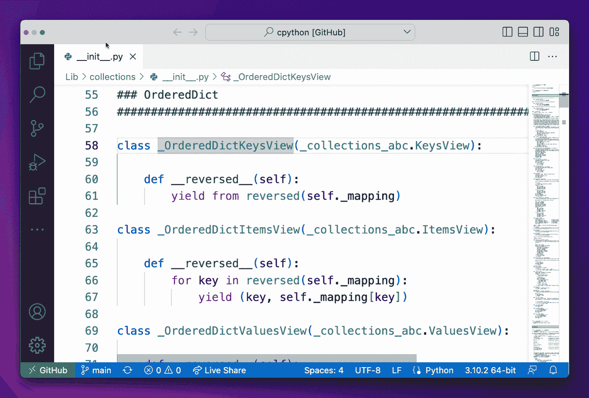
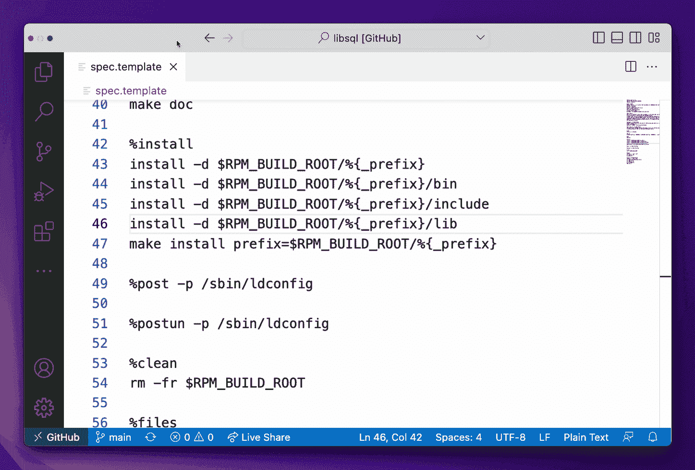
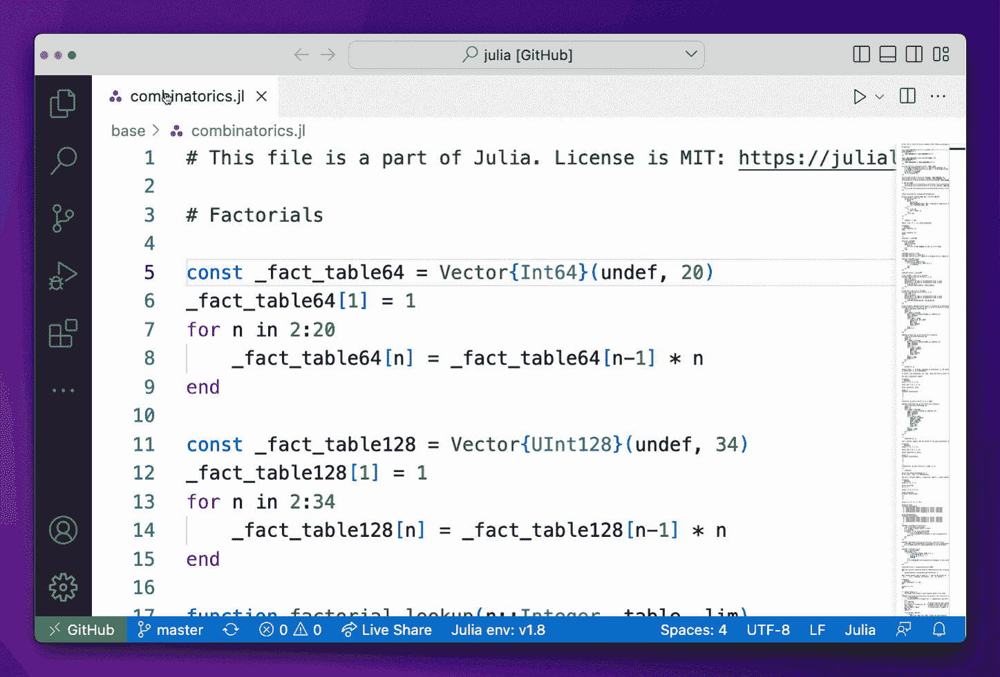
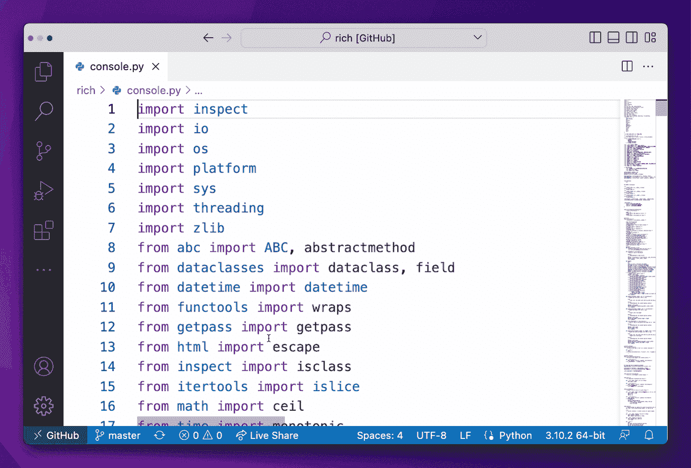

# 5 种节省时间的代码快捷方式

> 原文：<https://betterprogramming.pub/5-time-saving-vs-code-shortcuts-a966e8fd4061>

## 以及如何通过有目的的练习快速学会它们


作者提供的图片(带 Canva)

你花多少时间在键盘和鼠标之间移动你的手？

据 T21 估计，这个数字为每天 16 分钟。每年整整八天！虽然这个估计不科学，但我不认为它是牵强的。我猜对于程序员来说，这个数字甚至更高。键盘快捷键对于开发者来说是必不可少的。关于捷径的文章并不缺乏，但很少有人提供实践捷径的技巧。

以下是我最常用的五个 VS 代码快捷键，以及我是如何练习它们并坚持下来的。

# 1.导航单词，而不是字符

将光标移动到当前行的新“单词”上，不要使用鼠标，也不要逐字符移动。

*   macOS: `Option` + ←，`Option` + →
*   Linux: `Ctrl` + ←，`Ctrl` + →
*   Windows: Linux: `Ctrl` + ←，`Ctrl` + →

这是它实际运行的样子:



将此与快捷方式结合起来，将光标移动到一行的开头或结尾，以便更快地导航。(MAC OS:`Cmd`+←`Cmd`+→；视窗:`Home`和`End`)

## 什么是“字？”

一般来说，单词之间用空格和下划线分隔。

逗号、句号和其他标点符号经常被忽略。然而，VS 代码将像`!=`和`&&`这样的操作符视为单词，并跳过嵌套的大括号跳到下一个标识符或操作符。

## 怎么练

时间:1–2 分钟
频率:每天两次，至少持续五天

打开任何代码库中的任何文件。选择一行并将光标移动到该行内的某个位置。接下来，在行中选择一个“单词”,并使用快捷键将光标移动到该单词上。用不同的台词和不同的“单词”重复这个动作

# 2.只需一次击键即可复制和粘贴

不用选择一行、复制它、在上面或下面插入新的一行并粘贴它，您可以通过一次击键来执行整套操作。

*   macOS: `Shift` + `Option` + ↑，`Shift` + `Option` + ↓
*   Linux: `Shift` + `Alt` + ↑，`Shift` + `Alt` + ↓
*   Windows: `Shift` + `Alt` + ↑，`Shift` + `Alt` + ↓

这适用于选定的多行，因此您可以快速重复整个文本块。

它看起来是这样的:



当创建结构相似的项目数组时，此快捷方式非常方便。它也非常适合处理配置文件、XML 文件、JSON 文件或任何其他具有重复结构的代码相邻文件。

# 怎么练

时间:2 分钟
频率:每天两次，至少持续五天

创建一个包含 YAML、JSON、XML 或其他经常使用的结构化文本文件副本的文件夹。挑选一两个，花几分钟时间使用快捷方式添加新项目。

# 3.一步删除代码

您可以在一个步骤中完成所有这些操作，而不是选择一行，删除它，然后按 backspace 删除空行。

*   macOS: `Shift` + `Cmd` + `K`
*   Linux: `Shift` + `Ctrl` + `K`
*   视窗:`Shift` + `Ctrl` + `K`

它是这样工作的:



这适用于选定的多行代码，因此如果需要，您可以快速删除整个代码块。

# 怎么练

时间:1 分钟
频率:每天两次，至少持续五天

打开任何你想要的文件，然后去删除代码。这是一种宣泄，不是吗？

# 4.轻松重命名变量

使用 VS 代码内置的变量重命名特性，而不是手动查找并更改变量的所有实例，或者甚至使用查找和替换。

*   苹果电脑:`F2`
*   Linux: `F2`
*   视窗:`F2`

这也适用于函数名、类名和其他标识符。

这是它实际运行的样子:


VS 代码可以推断应用更改的范围。如果需要，您可以在重命名窗口中按`Shift` + `Enter`预览更改。


# 怎么练

时间:1-2 分钟
频率:每天两次，至少持续五天

从 GitHub 克隆一个存储库，或者使用自己的存储库，并使用快捷键练习重命名。

# 5.快速浏览参考文献

您可以在不离开当前文件的情况下快速浏览所有引用，而不是在代码库中搜索对函数的引用。

*   macOS: `Shift` + `F12`
*   Linux: `Shift` + `F12`
*   视窗:`Alt` + `F12`

这就是它的作用:



# 怎么练

时间:1–2 分钟
频率:每天两次，至少持续五天

从 GitHub 克隆一个库，并练习使用快捷方式查找参考资料。

# 如何掌握键盘快捷键

我在这里建议的练习程序是一个好的开始。

为了有效地练习，[研究建议](https://www.hopkinsmedicine.org/news/media/releases/want_to_learn_a_new_skill_faster_change_up_your_practice_sessions)你每次都应该改变练习的内容。在不同的代码库和文件类型上练习。为自己设定不同的目标。经常练习，每次练习间隔几个小时。

做到这一点，那些击键会立刻变成肌肉记忆。

```
**Want to Connect?**One email, every Saturday, with one actionable tip.
Always less than 5 minutes of your time.[Subscribe here](https://davidamos.dev/curious-about-code-newsletter/) to become a better coder in 5 minutes.
```