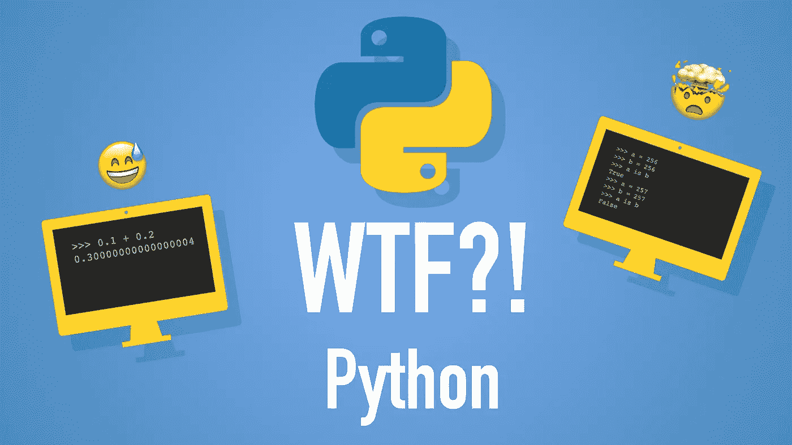
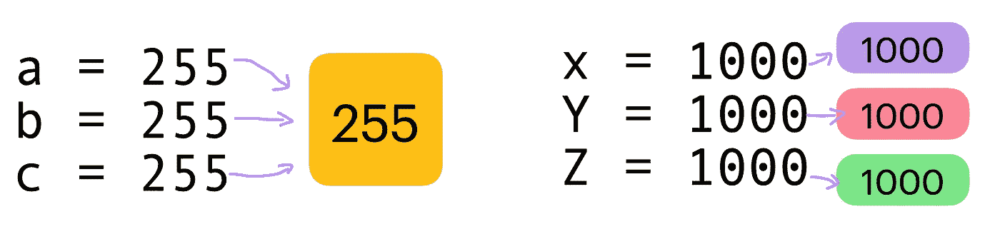

# 5 次 Python 让我说 WTF

> 原文：<https://betterprogramming.pub/5-times-python-made-me-say-wtf-38a36c2a551f>

## 了解一些有趣的 Python 怪事



Python 是一种流行的编程语言。和其他优秀的编程语言一样，Python 有时会让开发人员摸不着头脑。

今天我用 Python 给大家展示五个“搞笑”的 wtf。不，我不是在说虫子。

# 1.有时两个相等的数字不相等

让我们使用 Python 的`is`操作符来比较两个相等的数字，看看会发生什么:

```
>>> a = 256
>>> b = 256
>>> a is b
True>>> a = 257
>>> b = 257
>>> a is b
False
```

## 它是如何工作的

首先，使用`==`运算符检查两个变量是否相等。另一方面，`is`操作符检查变量是否指向同一个对象。

其次，Python 在引擎盖下做了一些优化。一些常用的对象，例如小数字(介于-5 和 256 之间)只分配一次。但是更大的数量是根据需要多次按需分配的。

这里有一个例子:

```
>>> x = 1000
>>> y = 1000
>>> z = 1000
```

数字`1000`被分配三次，因此即使数字`x`、`y`和`z`相等，它们都被分配了不同的`1000`。然而，这里有另一个例子:

```
>>> a = 255
>>> b = 255
>>> c = 255
```

数字 255 只被分配了一次，所以“同一个`255`”被使用了三次。这实际上是`is`操作符感兴趣的，而不是值相等。



总是只有一个 255，但是例如可以有多个 1000。图片鸣谢:作者。

关键的一点是:不要用`is`来比较数字，尽管它有时会起作用。

# 2.这是它不是什么

```
>>> 'something' is not None
True
>>> 'something' is (not None)
False
```

## 它是如何工作的

*   `is not`实际上是单个二元运算符。因此，其行为不同于单独使用`is`和`not`。
*   如果比较的变量指向同一个对象，则`is not`返回`False`，否则返回`True`。

为了分解这个例子，`(not None)`计算为`True`，因为值`None`在布尔意义上是`False`。这样`'something' is (not None)`就淡化为`'something' is True`。

# 3.0.1+0.2 的结果是什么？

我们来做一个简单的计算。这应该足够简单，不会引起任何问题，对吗？

```
>>> 0.1 + 0.2
0.30000000000000004
```

哇…

## 它是如何工作的

这在其他编程语言中也是一种常见的异常现象，有一个网站[0.30000000000000004.com](https://0.30000000000000004.com/)详细解释了这是怎么回事。

简而言之，计算机可以按原样存储整数，但它们需要近似十进制值。

在一个由计算机完成所有数学运算的 2 进制数字系统中，`1/10`和`1/5` ( `0.1`和`0.2`)实际上是循环小数(类似于`1/6`在 10 进制系统中循环小数`0.166666…`)。

当您的计算机使用循环小数进行计算时，由于近似值，结果可能会有剩余。当计算机最终将 2 进制的结果转换成 10 进制的结果时，可能的剩余部分继续进行。例子的结果是`0.1 + 0.2 = 0.30000000000000004`。

# 4.在链接中

你知道这个表达式的结果是`True`吗？

```
>>> "A" in "AA" in "AAA" in "AAAA"
True
```

## 它是如何工作的

在 Python 中，可以通过设计来链接比较运算符。在上面的例子中，它看起来很可笑，也不是特别有用。但是，当您可以执行以下操作时，它会变得很方便:

```
>>> 0 < x < 10
```

而不是:

```
>>> x > 0 and x < 10
```

# 5.使用布尔运算进行数学运算

厌倦了用数字做数学吗？为什么不用布尔函数代替呢？在 Python 中，可以用布尔值进行计算。例如:

```
>>> (True + True) * (True + True + True)
6
```

这对应`(1 + 1) * (1 + 1 + 1)`。

## 它是如何工作的

在早期，Python 中没有`True`也没有`False`。而是分别使用了`1`和`0`。如今，布尔值`True`和`False`是存在的，但它们与整数`0`和`1`捆绑在一起。 [Python 3 文档](https://docs.python.org/3/reference/datamodel.html#:~:text=These%20represent%20the,returned%2C%20respectively)说明了一切:

> Boolean 类型是 integer 类型的一个子类型，在几乎所有上下文中， **Boolean 值的行为分别类似于值 0 和 1，例外情况是当转换为字符串时，分别返回字符串`"False"`或`"True"`。**

# 结论

感谢阅读。希望你觉得好笑，有用！

# 你可能会发现这些文章很有见地

[](/10-useful-python-snippets-to-code-like-a-pro-e3d9a34e6145) [## 10 个有用的 Python 片段，让你像专业人士一样编写代码

### 我每天使用的有用的提示和技巧

better 编程. pub](/10-useful-python-snippets-to-code-like-a-pro-e3d9a34e6145) [](/understand-python-decorators-in-3-minutes-ec48fdc8e2cf) [## 3 分钟了解 Python Decorators

### 用 decorators 扩展方法和类的功能

better 编程. pub](/understand-python-decorators-in-3-minutes-ec48fdc8e2cf) 

# 资源

 [## 文件

### 欢迎光临！这是 Python 3.9.5 的文档。

docs.python.org](https://docs.python.org/3) [](https://github.com/satwikkansal/wtfpython) [## satwikkansal/wtfpython

### Exploring and understanding Python through surprising snippets. Translations: Chinese 中文 | Vietnamese Tiếng Việt |…

github.com](https://github.com/satwikkansal/wtfpython)