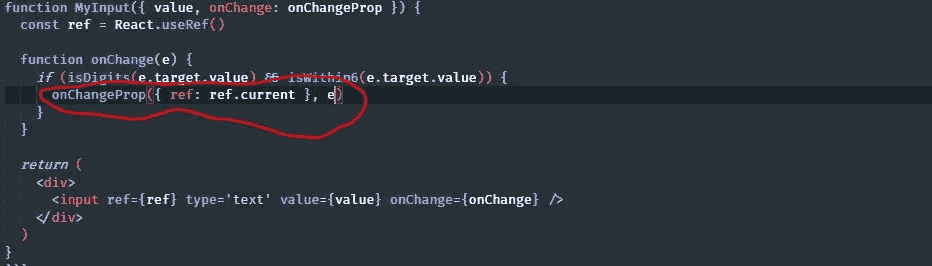
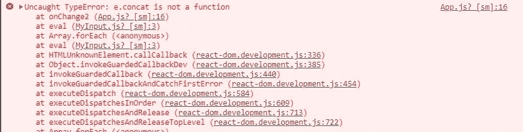
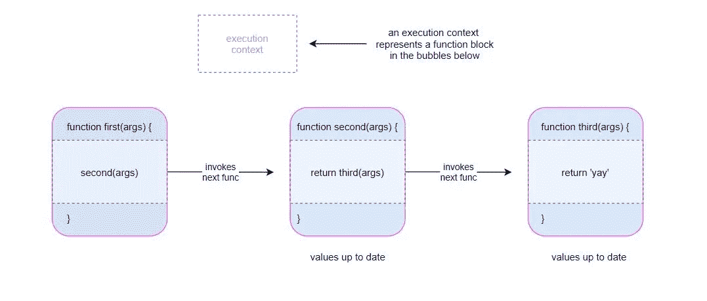
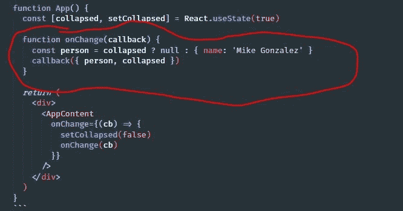

# 在 React 中编写事件处理函数的 5 个技巧

> 原文：<https://betterprogramming.pub/5-tips-for-composing-event-handler-functions-in-react-479553968585>

## 更好的构图

*卢卡·布拉沃在 Unsplash 上拍摄的照片*

JavaScript 因其独特的组合和创建函数的能力而受到称赞。这是因为在 JavaScript 中，函数是一等公民，这意味着它们可以被视为值，并且具有其他函数所具有的所有操作属性(比如能够被赋给变量、作为函数参数传递、或者从函数返回等等。).

我们将讨论在 React 中编写事件处理程序的五个关键技巧。本文不会涵盖所有可能的事情，但会涵盖每个 React 开发人员至少应该知道的编写事件处理程序的重要方法。

我们将从一个输入元素开始，并附加一个`value`和`onChange`道具开始:

我们的事件处理程序是`onChange`，第一个参数是来自处理程序所附加的元素的事件对象。

从这里我们可以改进什么？嗯，编写可重用的组件通常是一个好的实践，我们可以使其可重用。

# 1.将设置器移动到更高的级别

一种方法是将设置`value`状态的责任交给`props`，这样其他组件就可以重用这个输入:

这意味着我们还必须将对事件处理程序(包含状态设置器)的控制权交给父类:

但是我们所做的只是将状态和事件处理程序移动到父组件，最终我们的`App`组件与我们的`MyInput`完全相同，只是名称不同。那么这有什么意义呢？

# 2.如果出于可扩展性目的需要更多信息，请包装您的事件处理程序

当我们开始作曲时，事情开始改变。看一下`MyInput`组件。与其直接将`onChange`分配给它的`input`元素，我们不如赋予这个可重用组件一些额外的功能，让它更有用。

我们可以通过在另一个`onChange`中组合`onChange`并将新的`onChange`附加到元素上来操作`onChange`。在新的`onChange`中，它将从 props 中调用原来的`onChange`,因此功能仍然可以正常运行——就像什么都没改变一样。

这里有一个例子:

这带来了当`input`的`value`改变时注入额外逻辑的惊人能力。它的行为很正常，因为它仍然在它的块中调用原来的`onChange`。

例如，我们现在可以强制 input 元素只接受数字值，并且最多只接受六个字符的长度，如果我们想用它来验证通过用户电话的登录，这是很有用的:

然而，实际上，到目前为止，这一切都可以在父`App`中实现，没有任何问题。但是如果父进程中的`onChange`处理程序需要的不仅仅是来自`MyInput`的事件对象呢？那里的`onChange`处理程序不再有用:

但是除了事件对象和知道元素的值正在改变之外，`App`还需要什么呢，这是它已经知道的(因此在`onChange`处理程序的执行上下文中)？

# 3.利用通过参数组成的原始处理程序

直接访问`input`元素本身非常有用。这意味着让一些`ref`对象和事件对象一起传入是有用的。这很容易做到，因为`onChange`处理程序是在这里编写的:

我们所要做的就是声明 React 钩子`useRef`，将它附加到`input`，并在一个对象内部将其作为第二个参数传递给`onChangeProp`，这样调用者就可以访问它:

# 4.保持高阶函数处理程序和组合处理程序的签名相同

通常，保持组合函数的签名与原始函数的签名相同是一个非常重要的实践。我的意思是在我们的例子中，两个`onChange`处理程序的第一个参数都是为事件对象保留的。

在组合函数时保持签名一致有助于避免不必要的错误和混淆。

如果我们交换参数的位置，就像这样…

…然后，当我们重用组件时，很容易忘记和弄糟这一点:

当我们避免这种混乱时，您和其他开发人员的压力也会更小。

一个很好的例子是，当您希望允许调用者提供尽可能多的事件处理程序，同时使应用程序能够正常运行时:

如果其中至少有一个试图做一些特定于字符串的方法，比如`.concat`，就会发生错误，因为签名是`function(event, ...args)`而不是`function(str, ...args)`:

# 5.避免引用和依赖事件处理程序(闭包)内部的状态

这是一件非常危险的事情。

如果做得好，在回调处理程序中处理状态应该没有问题。但是，如果你在某一点上犯了错误，并且引入了难以调试的无声错误，那么后果就开始吞噬你一天中额外的时间。

如果你正在做这样的事情…

…您可能应该重新访问这些处理程序，并检查您是否真的得到了正确的结果。

如果我们的`input`的值为`23`，我们在键盘上键入另一个`3`，结果如下:

如果您理解 JavaScript 中的执行上下文，这是没有意义的，因为对`setValue`的调用在移动到下一行之前已经执行完毕。

嗯，实际上还是对的。JavaScript 现在没有做错什么。它实际上是在做自己的事情。

对于渲染过程的完整解释，你可以阅读他们的文档。

但是，简而言之，每当 React 进入一个新的渲染阶段时，它会对该渲染阶段的所有内容进行快照。在这个阶段，React 本质上创建了一个 React 元素树，它代表了该时间点的树。

根据定义，对`setValue`的调用确实会导致重新渲染，但是这个渲染阶段是在未来的某个时间点。这就是为什么在`setValue`完成执行后状态`value`仍然是`23`的原因，因为那个时间点的执行是特定于那个渲染的，有点像拥有他们自己生活的小世界。

JavaScript 中执行上下文的概念是这样的:

在我们的示例中，这是 React 的渲染阶段(您可以将此视为 React 拥有自己的执行上下文):

说完这些，我们再来看看我们对`setCollapsed`的调用:

这都发生在同一个渲染阶段，所以这就是为什么`collapsed`仍然是`true`而`person`被作为`null`传递。当整个组件重新呈现时，下一个呈现阶段的值将代表上一个阶段的值:

# 结论

本文到此结束。我希望你发现这是有价值的，并期待在未来更多！