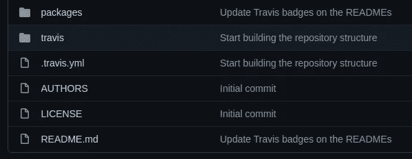

# 减少软件开发项目中 bug 的 5 个技巧

> 原文：<https://betterprogramming.pub/5-tips-for-reducing-bugs-in-software-development-projects-5bc592c2881a>

## 每个软件系统都有缺陷——让我们学习一些在编码时减少缺陷的技巧

照片由 [Fotis Fotopoulos](https://unsplash.com/@ffstop?utm_source=unsplash&utm_medium=referral&utm_content=creditCopyText) 在 [Unsplash](https://unsplash.com/s/photos/software?utm_source=unsplash&utm_medium=referral&utm_content=creditCopyText) 上拍摄，由 Canva 编辑

bug 是指软件系统的意外行为。错误有不同的严重程度。一些错误阻止用户做一些简单的动作；一些错误会暂停软件系统的一部分，有时，整个软件系统可能会因为一个严重的错误而暂停。在大多数情况下，社区/用户群会找到规避软件错误的方法。例如，我们经常看到几篇博文、视频教程和 GitHub 库来解决软件框架中的 bug 和限制。

然而，软件系统中的缺陷直接影响软件质量。另一方面，软件质量决定了每个软件项目未来的成功。因此，程序员总是努力用各种策略来减少软件 bug。

错误的产生有各种原因:编码错误、依赖关系错误和硬件故障。即使我们解决了源代码和平台中的错误，硬件故障也会引入错误。例如，遥远的[宇宙射线](https://en.wikipedia.org/wiki/Cosmic_ray)可以通过翻转物理内存位来改变程序运行时的变量。软件缺陷确实是不可避免的——但是我们可以减少它们。

在这个故事中，我将用实际例子来解释减少软件系统中的错误的几个技巧。您可以在编码时使用这些策略。

# 使用依赖关系前要三思

程序员经常使用依赖库来节省他们写代码的时间。例如，如果您需要构建一个基于 Nodejs 的 CLI 程序，您可以选择 [Commander.js](https://github.com/tj/commander.js/) ，而无需自己解析命令行参数。依赖库帮助程序员最小化逻辑错误和开发时间。但是，依赖库可能会降低代码质量，引入限制，并引入新的错误。

每个程序员通常不会检查和研究软件库的源代码。因此，它们可能会提供软件库无法处理的各种输入。并非所有的软件库都是灵活和可扩展的。如果一个特定的软件库有一个限制，我们必须应用几个被称为 hacks 的变通方法。这些变通方法经常会产生一些很难解决的错误。由于这种情况，大型科技公司倾向于创新新的软件库，而不是使用现有的软件库。

但是，考虑到整体优势，我们通常会尝试使用现有的软件库。在将特定依赖项集成到您的代码库之前，研究它现有的缺陷、限制、编码标准、性能基准和社区支持。确保编写几个针对第三方库的单元测试，以避免在库更新期间崩溃。

# 即使在简单的重构之后，也要重新测试一切

想想程序员如何初始化他们的软件项目。一些开发团队将概念验证(POC)项目转化为生产就绪软件。与此同时，一些程序员甚至在开始写代码之前就设计好了代码库的结构。然而，大多数软件产品都是从概念验证开始的。例如，查看 Flutter 框架的初始代码库，并将其与当前的项目结构进行比较。

Flutter 的初始代码库。作者截图。

程序员经常进行重构，将这些工作概念转化为生产就绪的软件系统。即使在生产就绪的代码库中，代码重构过程也更加常见。有时候，代码重构会产生甚至你的测试套件都无法识别的逻辑问题。

最近，我在我的一个开源项目中做了一个简单的重构。我将一个大函数分解成几个小的[子函数](https://github.com/neutralinojs/neutralinojs/blob/main/main.cpp#L127)。后来，我发现软件项目的一个模块没有按预期运行，因为重构过程改变了前面语句的流程。即使在完成简单的代码重构之后，也要重新测试所有的东西，因为你的软件系统的逻辑流程可能会被改变。

# 避免在主代码库中保存快速补丁

没有程序员能写出完美的代码，没有错误，没有小的设计模式缺陷，没有隐藏的逻辑问题。您今天准备提交的代码可能包含您明天必须修复的隐藏错误。三方会检测你写的代码中的 bug:你、测试人员和用户。当程序员注意到用户端出现了 bug 时，他们通常会尝试通过应用快速补丁来解决它。

在某些开发场景中，这些快速补丁也称为热修复补丁。这些补丁让用户高兴，但有时可能会降低代码质量并产生更多的错误。因此，如果可能的话，从容地实现一个适当的修复总是好的。

然而，我们经常不得不编写即时补丁来挽救软件产品的声誉。在这些情况下，可以先进行快速修复，然后进行适当的修复，以防止由于之前的快速修复而导致的未来错误。当你在应用产品问题的修复时，不要有压力——因为当你在修复一个问题时，有压力的头脑会引入一个新的错误。下面的故事讨论了程序员的压力管理技巧:

 [## 在你的软件开发生涯中防止压力的 5 个技巧

### 在任何软件工程工作中使用这些实践，把它作为一种爱好来享受

better 编程. pub](/5-tips-to-prevent-stress-in-your-software-development-career-e368e8122de1) 

# 使用良好的代码风格指南编写干净的代码

每个高级工程师都会激励他们项目的初级工程师编写干净的代码来保持源代码的质量。干净代码实践帮助我们使我们的代码库不容易出错，易于理解，并且易于扩展。每个代码库都有一个基于输入和条件语句的独特逻辑流程。我们可以根据逻辑流程绘制一个有向图结构。

干净代码实践帮助我们降低逻辑流程图的复杂性。当你的代码库不干净，有杂乱的代码时，这个图就变得复杂了。然后，程序员可能会努力在脑海中绘制这种逻辑结构，以应用代码修改。因此，您的软件系统即将推出的功能可能会包含更多的错误。

因此，使用广为接受的代码风格指南来编写干净的代码总是很棒的。如果你的项目还没有遵循代码风格指南，从[这里](https://github.com/Kristories/awesome-guidelines)选择一个。请根据您的喜好随意修改这些指南。下面的故事进一步解释了干净的代码实践:

 [## 每个软件项目的 5 个干净代码实践

### 提高前端、后端、CLI、桌面或移动应用程序代码库质量的想法

better 编程. pub](/5-clean-code-practices-for-every-software-project-479443b31c3c) 

# 重新思考你的错误处理策略

所有的软件系统都做四种通用的动作:捕获输入、处理数据、存储信息和显示/返回信息。每个用户操作都有一个预期的结果。例如，如果您使用 Angular CLI 创建一个新的单页面应用程序(SPA ),我们希望`ng new`命令将搭建一个新的应用程序。有时，软件程序在运行时不能给出预期的结果。

在这些情况下，程序员编写错误处理代码来给出替代结果而不是预期结果。程序员使用不同的方法来处理错误。一些程序员使用 if-else 条件并检查错误代码。同时，一些程序员使用异常并用 try-catch 块捕获它们。

未处理的错误可能会导致系统崩溃。此外，在输入错误的情况下继续执行程序可能会使您的系统崩溃，或者在软件系统的存储器中保存无效信息。确保您的错误处理方法足够好，能够产生更好的替代结果。否则，错误处理缺陷可能会产生我们不容易修复的长期运行的错误。

过度使用类似 try-catch 的模型会导致容易出错的代码。由于这个原因，Google 的 C++代码风格指南[根本不建议](https://google.github.io/styleguide/cppguide.html#Exceptions)程序员使用标准异常。此外，Go 编程没有提供异常功能。通过默认值减少错误处理流程是避免未处理的与错误相关的系统崩溃的一个很好的实践。

感谢阅读。