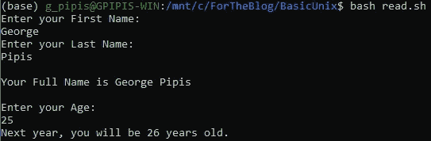
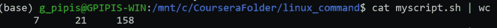
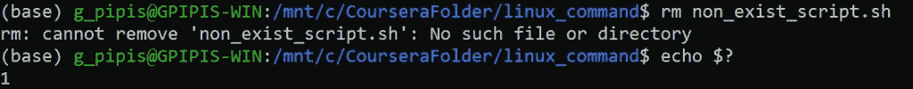
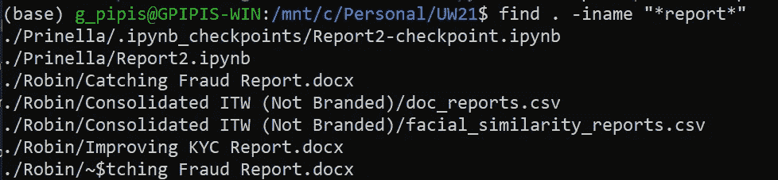
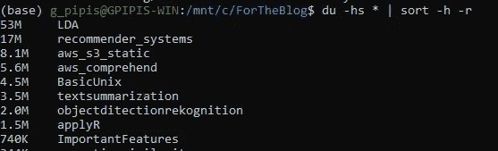

# Bash 脚本初学者的 5 个技巧

> 原文：<https://betterprogramming.pub/5-tips-in-bash-scripting-for-beginners-e113a2cf1510>

## Bash 脚本中的有用技巧


照片由[马蒂亚斯·施罗德](https://unsplash.com/@trancepole?utm_source=medium&utm_medium=referral)在 [Unsplash](https://unsplash.com?utm_source=medium&utm_medium=referral) 上拍摄

# 1.如何与最终用户互动

我们将提供一个简单的`read`语句示例，展示如何与最终用户进行交互。注意，在这个例子中，我们不处理错误，因为我们想保持简单。让我们创建`read.sh`脚本。

```
echo "Enter your First Name: "
read FIRSTNAME
echo "Enter your Last Name: "
read LASTNAMEecho ""
echo "Your Full Name is $FIRSTNAME $LASTNAME"echo ""
echo "Enter your Age: "
read AGEecho "Next year, you will be `expr $AGE + 1` years old."
```

让我们现在运行它。



注意我们是如何用反斜线`expr $AGE + 1`来写这个表达式的

# 2.退出状态

在 Unix 中，每个命令都有一个退出代码，取值范围从 **0 到 255** 。我们应该记住的是，0 意味着成功，其他都是错误。为了得到退出代码，我们可以运行`$?`。例如，我将运行命令`wc`。

```
cat myscript.sh | wc
```



如果我想得到退出代码:

```
echo $?
```

我们得到 0 表示成功。现在，假设我们想要删除一个不存在的文件。

```
rm non_exist_script.shecho $?
```



这里的退出代码是 1，这意味着“不成功”，更具体地说，这意味着不允许操作。最后，如果我们写了一个脚本，并希望在出现错误时终止它，我们可以添加行`set -e`。

# 3.如何搜索文件或目录

试图在我们的硬盘或目录和子目录中找到一个文件是很常见的。我们可以在 Unix/Linux 中使用`find` 命令轻松做到这一点。假设我正在寻找包含单词`report`的文件名

```
find . -iname "*report*"
```



注意，`.`指的是我们当前的目录，我们可以像`/home`一样显式地使用路径，`-iname`会让`find`忽略文件名的大小写，如果你想区分大小写，你应该使用引号内的`-name`和`*`来指代任何字符，所以本质上，我们寻找的是包含子串`report`的文件名。

关于对搜索有用的通配符:

*   `*`零个或多个字符
*   `?`任何一个字符
*   `[]`括号中的任何字符

# 4.如何获得目录的大小

如果我想查看系统的已用空间和可用空间，可以使用以下命令:

```
df -h
```

现在，如果我想获得一个文件夹中每个文件夹的大小，我可以键入:

```
du -hs * | sort -h -r
```



# 5.如何连接多个 CSV 文件

假设您的文件是`my_file_1.csv`、`my_file_2.csv, my_file_3.csv`等等，并且您想将它们连接成一个文件。然后，您可以使用以下命令来完成此操作:

```
cat my_file_*.csv > merged.csv
```

我们生成一个名为`merged.csv`的文件。

## 如何处理标题

现在，如果您的 csv 文件有文件头，并且您希望只保留一个文件的文件头，那么您可以使用以下命令:

```
awk '(NR == 1) || (FNR > 1)' my_file_*.csv > merged.csv
```

FNR 指的是单个文件中已处理记录的数量，NR 指的是所有文件，所以我们保留第一行，即文件头，忽略每个文件的第一行。

最后，如果您想删除所有文件的标题:

```
awk 'FNR > 1' my_file_*.csv > merged.csv
```

最初发布于[预测黑客](https://predictivehacks.com/tips/)