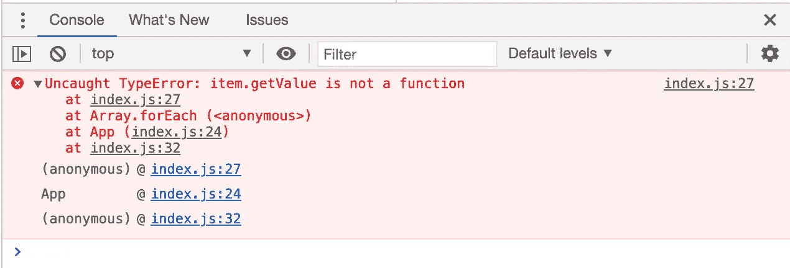
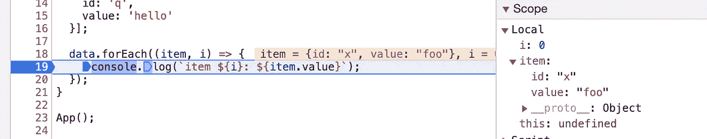
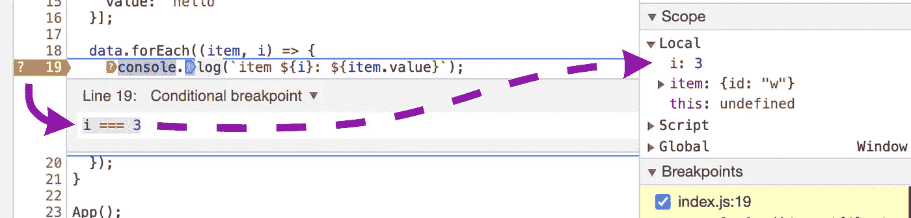
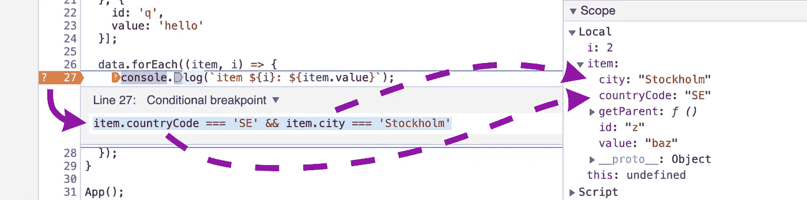
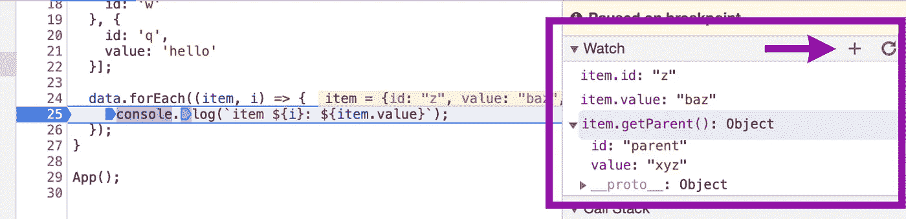
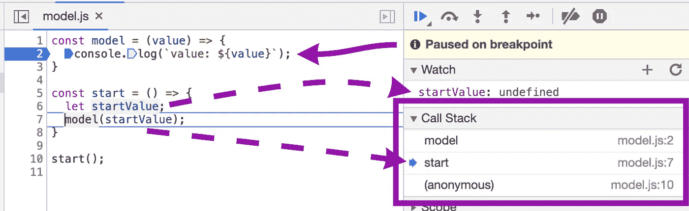
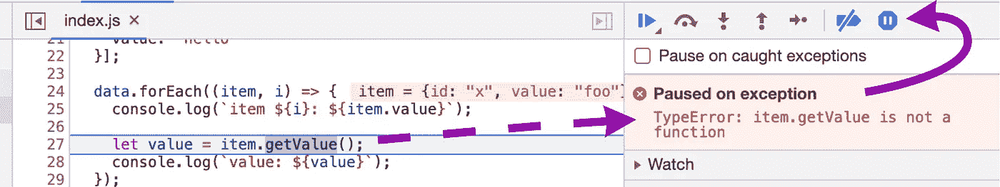

# 提高 JavaScript 调试技能并节省时间的 5 个技巧

> 原文：<https://betterprogramming.pub/5-tips-thatll-improve-your-javascript-debugging-skills-and-save-you-hours-7410a59afb64>

## 使用 Chrome DevTools 有效地解决您的 JavaScript 问题

照片由[菲利佩·波特拉](https://unsplash.com/@f_portella?utm_source=unsplash&utm_medium=referral&utm_content=creditCopyText)在 [Unsplash](https://unsplash.com/@f_portella?utm_source=unsplash&utm_medium=referral&utm_content=creditCopyText) 上拍摄

你是否曾经对导致你的网络应用崩溃的原因感到困惑？或者，您可能对如何追溯一个看似断断续续的 bug 的根本原因感到困惑。也许你已经因为看到这条消息而大脑爆炸了太多次。所有这些事情在我身上肯定发生过很多次了！

在本文中，我希望帮助改进您的 JS 调试技术，并通过这样做，从长远来看，为您节省数小时甚至数周的时间。既然你可以不拉头发了，你甚至可以把头发长回来！

臭名昭著的红色错误信息在开发过程中不时出现，有时甚至出现在生产中

如果你是一个经验丰富的 web 开发人员，你可能已经熟悉了这些技巧中的大部分；在这种情况下，您可以快速浏览并验证您已经掌握了调试游戏。对于其他人，尤其是在职业生涯早期进入前端或前端开发的后端开发人员，我希望这篇文章能让你感觉特别好！

是时候停止猜测，停止`console.logging`，停止无休止的尝试和错误了。相反，您可以使用一致且系统的方法来进行 JS 调试。

# 1.用条件断点解开循环

我想你已经熟悉了如何使用 Chrome DevTools 在调试器中设置常规断点，所以这里有一个巧妙的技巧来改进它们。

在每次迭代中都会停止的常规断点。

如果你曾经试着调试过一个`for`循环，你就会知道得到正确的迭代是相当痛苦的。如果你正在迭代的数据集包含超过 100 个条目，你可能要进行一次严重的跳跃练习——请进行下一次函数调用！如果没有结构化的方法，您可能会几个小时都无法跳过函数调用。

因此，一个聪明的技巧是使用条件断点，让调试器只在特定的迭代中停止——例如，当`i === 143`时。要将常规断点转换为条件断点，只需右键单击它，然后选择“编辑断点”现在只需输入您想要的循环条件，重新加载页面，并观察调试器只在您想要的迭代上暂停。

基于迭代器的条件断点—当 i === 3 时，这个特定的断点停止

# 2.使用高级表达式中断

如果您不知道在哪个迭代中停止，但是有另一个您感兴趣的可变条件，该怎么办？没问题，条件断点可以用来计算(和暂停)任何表达式。

例如，假设您想在某个对象属性为`undefined`时停止。在这种情况下，下面的表达式就足够了: `myObject.interestingValue === undefined`。甚至可以让断点评估多个条件，就像任何常规的`if`语句一样——例如`myObject.interestingValue === 200 && myObject.anotherValue !== 'foo'`。

使用多个条件的条件断点

只有你的想象力设定了界限。您甚至可以评估函数执行的返回值，例如`myObject.getParent().id === 97`。

# 3.从观察面板检查变量(跨重新加载)

在寻找 bug(或者更确切地说是 bug 修复)时，有时有必要在页面重新加载时检查变量——例如，如果您更改了代码或者更新了底层数据源。

您可以将变量添加到变量监视列表中，而不是在调试器停止时通过鼠标悬停或通过控制台来手动检查变量。这将使变量随时可供检查，并自动更新和显示其当前值——如果您需要在重载期间同时检查多个变量，这将非常有用。

在监视列表中，您甚至可以通过点击变量来交互式地检查变量。每当我调试更复杂的 JS 对象时，我都会用到这个技巧。

要将变量添加到观察列表中，只需点击观察面板上的加号，然后输入您感兴趣的变量的名称。

通过单击加号将您的变量添加到调试器监视列表中，并观察它们的值自动更新！

# 4.遍历调用堆栈以找到根本原因

每当您调试和检查一个变量时，例如作为一个参数传递给一个函数，您可能会意识到这个值是不正确的。在 JS 中看到`undefined`是很常见的，即使你希望变量已经被赋值。一个常见的根本原因是变量从来没有在执行序列的早期被赋值。

通过遍历调用堆栈，您可以轻松地回溯到导致当前断点的所有步骤，检查变量和赋值以验证问题最初源自何处；像这样的时间旅行，一般不需要很长时间就能找到那条冒犯的线！

通过遍历调用堆栈，我们能够在执行的早期检查变量。在这种情况下，调试器已经停止在第 2 行，但是从调用堆栈中，我们可以及时返回；如您所见，startValue 从一开始就没有被赋值。

# 5.异常时自动暂停

DevTools 调试器中的另一个致命特性是在异常发生前自动暂停的可能性。

您可能已经目睹过，每当一个异常被抛出太多次时，您的控制台就会出现令人尖叫的红色错误消息。如果您有点像我，发现这些日志通常会让您直接进入 bug-hunting 模式，找出导致异常的原因。

如果幸运的话，错误消息(或打印的调用堆栈)在某种程度上是描述性的，允许我们在更接近错误的假定来源的地方开始我们的故障诊断会话。在其他情况下，可能很难准确理解问题发生在代码中的什么地方，但在 web 应用程序本身中重现它却很简单。

通过激活“异常时暂停”特性，您可以让调试器在从 UI 再现错误时暂停，就在执行将要终止之前；这允许您检查变量或遍历调用堆栈来找出导致错误的原因。

使用停止图标激活“异常时暂停”，让调试器在抛出异常时自动停止

见鬼，如果你觉得有用的话，你甚至可以让调试器“暂停被捕获的异常”。

所以下次你不确定在崩溃后从哪里开始调试会话时，激活“异常暂停”，从那里开始！

# 奖金

作为奖励，这里有一个小提示，可以与前面的所有提示结合使用。

当深入调试会话时，在对代码进行故障排除时，经常会出现分散在代码中的多个断点。如果你因为某种原因被迫停止当前的会话，也许是跳到其他紧迫的问题上，比如生产事故，而不是删除所有的断点，你可以简单地停用它们。

每当你准备好重新开始你的 bug 搜索会话时，只需再次激活所有断点，并从你停止的地方重新开始！

使用此切换按钮激活或取消激活所有断点

# 结论

现在有了这些技巧，你就可以用一种更加可控和有效的方式来追踪 bug 了！

由于 99%的软件开发都是关于识别错误的，通常只有 1%花在编写代码上，所以对调试技术的任何改进都是值得花时间的，因为它会在你的整个职业生涯中为你带来回报。

感谢您的阅读，祝您好运，提高您的 JS 调试技能！