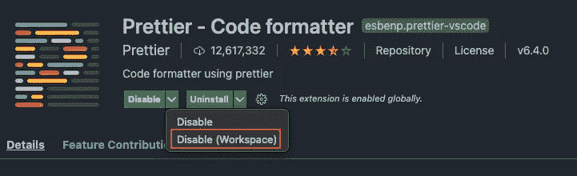
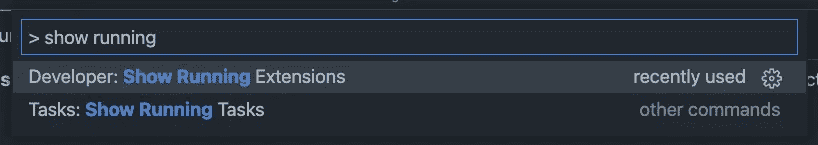
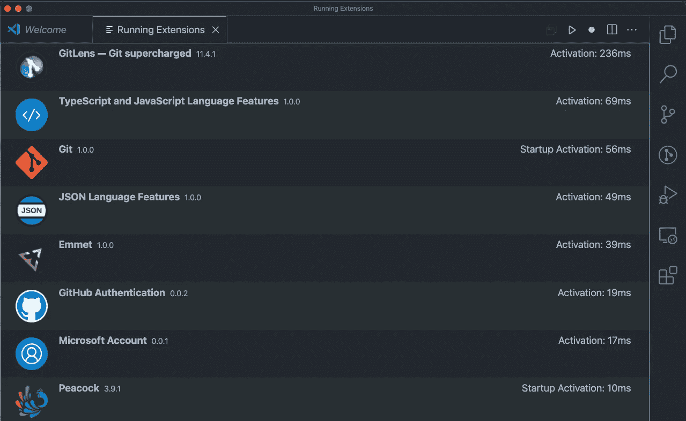
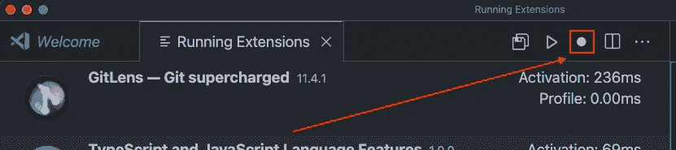
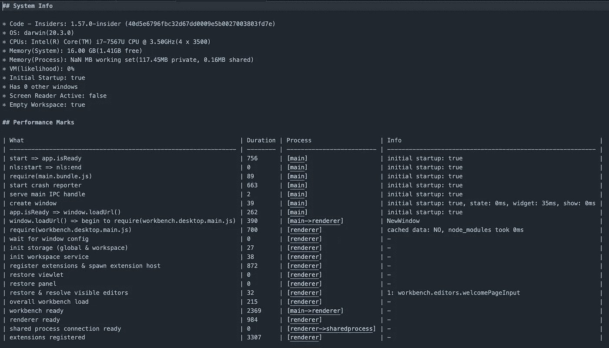
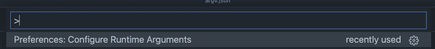
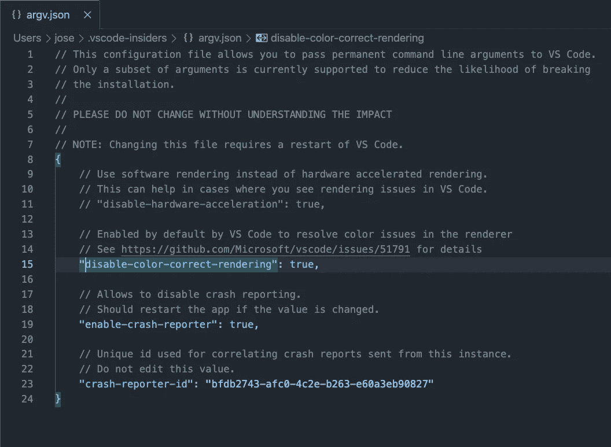

# 提升 VS 代码编辑器性能的 5 个技巧

> 原文：<https://betterprogramming.pub/5-tips-to-boost-the-performance-of-your-vs-code-editor-ff28dda68d9b>

## 让您的 Visual Studio 代码运行得更快

德文·扬塞·范·伦斯堡在 [Unsplash](https://unsplash.com?utm_source=medium&utm_medium=referral) 拍摄的照片。

Visual Studio 代码于 2015 年 11 月 18 日发布。一晃五年过去了，它已经成为最成功的编辑之一。它是在 MIT 许可下发布的，这使得它可以免费使用。其成功的关键在于:

*   多才多艺
*   大量的插件
*   多种平台上的可用性

目前，VS 代码可以在以下平台上本地使用:

*   OS X Yosemite (10.10+)
*   Windows 7(带。NET Framework 4.5.2)、8.0、8.1 和 10 (32 位和 64 位)
*   Linux (Debian): Ubuntu 桌面 16.04，Debian 9
*   Linux(红帽):红帽企业版 Linux 7，CentOS 8，Fedora 24

它也可以在任何功能有限的现代浏览器中运行。

其巨大的平台可用性是因为它是一个在电子上交付的网络应用程序。

> “Electron(原名 Atom Shell)是由 GitHub 开发和维护的开源软件框架。它允许使用 web 技术开发桌面 GUI 应用程序:它结合了 Chromium 渲染引擎和节点。— [维基百科](https://en.wikipedia.org/wiki/Electron_(software_framework))

唯一的缺点是，电子应用程序可能非常消耗资源，效率也不如本地应用程序。这意味着如果你不小心，它会变得更慢。

你的 VS 代码是不是感觉有点迟钝？你希望它以更高效的方式运行吗？今天，我们将学习五个技巧，帮助你充分利用它。

# 基本要求

在进行优化之前，让我们看看我们是否符合 Visual Studio 代码团队建议的最低硬件要求。我们至少需要 200 MB 的磁盘空间。

处理器和内存建议:

*   1.6 GHz 或更快的处理器
*   1 GB 内存

查看[更详细的列表](https://code.visualstudio.com/docs/supporting/requirements#_hardware)。

# 1.禁用未使用的内置功能

VS 代码附带了很多特性。然而，你可能对其中一些不感兴趣。因此，您可以禁用它们来提高编辑器的性能。

*   添加任何你不想让 VS 代码在你的项目中使用的文件模式。
*   `File > Preferences > Text Editor > Minimap > Enabled`:禁用/启用小地图的复选框。
*   `File > Preferences > Text Editor > Suggestions`:在这里，您可以微调任何与建议相关的内容。
*   `File > Preferences > Text Editor > From on save / Format on paste`:例如，您可以在保存时禁用格式化，并将其推迟到预提交。
*   `File > Preferences > Application > Telemetry`:遥测可能会影响性能。
*   `File > Preferences > Text Editor > Code lens`:您可以禁用/启用编码镜头功能。

# 2.做一个延伸的极简主义者

有大量的扩展可用。然而，这并不意味着你需要他们所有人。只添加那些对你的日常生产生活有直接影响的。

在添加任何扩展之前，问问自己:

*   这不是已经内置到 VS 代码中了吗？
*   不仅仅是一次性的事情吗？
*   对你的日常工作真的有影响吗？
*   对于您的用例来说，这是最好的工具吗？
*   它的评价好吗？

如果插件检查了所有的框，那么它可能很适合你。你也可以用你已经安装的扩展来完成这个过程。

# 3.将扩展绑定到工作区

如果您正在使用不同的代码堆栈处理许多不同的项目，您可能会发现自己安装了许多扩展。这很容易对性能产生影响。

一个技巧是将您的扩展与您的工作空间耦合起来。这样，您就知道您只加载了该工作空间所必需的插件。

你需要做的只是浏览所有可用的插件，并禁用你的特定工作空间不需要的插件。

禁用工作区插件的示例

开始时，这可能看起来像是一项耗时的任务，但从长远来看，这是值得的。

# 4.监控插件的加载时间

一旦你有了编码所需的最少插件，你就可以检查它们的性能了。VS 代码附带了一些开发人员选项，您可以加以利用。

您可以通过执行`cmd + p > Developer: Show Running Extensions`轻松监控所有这些插件的启动时间。

运行扩展命令的示例

您将获得一个列表，列出您所有的活动扩展及其激活时间。根据一般经验，您可能需要仔细检查任何超过 300 ms 的内容。

运行扩展命令的示例

如果你想深入了解，你可以点击“记录”按钮来分析他们。

分析扩展

如果您想清楚地了解 VS 代码发布时发生的一切，您可能需要检查一下`cmd + p > Developer Startup Performance`。

启动性能命令示例

您将获得以下信息:

*   操作系统详细信息
*   性能指标
*   扩展激活详细信息
*   缓存位置

启动性能命令的运行示例

它很好地概述了 VS 代码的性能。当试图断言任何变化对性能的影响时，这是很有用的。做定期检查是一个好习惯，以确保一切顺利运行。

# **5。微调您的配置运行时参数**

有些情况下，您可能需要进一步配置 VS 代码的启动。您可以通过在命令行中使用参数来做到这一点。很容易在`argv.json`文件中进行配置。

运行`CMD + Shift + P > Configure Runtime Arguments`。

配置运行时参数

然后用你所有的定制配置编辑`argv.json`文件。

用于配置运行时参数的文件

# 最后的想法

VS 代码是一个广泛使用的 IDE。它非常灵活，高度可定制。然而，这是有代价的。请确保您了解您正在添加的内容以及加载方式。

起初，为你发现自己正在做的任何小任务添加插件似乎更容易。随着时间的推移，该扩展开始消失，以寻找一个更具性能的编辑器。

我希望这些技巧能帮助你加快 VS 代码编辑器的速度，享受更好的编码体验。

# 相关文章

 [## 8 VS 代码插件，提高您的工作效率

### 帮助你日常工作的必备插件

better 编程. pub](/8-vs-code-plugins-to-improve-your-productivity-ee4497cebefa)  [## 编写高效高性能 JavaScript 代码的 7 个技巧

### 提升您的 JavaScript 应用程序的性能

better 编程. pub](/7-tips-to-write-efficient-and-performant-javascript-code-bccbdb9662ae)