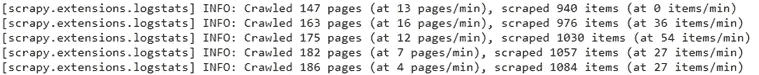
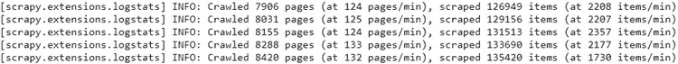
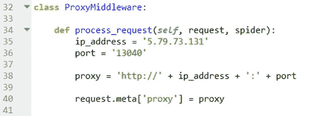
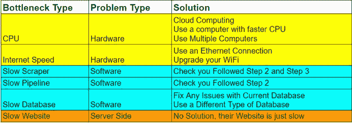

# 构建更快网络爬虫的 5 个步骤

> 原文：<https://betterprogramming.pub/5-tips-to-build-a-faster-web-crawler-f2bbc90cf233>

## 让你的 Python 铲运机快 100 倍

YouTube 上来自[网站开发者忍者](https://www.youtube.com/watch?v=0Z0BEOnGREQ)的照片。

抓取大量数据需要你有一个*非常*快的网页抓取器。如果你想刮 1000 万件物品，而你的刮刀每分钟刮 50 件物品，那么你要等 130 天才可以刮完。那太长了！

本指南提供了一个结构化的方法来建立一个超快速的网页刮刀。

现在让我来告诉你:

平均速率低于 50 件/分钟的刮刀

对此:

平均速率大于 2000 件/分钟的刮刀

# 1.设置

如果你在 Python 中进行抓取，并且想要更快，只有一个库可以使用: [Scrapy](https://scrapy.org/) 。如果你要做任何实质性的抓取，这是一个很棒的网络抓取框架。BeautifulSoup、Requests 和 Selenium 对于大型项目来说太慢了。如果你不熟悉 Scrapy，我建议你先学习它，然后再来看这篇文章。

在开始刮之前，我们需要做两件事:

1.  更改您的用户代理。你的用户代理告诉服务器谁在访问他们的网站。默认情况下，Scrapy 告诉服务器有一个机器人正在爬他们的网站。如果你不改变这个设置，你将在分钟内被禁止。要改变它，谷歌“用户代理”，并设置其中一个等于`settings.py`中的`USER_AGENT`变量。也可以轮换您的用户代理。然而，我发现这是不必要的。如果你想做到这一点，只需谷歌如何——我相信设置相对容易。
2.  为你的爬虫选择和设置代理。选择代理时，您应该考虑代理的定价结构。你按每 GB 带宽付费吗？你按代理付费吗？你按线程付费吗？对于大型项目，我总是按线程付费，并使用 StormProxies。对于较小的项目，我推荐 [SmartProxy](https://prf.hn/click/camref:1011leixZ) 。他们按 GB 的带宽收费，并提供无限的线程。接下来，您想要设置您的代理，这可以通过在如下所示的`middleware.py`文件中创建一个新的中间件来完成。这将为项目中的所有蜘蛛设置代理。然后，您需要将中间件添加到您的`settings.py`文件中。或者，您可以为每个蜘蛛单独设置代理。下面有一个关于如何做到这一点的简短视频:

代理中间件(所有蜘蛛)

为每个蜘蛛单独设置代理

# 2.优化你的刮痧策略

更聪明地工作，而不是更努力。

这一节讲的是三种刮削技术，它们将对你的速度产生巨大的*T2 差异。*

## 分步解决

如果你使用一只大蜘蛛，把它分成许多小蜘蛛。你这样做是为了可以利用 [Scrapyd](https://scrapyd.readthedocs.io/en/stable/) (更多细节在第 4 步)。Scrapyd 允许你同时运行许多蜘蛛(使用 Scrapy，你一次只能运行一个蜘蛛)。每只较小的蜘蛛会爬行大蜘蛛爬行过的部分。这些迷你蜘蛛不应该在它们爬行的内容上重叠，因为这将浪费时间。如果你把一个蜘蛛分成十个更小的，你的抓取过程将会快十倍左右(假设没有其他瓶颈——见步骤 5)。

## 尽量减少发送的请求数量

发送请求和等待响应是使用 scraper 最慢的部分。如果你能减少发送请求的数量，你的 scraper 会快很多。例如，如果你从一个电子商务网站搜集价格和标题，那么你就不需要访问每个商品的页面。您可以从结果页面获得所需的所有数据。如果你每页有 30 个条目，那么使用这种技术将使你的 scraper 速度提高 30 倍(它现在只需要发送一个请求，而不是 30 个)。总是寻找减少请求数量的方法。以下是你可以尝试的一些事情。如果你能想到任何其他的，请留下评论。

减少请求的常用方法:

*   增加结果页面上的结果数量(例如，从 10 个增加到 100 个)。
*   在刮擦之前应用过滤器(例如价格过滤器)。
*   使用普通的蜘蛛，而不是爬行蜘蛛。

## 将项目批量上传到数据库

慢抓取的另一个原因是人们倾向于抓取他们的数据，然后立即将这些数据添加到他们的数据库中。这很慢有两个原因。首先，批量处理总是比逐项相加要快。其次，通过批处理，您可以利用 Python 提供的许多工具批量上传到数据库。例如， [pandas](https://pandas.pydata.org/) 库可用于将数据放入 dataframe，然后将数据上传到 SQL 数据库。那就是*快得多*！如果你有兴趣了解更多，我强烈推荐你阅读[这篇关于批量上传到 SQL 数据库的文章](https://medium.com/analytics-vidhya/speed-up-bulk-inserts-to-sql-db-using-pandas-and-python-61707ae41990)。

# 3.设置

1.  `CONCURRENT_REQUESTS`:

> " Scrapy 下载程序将执行的并发(即同时)请求的最大数量."— [刺儿头的文档](https://docs.scrapy.org/en/latest/topics/settings.html)

这是您的蜘蛛将发送的同时请求的数量。你可能想用不同的值做一些实验，看看哪个值能给你最好的刮擦率。一个好的起点是 50 岁。如果您得到许多超时错误，那么您已经设置得太高了。减少 10%，再试一次。

2.`DOWNLOAD_TIMEOUT`:

> "下载程序在超时前等待的时间(秒). "— [刺儿头的文件](https://docs.scrapy.org/en/latest/topics/settings.html)

这是蜘蛛在发送请求后重试前等待响应的时间。设置太低，你会得到无尽的超时错误。设置的太高，你的蜘蛛将会等待而不是重试请求，浪费时间并减慢你的速度。从 100 秒开始，通过实验找到最佳值。

3.`DOWNLOAD_DELAY`:

> "下载程序在从同一网站下载连续页面之前应该等待的时间(秒)。"— [刺儿头的文档](https://docs.scrapy.org/en/latest/topics/settings.html)

这是您的蜘蛛在下载响应之间等待的时间。对于最大速度，将其设置为零。如果您一直得到响应代码 400、403 或 502，那么您的速度太快了。稍微增加下载延迟并重试(一个好的起点是 0.5)。

# 4.scrappy d

根据[它的文档](https://scrapyd.readthedocs.io/en/stable/)，Scrapyd 是一个部署和运行 Scrapy 蜘蛛的应用。

Scrapyd 允许你同时运行多个蜘蛛。这将使我们能够显著提高刮擦过程的整体速度。如果您希望 spider 部署免费且易于设置，请使用 Scrapyd。 [Scrapy 集群文档](https://scrapy-cluster.readthedocs.io/en/latest/topics/advanced/comparison.html)包含了许多备选方案，但我仍然会推荐 Scrapyd。

使用废料的好处:

1.  如果您的项目包含一个或多个大型蜘蛛，将它们分开(如本指南第 2 步所述)。
2.  不需要拆分的小蜘蛛，可以原样运行。

如果你只是阅读文档，Scrapyd 的设置可能会显得令人生畏，但下面的视频使它非常容易理解和实现:

注意:用一个命令就可以运行一个项目中的所有蜘蛛。设置它需要少量的工作，但是对于有十个或更多蜘蛛的项目，我推荐这样做。了解如何在 [*上叠加溢出*](https://stackoverflow.com/questions/10801093/run-multiple-scrapy-spiders-at-once-using-scrapyd/10804324) *。*

# 5.找到并消除瓶颈

您已经遵循了该指南，并且您的铲运机正在以令人尊敬的速度运行。现在有一个最后的步骤让你的爬虫从令人尊敬到快如闪电:处理瓶颈！

图片来自 [IndigoVision](https://blog.indigovision.com/identifying-and-solving-data-bottlenecks-in-your-surveillance-network) 。

什么是瓶颈？

这是你的过程速度的限制因素。如果解决了这个问题，它将使您的流程在下一个瓶颈处得到显著的加速。

处理瓶颈是一个迭代过程，如下所示:

1.  你有一个减慢你的过程的瓶颈。
2.  你会发现瓶颈是什么。
3.  你解决了瓶颈，你的过程变得更快。
4.  你有一个新的瓶颈。

这是一个你要不断重复的过程，直到你从铲运机中挤出最后一点速度。

下表包含了一些常见的抓取瓶颈。

常见抓取瓶颈及解决方案表(作者提供)

# 结论

干得好。您已经学习了用 Python 构建快速 web 抓取器的来龙去脉。我希望这篇文章对你有用，并希望听到你的任何想法。你在做什么项目？你喜欢编码/抓取的什么？你最高的物品/分钟价格是多少？

感谢阅读。一如既往，如果你有任何问题，只需留下评论。