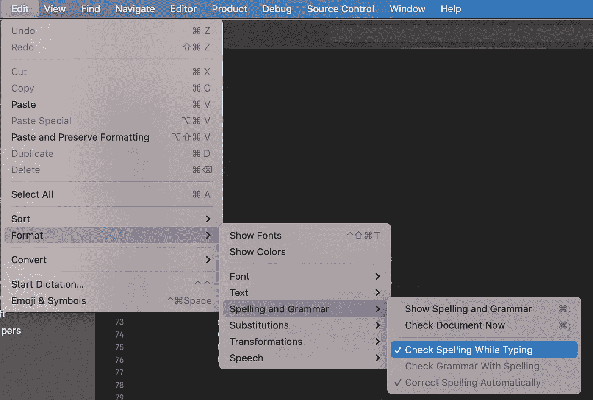

# 创建更好的拉动式请求的 5 个技巧

> 原文：<https://betterprogramming.pub/5-tips-to-create-better-pull-requests-a75c42a32ff>

## 让你的评论者生活更轻松的小建议

马库斯·温克勒在 [Unsplash](https://unsplash.com?utm_source=medium&utm_medium=referral) 上的照片。

创建 PR 并等待代码评审是编写代码的标准方法。PRs 和代码审查在每个开发人员的日子里都非常重要。他们实现不同的目标:

1.  分享关于代码库的知识。
2.  指导开发人员，让他们变得更好。
3.  保持高质量的标准。

这个过程通常分为两个步骤:一个开发人员准备一个 PR，另一个(或几个)开发人员执行代码评审，指出好的部分和可以改进的部分。

今天，我想通过第一步，强调我们如何能够创建一个便于我们的同事审查的公关。我们让他们的生活越轻松，评论就越有用。这也将提高他们对我们作为专业人员的看法，这是一个不错的额外津贴！

# 1.写一个信息丰富的标题

我们必须牢记的第一个想法是，我们知道上下文，而我们的审阅者不知道。

以一个信息丰富的标题开始会立即设定评论者必须检查的内容，并给他们提供基本的背景。

例如，一个名为“BUGFIX”的 PR 会告诉评审员他们将要检查一个 bug 是否已经被修复。但是在哪里？是什么 bug？

更好的标题是类似于“[修复]当新产品从后台到达时更新产品列表。”这个标题立刻告诉了评论者几件事:

1.  这是一个 bugfix(相对于特性实现、一些测试或其他任何东西)。
2.  和 app 的产品列表有关。
3.  它解释了错误发生的时间。
4.  它解释了期望的结果是什么。

*专业提示:* *根据你的公司文化、团队宣言或任何惯例，有时在标题开头加上表情符号是有用的。例如，我们经常使用🐛用于修复 bug 或📚医生的表情符号。它给出了正在发生的事情的视觉线索。*

# 2.不要忘记描述

有时 PRs 有一个很好的标题，但是有一个空洞的描述(或者甚至有一个“按照标题”的描述)。

描述对于给你的评论者提供他们需要的额外信息是非常重要的。在这里，我们可以解释编写代码时所做的所有假设。

一个好的方法是尝试回答五个问题:为什么？在哪里？谁啊。什么？什么时候？他们解释:

*   为什么需要公关？
*   背后所有的假设。
*   当前解决方案的利弊。
*   是否有一些部分将在以后处理。

最佳实践是链接附加资源。如果 PR 是一个 bug 修复，重要的是链接相关问题。如果是功能实现，那么链接相关任务是很重要的。

在 PR 旨在提高性能的情况下，我们可以添加 PR 之前和之后的性能图。

如果 PR 是 UI 相关的，我们可以显示结果的快照，甚至是一个小的 GIF。

所有这些信息都有助于审查员完成任务，他们可以专注于 PR 的相关部分。

# 3.保持 PR 小并且语义原子

没有什么比审阅长达几千行的简历更令人沮丧的了。

这很不好！

类似上图的东西是一场噩梦。事情太多了，评论者肯定会漏掉一些东西。而且，这个 PR 在语义上做的不止一件事。它可以理解一个错误修复，一个重构，测试，谁知道还有什么？

准备 PR 时，专注于一件事(例如实现一个组件或解决 bug)。避免实现组件、重构代码、为两者编写测试以及更新依赖关系。任何 PR 都可以分解成更容易评估的不同的较小 PR。[单一责任原则](https://en.wikipedia.org/wiki/Single-responsibility_principle)在这里同样适用！

例如，如果您需要实现一个需要实现特定组件的特性，那么第一个 PR 可以只包含该组件，随后的 PR 可以实现测试，而最终的 PR 可以将该组件集成到代码库中。

这种方法允许你在适当的时候面对不同的讨论:

*   组件是否被正确实现？
*   测试覆盖了所有的重要案例和相关的边缘案例吗？
*   组件的 API 是否有意义，是否符合人体工程学？

根据经验，任何 PR 都不应该超过 200 行代码。在一些罕见的情况下，当有很多样板文件时，更大的 PR 也是有意义的(例如，如果你必须实现一个新的`View`和`ViewController`，在同一个 PR 中有标准的、定义良好的部分是有意义的)。对于这些 PRs，我们可以轻松地达到~800 行，但是重要的部分应该很好地分离。

# 4.更新文档

我们希望将我们的代码记录在案。因此，当处理一段代码时，我们也应该更新文档。

也许我们改变了一个公共函数的签名，添加或删除了一个参数。在这种情况下，我们需要更新文档。

在其他一些情况下，我们会引入新的 API。那样的话，我们就得更新`README.md`。

一般来说，应该有一个`CHANGELOG.md`来跟踪代码库中的所有更新。这是另一个需要更新的文档。

当我们准备 PR 时，强迫自己更新文档有两个目的:

1.  它保持文档更新。
2.  它避免了审查者花费时间添加类似“记得更新变更日志”的评论

# 5.避免错别字

与上一点类似，这样做的主要原因是为了节省我们评审人员的时间。错别字使公关更难阅读，因为当他们拦截一些奇怪的东西时，我们的眼睛会停留在他们身上。

此外，评论家必须指出他们，花时间为他们写评论。

我们可以做几件事来防止我们犯拼写错误:

1.  在点击“创建拉取请求”按钮之前，请再次阅读我们的代码差异。如果你遵循提示 3，它会很快，因为 PR 很小。
2.  在 Xcode 中启用语法检查器。为此，只需打开 Xcode，点击工具栏中的“编辑”，然后突出显示“格式”和“拼写和语法”最后，点击“打字时检查拼写”

激活此选项后，Xcode 会用典型的红色卷线给你的注释和代码中的错别字加下划线。

# 结论

在今天的文章中，我想分享一些技巧，告诉你如何准备有用的简历来减轻审稿人的工作。这种方法不仅对我们的同事友好很重要，还因为它有助于他们进行更好的代码审查。这反过来可以让我们成为更好的开发者。

另一个重要的好处是，它让我们创建需要更少注释的 PRs，这意味着更少的迭代和更快的开发周期。每个人都更快乐、更有效率。

最后，我想引用一下 [CL 作者通过代码评审](https://github.com/google/eng-practices/blob/master/review/developer/index.md) *的指南。*本指南包含一些我们可以用来准备 PRs 的其他技巧。