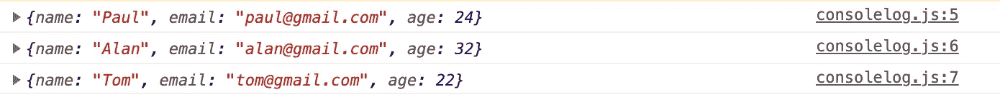
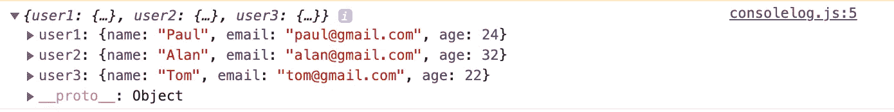
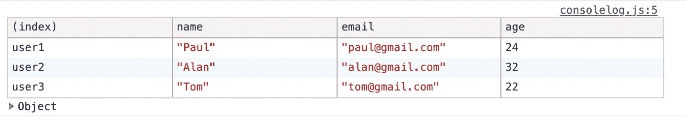
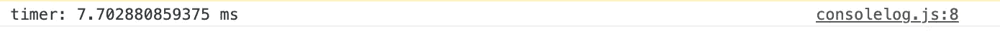
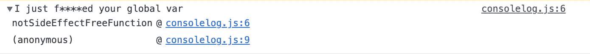

# 使用控制台像专家一样调试 JavaScript 代码的 5 个技巧

> 原文：<https://betterprogramming.pub/5-tips-to-debug-javascript-code-like-a-pro-using-console-47a23fe3bf18>

## 谁说 *console.log()* 野蛮？

德文·扬塞·范·伦斯堡在 [Unsplash](https://unsplash.com?utm_source=medium&utm_medium=referral) 拍摄的照片。

是的，有些人喜欢用`console.log()`调试他们的 JavaScript 代码。当您需要快速调试时，它实际上非常有用。

这里有五个有用的调试技巧。

# 1.console.log()几个对象

假设你有三个不同的物体。最常见的做法是只对`console.log()` 进行三次。

但是当您检查控制台时，您只会看到三行没有变量名的内容:

第一个技巧是像这样给一个对象分配变量:

它将计算您的变量名来创建您的对象的属性:

# 2.console.table()

或者，您可以使用`console.table()` 将您的数据显示在控制台的一个漂亮的表格中:

*注意:如果您用括号替换分号(将您的对象转换成一个数组)，“索引”列将显示您的对象在数组中的实际索引。*

# 3.让您的控制台语句更加友好

您可以在控制台语句中使用替换来替换使用`“%c”`的 CSS 样式。第一个参数是你的消息，而第二个参数是你想用来替换你的令牌的 CSS。

# 4.基准性能

如果需要对某个函数进行快速性能基准测试，可以使用`console.time()` 和`console.timeEnd()` *。*它会给出两个语句之间经过的时间:

*注意:要使它工作，你需要给它一个与参数相同的名字。*

# **5。查明事情发生的地点**

`console.trace()` 会告诉你你的函数是在哪一行定义的，在哪一行被调用:

# 结论

这些是我每天用来调试 JavaScript 代码的主要技巧。知道比较牛逼的请告诉我！

 [## 通过我的推荐链接加入 Medium-sevrin Chea

### 阅读 Sevrain Chea(以及媒体上成千上万的其他作家)的每一个故事。您的会员费直接支持…

sevrain-chea.medium.com](https://sevrain-chea.medium.com/membership)