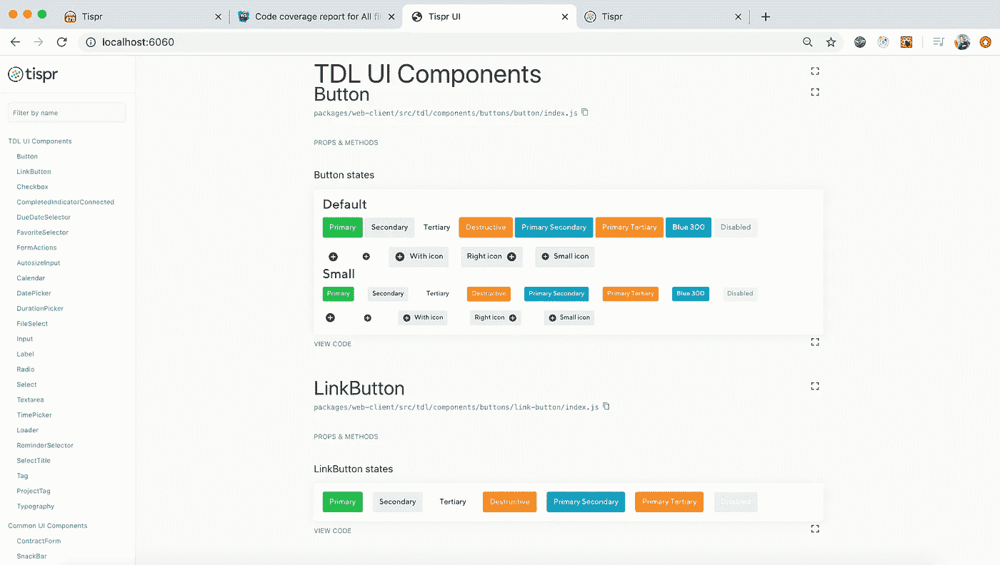
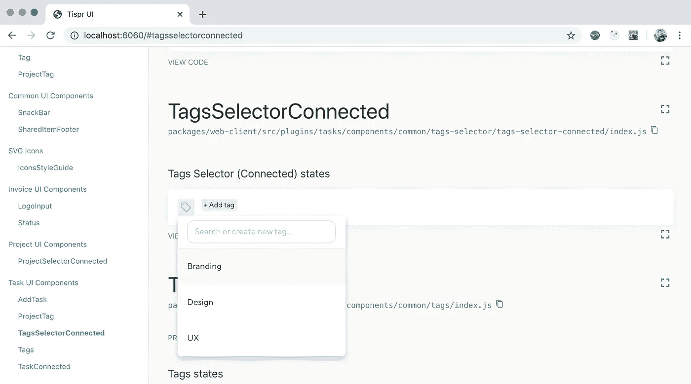
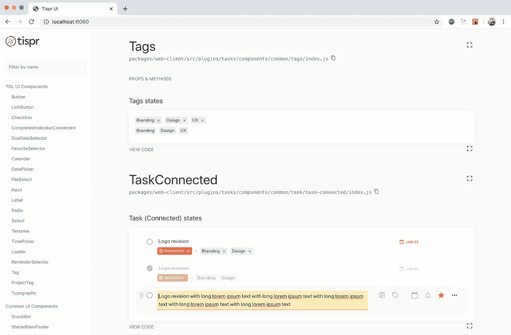
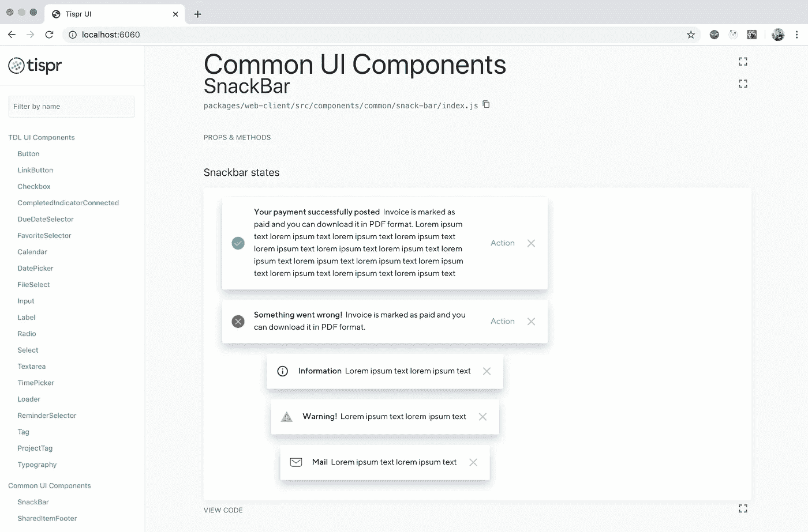
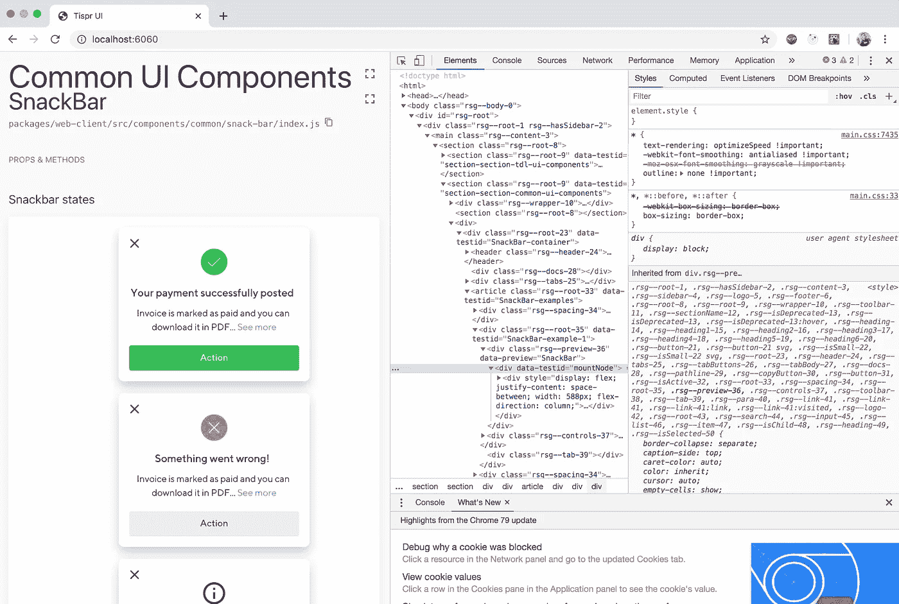
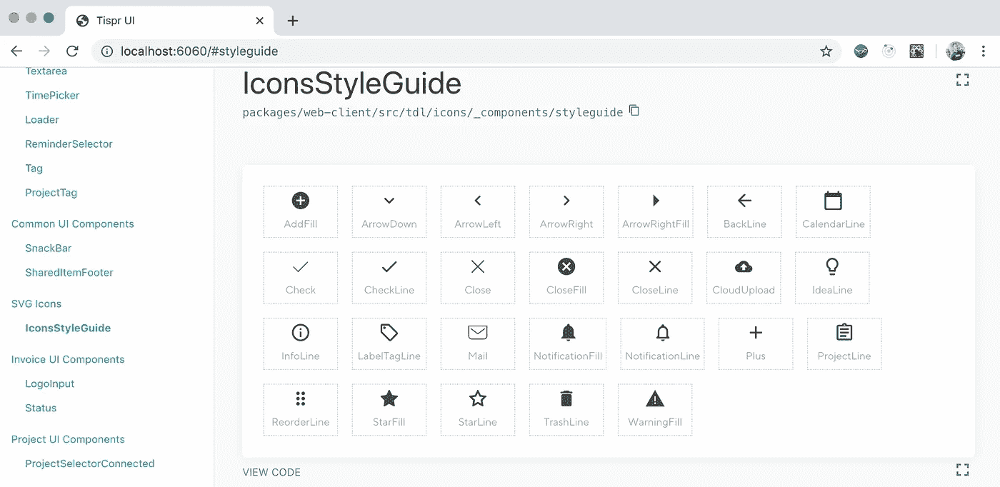
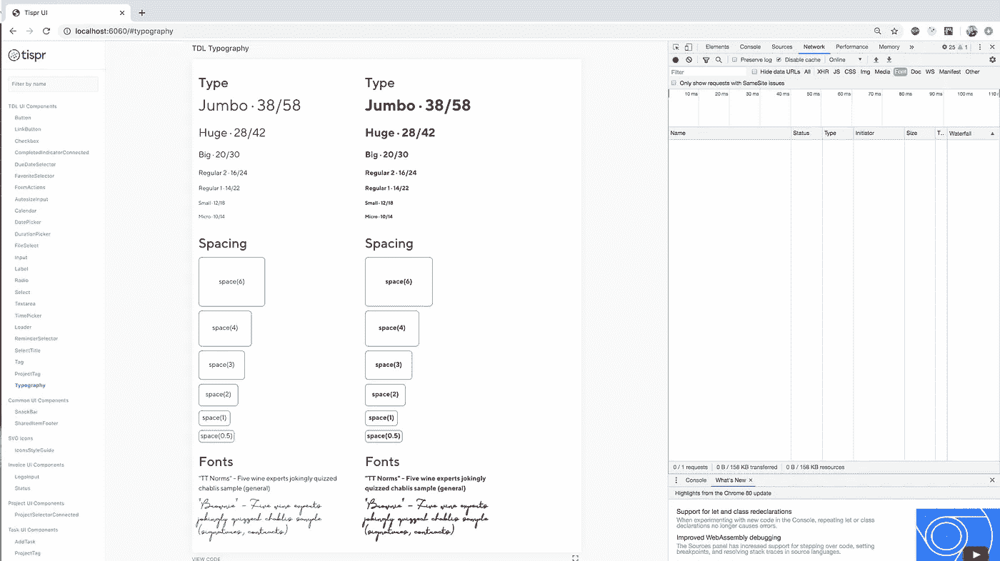
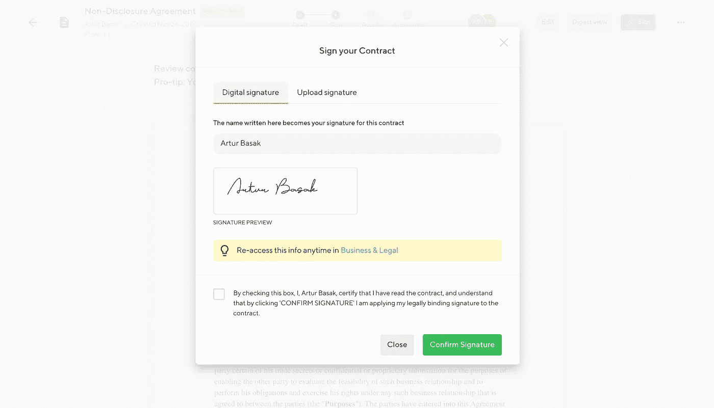
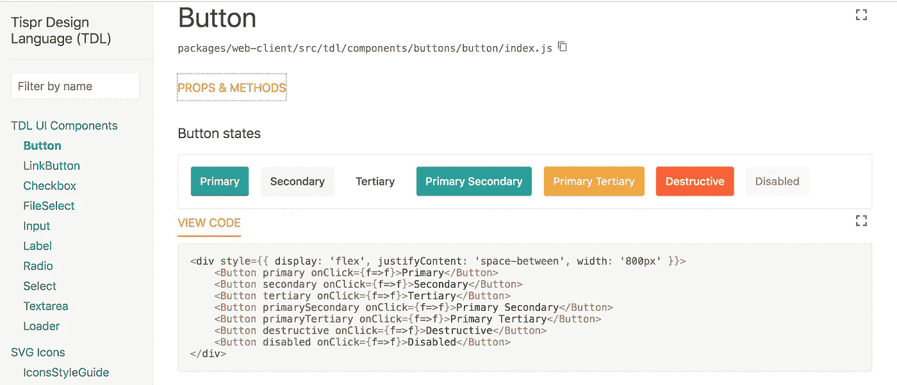
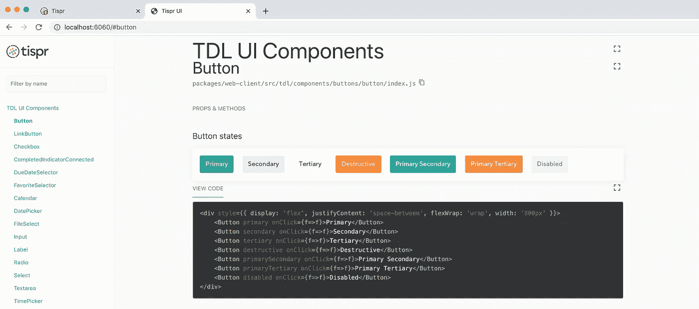

# 帮助改善 UI 开发环境的 5 个技巧

> 原文：<https://betterprogramming.pub/5-tips-to-help-improve-your-ui-development-environment-6ceda3827618>

## 配置 React-Styleguidist 的建议



UI 开发环境(根据 [ThoughtWorks 技术雷达定义](https://www.thoughtworks.com/radar/tools/ui-dev-environments))是一个全面的交互环境，允许我们快速轻松地创建 UI 组件，促进设计团队和 UI 工程师之间的交互。这意味着某种类型的实时交互文档或组件目录。设计师通常被称为模式库——它是每个设计系统的基础。

在开发组件库(UI Kit)以及 web 应用程序中的嵌入式组件时，可以独立使用该工具。

[React-Styleguidist](https://react-styleguidist.js.org) 、 [Storybook](https://storybook.js.org) 或 [MDX](https://mdxjs.com) 是使用 [React.js](https://reactjs.org) 编程时创建和配置 UI dev env 的常用工具。在本文中，我想分享一些旨在改善开发环境的 lifehacks，使用我们在应用程序中使用的例子`React-Styleguidist`。

# 1.描述连接的组件

通常在大型 React.js 应用程序中，您会发现订阅(连接)到应用程序商店的小组件。这些不是页面组件或复杂的容器，它们是可以独立工作的简单组件——除了它们需要来自服务器的某些数据。它们可以是允许您选择字典数据的任何定位器或下拉列表。

与商店的连接并不是向 UI 开发环境添加这种组件的障碍。我们可以简单地通过[提供者](https://react-redux.js.org/api/provider)包装组件。例如，`[redux-mock-store](https://www.npmjs.com/package/redux-mock-store)`可以帮助我们用特定的状态模拟应用商店。



标签下拉列表是一个连接的组件

我们不仅能够在 UI dev env 中描述组件，还可以使用类似的包装器进行单元和集成测试:



任务是一个非常复杂的连接组件

# 2.开发组件的移动版本

UI 开发环境也非常适合某些 UI 组件的移动改编的独立开发或测试。

在桌面和移动版本之间切换的原理与应用程序中的相同—只需改变视口的大小。

在`React-Styleguidist`中，您可以通过 config 中相应的断点删除侧菜单(菜单宽度和组件区也可以配置，所有值都在 *px* ):

```
// styleguide.config.jstheme: {
    mq: {
      small: '@media (max-width: 768px)'
    },
    sidebarWidth: 300,
    maxWidth: 1280
}
```



桌面 Snackbar 组件



移动小吃店组件

# 3.肖像学

如果 web 应用程序使用自己的自定义图标，组织一个图标目录(图标集)可能是一个好主意，在那里您可以快速找到代码库中已经存在的图标和象形图。

这种内置目录可以配备搜索和过滤器。如果您使用[图标作为 SVG React 组件](https://medium.com/front-end-in-regions-grodno/the-main-benefits-that-you-can-get-from-icon-components-in-react-js-68165587cb01)，那么您可以很容易地将它们添加到`React-Styleguidist`中。

[](https://medium.com/front-end-in-regions-grodno/the-main-benefits-that-you-can-get-from-icon-components-in-react-js-68165587cb01) [## React.js 中图标组件的主要好处是

### 图标是任何系统界面的一部分。我们可以把它们想象成小图片的集合或者解读…

medium.com](https://medium.com/front-end-in-regions-grodno/the-main-benefits-that-you-can-get-from-icon-components-in-react-js-68165587cb01) 

肖像集

# 4.排印

UI 开发环境不仅仅是关于组件。印刷术——以及它的统一——也可以成为这个套件的一部分。将您与设计团队的安排作为文档示例来起草是一个好主意。您可以为字体、文本大小、填充和边距值创建一个特殊的`Typography`组件，并将其添加到`React-Styleguidist`中。



排版组件(字体和空格)



应用程序中的字体用法(签名使用[布朗尼](https://ifonts.xyz/brownie-font-family.html)，正文使用 [TT 规范](https://typetype.org/ru/fonts/norms))

# 5.自定义样式指南

你不必把你的 UI 开发环境弄得灰暗而不显眼。您可以自定义颜色、徽标甚至代码突出显示，然后将环境扩展为可供公司所有部门使用的独立应用程序。



React-Styleguidist 的默认配置

[](https://react-styleguidist.js.org/docs/cookbook.html#how-to-change-styles-of-a-style-guide) [## 食谱

### 使用 ref prop 作为函数，并为局部变量分配一个引用:Styleguidist 将忽略测试(__tests__ folder…

react-styleguidist.js.org](https://react-styleguidist.js.org/docs/cookbook.html#how-to-change-styles-of-a-style-guide) 

React-Styleguidist 的自定义配置

如果你对这个话题有什么想法，请在评论中分享！