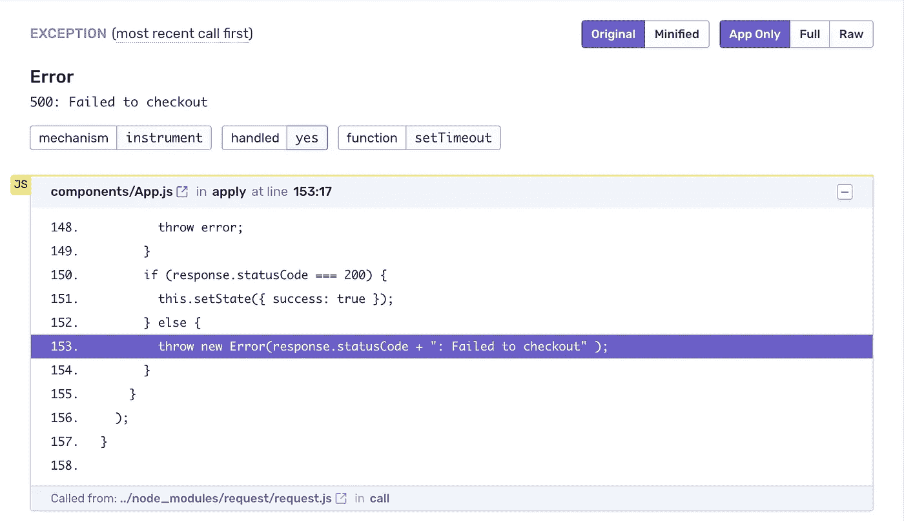
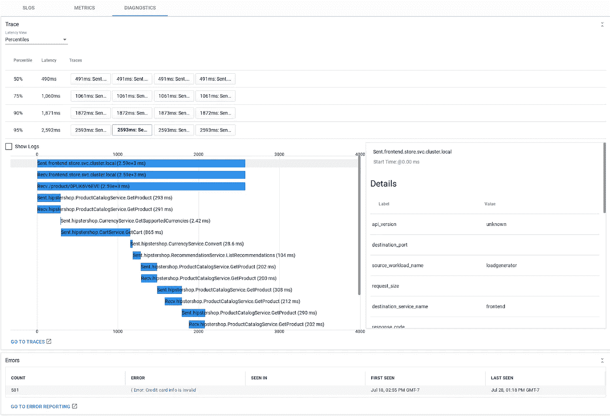
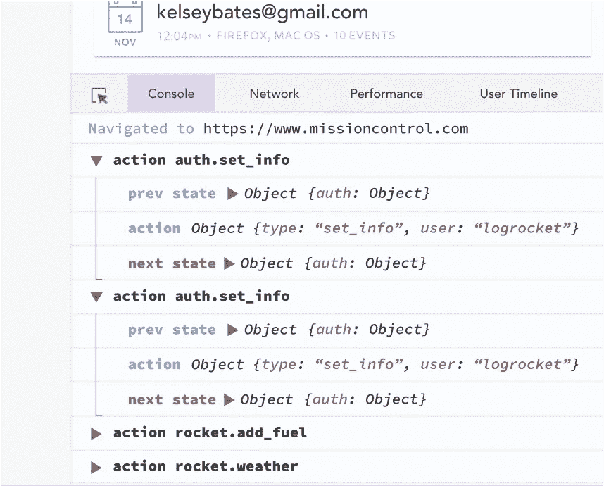
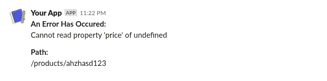
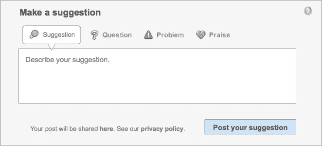

# 快速处理产品代码中的错误的 5 个技巧

> 原文：<https://betterprogramming.pub/5-tips-to-quickly-tackle-errors-in-your-production-code-be4633bf8ed0>

## 构建健壮软件的简单方法

马库斯·斯皮斯克在 [Unsplash](https://unsplash.com) 上的照片

开发人员经常在编写代码的同时编写测试用例。除此之外，他们甚至在工作流程中增加了一些[探索性测试](https://www.guru99.com/exploratory-testing.html)。然而，有时，有一些错误逃过了他们深思熟虑的测试过程，并最终出现在生产中。

许多这样的错误都是最终用户经历和发现的——他们中的一些人可能会报告问题，一些人可能稍后会尝试，或者一些人可能会因为错误而直接拒绝产品。

因此，能够对生产中出现的错误做出快速反应是非常重要的。在本地开发环境中工作时，很容易调试和修复错误，因为一切都在开发人员的控制之下。相比之下，在生产环境下运行的代码中查找错误完全是一项不同的任务。发现前端应用程序中的错误更加困难，因为代码运行在客户端的设备上。

我们将看看一些简单的解决方案，它们可以用来发现生产中的错误，以及如何尽快做出反应。

# 1.使用错误报告服务

[Sentry.io 错误报告](https://sentry.io/welcome/)

这些服务可用于捕捉应用程序中发生但未被处理的异常。这些服务会报告错误以及堆栈跟踪和发生错误的实际代码。除此之外，还可以定制它们来报告任何其他数据和错误。这是最简单的解决方案，可以用来检测破坏软件和破坏用户体验的实际错误。

## 可从这些服务获得信息的例子

*   发生的实际错误
*   发生错误的行号
*   错误发生时的堆栈跟踪
*   特定错误发生的次数和时间
*   在前端应用程序中，我们可以获得当前的 URL，甚至是用户到达那里的一系列步骤

集成错误报告服务非常容易。事实上，你甚至可以使用[谷歌分析](https://developers.google.com/analytics/devguides/collection/analyticsjs/exceptions)来捕捉错误。然而，有更强大的工具。这些工具大部分是免费的，有一些受限的特性。不过这些免费功能对于一个小规模的应用来说已经足够了。然而，为高级功能付费并不总是花费很多。例如，[滚动条](https://rollbar.com/pricing/)是一项错误报告服务，起价低至每月 1 美元。

其他一些受欢迎的服务有[哨兵](https://sentry.io/)、[谷歌云的操作套件](https://cloud.google.com/products/operations)、 [Instabug](https://instabug.com/) (主要针对移动应用)，以及 [Bugsnag](https://www.bugsnag.com/) 。这些工具可以在几分钟内设置好，因此尝试这些选项并找出哪一个最适合您的应用程序应该不会太难。

# 2.性能监控服务

[Google Cloud 的操作套件对单个请求的分解](https://cloud.google.com/products/operations)

向应用程序添加错误报告只是开始。还有一些服务可以监控应用程序的性能。这些工具提供了一些有价值的信息，尽管它们可能不如[剖析工具](https://en.wikipedia.org/wiki/Profiling_(computer_programming))强大。

## 可从这些服务获得信息的例子

*   处理请求所需的时间
*   一个请求的概述被分解成更小的部分，如 HTTP 请求、数据库查找等。
*   在前端进行第一次绘制所花费的时间
*   前端接收对请求的回复所花费的时间

## 示例使用案例

*   将应用程序的一部分的当前性能与过去的性能进行比较
*   找出数据库查询或实际代码中是否存在性能瓶颈
*   当应用程序的某些关键部分的性能下降时设置警报

关于这些服务需要注意的一点是，与前端相比，它们的后端功能更强大。

一些错误报告服务也可以兼作优秀的性能监控工具。哨兵、谷歌云的操作套件、[普罗米修斯](https://prometheus.io/)、 [LogRocket](https://logrocket.com/) 都是一些性能监控工具。正如错误监控服务一样，研究哪种服务最适合您的应用程序非常重要。然而，与错误监控服务不同，这些工具中的一些可能需要时间来设置，尤其是在后端。

# 3.记录

[log rocket](https://docs.logrocket.com/docs/data-collected)中 Redux 的前端日志

日志记录是最重要的事情之一，可以实现它来帮助在发现错误或 bug 后采取行动。我数不清有多少次日志记录让我很容易理解错误，而手动理解这些错误可能需要花费大量时间。

## 示例使用案例

*   当检测到错误或缺陷时，查看当时的日志有助于找出原因。
*   如果数据不幸意外丢失，日志在某种程度上甚至是有用的。如果有足够多的日志，即使不能确定丢失了什么数据，至少也能更容易地确定丢失数据的性质。

传统日志记录的一个缺点是搜索日志通常会很慢，因为有很多日志。在无法建立自己的日志捕获服务的情况下，可以集成许多日志服务。

一些日志服务有 LogRocket、 [LogDNA](https://logdna.com/) 、 [Loggly](https://www.loggly.com/) 、[亚马逊 CloudWatch](https://docs.aws.amazon.com/AmazonCloudWatch/latest/logs/WhatIsCloudWatchLogs.html) 和 Google Cloud 的操作套件。

# 4.警报和通知

警报示例(使用松弛块套件创建)

集成错误报告和性能监控工具是一回事；实际上及时对关键问题做出反应是另一回事。当问题出现时，设置警报和通知是非常重要的。很多服务和工具会在检测到问题时自动发送电子邮件。

然而，在团队使用的任何通信平台上设置通知是一个好主意。一些服务有 Slack 等流行平台的插件和机器人。然而，他们中的大多数都提供了 [webhooks](https://en.wikipedia.org/wiki/Webhook) ，所以为团队使用的平台建立一个定制的警报服务并不困难。

设置警报时要做的一件重要事情是确定哪种警报是关键的。例如，后端抛出的导致整个应用程序崩溃的异常可能被认为是关键的。类似地，在提供对企业核心服务的访问的 URL 中发生的任何错误都可能被认为是严重的。这些特定的错误可以被设置为高优先级，以便其他错误不会在团队不工作时打扰他们。

# 5.用户的联系点

[反馈表示例](https://commons.wikimedia.org/wiki/File:Article-Feedback-Form-V5-Option2-10-20.png)

这个更多的是用户体验解决方案，而不是技术解决方案。此外，这一方法一直沿用至今。在应用程序中有一个清晰可见和易于使用的“联系我们”或“给我们反馈”按钮可以鼓励用户报告他们在应用程序中遇到的问题。此外，它向用户表明，公司实际上关心他们和他们的意见。许多公司追随的一个新趋势是在他们的网站上集成一个[脸书信使插件](https://developers.facebook.com/docs/messenger-platform/discovery/facebook-chat-plugin/)或其他机器人。

有一件事可以让事情变得更简单，那就是将反馈直接发送到团队使用的沟通平台，而不是只发送电子邮件或在管理面板中显示。

如果客户主动报告问题，那么集成像 [Zendesk](https://www.zendesk.com/) 或 [Intercom](https://www.intercom.com/) 这样的东西来管理支持票也是一个好主意。

# 额外收获:关于选择报告工具的一些提示

*   在选择付费版本之前，考虑一下免费版本，看看是否已经满足了你的需求。
*   确保服务提供商支持您使用的语言和平台。
*   研究服务提供商是否有机器人或与您使用的通信平台的集成。如果没有，检查他们是否有 webhooks，以及开发与您的通信平台的定制集成有多困难。
*   检查它们是否支持添加到报告中的自定义数据(如果您有此需要)。