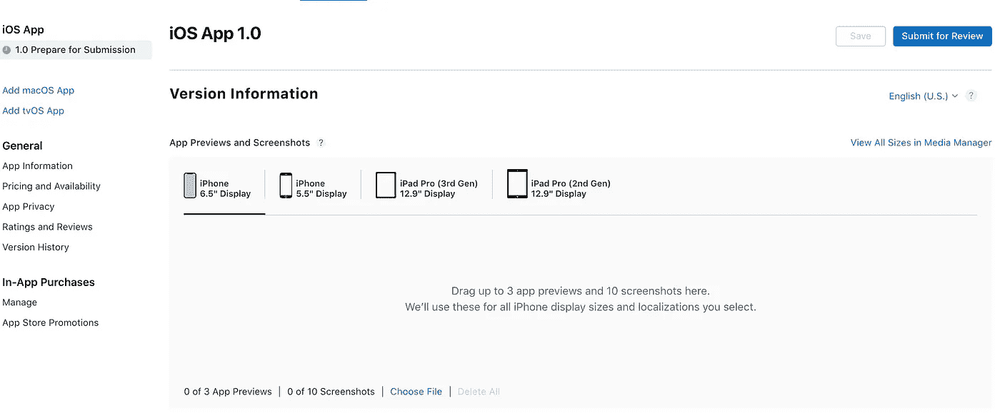

# 使用 React Native 解决常见问题的 5 个技巧

> 原文：<https://betterprogramming.pub/5-tips-to-solve-common-pitfalls-with-react-native-fcf66772b4b7>

## 对本地发展作出反应

## 使用 React Native 构建移动应用时遇到的常见问题以及我如何解决这些问题


使用 React Native 解决常见问题的 5 个技巧

近年来，移动开发的世界已经扩大，从 Android 和 Swift 开发人员的专利发展到 Javascript 的快节奏世界，混合框架如 Ionic 或原生框架如 React Native。

> React Native 是由 Meta Platforms，Inc .创建的开源 UI 软件框架。它通过使开发人员能够使用 React 框架和本机平台功能，用于开发适用于 Android、Android TV、iOS、macOS、tvOS、Web、Windows 和 UWP 的应用程序。

使用 React Native 时，您可能会遇到难以解决或找到答案的问题，主要是因为 React Native 社区和生态系统没有 React 或 Vue 等其他 Javascript 社区大。

在本文中，您将从我的经验中学到我是如何解决一些常见的 React 原生问题或实现一些棘手的特性的。

# 1.苹果连接商店截图



Apple Store 审核流程

当使用 React Native 构建应用程序时，您可能会使用模拟器来测试您的应用程序，而不是物理设备。

像我一样，你可能会惊讶于使用 Xcode Simulator 为 App Store 创建大小和密度合适的截图有多么困难。

在 Google Play 中，这个过程很简单，上传你在任何模拟器中制作的截图都很棒，但对于苹果商店，我无法获得正确的尺寸。

对于 6.5 英寸的 iPhone，他们要求要么是`2688x1242`要么是`2778x1284`。我尝试了各种选项和设备模拟器来实现这一点…但没有成功。最后，我在这里找到了正确答案。

这是你必须做的:

*   将模拟器设置为物理大小:窗口>物理大小(快捷键:command + 1)
*   设置高质量图形:调试>图形质量覆盖>高质量
*   对于 6.5 英寸的 iPhone，请使用任何专业版 iPhone。我用了 11 Pro
*   对于 5.5 英寸的 iPhone，请使用 iPhone 8+模拟器。
*   对于 Ipad Pro(第三代/第二代)，请使用模拟器 iPad Pro (12.9 英寸) (第三代)

# 2.字体的问题


照片由[布雷特·乔丹](https://unsplash.com/@brett_jordan?utm_source=medium&utm_medium=referral)在 [Unsplash](https://unsplash.com?utm_source=medium&utm_medium=referral) 拍摄

默认情况下，React Native 使用每个平台的标准字体，这意味着 Android 的“Roboto”和 iOS 的“San Francisco”。然而，设计师通常喜欢使用不同的字体来适应应用程序的整体设计。

如果你运气好，字体是谷歌字体，那就太好了！你可以使用包 [expo-google-fonts](https://github.com/expo/google-fonts) 。

安装包之后，`expo install expo-google-fonts`，你要做的就是:

在这里，我们导入字体，并确保在启动应用程序之前加载它们，然后您可以像这样轻松地在样式表中使用它:

```
fontFamily: 'Lato_400Regular'
```

我在使用`expo-google-fonts`时遇到的一个问题是，当我错误地导入整个项目时，它加载了所有的字体，而不仅仅是拉托字体，就像这样:

```
import { Lato_400Regular } from '@expo-google-fonts/dev';
```

这在 web-view 或 Android 模拟器上没有问题，但对于 iPhones 来说，它会试图一次加载所有字体，并且会因为内存限制而导致应用程序崩溃。

因此，请确保只导入您需要的字体，如下所示:

```
import { Lato_400Regular } from '@expo-google-fonts/lato';
```

# 3.移动设备上的本地存储和 Cookies


照片由[克里斯蒂娜·布兰科](https://unsplash.com/@starvingartistfoodphotography?utm_source=medium&utm_medium=referral)在 [Unsplash](https://unsplash.com?utm_source=medium&utm_medium=referral) 拍摄

由于有前端编程背景，我习惯于滥用 cookies 和本地存储来做几乎任何事情。

需要保存一些用户信息以备后用？饼干！这个几乎不变的请求怎么办…我可以在哪里缓存它？本地存储！

所以在这里，我认为这是理所当然的，并将用于授权的不记名令牌和用户信息对象添加到本地存储中。只有当我开始在模拟器中测试时，我才意识到令牌没有被持久化，并且我用一个空的承载字符串来发出每个请求。

快速的互联网搜索让我找到了在这种情况下最常用的包:[react-native-async-storage/async-storage](https://github.com/react-native-async-storage/async-storage)。

安装完这个包后，`expo install [react-native-async-storage/async-storage](https://github.com/react-native-async-storage/async-storage)`使用它就像普通的本地存储一样简单。

密切关注`JSON.stringify()`和`JSON.parse()`功能。如果你试图将 JSON 而不是字符串传递给`AsyncStorage.setItem()`函数，你的应用程序仍然可以在网络上运行，甚至可以在模拟器上运行，但是它会破坏你的应用程序。

调试这个问题可能会很麻烦，所以快速检查默认的 stringify 和 parse 可能会成为一种很好的做法，可以让您在将来免受痛苦。

# 4.呈现 HTML


HTML 示例

你可以在你的应用程序中硬编码文本，但是当你想改变文本时，你必须为你的应用程序创建新的版本，并再次提交到应用程序商店。

更糟糕的是，一些用户可能会禁用你的应用程序的自动更新，并且永远不会获得新版本。为了克服这一点，你应该总是通过 API 发送不常用的文本。

但是，即使您通过一些请求发送文本，动态内容又如何呢？如果你有描述丰富的文章或内容怎么办？在你的后端，你可能有一个丰富的文本编辑器，所以你可以添加标题和格式化你的文本，但在应用程序中，你需要一种方法来呈现 HTML 到本地视图。

为此，你可以使用 [react-native-render-html](https://github.com/meliorence/react-native-render-html) 。一个 iOS/Android 纯 javascript react-native 组件，将您的 HTML 呈现为 100%原生视图。

使用它非常简单。它还有一个注入你字体的道具叫做`systemFonts`，如上图。

属性可以用来设计 HTML 内容的样式。[这里有一个简短的演示](https://codesandbox.io/s/thirsty-payne-j5ect?file=/src/App.js)来看看它的实际效果。

# 5.短路评估(&&)

我在 React 生态系统中犯的一个错误是在渲染组件时过度依赖&&操作符。

```
{isFetching && <Loading />}
```

这种方法非常有效，直到我犯了一个错误，使用非布尔值作为第一个操作数，就像这样:

```
{users.length && <User />}
```

这在 normal React 中工作得很好，在项目的 web 视图中完全没有中断，更糟糕的是，它还在 Android 和 iOS 的模拟器上工作。

但是在生产中，每当用户使用这种逻辑输入视图时，应用程序就会崩溃，并显示以下错误:

```
Error: Text strings must be rendered within a <Text> component.
```

这是有意义的，如果你的`users`数组大于 0，React Native 想要渲染数字，因为它不在`<Text>`组件中，它会破坏应用程序。

我建议在使用逻辑运算符`&&`来简化呈现时要小心，尤其是在处理非字符串值时。

现在，React Native 社区正在成长，有很多好的软件包可以帮助你。

但是它还没有达到 Javascript 的名气水平，这可以从可用资源的数量上看出来。

我真诚地希望这篇文章能够帮助有抱负的 React 本地开发人员解决他们的困难，或者说服 React 生态系统的工程师们尝试并构建几个移动应用程序。