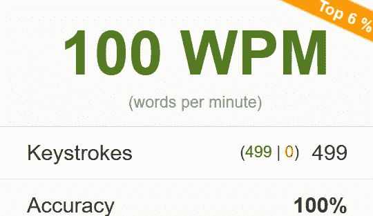
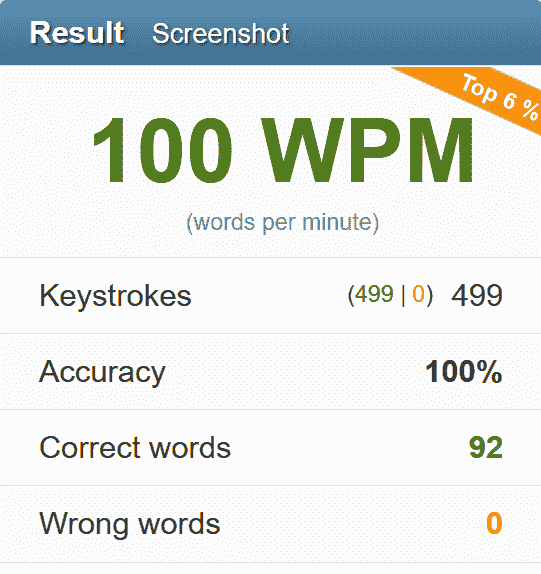

# 让你的打字速度达到每分钟 100 字以上的 5 个技巧

> 原文：<https://betterprogramming.pub/5-tips-to-take-your-touch-typing-to-100-words-per-minute-8ad73ca08d31>

## 只要每天练习 10 分钟

图片来源:作者

一旦虚函数与引用对象交互，就验证 name 属性。然后在检查事件状态之前注册回调。等等，什么事件？我甚至还没有定义它。你可能会问，我到底在说什么？

想一想你顿悟后有了惊人想法的时候。你匆忙记下它，但最后却跑题了。结果，你没能捕捉到一分钟前在你脑海中蹦出的伟大想法。你失去了它的要点，因为这些想法一直困扰着你的大脑，你跟不上。你遇到过这种情况吗？

作为一名前开发人员，我不断地与自己的大脑斗争。我的打字技术一般，如果我在这里坦率地说，也许是平庸的。我只是从来没有花时间去磨练它们，结果错过了许多好主意。

# 什么是触摸打字？

如果你不用偷看键盘，而是用你所有的十个或更多的手指，那么你就是在打字。这个巧妙的技巧可以帮助你快速记下他们的想法和主意。我常常希望我打字能和我想象的一样快。

我喜欢打字。“在纸上”写下我的想法和思考帮助我理解我的生活。因为这个原因，我每天写日记和自由写作。

[最危险的写作 App](https://www.squibler.io/dangerous-writing-prompt-app) 让我产生想法，点燃我的思想流。谷歌一下！这篇文章的很多想法都来源于此。今天我尝试了硬核模式。当我打字时，它会模糊字母，并承诺如果我停顿超过五秒钟，就会销毁我写的所有内容。

所以第一个建议是每天打字，哪怕只有一百个单词。

在 30 分钟的写作过程中，我通常会打 1200 到 1500 个单词。我的平均打字速度是每分钟 90 字。但是我跑题了。

# 为什么要费心琢磨触摸打字呢？

触摸打字允许在数字媒体中更流畅地表达思想。它通过把模糊的想法变成清晰的文字来传达。无论是散文还是代码，你的思绪都不会徘徊太久。如果你不能及时捕捉到它们，它们就消失了。也许是永远。

由于受到沟通能力的限制，我们经常会失去许多非凡的想法。我过去常常坐下来草草写下一个行动计划，但我的创造性思维常常会迸发出各种想法。由于打字速度慢，我跟不上，也没能捕捉到其中的大部分。

我总是羡慕那些像杰出作曲家敲击钢琴键那样的触式文字。今天，打字和手写在文艺复兴时期一样重要。键盘取代了羽毛笔和墨水。我们触摸打字的能力现在是识字的证明。我们不断地在网上交流，通过击键、阅读、编辑和回复他人来数字化我们的思想。

这不仅是打字速度的问题，也是你使用键盘的轻松和舒适的问题。毫不费力地动用所有手指，一分钟打 50 个字，比一分钟打 100 个字而每隔一个字就按退格键要好得多。不适和紧张会抑制你的思维，减缓你的写作速度。由于努力寻找正确的答案，你无法毫不费力地将你的想法“写在纸上”

过去，打字对我来说是一件苦差事。现在我打字的时候感觉就像在放音乐。即使是这段文字，当它出现在淡白色的屏幕上时，感觉也很棒。轻松打字只需要少量的大脑内存，将大部分留给手头的任务。

在我职业生涯的早期，我意识到了触摸打字的重要作用，但从未费心去磨练它。不要犯同样的错误。

我敦促你提高你的打字水平。从现在开始，记住一致性胜过强度。

# 手指紧张的问题

紧张的手指抑制了行动的自由，打乱了步伐，打断了思想的流动。触摸打字需要手指灵活，指尖灵敏。他们必须是你的仆人，随时准备按下任何一个键。

紧张是打字速度慢的主要原因。这些动作应该有一个不受限制的运动范围，指尖优雅地漂浮在键盘上方，没有你这边的任何监督。意识不应该参与决定哪个手指敲击下一个键。

当你不打字的时候，保持你的手腕休息。否则，紧张感会很快积累起来，影响你打字。

# 偷看键盘

低头看键盘的问题，是不良打字习惯的核心。我们不应该把视线从屏幕上移开。为此，键盘上有两个标记，分别代表键 *F* 和 *J* 。这些是你左手和右手食指的 home 键。从那里开始，你应该通过肌肉记忆来导航其余的键。

触摸打字的诀窍是用合适的手指敲击每一个键。例如，左手无名指只应该敲击键 *W* 、 *S* 和 *X* 。

但是仅仅这些知识不会让你打字更快。这需要深思熟虑的练习和持续的努力。你需要反复练习。熟能生巧。

# 如何更快地触摸打字

一旦你意识到如何使用你的手指，钻吧！伪造肌肉记忆。我从[typing.com](https://typing.com)开始。他们提供了一个伟大的用户界面和键盘地图。地图会告诉您每个特定的键应该使用哪个手指。虔诚地跟随它。

该网站跟踪你的进展，给你即时反馈，并显示你的速度以及你的问题关键。我花了几十个小时在那里练习。

不过，你不必这样做。每天只花 10 分钟就能让你的打字速度在一年内翻倍。无论你的目标是什么，记住一致性胜过强度。

选择一个适合每天十分钟练习的时间表。承诺，不要每天检查你的进度。每隔一天或者甚至一周做一次。通过每天一小时的练习，我能够在五个月内将打字速度提高到每分钟 100 个单词。

在 10fastfingers.com 测试

一旦你学会了打字的基本知识，把 Keybr.com 加入你的武器库。该网站不需要注册。你一找到它就开始练习。它在顶部横幅中显示广告以支持开发者，但我从未发现它会分散注意力。该网站将您的进度保存在浏览器 cookie 中，因此当您返回时，您可以从您停止的地方继续。

算法会根据你的进度调整难度。单词不是真正的英语单词，但它们遵循英语语音规则。例如，你可能会得到单词*rebulation*，听起来像一个英语单词。但是你永远不会看到像 *gdfskgjlsd* 这样的东西或者一行中的另一长串辅音。

这是一个很好的方法，在你每天在电脑上做的小任务之间挤出五分钟来练习。

如果你想要一个完整的打字教程，请点击 [Ratatype](https://ratatype.com) 。这些人开发了一个系统，带你踏上一段激动人心的打字旅程，并帮助你以最有趣的方式磨练你的技能。

现在，你在哪里测试你的打字速度？我用的最多的网站是[10 快指](https://10fastfingers.com)。

该网站通过让你输入短到中等大小的单词来测试你的打字速度和准确性，然后根据正确的字符数进行计数。触摸打字冠军肖恩·沃纳(Sean Wrona)给出了提高打字速度的好建议。

# 速度的需求

随着你的进步，你可能会开始追求速度。这很诱人，但你需要克制自己不去做。我们都深受其害。一致性和耐力会让你得到更好的结果。

说到速度，你必须控制和改变它。对于熟悉简单的单词加快速度。对于不认识的和复杂的单词放慢语速。这对避免犯错很重要。大多数时候你想保持一致的速度。

准确性比速度更重要。

# 准确(性)

无论你是刚开始打字还是想让你的打字技巧更上一层楼，准确性都是至关重要的。你需要把它钻到你想砸键盘的程度，但是在你真的砸键盘之前停下来。

第二天，你的手指会更轻松地移动，打字时你会感觉更放松。这会让你自由思考，专注于其他精神活动，同时让你的打字几乎处于自动驾驶状态。然后它会成为你的仆人，打出你想到的任何东西。

当我沮丧的时候，我会提醒自己人们是如何学习钢琴的。他们可能会有更邪恶的想法。

# 向前看一个字

当练习打字和测试你的速度时，密切跟踪每个单词。还有，往前看一个字。你的眼睛需要逐渐从一个单词移动到另一个单词，你的手指必须跟着移动。随着时间的推移，你会更好地协调它们，并将这种能力嵌入肌肉记忆。

用眼睛精确跟踪和用指尖敲击按键一样重要。

# 最后

随着计算机的发展，外围设备也在发展。在 60 年代，旋钮和开关形式的基本输入被键盘和鼠标所取代。然后语音控制就出现了。现在我们有了从视频信号中获取输入的计算机。

我们将永远用语言交流。写作将是永恒的。我们从小就学会了互相交流。如果语言是识字的基础，那么打字就是它的主要工具。