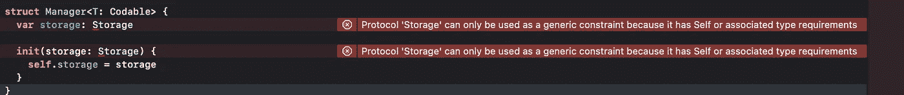

# 编写干净 Swift 代码的 5 个技巧

> 原文：<https://betterprogramming.pub/5-tips-to-write-clean-swift-code-2ef287a11500>

## 提高我们代码编写技能的快速技巧


马克斯维尔·纳尔逊在 [Unsplash](https://unsplash.com?utm_source=medium&utm_medium=referral) 上拍摄的照片

一个好的软件工程师不仅仅是一个能写软件高效解决问题的人。他们比编写聪明的单行解决方案更能写出健壮、易读、易维护的代码。

优秀的软件工程师会发现他们可以在哪里简化代码，使用模式，或者重构代码片段以使它们变得更好。

让我们探索我最喜欢的五种方法，在 Swift 中编写更干净、更有意义的代码。

# 使用正面防护装置

`guard`关键字是 Swift 编程语言中最具定义性的语言之一。我们每天都在使用它，它有两个主要用途:

1.  展开一些计算所需的选项。
2.  陈述我们功能的先决条件。

我要分享的技巧对第二种用法更有意义。

想想我们在算法中写的前提条件:`!set.isEmpty`、`!name.isEmpty`、`num != nil`等等。你写了多少次下面的代码？

我想了很多次。这段代码，连同上面所有的例子，至少有两个缺点:

1.  这很容易出错——很容易忘记`!`。
2.  很难内化。当阅读条件时，我们必须颠倒我们阅读的单词的语义，以正确理解代码的意思。

幸运的是，我们可以通过在`Collection`协议中添加一个小助手来轻松解决这个问题。代码如下:

我们用这个简单的方法一次性解决了这两个缺点，并且使我们的代码变得简单明了。

每当一些逻辑被否定表达时，我们就可以应用这个原则。这是给你的一个练习:检查你的代码，找到相似的例子。用积极的方式重写它们。

# 杠杆式推理

Swift 是一种智能语言。Swift 编译器可以推断类型，这为我们节省了一些输入。我们不必写出所有的类型；编译器可以为我们做到这一点。

例如:

```
let num = 0 // this is an Int
let pi = 3.14 // this is a Double
let greetings = "Hello" // this is a String
```

当我们使用自己的类型，尤其是枚举时，这个特性真的大放异彩。例如，让我们考虑一个返回`Result<Int, Myerror>`的函数:

在这个简单的代码中，我们打包了多个层次的推理:

*   在第 8 行，编译器正在推断返回类型(`Result.failure`)和`Error` ( `CustomModule.Error`)。
*   在第 10 行，编译器正在推断返回类型的`success`值。
*   在第 16 行的开关中，我们正在推断两个`case`的类型。

编译器足够聪明，即使在屏蔽系统类型时也能正确解析类型。第 2 行的`Error`与`Swift.Error`型同名。然而，由于特殊性规则，`doubleEven`函数会自动推断出正确的错误类型。

这些机制允许我们编写有意义和可读的代码，而不会不必要地冗长。

# 使用协议见证

[协议见证人](https://riccardocipolleschi.medium.com/stop-using-protocols-cd63744a3261?source=your_stories_page-------------------------------------)是协议的一个有趣替代方案。他们可以用面向值的方法取代标准的面向协议的编程(POP)。

它们有几个优点:

1.  它们减少了实现协议所需的结构数量。
2.  他们简化了泛型。
3.  它们简化了带有关联类型的协议(PAT)。

假设我们需要为一个特定的、`Codable`数据类型编写一个管理器，并假设我们希望将它存储在某个持久层中。典型的 POP 方法如下所示:

但是你已经知道会发生什么了，对吗？



为了解决这个问题，我们必须为`Storage`协议创建一个特定的实现。或许，我们可以实现一个`KeyValueStorage`来保存内存中的值:

有了这个协议实现，我们可以修改管理器来使用它并解决我们的问题。

现在，如果您的经理找到您，要求将内存与另一个使用`UserDefaults`的内存进行交换，会发生什么情况？

突然间，你不仅要实现一个继承自`Storage`协议的新结构。您还需要改变`Manager`的内部结构来使用新的协议实现！这明显违反了[开闭原则](https://en.wikipedia.org/wiki/Open%E2%80%93closed_principle):`Manager`没有接近修改，那是因为协议。

通过使用证人，我们可以克服所有这些问题。见证只是一个带有一些闭包的结构。您可以将闭包视为协议函数定义。当我们为这个结构创建一个值时，我们必须提供一个实现。这是我们实现接口的步骤。

让我们看看如何使用它们来解决我们经理的问题。首先，下面我们来定义一个`Storage`证人:

这段代码在很少的几行中包含了很多含义。见证的典型结构如下:

1.  见证服务器提供的闭包定义了 API。
2.  为见证提供不同实现的初始值设定项。
3.  一组调用闭包的函数。这一步是可选的，但是为被调用者提供更好的 API 是有用的。例如，我们可以使用这些函数为参数添加标签。

现在，我们简单地通过用适当的闭包初始化`Storage`结构来实现新的`KeyValueStorage`。我们甚至可以准备一个`UserDefaultStorage`，用不同的闭包创建另一个变量。代码如下:

这个例子显示了在不定义不同结构的情况下，我们可以多么容易地创建不同的存储和不同的管理器。

即使内存存储发生变化，管理器定义也不会改变。它保留了开闭原则。唯一改变的是传递给管理器的存储类型。这种方法是[依赖注入](https://en.wikipedia.org/wiki/Dependency_injection)的基础，为此我们可以向管理器注入不同的依赖，而不必担心管理器的实现。

这种方法遵循干净代码的另一个重要原则:依赖倒置原则。尽管使用协议来抽象功能，第一个例子依赖于`KeyValueStorage`实现，而不是依赖于协议。使用协议见证方法，`Manager`只依赖于提供`get`和`set`原语的结构，但是它不关心这些原语是如何实现的。

# 使用工厂方法

尽管协议见证很酷，让我们应用开闭原则、依赖倒置原则和依赖注入，但我们可以说代码并不真正干净。也许它比标准的面向协议的方法更难理解。

幸运的是，这个问题有一个简单的解决方法:我们可以重构代码，利用一些静态工厂方法。[工厂方法](https://en.wikipedia.org/wiki/Factory_method_pattern)是我最喜欢的设计模式之一，它可以整理我们的代码。

主要思想是使用`extension`特性来创建我们的结构的一些默认实现。然后，我们可以在代码的不同部分重用它们。让我们看看如何利用前面的例子来做到这一点:

在这段代码中，您可以看到如何用很少的几行代码创建不同的`Storage`见证实现。`memory`字典是在`static`工厂内捕获的。依赖注入也可以应用于`UserDefaults`。在将`userDefaults`参数传递给`manager`的同时，我们可以将一个依赖注入到一个注入的依赖中！

说到它的用法，我们可以通过不同的`Storage`实现来初始化不同的管理器。我们甚至可以利用类型推断来减少样板文件！代码如下:

# 使用高阶函数和关键路径

没有什么比循环更冗长、更难阅读或理解了。

有时我们最终会写出这样的代码:

快速忽略第一行，它只包含一些给出上下文的代码。让我们更关注后者，从第 18 行到第 32 行。代码循环遍历所有 SDK，并尝试提取最高版本的移动平台模拟器。

我们能用不到十行的代码来描述这个用简单英语写了几行的想法吗？

是啊！我们可以在函数式编程方法中更明确地利用函数和关键路径。

首先，我们需要给我们的结构添加一些特性。我们可以利用 Swift extensions 来实现这一目标。代码如下:

然后，我们可以利用集合的`filter`和`max`函数来重写那个糟糕的`for-loop`。

搞定了。四行超级简单的代码(出于可读性的考虑，只有四行)达到了同样的效果。此外，它们是描述性的。即使是软件开发知识浅薄的人也能理解发生了什么；它们是英语动词，到处都有一些符号！

# 结论

今天，我想分享我在 Swift 中编写代码时遵循的一些原则。他们帮助我和我的团队编写简洁而富有表现力的代码。

来自其他团队的人可以很快投入到我们的项目中，并在他们身上实现一个新的特性或修复一个 bug。我们尽可能保持代码的可读性和整洁性。