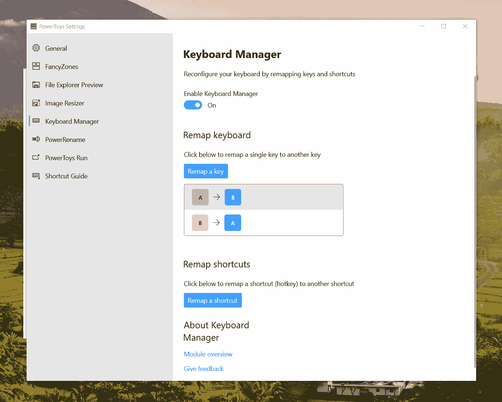
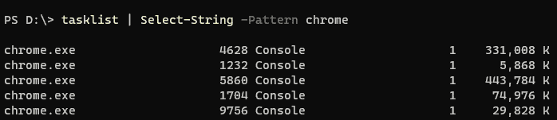
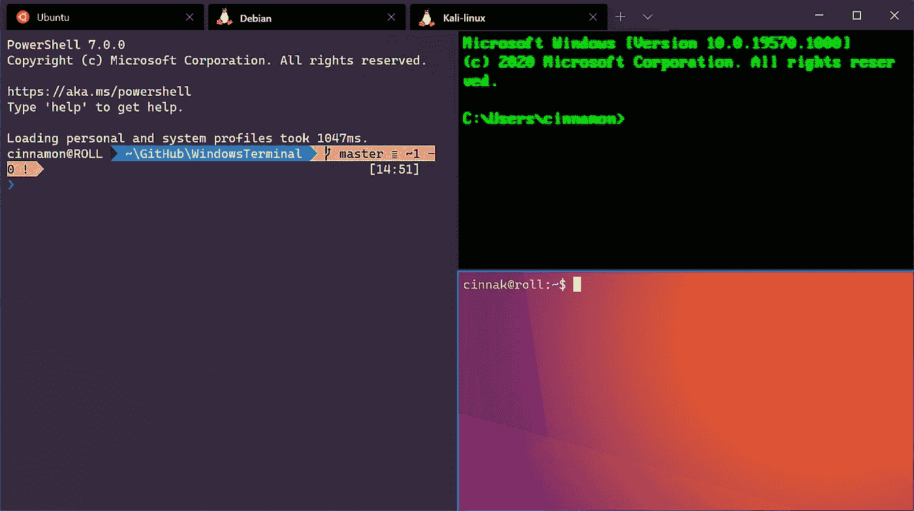
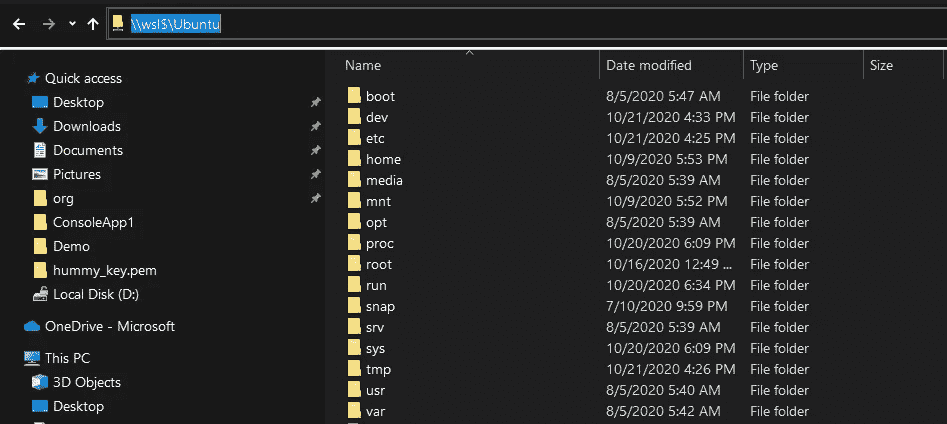
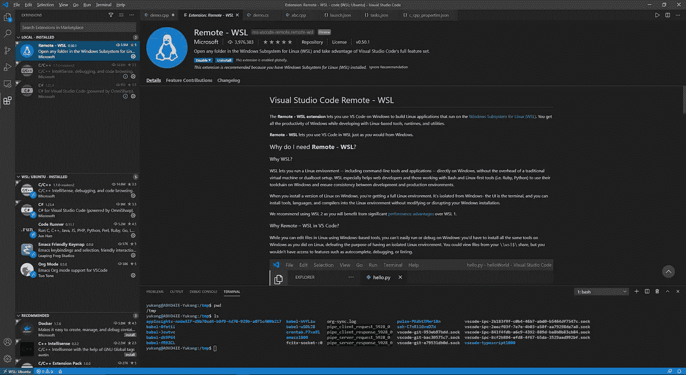
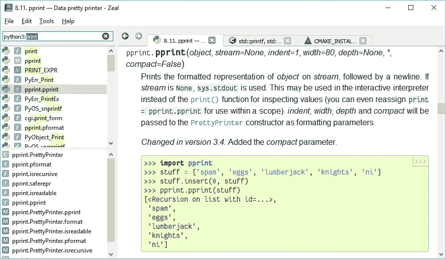

# 在 Windows 10 上提高工作效率的 5 个工具

> 原文：<https://betterprogramming.pub/5-tools-to-boost-your-productivity-on-windows-10-78f028cd6305>

## 微软在改善用户体验和为开发者建立活跃的生态系统方面做得很好

照片由 [@stadsa](https://unsplash.com/@stadsa) 在 [Unsplash](https://unsplash.com/) 上拍摄。

微软已经做出了巨大的努力来改善用户体验，并为开发者建立一个活跃的生态系统。而且，微软近几年已经完全拥抱开源了。微软开发了这么多[牛逼的开源项目](https://opensource.microsoft.com/)。

在 Mac 上做了八年的日常工作后，我最近换到了 Windows 10。我之前的印象是，与 Mac 相比，Windows 对开发者并不友好，效率也不高。

但我不想念我的 Mac，可能会在 Windows 10 上获得一些闪亮的开发体验。经过两周的探索，我发现了以下五个可以大大提高我工作效率的工具。

# 1.电动玩具

PowerToy 是一套实用程序，用于高级用户调整和简化他们的 Windows 体验，以提高工作效率。是开源的！PowerToy 里一共有八个小实用程序。自己去探索吧！

要提高生产力，我建议这两个实用程序。

## 电动玩具跑

[PowerToy run](https://aka.ms/PowerToysOverview_PowerToysRun) 是一款类似于 Alfred 或 Spotlight on Mac 的工具。一个简单的 Alt+空间，它可以帮助您搜索任何应用程序，进程，文件，网址等。任何你能想象到的。如果你愿意，它会运行一个简单的计算:

来源:[https://github.com/microsoft/PowerToys](https://github.com/microsoft/PowerToys/wiki/PowerToys-Run-Overview)

Alt+Num (1，2，3，等等。)将根据输入的数字最大化或最小化活动窗口。

如果你只是想搜索一个文件， [everything](https://www.voidtools.com/en-us/) 就其性能而言是一个极好的工具，并且是整个磁盘中文件的完整索引。

## 键盘管理器

键盘管理器是一个重新映射按键的工具。作为一个 Emacs 用户，我需要把 Caps Lock 换成 Ctrl，因为 Ctrl 用得更频繁，Caps Lock 位于键盘上更合适的位置。

资料来源:https://github.com/microsoft/PowerToys

您还可以在某些特定的应用程序中进行键重映射，但是请记住，它只接受进程名，而不接受应用程序名。所以对于微软 edge 来说，应该是“msedge”而不是微软 Edge。要获得进程名，您可以在 Powershell 中使用命令`tasklist`和`Select-String` 进行模式匹配:

# 2.WSL2

作为开发人员，日常工作需要运行一些 Linux shell 命令。在 Mac 上，我们有一个类似 Unix 的外壳，足够日常使用。

在 Windows 上，WSL 是游戏规则的改变者！忘掉 Linux 和 Mac 的那些细微差别吧。我们需要一个纯 Linux 内核和外壳。

WSL 代表 Linux 的 Windows 子系统。WSL2 是最新版本，性能更好。你甚至可以在上面运行 Docker。如果你想运行一个 Linux GUI 应用程序，[用 X-Server](https://github.com/hubisan/emacs-wsl#run-emacs) 配置它，一切顺利。

官方文档页面上有非常[详细的教程](https://docs.microsoft.com/en-us/windows/wsl/install-win10)。预编译的 Linux 发行版包括 Ubuntu、Debian 和 Kali。

使用路径`\\wsl$\Ubuntu`访问 Linux 中的文件。

# 3.Windows 终端

新的 Windows 终端是另一个礼物。它有一个花哨的用户界面和令人敬畏的性能。我们可以用它在 WSL 中创建 PowerShell、命令提示符和 Linux！

出色的性能来自 GPU 加速的文本渲染引擎。从我的经验来看，Mac 上的引导过程几乎比 Iterm2 快两倍。

更重要的是，我们可以在那里显示几乎任何我们想要的东西，包括图标或表情符号。

# 4.具有远程 WSL 的 Visual Studio 代码

VS 代码有大量优秀的插件。它可以被配置成大多数编程语言的强大 IDE。使用 Remote-WSL 插件，我们可以在 Linux 中编辑文件，这样我们就可以在使用基于 Linux 的工具、运行时和实用程序进行开发的同时获得 Windows 的所有生产力。

在编辑器窗口中编辑源代码，并在嵌入式 Shell 终端中运行或编译它。这和 Emacs 的用户体验差不多。我不能再要什么了！

# 5.热情

当我开始在 Windows 上编程时，Dash 是我非常想念的工具。幸运的是，我们在 Windows 上有一个替代工具。

Zeal 是一个面向软件开发人员的离线文档浏览器，结合了 200 多个文档集。其实大部分来自 Dash。

# 结论

有了这些强大的工具，您将获得一个轻量级的混合 Windows/Linux 编程环境。如果不用开发 Mac/iOS 应用，Windows 10 将是正确的选择。

我希望你喜欢这篇文章。Windows 上的快乐编码！