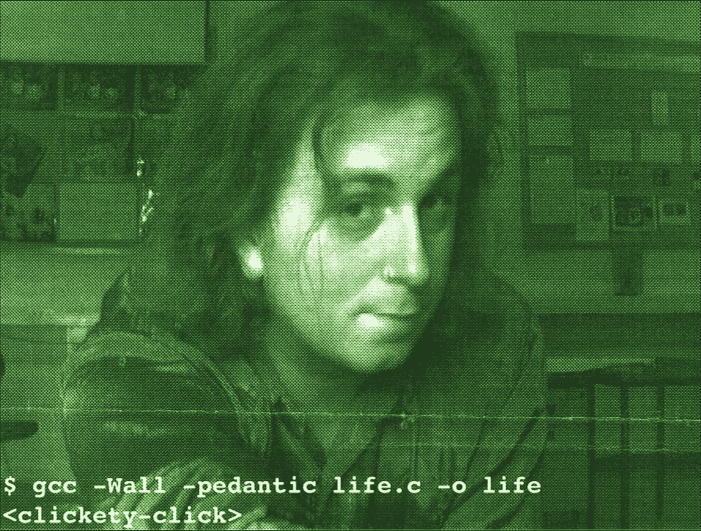

# 成为一名进步的软件工程师的 5 大技巧

> 原文：<https://betterprogramming.pub/5-top-tips-to-be-a-progressive-software-engineer-75bdedb0ca35>

## 在战场上的几十年已经教会了我软件工程大游戏的秘方——不仅仅是技术

鸣谢:作者，大约 1992 年(在错误地从学术界进入公司生活前不久)。

# 序幕

无论你是在家工作，偶尔去一个工作场所，还是被迫默许你的维多利亚老板的突发奇想，这里有一些提示可以帮助你推进你的软件工程职业生涯，这些提示并不都涉及在线课程或实际与人交谈。

这不仅仅是学习最新的技术，骑一辆看起来复杂的四维可折叠自行车，或者在周四晚上在一个改造过的码头仓库假装热爱精酿啤酒——这是关于规划游戏的策略，提前思考你的每一步行动，并在任何时候尽可能以最有利的方式展示自己。

让我们以半幽默的方式来看看如何在软件工程游戏中赢得朋友和影响他人。

# 1 —耳机

有时候，你经常被迫分享某种形式的共同工作空间，无论是真正的开放式办公室，还是那些时髦的议会运营的“企业中心”，提供可怕的不新鲜滚烫的热咖啡，没有停车场，€每小时花 10 英镑享受假天花板和香烟烟雾从停车场的通风口渗入的特权。

戴耳机通常是为了逃避现实，要么是为了盖过烦人的同事没完没了的吵闹声，要么是为了在你试图完成一些实际工作时阻止别人打扰你。

当然，从长远来看，耳机根本没有效果，因为它们只会让你相对于其他人处于劣势——秘诀是戴上耳机，但不要打开耳机。

在这种最不糟糕的策略中，你可以参与到你周围正在发生的事情中，比如办公室的流言蜚语和项目“经理”的做法，同时也能够转移那些通常会打扰你讨论 JavaScript 的类型安全或制表符如何优于空格的同事的大多数做法。

戴上耳机，别打开就行。

# 2-袋子

每个软件工程师都需要带一个包，不管是去办公室还是从办公室出来，或者只是去当地的咖啡店，炫耀你是高科技非光明会 FPS 爱好者的一员。

有时候，刚开始工作时，在选择合适的着装时经常会出错，一些初出茅庐的工程师——特别是数据库管理、金融科技或匿名咨询公司的“管理”快车道上的工程师——经常会犯拿公文包的致命错误。

公文包有两个好处，保持你家门口三明治的平整和 20 世纪 50 年代米色公务员办公室角色扮演。

你也应该真正避免挎包(它们特别适合私立学校，除非你也喜欢[果酱三明治和一顶红帽子](https://en.wikipedia.org/wiki/Paddington_Bear))和背包(主要适合游客，当然是背包客——名字里有线索，还有喜欢带很多水瓶的人)。

你选择的包最终应该是经典的[斜挎包](https://en.wikipedia.org/wiki/Messenger_bag)，因为它可以轻松装入一个小的一体式铝制 laptop⁵、精装绘图纸笔记本、各种墨水(中性笔)和手机。而且斜挎包还有一个额外的好处，就是可以让你的双手空出来拿必须的卡布奇诺，还可以让你自己开门。

斜挎包还可以牢牢地绑在你的身上，让你在必要时跑步，以便赶上火车、公共汽车，逃离公共场所或长长的办公室走廊中的敏捷职业，并给人一种可信的错觉，即你实际上经常骑自行车来保持身材。

有很多好处。

# 3-服装

经典的[赛博朋克](https://en.wikipedia.org/wiki/Cyberpunk)造型永远不会过时，而且总是给人一种“[高科技低生活化](http://www.sjgames.com/gurps/books/cyberpunk/)的印象，这种印象对于看起来像是房间里最博学的、本质上不可接近的人是至关重要的。

着装规范是在软件工程中实现的，这是早期计算机在政府资助的机构中有效运行的结果。从那以后，它们主要是通过普遍的惰性和我喜欢称之为“管理一致性原则”来传播的，这种原则试图通过 borg 式的平淡着装来剥夺个性和创造力。

[俗话说，人靠衣装，作为高科技的旗手](https://idioms.thefreedictionary.com/clothes+make+the+man)[你有责任尽可能地展现知识至上和反传统着装规范的并存，让自己变得奇怪而精彩。毕竟，西装革履的管理阶层确实依赖于你证明他们存在的能力。](https://www.youtube.com/watch?v=zxFnHvousAM)

除了在偶尔的董事会会议上，当幻灯片演示消失时，或者当爬到管理人员的桌子下面重新连接他们的以太网电缆时，宣扬你讨厌但又重要的存在，还要想想你的衣服是低维护、低成本的，而且从来不需要熨烫。

事实上，知道了这一点就可以高枕无忧了，最终工作满意度和总体幸福感 proven⁶与你花在衣服上的钱和一个早上在镜子前熨 underpants⁷的时间成反比。

软件工程师的刻板印象存在是有原因的，[同志们](https://www.youtube.com/watch?v=GK2GUxOnjDQ)！

# 4 —硬件(和软件)

就像“人靠衣装”一样，你使用的硬件，很自然地描述了你是什么样的人——或者你想被人看到的样子。

现在，我说的不仅仅是拼凑起来的移动操作系统 systems⁸的脆弱和支离破碎的生态系统，还有你经常使用的桌面操作系统(我喜欢这种说法)。

拿出一台塑料笔记本电脑，运行着几十年前由雷德蒙推出的行李运输意大利面条的衍生产品，看上去并不好看。也不是等 20 分钟开机，再等 40 分钟“强制升级”，然后才能开始你的幻灯片演示。

你会想要使用某种金属([字面意思](https://developer.apple.com/metal/))，这种金属也有从休眠状态跳回使用的可靠历史，有超过 50%的成功机会。

打开[黑暗模式](https://developer.apple.com/design/human-interface-guidelines/macos/visual-design/dark-mode/)的光鲜屏幕总是有那种惊人的效果，随后跳转到直观和光滑的[主题演讲](https://www.apple.com/keynote/)，而不是现在陈旧和臃肿的订阅不友好的 [Powerpoint](https://www.microsoft.com/en-ie/microsoft-365/powerpoint) 。

当管理阶层在他们的塑料围墙的 Excel 花园里辛勤工作时，真正的软件工程师带着他们的激光蚀刻铝的优点一头扎进了未来。

你会想从你的斜挎包里拿出你选择的[笔记本电脑。](https://www.apple.com/uk/macbook-pro-13/)

# 5——“我不知道”因素

那种特殊的软件工程师与众不同，很难用语言表达出来。不，不总是发型的问题。

除了上述方面，一个令人敬畏的钻石级软件工程师就像[外柔内刚的铁手](https://idioms.thefreedictionary.com/an+iron+hand+in+a+velvet+glove)，有点类似于“千面之神” [Nyarlathotep](https://en.wikipedia.org/wiki/Nyarlathotep) 。

这可以称之为一种技术外交，他们可以毫不费力地、谨慎地在拒绝荒谬的管理实施截止日期和转向有效、连贯地争论每月 10€以上的云计算预算之间滑行。

要培养这种专业技能，并沿着技能线前进，需要多年的技术学习，但也需要有目的、专注的倾听。成功的、老练的软件工程师将能够看到更大的图景，同时始终关注小的细节，把握公司的脉搏，并且非常清楚该打哪场仗，知道众所周知的风正吹向⁰.的哪个方向

你的进步将是前面四点的结合，不仅积累了技术上的敏锐，还在正确的时间向正确的人展示了正确的外表，从而提高了你的学习和工资等级。

你将是管理层的联络人，一个他们可以交谈的人，并且以一种柔和但丰富多彩的[漫画无](https://en.wikipedia.org/wiki/Comic_Sans)格式呈现技术细节以便于消化。对于采煤工作面的同志来说，你将是一个有益的、友好的导师——在你的领域里是一个强大的技术权威，一个知道大多数按键的人，并且愿意分享黑暗咒语。

你将是[难以捉摸却又存在的](https://en.wikipedia.org/wiki/The_Scarlet_Pimpernel)，聪明却又邋遢，后台却又前台，预定却又不间断，一个[操作数](https://en.wikipedia.org/wiki/Operand)和一个[操作符](https://en.wikipedia.org/wiki/Operator_(computer_programming))。

培养这些品质，努力工作，注意观察，你会走得很远。这就是我们软件类型的人(不是字面上的意思，Int 先生)喜欢软件游戏的原因，它是字面上的[垃圾进垃圾出](https://en.wikipedia.org/wiki/Garbage_in,_garbage_out)——所以努力吧！

我们都有自己的英雄，也许你的英雄是托尼·斯塔克(T1)或 T2(T3)，或者是一个像我一样的英雄，T4·博夫本人。

[1]:是的，很遗憾，它们依然存在。即使经过了几十年的嘲笑和千兆字节的信息淘洗一切从他们的有效性到他们的卫生。软件开发的全景监狱。
【2】:银行软件的时髦名字，就像 [Sellafield](https://en.wikipedia.org/wiki/Sellafield) 对于 Windscale 一样。这也很大程度上取决于房间——例如，软件开发办公室和会议室之间的工作量有很大的不同。
【5】:大家都知道我在说什么。
【6】:轶事，自然。谁会看脚注呢？
【7】:此处插入合适的内衣口语。
【8】:安卓。你想的是黑莓操作系统的 JVM 吗？如果是这样的话，你不仅显示了你的年龄，而且还错过了评估 Android 成功的安全功能和隐私保护功能的乐趣。好吧，我说选择，就好像你没有选择，那你就是做错了。强制性操作系统是为管理阶层设计的。
[10]:他们还会知道哪些 HDMI 电缆可以在紧急情况下拔掉，哪些椅子可以避免从会议室被偷走，因为它们在座位下用紫外线做了标记。
【11】:<ESC><SHIFT>ZZ