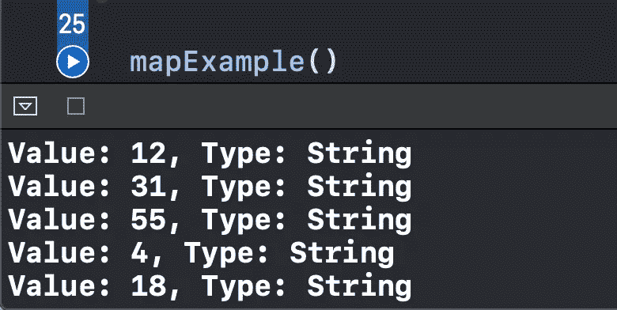
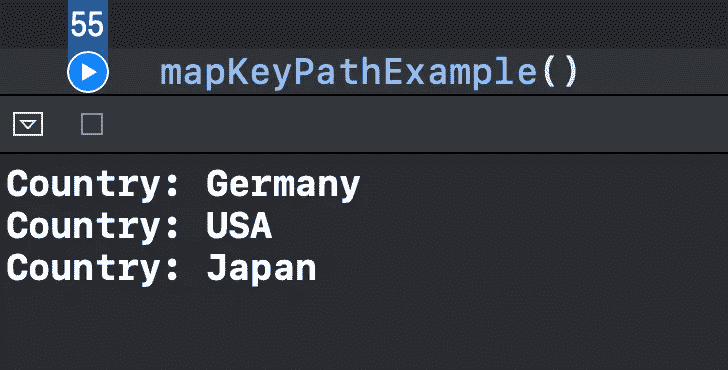
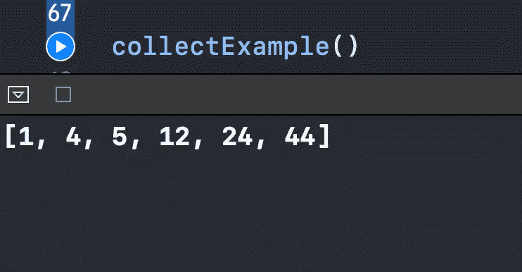
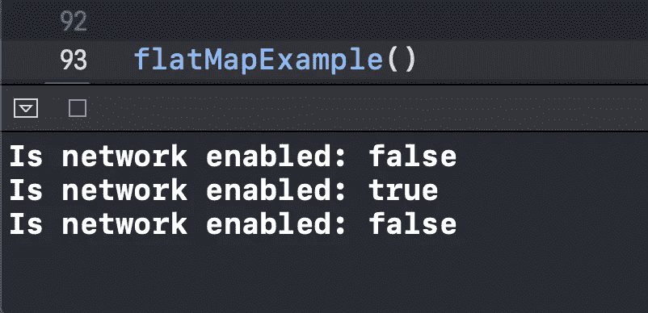
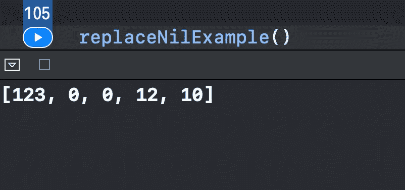

# Swift:你应该知道的 5 个转换组合运算符

> 原文：<https://betterprogramming.pub/5-transforming-combine-operators-you-should-know-4603fe112d74>

## 用清晰的例子

[rupixen.com](https://unsplash.com/@rupixen?utm_source=medium&utm_medium=referral)在 [Unsplash](https://unsplash.com?utm_source=medium&utm_medium=referral) 上的照片

在本文中，我们将探索五个伟大的[组合](https://developer.apple.com/documentation/combine)转换操作符，它们可以轻松地将数据转换成不同的格式。

我们将通过在 Xcode 操场上创建示例函数并运行它们来观察结果。

源代码可以在文章的底部找到。

我们开始吧。

# 1.地图

`.map`操作符允许我们在闭包中转换来自发布者的所有元素。

下面是这段代码的作用:

*   我们创建一个接受`Int`价值观的`PassthroughSubject`。
*   我们使用`.map`运算符将每个接收到的`Int`值转换为`String`。
*   然后我们订阅发布者并打印转换后的元素的值和类型。
*   我们向受试者发送随机数，以观察以下结果:

我们也有一种简单的方法来使用对象的键路径获得对象的属性:

如我们所见，使用`.map(\.country)`，我们访问了`CarBrand`的国家属性。然后我们简单地打印每个国家:

# 2.收集

`.collect`操作符使得收集所有接收到的元素并发出包含所有元素的单个数组变得容易:

我们得到了我们想要的结果:

注意:发布者必须发出一个`.completed`事件来实现这一点，因为`.collect`是一个贪婪的操作符，它会一直等到所有的元素都被发出并且发布者完成。

例如，如果我们正在使用一个`PassthroughSubject`，我们将需要在发送所有元素之后发送一个`.finished`事件:

# 3.平面地图

`.flatMap`操作符允许我们将一个给定的发布者转换成另一个发布者。看看我们如何将观察从一个`Network`改变到它的`isAvailable`主题:

结果，当我们改变它的值时，我们打印出了`isAvailable`的值。首先，它打印初始值(我们使用的是`CurrentValueSubject`)。然后，一旦我们给它分配了一个新值，就会发生以下情况:

# 4.replaceNil

顾名思义，`.replaceNil`操作符将每个收到的`nil`元素转换成我们指定的元素:

请注意，我们也可以将几个运算符组合在一起以获得必要的结果。首先，我们用 0 替换每个`nil`值，然后我们强制展开值，最后，我们将所有值收集到一个数组中:

注意我们如何在`.map`操作符中使用强制展开。不喜欢强制解包怎么办？为此，我们有一个`.map` : `.compactMap`的共变。当我们使用它时，它只自动转发那些不为零的元素:

# 5.扫描

`.scan`操作符在一个闭包中公开当前发出的值以及最新的值。我们可以用它来累加值并打印总结果:

在这里，我们执行以下操作:

*   创建收益数组(下划线是分隔数字中千位部分的好方法)。
*   创建一个这些收入的出版商。
*   使用`.scan`操作符，将当前发出的值($0)加到最新的值($1)，从零开始。

因此，我们计算总收益:

# 资源

Xcode 游乐场的源代码可以在[概要](https://gist.github.com/zafarivaev/75db5ff7b6550f22e671d2be1670980a)中找到。

# 包扎

想了解更多关于联合收割机的信息吗？查看我的其他相关文章:

 [## 如何在 Swift 5 中创建自己的联合收割机订户

### 将逻辑封装在单独的类中

medium.com](https://medium.com/better-programming/how-to-create-your-own-combine-subscriber-in-swift-5-702b3f9c68c4)  [## 你应该知道的 9 个过滤组合运算符

### 用清晰的例子

levelup.gitconnected.com](https://levelup.gitconnected.com/9-filtering-combine-operators-you-should-know-9c1ef2911352)  [## 在 Swift 5 中将委托替换为组合

### 摆脱这种冗长的协议一致性

medium.com](https://medium.com/better-programming/replace-delegation-with-combine-in-swift-5-e4c193655e7b) 

感谢阅读！