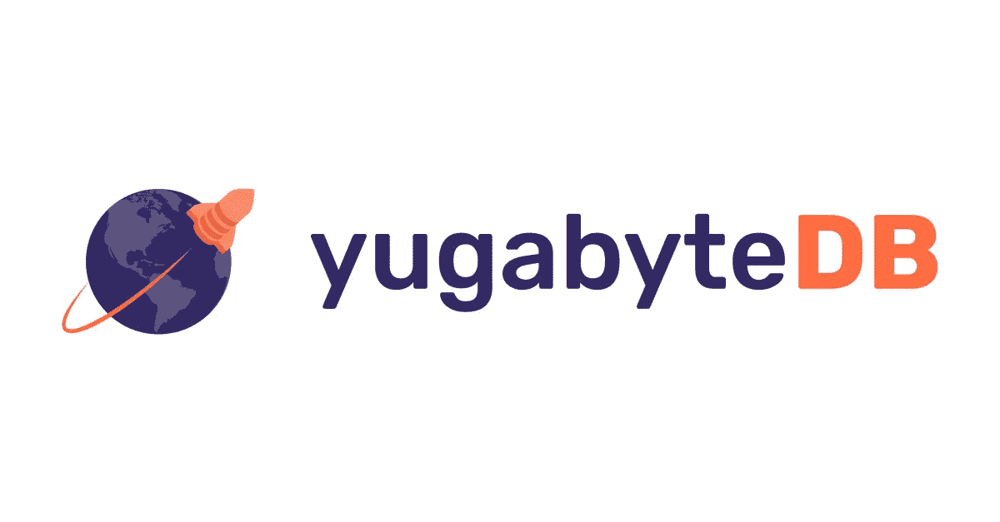

# 2020 年大数据和 SQL 的 5 大趋势令人振奋

> 原文：<https://betterprogramming.pub/5-trends-in-big-data-and-sql-to-be-excited-about-in-2020-1489464e7aee>

## 分布式数据处理、协作 SQL 和开源

[斯科特·格雷厄姆](https://unsplash.com/@sctgrhm?utm_source=medium&utm_medium=referral)在 [Unsplash](https://unsplash.com?utm_source=medium&utm_medium=referral) 上拍照。

SQL 是当今职场中最受欢迎的技能之一。它开发于 20 世纪 70 年代，至今仍是我们大多数数据系统的接口方式。不管出现了什么样的拖放工具，也不管有什么样的新查询范式试图取代它，它仍然存在。

我们今天将讨论的许多现代数据库技术都必须不断地遵守 SQL 策略，而 SQL 需要更新。

然而，这并不是说 SQL 的前景在过去的几十年里没有太大的变化，不会继续发展。这是 SQL 一直存在的一个原因。它与时俱进，不断发展。

本文将总结 SQL 和数据分析领域目前出现的一些主要趋势。

我们将讨论 SQL 如何变得更具协作性和开放性，我们这个世界上继续运行的大多数数据库是如何开源或转向开源的，以及提出一些您可能没有听说过但应该警惕的技术。

随着技术领域发生如此多的事情，这将有助于提供 SQL 和数据世界中一些更重要的变化的清晰画面。

# SQL 不仅仅适用于数据驱动型公司的数据工程师和分析师

如果你曾经在 FAANG 甚至像 Instacart 这样的技术驱动型初创公司工作过，那么你可能已经意识到数据驱动一切——以至于[分析师](https://www.dataquest.io/blog/data-analyst-skills/)、PMs 和[产品经理](https://www.departmentofproduct.com/blog/sql-skills-for-product-managers/)出于需要开始理解 SQL。

SQL 是数据的语言，如果你想和数据交互，你需要了解它。

你想轻松算出用户在你产品上的平均花费时间，但又不想等分析师？你最好弄清楚如何运行查询。

这种轻松运行查询的能力也是因为不再需要安装 SQL 编辑器。对于基于云的数据，仓库带有 SaaS SQL 编辑器。我们将在下一节详细讨论 SaaS SQL 编辑器。

然而，这里重要的部分是你不必等 30 分钟来安装一个编辑器和处理管理它的所有麻烦。

现在，您只需访问一个 URL，就可以访问您团队的数据仓库。这使得公司中的任何人都可以轻松访问他们的数据。

我们知道这一点是基于轶事经验，以及 indeed.com 在 2019 年的跟踪显示了过去五年对 SQL 技能集的稳定需求。

总的来说，我们预见到未来不仅仅是大型科技公司使用 SQL 和分析来推动良好的决策。为此，我们需要一些工具，让任何人都能更容易地访问他们公司的数据。

# SQL 和分析变得越来越协作

图片来自 [PopSQL](https://popsql.com?utm_source=seattledataguy) 。

SQL 和分析变得越来越协作。如前所述，从数据中获得洞察力变得越来越多产。这意味着越来越多的人参与到创建查询、分析和指标中来。

协作工作始于像 Google Sheets 这样的产品。这种趋势继续扩展到 SaaS 的产品，如 Figma(协作设计)和 [PopSQL](https://popsql.com?utm_source=seattledataguy) (协作 SQL)。

像 PopSQL 这样的技术使您的团队能够通过文件夹和版本控制轻松地协作和跟踪您的查询工作。

现在，您不必担心有人不小心更改了您在报表或仪表板上的查询。版本控制允许您将查询恢复到以前保存的状态。这确保了您的团队在 SQL 和您用来计算指标的逻辑方面始终保持一致。

您还可以轻松地共享查询、更新查询、派生查询以及可视化数据。

此外，像 Figma、Google Sheets 和 PopSQL 这样的工具可以很容易地与 Slack 这样的其他协作工具集成。这些集成进一步允许您的团队轻松共享图表、查询、设计和见解。

你的团队可以很容易地看到其他人在做什么工作，他们在做什么改变，并且理解他们为什么要做这些改变。

随着远程工作的概念越来越多地成为许多公司的现实，拥有便于协作的工具将变得非常重要。

最后，像 PopSQL 这样的技术是朝着自助分析方向迈出的一大步，因为它们将查询数据的能力放到了分析师和数据工程师之外。

# 开源仍然是最受欢迎的数据库

像 Oracle 和 MSSQL 这样的付费许可的数据库管理系统对于开发团队来说似乎是非常受欢迎的选择。然而，MySQL 和 Postgres 这两个开源数据库管理系统是目前最受开发者欢迎的选择。

根据 EverSQL 在 2018 年[和 2020 年](https://www.eversql.com/most-popular-databases-in-2018-according-to-stackoverflow-survey/)[进行的调查，MySQL 仍然是最受欢迎的数据库管理系统。此外，根据](https://www.eversql.com/most-popular-databases-in-2020/)[栈溢出](https://insights.stackoverflow.com/survey/2020)，Postgres 最近已经超过 MSSQL 成为第二受欢迎的数据库。

Postgres 引入了一种新型的关系数据库。这就是所谓的对象关系数据库管理系统(ORDMS)。这与面向对象编程具有相似的属性，在面向对象编程中，可以有类和继承。此外，Postgres 的其他一些漂亮的特性是，它允许数组并具有一些 PubSub 功能。

这种向开源的转变并不新鲜。然而，[事实是许多公司开始放弃甲骨文和微软](https://aws.amazon.com/blogs/aws/migration-complete-amazons-consumer-business-just-turned-off-its-final-oracle-database/)而选择免费。他们选择支付云成本，而不是支付许可成本。

总的来说，我们看到开发人员的数据库选择发生了很多变化。

# 云优先的开源数据库正在获得关注和资助

图片来自[yugabytdb](https://www.yugabyte.com/)。

虽然 Postgres 经常是选择从 Oracle 转向开源解决方案的公司的常见选择，但 Postgres 并没有考虑到云基础设施和复杂性。

这迫使团队开发复杂的云基础设施来管理世界各地正在使用的应用程序。

但是还有其他开源解决方案。[2019 年 7 月，yugabytdb 100%开源](https://thenewstack.io/yugabyte-new-database-solve-sql-vs-nosql-dilemma/)。现在你们中的许多人可能会问(特别是如果你在美国)，“什么是 YugabyteDB？”

YugaByte 专有的面向文档的存储格式是一种高度定制的 RocksDB 形式，提供低延迟访问和高密度数据。它运行在流行和已知的 API 上。

YugaByte 旨在填补所有空白。想要一个同样是 ACID 的 NoSQL 数据库？然后，Yugabyte 希望接管这个市场。

它希望解决开发人员在部署 MySQL 等 SQL 数据库时遇到的问题，这些数据库需要分片和复杂的基础设施来运行多区域系统。

YugaByteDB 通过自动分片和负载平衡以及其他几个利用云优先方法的特性来做到这一点。

那么既然 2016 年就有了，为什么 YugaByte 会出现在这次更新中呢？

这是因为 Wipro Ventures 在本月早些时候向 Yugabyte 投资了 3000 万美元。此外，Wipro 计划将 Yugabyte 的开源 SQL 数据库带给其客户。有 1000 家新公司可能会使用 Yugabyte。

虽然 Yugabyte 不在 EverSQL 的调查结果中，但几年后，随着更多的牵引和用户，它可能会出现。现在，说实话，一个能解决 NoSQL 和标准关系数据库所有问题的数据库将是一个奇迹。所以从很多方面来说，我们对没有更大规模的采用感到惊讶。

在接下来的几年里，我们很想知道 Yugabyte 是像许多其他承诺解决您的组织的所有问题的奇迹技术一样，还是会像许多其他技术一样消失。

# 用于数据仓库的分布式数据库现在是标准

在科技界，数据库有两个主要用途:应用和分析。

这两个主要用例受益于不同的数据库系统以及不同的数据库设计。

特别是，为单个公司的数千名分析师、数据科学家和数据工程师运行数百万次计算的分析数据库通常受益于某种形式的分布式或并行组件。想想红移和它如何依赖 MPP(大规模并行处理)。

但是有许多新的 SQL 和 NoSQL 技术进入了这个领域。

例如，脸书普雷斯托的分支 Starburst 获得了 4200 万美元的额外资金。《星爆》是脸书开源项目(Presto)的副产品。Starburst 的目标是创建一个企业版的 Presto，因为 Presto 本身没有访问管理，没有 Teradata、Snowflake 和 DB2 等企业系统的连接器，也没有用户可以配置集群自动扩展的管理控制台。

这使得对大多数公司来说，即使不是不可能，也很难单独使用 Presto。这很遗憾，因为 Presto 允许您轻松地跨数据库运行查询，而无需将数据加载到数据仓库中。

所以最近对《星爆》的投资是很好的。我们期待看到这项技术将走向何方，并希望更多的公司可以利用 Presto，而不必担心必须管理 Presto 的所有复杂性。

当我们谈论像 Presto 这样的分布式数据库系统时，本月另一个有趣的发展[是 Spark 3.0](http://spark.apache.org/releases/spark-release-3-0-0.html) 的发布。Spark 的这个新版本带来了许多增强功能。这些改进中的许多都是为了让 Spark SQL 变得更加符合 ANSI SQL。

这是一个重要的注意事项。一个似乎仍然成立的模式是，您不能按原样放弃 SQL。许多工具和技术都试图开发自己的查询语言。然而，最终，SQL 仍然存在——不像许多已经消亡的编程语言。

SQL 仍然是数据的语言。

# 您的团队如何利用您的数据？

数据库和 SQL 哪里也去不了。如果说有什么不同的话，那就是它们正变得越来越普遍。像 Starburst 和 PopSQL 这样的工具显示了让你的工程师、分析师，甚至是非技术员工精通数据的重要性。

这些技术或类似的技术肯定会被大公司和小公司大量使用，因此它们可以帮助改善他们的决策。

我们喜欢看到像 PopSQL 和 Starburst 这样的工具。这些工具通过使 SQL 更具协作性和简化 Presto 等强大技术的部署，打开了数据世界。这有助于提升公司执行数据分析、做出更好决策和开发更好数据流程的能力。

至此，我们将结束这一两周一次的数据和技术领域的最新动态。我们的目标是继续提供关于新兴技术、风险投资等的未来更新。

敬请期待！