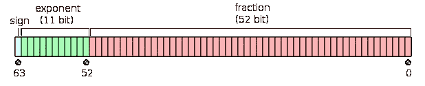

# 5 个棘手的 JavaScript 方面试问题

> 原文：<https://betterprogramming.pub/5-tricky-javascript-fang-interview-questions-fb3112002ca8>

## 强制，提升，可变范围…钉你方 JavaScript 技术面试


照片由 [Christina Morillo](https://www.pexels.com/@divinetechygirl?utm_content=attributionCopyText&utm_medium=referral&utm_source=pexels) 从 [Pexels](https://www.pexels.com/photo/woman-using-laptop-computer-1181280/?utm_content=attributionCopyText&utm_medium=referral&utm_source=pexels) 拍摄

如今面试竞争越来越激烈。要想被方公司录用，你需要通过一系列的面试。他们的招聘流程在不断变化和调整。然而，其中一个流程步骤仍然经常是深度 JavaScript 引擎面试。

评估 JavaScript 知识的一种常见方式通常是要求阅读一些代码。这有什么关系？因为代码审查是一项非常有用的技能。开发人员花了相当多的时间进行代码评审。为了正确有效地完成它们，对等体应该能够理解代码，而不需要执行它。

有时，在 JavaScript 练习范围内的结对编程会话中会提出引擎问题。

问你这些问题的方式可能会改变，但无论如何，它们都会进入技术面试。

让我们看看你可能会发现的最常见的棘手问题，以及如何通过掌握每个主题来解决这些问题。

# 1.变量作用域

清楚地了解不同的范围或变量是很重要的。这是一个在面试中很常见的问题。有一百万种方法可以问这个问题。然而，一旦你理解了它的机制，就很容易发现它。

让我们看看下面的代码:

它的产量是多少？

## 回答

如果你不注意变量`i`的范围，你的第一个猜测会是输出是`0 1 2 3 4 5 6 7 8 9`。

由于`var`确实在块级别上限定了变量`i`的范围，所以变量的引用不会改变。这意味着当`setTimeout`调用被解析时，它们将总是拥有`i`的最后一个值，即`10`。由于`setTimeout`有 10 个调用，输出将是`10 10 10 10 10 10 10 10 10 10`。

你怎么把它变成从 0 到 9 的线性序列呢？

**1。创建一个执行打印的函数。**
这意味着当执行该函数时，将创建该值的副本，并且它将工作:

`setTimeout`将不再保存相同的变量`i`。它将为每个迭代保存一个副本。

**2。用字母代替变量。因为 let 的作用域是由块决定的，所以它会在每个循环中创建一个新的变量。简单来说:`setTimeout`将用 10 个不同的变量来调用。**

⚠️:在那种情况下你不可能使用`const`。`for`循环在每次迭代中执行一次赋值。不能给`const`变量赋值。

更可取的方案永远是`Solution 2`。然而，能够用不同的方法解决这个问题将证明你在这个问题上的知识。

# 2.可变提升

可变主机是 JavaScript 面试中经常被评估的一个话题。这表明你在内心深处理解 JavaScript 引擎是如何工作的。

下面代码的输出会是什么？

选项:

a) `function a()`和`'b'`和`function c ()`

b) `undefined`和`undefined`和`undefined`

c) `function a()`和`undefined`和`undefined`

e) `function a()`和`undefined`和`function c()`

## 回答

如果你不知道主机如何工作，你可能会选择`b)`选项。但这是不对的。正确选项`c)`。

为什么？当用`function`关键字创建一个函数时，它会立即被提升，并在作用域块的开始处可用。它将打印`function a()`。`var`的工作方式与此类似，不同之处在于:变量是创建的，而不是初始化的。因此它会打印`undefined`。

初始化后，从第 5 行开始，`var b`的值`'b'`将可用。

# 3.数组

JavaScript 数组是日常使用的一个重要结构。他们是如此相关，以至于他们经常成为面试问题的候选人。

你能猜出下面代码的输出吗？

## 回答

人们很自然地认为上面的代码会失败。在相当多的语言中，分配需要手动进行。在 JavaScript 中，数组的`length`不是动态的。所有的内存分配都由引擎管理。

正确答案是:`Array(11) [0, 1, 2, 3, <6 empty slots>, 9]`。JavaScript 将负责初始化索引之间的间隙。数组的长度将是`11`，而不是`5`。

# 4.数学运算

你知道这个简单的 JavaScript 加法的结果吗？

## 回答

开发人员通常会假设这个操作的结果是`0.3`。可以理解，如果操作是`0.1 + 0.3`，结果将是`0.4`。

那么结果是什么？是`0.30000000000000004`。为什么？因为像许多语言一样，JavaScript 使用双精度浮点精度表示，也称为`IEEE 754`标准。该标准只是一种压缩算法，因为你不可能在一个 64 位变量上表示所有的十进制数。

使用压缩意味着您必须处理近似值。这导致了意想不到的结果。如果不小心谨慎，这些近似值可能会对任何计算产生负面影响。

我们可以在这里看到一个双浮点数近似的模式:



从维基百科获取

如何预防那些情况？有多种方法可以解决这个问题。对这个特定场景最简单的修复是使用`toFixed` `Number`方法。

但是，为了安全起见，最好只对整数进行操作。

如果你真的需要处理浮点数，有一个专门的库:`big.js`。它提供了解决近似问题的抽象。

让我们看一个它的用法的例子:

# 5.强迫

在深入研究代码之前，让我们回顾一下类型强制在 JavaScript 中的含义:

> 类型强制是值从一种数据类型到另一种数据类型的自动或隐式转换(如字符串到数字)。*类型转换*与*类型强制*相似，因为它们都将值从一种数据类型转换为另一种数据类型，只有一个关键区别——类型强制*是隐式的，而*类型转换*可以是隐式的*或*显式的。— MDN*

强制过程只会发生在基本类型上:`string`、`number`或`boolean`。通过使用`String()`、`Number()`或`Boolean()`功能，该过程可以是隐式的或显式的。这里我们就考察一下前者。

根据上面的知识，下面 4 个陈述的结果是什么？

## 回答

认为所有这三个操作的强制将以相同的方式发生是有道理的。有些人可能会选择`string`或`number`并将其应用于所有场景。

在下面找到每个陈述的解决方案:

*   结果 1: `"21"`
*   结果 2: `3`
*   结果 3: `1`
*   结果 4: `NaN`

除了`+`操作符，JavaScript 在使用数学运算时通常会强制使用数字。当字符串存在时，它将默认为串联。

这使得`result1`的结果成为一个字符串连接:`"21"`。

`result2`的结果是`3`，因为从布尔`true`到数字的强制是`1`。

```
// ✅ Explicit coercion example
Number(true) === 1
```

然后`2 + 1 = 3`。

对于`result4`，我们得到`NaN`，因为从`"x"`到数字的转换是不可能的。在这些场景中，JavaScript 将返回`NaN`。

```
// ✅ Explicit coercion of invalid number
isNaN(Number("x")) === true
```

任何使用`NaN`对象的操作都将返回同一个`NaN`对象。

# 摘要

我们已经看到了最常见的主题和问题，并附有简短的解释。这些将有助于你预测面试中可能会被问到的问题，并着手去做。

这些问题一点也不难。然而，如果你不了解这个话题，它们是很难猜出来的。

通过一点点实践，您将掌握并顺利通过 FANG 技术 JavaScript 面试。

干杯。如果你喜欢你所读到的，看看下面这个故事:

[](/7-tips-to-write-efficient-and-performant-javascript-code-bccbdb9662ae) [## 编写高效高性能 JavaScript 代码的 7 个技巧

### 提升您的 JavaScript 应用程序的性能

better 编程. pub](/7-tips-to-write-efficient-and-performant-javascript-code-bccbdb9662ae)