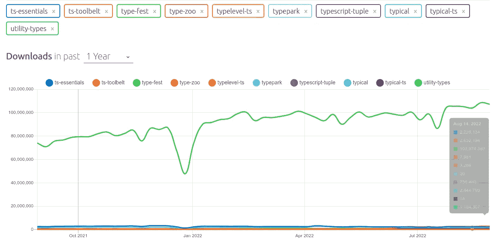
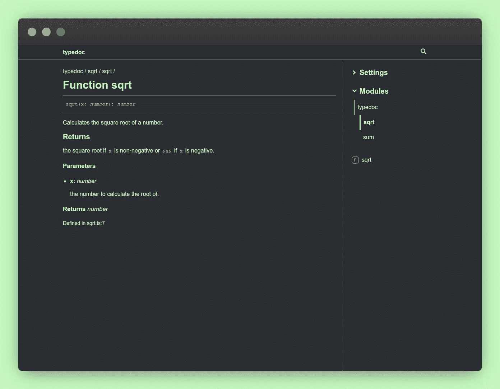

# 5 个类型脚本库来改进您的代码库

> 原文：<https://betterprogramming.pub/5-typescript-libraries-to-improve-your-codebase-d26f74a5c3>

## 增加你对静态打字的信心


作者图片

在过去的几年里，TypeScript 语言除了成长之外什么也没做。它被评为许多 web 开发人员最喜欢的语言。不得不在普通的 JavaScript 代码库中工作的情况越来越少。

然而，有时 TypeScript 并没有被充分利用。铸件过多或使用`any`是最常见的错误。

在本文中，我们将看到一个库列表，它将增强您的 TypeScript 体验，并增加您对其静态类型的信心。这些最小化的库将提升任何开发人员的人机工程学。

# 1.佐德

TypeScript 的薄弱环节是只在编译时进行验证。一旦它被解析和构建，所有类型都被移除。在以下情况下，这可能会导致一些不希望出现的错误:

*   编译器信任开发人员的一些假设(使用`any`、`ts-expect-error`、造型等)
*   网络返回的 REST 架构与预期的不同。

让我们看一个后者的例子:

在上面的代码中，编译器相信网络将返回一个带有`name`和`email`属性的 JSON `User`对象。如果那被证明不是真的，我们将在生产中面临一些问题。不幸的是，这只能在运行时发现。

使用`zod`,我们可以定义一个在运行时也将被验证的模式。

让我们看看使用`zod`对前面代码的重构

我们可以选择如何处理错误。在上面的例子中,`UserSchema.parse`将在运行时抛出一个错误。

通过使用`safeParse`方法，我们可以选择不抛出错误。它非常适合在 sentry 上记录问题，而不会破坏用户体验。

Zod 非常强大，我们也可以通过使用`z.infer`从模式中提取类型。我们可以在整个代码中传播该模式。

总之，它是一个强大的库，可以确保您的类型没有一个是不正确的，这可能会导致许多代码不一致。

其他一些重要事实:

*   它很小:8kb 缩小+压缩
*   零依赖性
*   不变的
*   简洁、可链接的界面
*   功能方法
*   也适用于普通的 JavaScript！不需要使用 TypeScript。

## 要求

*   TypeScript 4.1 和更高版本
*   启用严格模式

## 装置

```
npm install --save-dev zod
```

# 2.微小不变量

有时，在代码中的某些地方，您可以确定可空值不是空值。在 TypeScript 的严格模式下，如果不进行空检查，它就会出错。为了绕过它，有一个本地的`!`操作符。

让我们看一个例子

以上是一个不好的实践，因为有时那些开发人员的假设可能是错误的。

TypeScript 为此提供了一个名为`Asssertion Functions`的原生特性。`tiny-invariant`库就建立在它的上面。

你可以给`tiny-invariant`一个假设和一个要抛出的消息，如果那是`falsy`。只要不满足这些假设，它就会在运行时抛出异常。你可以稍后在哨兵或任何其他供应商赶上。这将增加对代码库的信心，并检测任何不一致的地方。

让我们来看一个使用示例:

代码库变得更加灵活和简洁。我们现在可以安全地清除大量多余的`if`语句。

这个包是最小的，你可以选择实现你自己的`invariant`功能，如果你喜欢的话。

## 要求

*   启用严格模式(否则毫无意义)

## 装置

```
npm install --save-dev tiny-invariant
```

# 3.铅字节

TypeScript 最强大的功能之一是映射类型。如果你想掌握它，可以在这里找到我的文章。

TypeScript 附带了一些实用程序，但是它们是有限的，只是作为一个起点。因此，最肯定的是，您的代码库中有一组实用工具。可能是在一个`utils.d.ts`里，你可以从一个项目带到另一个项目。这绝对没问题，但是，还有其他方法可以解决这个问题。

您可以使用许多库类型的实用程序。小心一些现在已经死了的像`ts-toolbet`。它们提供了久经考验的类型，减少了编写新映射所花费的时间。通过观察 npm 趋势，你可以发现`type-fest`是如何主导这个领域的。



https://npmtrends.com/[的搜索](https://npmtrends.com/)

让我们看一个例子。TypeScript 本机`Optional`实用程序非常有限。它只是让我们将所有属性标记为可选的。它缺乏粒度。

让我们来看看`type-fest`附带了哪些用例:

我们可以看到，要做到这一点，我们需要多么强大和多么少的代码。因为所有类型在编译时都被移除了，所以这不会增加包的大小。

请注意，所有这些类型的库实用程序都有一些要求和限制。所以您可能被迫更新到一个更新的 TypeScript 版本，或者要求您的代码在`strict mode`上。

## 型式试验的要求

*   TypeScript 4.7 及以上版本
*   严格模式

## 装置

```
npm install --save-dev **type-fest**
```

# 4.ts 变形

在很多不同的场景中，对代码执行静态分析是有用的。你可以使用`jscodeshift`甚至`babel`来实现。然而，对类型有更多的了解可能会更方便。

出于这个目的，您只能使用 TypeScript 编译器，它可以转化为一个陡峭的学习曲线。但愿`ts-morph`项目早就开始了。它提供了一种以编程方式导航和操作 TypeScript 代码的更简单的方法。

它是如何实现的？

*   通过围绕编译器 API 提供一些包装器。
*   允许回退到编译器 API
*   首先在内存中执行所有更改，只有在收到指令时才发出代码

让我们来看一个简单的例子，在这个例子中，将检查一个枚举，并在它确实存在的情况下对其进行更改。

安装非常简单

```
npm install --save-dev **ts-morph**
```

我们可以创建我们的`example.ts`文件来运行我们的代码。

那我们只需要运行它

```
npx ts-node example.ts
```

# 5.类型-文档

文档过程是构建 API 时的一个关键方面。它帮助其他开发人员快速掌握您的应用程序所公开的内容。通常每种语言都有自己构建文档的过程。

有了 TypeScript，就没有内置的工具，这就是`TypeDoc`诞生的原因。它使用代码注释来构建 HTML 或 JSON 格式的文档。它是可扩展的，支持多种配置。

这个工具带有方便的文档，可以在[https://typedoc.org](https://typedoc.org/)找到。有一些简单的例子可以学习掌握这个工具。

让我们看一个如何给方法添加注释的例子:

下面是结果:



生成的文档示例

你从盒子里得到很多:

*   干净的界面
*   面包屑
*   侧向导航
*   容易定制的 CSS，以适应你的喜好

装置

```
npm install typedoc --save-dev
```

为了生成文档，它需要知道`tsconfig.json`配置文件。它将根据给程序指定的入口点来扣除它。

```
typedoc src/index.ts
```

您还可以定义多个入口点

```
typedoc src/package1/index.ts src/package2/index.ts
```

你可以传递一个文件夹，而不是传递一个文件，TypeDoc 将使用`entryPointStrategy`来寻找一个`index`文件。

这种策略使得为工作区生成文档变得容易，只需运行

```
// ✅ it will check in each package folder for an index.ts file
typedoc --entryPointStrategy packages .
```

# 包裹

就是这样，这五个不同的 TypeScript 库中的任何一个都有可能提高您的任何项目的人机工程学。如前所述，有些可能很容易实现。这将归结为你的发展能力和优先事项。

干杯

[](/es2022-features-javascript-a9f8f5dcba5a) [## ES2022 有什么新功能？4 个最新的 JavaScript 特性

### 新 ES13 规格概述

better 编程. pub](/es2022-features-javascript-a9f8f5dcba5a)