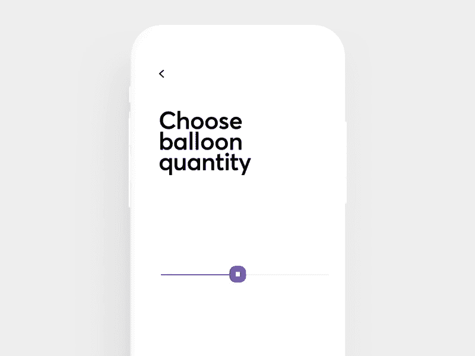
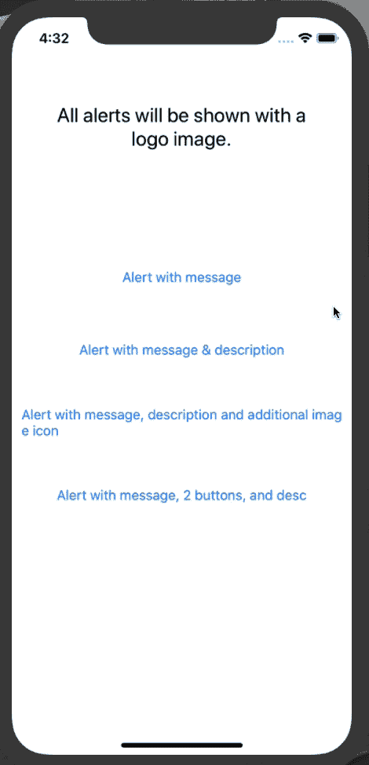
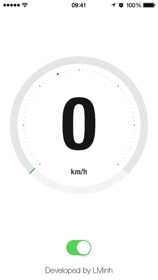

# 5 个与用户界面相关的 iOS 库，可在您的应用上使用

> 原文：<https://betterprogramming.pub/5-ui-related-ios-libraries-to-use-on-your-app-3591e71be4e6>

## 有趣的滑块，标签的惊人效果，表格空视图占位符，等等


照片由[卡斯帕·卡米尔·鲁宾](https://unsplash.com/@casparrubin?utm_source=medium&utm_medium=referral)在 [Unsplash](https://unsplash.com?utm_source=medium&utm_medium=referral) 上拍摄

# 1.气球采摘者



balloon-picker 是一个轻量级的库，只用几行代码就创建了一个有趣的滑块控件。

基本上，要开始只需通过代码 a `BalloonPickerView`实例化(你也可以在故事板中设置它)并用`valueChanged`事件跟踪值的变化。

[](https://github.com/Cuberto/balloon-picker) [## 立方体/气球采摘器

### Cuberto 是一家领先的数字机构，拥有扎实的设计和开发专业知识。我们为…打造移动和网络产品

github.com](https://github.com/Cuberto/balloon-picker) 

# 2.格力奇标签


GlitchLabel 将把你的无聊标签转变成一个带有毛刺效果的令人惊叹的新标签。

我说的*小故障是什么意思？*故障是系统中的暂时故障，该术语通常用于计算/电子/视频游戏环境中。

下面你可以找到开发者在 GitHub 库上提供的使用这个库的代码:

```
let glitchLabel = GlitchLabel()
glitchLabel.text = "Hello, World!"
glitchLabel.sizeToFit()
view.addSubview(glitchLabel)
```

[](https://github.com/kciter/GlitchLabel) [## kciter/GlitchLabel

### iOS 版 UILabel 故障📺$ pod 试试 GlitchLabel 如果你喜欢这个开源，可以赞助。

github.com](https://github.com/kciter/GlitchLabel) 

# 3.EmptyStateKit


实话实说:没有人喜欢空的表/集合视图。通常，当我们处于这种情况下，我们不知道该怎么办。

例如，如果我们进行搜索，却发现屏幕上一片空白，该怎么办？这是什么意思？没有结果吗？应用程序仍在搜索？出现了连接错误？通过使用 EmptyStateKit，我们将不再有这个问题。

[](https://github.com/alberdev/EmptyStateKit) [## 阿尔伯德夫/EmptyStateKit

### 在关键时刻，空状态实际上是吸引、保持和取悦用户的一个好方法。使用 EmptyStateKit 制作…

github.com](https://github.com/alberdev/EmptyStateKit) 

# 4.KCustomAlert



停止使用默认的警报控制器。

通过使用 KCustomAlert 库，您可以创建四种不同的超酷的可自定义通知:

*   用消息提醒
*   带有消息和描述的警报
*   通过消息、描述和附加图像图标发出警报
*   带有消息、两个按钮和描述的警报

[](https://github.com/krishnads/KCustomAlert) [## krishnads/KCustomAlert

### GitHub pages URl 在这里:https://krishnads.github.io/KCustomAlert/.让我们不要在我们的…

github.com](https://github.com/krishnads/KCustomAlert) 

# 5.LMGaugeViewSwift



最后一个库使用核心图形和核心动画来显示仪表(如速度计或负载指示器)以获得最佳性能，

它支持界面构建器，允许开发者定制很多东西和设置。

[](https://github.com/lminhtm/LMGaugeViewSwift) [## lminhtm/LMGaugeViewSwift

### https://github.com/lminhtm/LMGaugeView 显示仪表，如速度计或装载指示器。使用核心…

github.com](https://github.com/lminhtm/LMGaugeViewSwift) [](https://www.buymeacoffee.com/nicolidomenico)