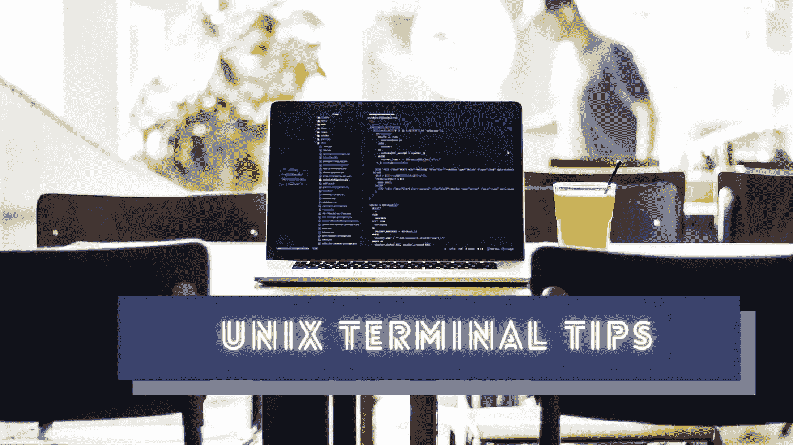

# 提高编码速度的 5 个 Unix 终端技巧

> 原文：<https://betterprogramming.pub/5-unix-terminal-tips-to-boost-your-coding-speed-c85f880606ed>

## 使用这些实践可以更快地完成编程任务



照片由 [Jantine Doornbos](https://unsplash.com/@jantined?utm_source=unsplash&utm_medium=referral&utm_content=creditCopyText) 在 [Unsplash](https://unsplash.com/s/photos/coding?utm_source=unsplash&utm_medium=referral&utm_content=creditCopyText) 上拍摄，用 Canva 编辑。

程序员经常在编程期间使用终端应用程序来完成各种活动，例如输入 Git 命令、运行构建脚本和执行自动化脚本。几乎所有的 GUI 操作系统都有内置的终端程序，让用户通过命令行界面(CLI)完成任务。

每个终端程序通常将用户输入的命令发送到命令行解释程序以获得输出。例如，当您输入`mkdir`来创建一个新目录时，终端程序通过 Bash 这样的命令行解释器使用输入参数执行`/usr/bin/mkdir`进程。接下来，`mkdir`二进制文件用`mkdir` syscall 创建一个新目录，并将输出返回到终端。

我们可以在终端上运行各种命令来执行不同的操作。这些命令在 GNU/Linux 和 macOS 等类 Unix 操作系统上几乎是相同的。大多数程序员在编程时更喜欢基于终端的与操作系统的交互。因此，您使用终端程序的方式直接影响您的编程速度。

在本文中，我将解释几个 Unix 终端技巧来提高您的编程速度。

# 有效地使用后台任务

我们通常在终端上输入短时命令。例如，`git status`命令会立即显示当前的存储库状态并退出。有时，我们必须运行命令来执行长时间运行的任务，例如打开 GUI 文本编辑器来编辑文件、安装新的软件包以及通过互联网克隆存储库。在这些情况下，大多数程序员通常倾向于打开带有更多选项卡的多个 shell 实例。但是，几乎所有的命令行解释器都提供了在一个 shell 实例中管理这些长期运行任务的特性。

在类 Unix 操作系统中有不同的后台任务模式。最简单和最有帮助的后台任务类型是我们可以从&符号(`&`)字符开始的类型。我经常使用以下命令用 gedit 应用程序打开一个文本文件:

```
gedit myFile.py &
```

该命令打开文本编辑器，而不阻塞当前 shell。因此，我可以在不关闭文本编辑器的情况下输入另一个命令。然而，这种方法不适合将内容打印到控制台的长时间任务——因为当进程打印一些文本时，shell 会被阻塞。在这些场景中，我们可以使用以下命令将输出/错误流从 shell 中分离出来:

```
./download.sh &> /dev/null &
```

如果上面的语法看起来很长，你可以在`.bashrc`中创建一个函数，如下所示:

```
function bgt() {
  "$@" &> /dev/null &
}
....
....bgt ./download.sh # will do the same!
```

我们可以使用内置的`jobs`命令检查后台任务的状态。如果您需要在关闭终端后保持进程活动，可以通过`nohup`命令生成一个进程。

# 学习更快地检索和输入命令

练习打字更快并不是程序员能够更快输入终端命令的唯一秘诀。每个终端应用程序都提供了一组键盘快捷键，让您在输入终端命令时更有效率。每个开发人员都知道用箭头键获取先前输入的命令，并用 tab 键自动完成。但是你知道如何在编辑命令时更快地移动光标吗？试着分别按下`Ctrl + A`和`Ctrl + E`进入开始和结束。

有时候，我们经常要找到我们前段时间输入的一个命令。有两种方法可以选择一个旧的命令，而不需要多次按向上箭头键。如果您喜欢使用鼠标，将`grep`命令和`history`命令组合在一起，如下所示:

```
history | grep git
```

上面的命令显示了您之前输入的所有`git`命令，因此您可以复制并再次运行。如果你不喜欢用鼠标，可以反向搜索。按下`Ctrl + R`并输入命令的一部分。接下来，按`Ctrl + R`直到找到需要的命令。

# 尝试在终端内进行所有文件操作

在编程任务中，我们经常需要创建新文件、删除文件夹和复制文件。你不需要离开你的终端去做这些文件操作。尽管内置的 GUI 文件浏览器提供了更好的文件可视化概览，但它降低了文件操作的生产率，因为我们必须进行大量的点击和鼠标移动。您最喜欢的代码编辑器可能会提供一些特性来执行文件操作，但是您仍然需要使用 GUI。

练习使用`touch`、`cp`、`mv`、`rm`和`mkdir`命令，而不是使用 GUI 文件管理器应用程序。但是，使用像`rm`这样的命令要小心，因为一旦你使用了强制选项，它不会要求你确认。

此外，我们可以在终端应用程序上更快地执行文件搜索和文本模式搜索。例如，以下命令显示了包含`unistd.h`头文件的所有位置:

```
grep -rn "#include <unistd.h>"
```

如果这些命令看起来有点长，您总是可以在`.bashrc`文件中将这些命令定义为函数，如下所示:

```
function sp() {
    grep -rn "$@"
}
....
....sp "#include <unistd.h>" # will do the same!
```

但是，我们有时不得不使用 GUI 文件管理器。然后输入以下命令，在不离开终端应用程序的情况下打开它:

```
xdg-open ~/folder # Linux
open ~/folder # macOS
```

# 使用 JavaScript 或 Python 编写现代自动化脚本

当我们每天必须在终端上输入重复的命令时，我们通常会编写一个包含所有命令的 shell 脚本。大多数程序员使用 Bash 来编写他们的自动化脚本。Bash 非常适合 shell 脚本，但是不适合构建所有的自动化脚本。如果需要用多行字符串模板创建一个文件呢？Bash 是一种命令语言。因此，它没有提供所有开发人员友好的语法和特性来编写现代自动化脚本。

尝试选择一种替代的编程语言来编写现代自动化脚本。JavaScript 和 Python 是很好的替代品。每个类似 Unix 的操作系统都预装了 Python 版本。还有，很多程序员在自己的电脑上安装了 Nodejs。因此，您可以用 Python 和 JavaScript 编写类似于 Bash 的可移植自动化脚本。您也可以使用这些替代方法为 CI/CD 服务器编写自动化脚本。

您可以使用 [zx](https://github.com/google/zx) 或 [shelljs](https://github.com/shelljs/shelljs) 让您的 JavaScript 实用程序脚本看起来类似于 Bash。另一方面， [shellpy](https://github.com/lamerman/shellpy) 帮助您编写类似 Bash 的 Python 脚本。下面的故事进一步解释了 shell 脚本语言:

[](/bash-vs-python-vs-javascript-which-is-better-for-automation-92a277ef49e) [## Bash vs. Python vs. JavaScript:自动化哪个更好？

### 比较 Bash、Python 和基于 JavaScript 的 Shell 脚本的优缺点

better 编程. pub](/bash-vs-python-vs-javascript-which-is-better-for-automation-92a277ef49e) 

# 始终检查命令选项和可能的组合

特定的终端命令通常执行一个操作。例如，`tac`命令以相反的顺序显示所提供文件的行。此外，一些外部命令带有子命令。几乎所有命令通常都支持几个命令行选项来控制内部行为。有时，这些命令行选项通过跳过额外的命令来帮助我们加快工作速度。

例如，您可以使用以下命令一次创建多个子目录:

```
mkdir -p ./src/core/filesystem
```

Shell 解释器支持在一行中运行一系列命令的两种方式:用分号(`;`)或两个&符号(`&&`)和管道分隔命令。我们确实可以创建一行程序来提高我们的生产率，而不是一次键入一个命令。以下一行程序递归地创建一组目录，并将当前工作目录设置为最近创建的目录:

```
mkdir -p ./src/core/filesystem && cd $_
```

有时，我们可以通过将特定命令的输出作为另一个命令的命令行参数发送(而不是通过管道作为标准输入)来加快速度。看看下面的例子，它一次删除所有 Docker 容器:

```
docker rm -f $(docker ps -a -q)
```

此外，我们可以构建数组，并立即将它们用作命令行参数。以下一行程序将创建五个具有顺序命名的 Python 脚本:

```
touch script_{1..5}.py
```

试着用你自己的命令组合来一次做一些事情，而不是一直一次输入一个命令。