# 5 个有用的浏览器控制台功能(除了日志)

> 原文：<https://betterprogramming.pub/5-useful-browser-console-functions-other-than-log-16fb84341d05>

## 有更有效的调试方法


[西格蒙德](https://unsplash.com/@sigmund?utm_source=medium&utm_medium=referral)在 [Unsplash](https://unsplash.com?utm_source=medium&utm_medium=referral) 上拍照

web 开发人员的武器库中最有用的工具之一是可靠的旧`console.log()`函数。无论您试图调试一个错误，检查一个函数是否被调用，或者研究一个 HTTP 响应的形状，`console.log()`可能是您的首选工具。

但是如果我告诉你控制台有更多的功能呢？如果我告诉你，它可以执行更有用、更强大的功能来使这些任务变得更容易、更简单，会怎么样？嗯，事实证明，当你更深入地观察控制台时，它有着超越`.log()`的功能。让我们来看看五个最有用的功能，让你的开发体验更加有效。


有太多要探索的了！

**注意:**虽然这些功能在大多数现代浏览器中广泛可用，但它们可能并非在所有浏览器中都可用，并且可能在每个浏览器中实现不同。

# console.assert()

通常，当试图有条件地将问题记录到控制台时，有必要使用 if-else 块来调用`console.log()`。这给你的代码库增加了额外的代码行，使得保持整洁更加困难。这就是`console.assert()`的用武之地，它将一个布尔语句作为它的第一个参数，并使用计算出的值来决定它是否应该记录到控制台。

当给定的表达式计算为`false`时，对`console.assert()`的调用将抛出一个错误并记录到控制台，但是如果表达式为`true`，将跳过记录。例如，假设我们有一个应该有`4`轮子的`car`对象。我们可以编写一个 if 语句来注销汽车是否有不同的车轮值，或者我们可以使用下面的语句断言它必须有`4`车轮:

```
console.assert(
    car.wheels == 4, 
    `Car has wrong number of wheels: ${car.wheels}`
);
```

这将导致我们的代码不仅记录到控制台，而且抛出一个错误，因此断言的失败也立即可见。

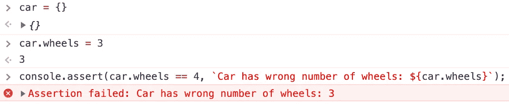

您不仅可以看到消息，还会抛出一个错误

# console.count()

调试循环或递归函数时，跟踪一段代码被调用的次数通常很有用。这通常需要设置一个全局计数变量，并在每次命中该段代码时递增它。`console.count()`通过消除对全局计数变量的需要，以及消除对递增然后记录计数值本身的需要，简化了这一点。

通过在代码的任何地方添加`console.count()`,浏览器将自动记录一个默认的计数，这意味着不需要手动跟踪计数。

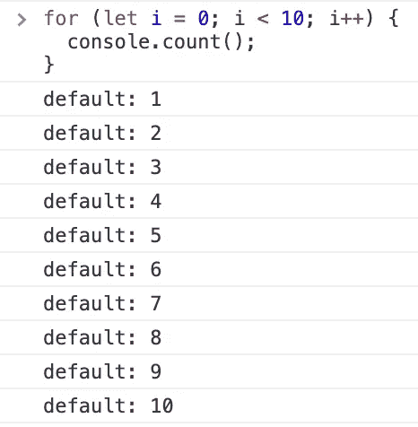

轻松跟踪计数—不需要变量

但是，如果您需要多个计数呢？幸运的是，一些聪明人已经想到了这一点，所以`console.count()`可以用一个可选的标签来命名你需要显示的计数，而不影响其他任何计数。

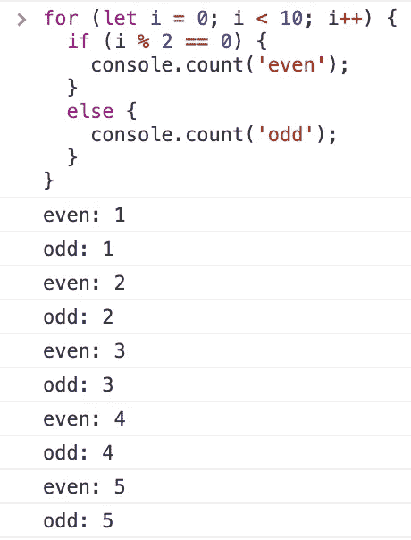

简单、易于理解的计数，无需复杂的实施

此外，您可以使用`console.countReset()`重置默认计数或标记计数。

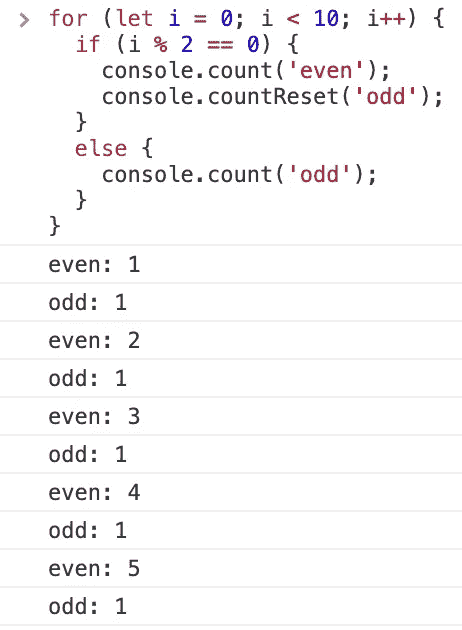

每次都回到计数的开始

# console.warn() /。错误()

控制台可以提供不同级别的注销信息的快速可视化指示。这些不同级别的日志记录在控制台中有预建的功能，其工作方式几乎与`console.log()`相同。它们接受相同的参数，但是改变了输出的视觉样式，以便更容易地指示最重要的消息。

如果你有一些重要的东西应该非常明显，并且在你的其他控制台项目中非常突出，使用`console.error()`将会把那个控制台消息变成亮红色:

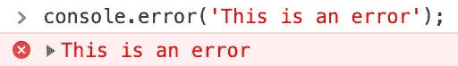

console.error()消息的输出

类似地，如果您有一些重要的事情需要了解，您希望突出出来，但并不像错误那样重要，那么`console.warn()`日志级别会用黄色突出显示您的消息:

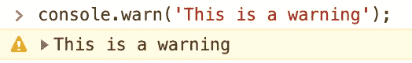

console.warn()消息的输出

# console.table()

`console.log()`适用于记录简单的字符串或整数值，但是当试图查看一个对象或数组时，输出会变得更加乏味。谢天谢地，有一个更好的方法来记录这些项目:使用`console.table()`。

这个函数接收传递给它的数据，并在日志记录时将其排列到一个表中。现代浏览器甚至能够直观地看到对象中数据的列名，这使得查看信息变得更加容易，而不需要您进行额外的配置！

## 数组

在处理数组时，`console.table()`能够一次处理多种数据类型，这意味着即使您有一个字符串、布尔值和整数的混合数组，`console.table()`也会整齐地显示它们。

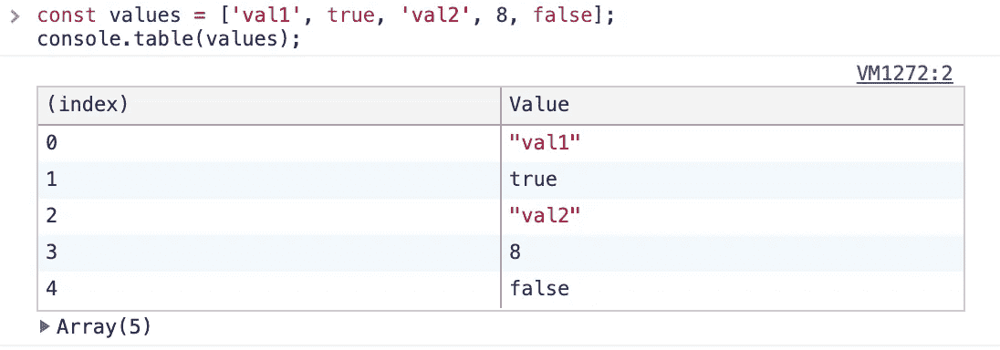

混合数据类型—非常易于查看和理解

事实上，你甚至可以将嵌套的数组和对象混合在一起，`console.table()`仍然会照顾你(虽然，不可否认，不如更简单的数组好)。

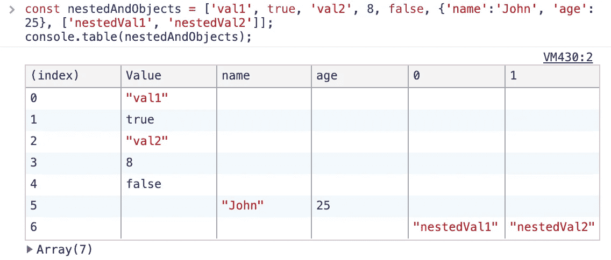

不太漂亮，但仍然非常容易阅读

## 目标

`console.table()`功能也可用于显示对象。假设我们有一个带有几个字段的用户对象:

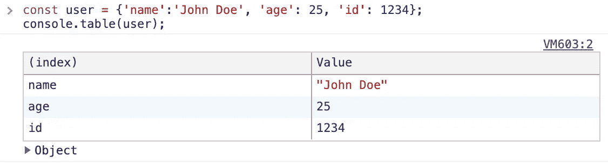

一个简单的物体，但我们已经可以看到一些力量

现在让我们假设我们有一个用户对象的完整数组。我们可以使用`console.table()`来按照易于阅读的顺序显示这些内容:

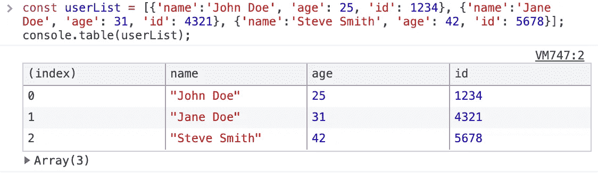

全部以表格形式呈现和说明

此外，由于`console.table()`函数可以接受额外的属性，我们甚至可以指定我们感兴趣的细节子集来过滤列:

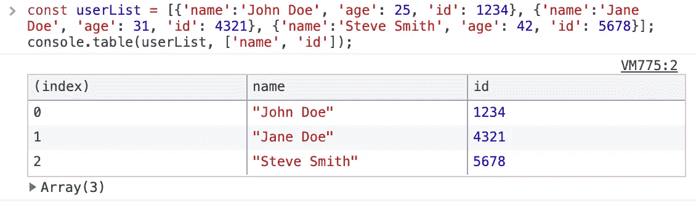

超级简单地看到我们需要的一切

# console.time()

最后，随着您的 web 应用程序或网站的增长，记录任务执行需要多长时间是很重要的。运行缓慢的功能可能会阻碍用户与网站的交互。为了记录每个功能所花费的时间，`console`有一些内置功能，可以准确一致地开始和停止计时。

要进行最基本的计时，只需添加`console.time()`来启动计时器，添加`console.timeEnd()`来停止计时器，并以毫秒为单位记录它已经运行了多长时间。

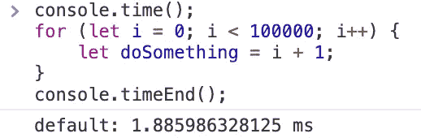

很容易掌握时间

如果您需要在结束计时器之前检查在特定点经过的时间，您可以添加一个`console.timeLog()`调用来获取当前时间。

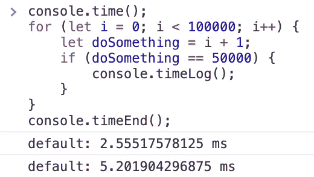

增加了一个中途检查站

最后，可能有必要一次添加多个计时器，比如说，如果你想一次为几个功能计时。所有三个`console`定时器函数都允许你以字符串的形式传入一个标签，以指示你希望启动哪个定时器，或者记录或停止——使得一次跟踪多个定时器变得容易。

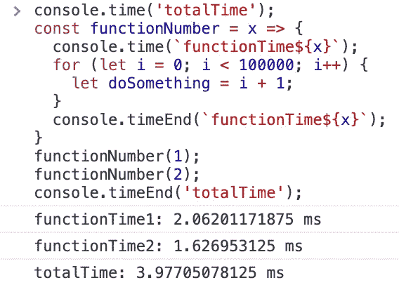

标签可以让多个计时器清晰可见

# 结论

无论您是希望计算函数的时间，确定某个值是否正确，或者只是希望日志的输出更易于管理，浏览器的控制台都提供了广泛的功能来改善您的开发体验。

不要简单地将`console.log()`作为一种工具用于每一个场合，花时间扩展你的技能，让事情变得更简单，这样你就可以把更多的时间花在重要的事情上。

# 资源

*   [MDN 控制台 API 文档](https://developer.mozilla.org/en-US/docs/Web/API/console)
*   [Chrome 控制台 API 文档](https://developers.google.com/web/tools/chrome-devtools/console/utilities#debugfunction)