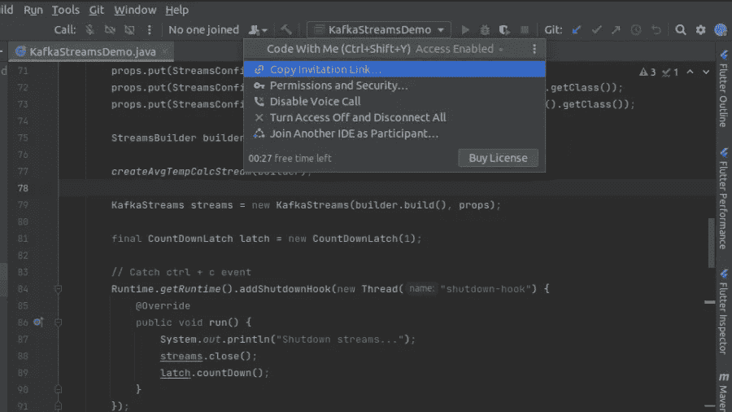
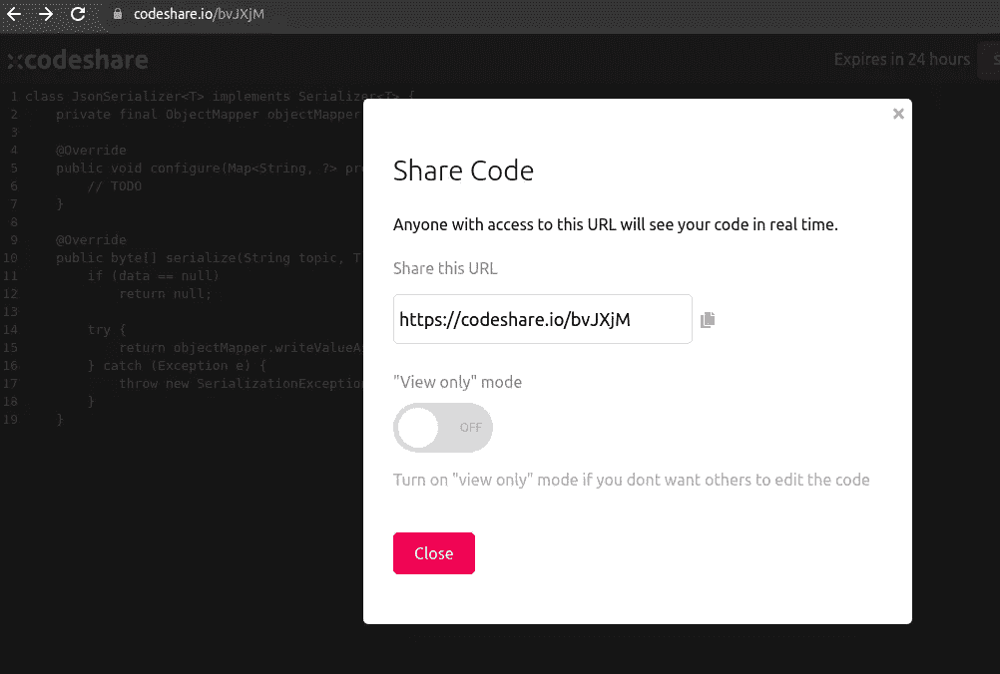
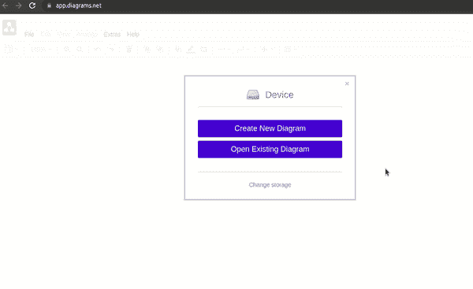
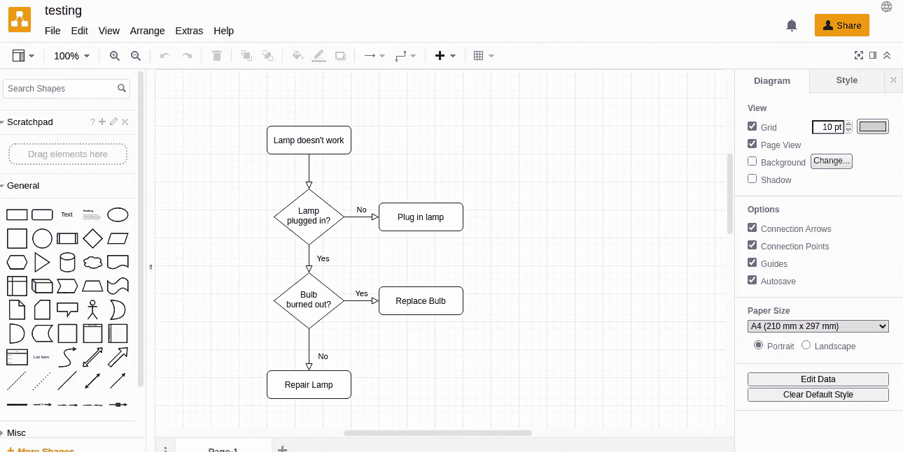
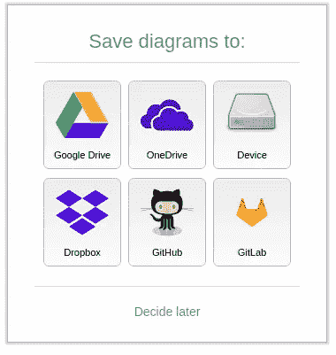
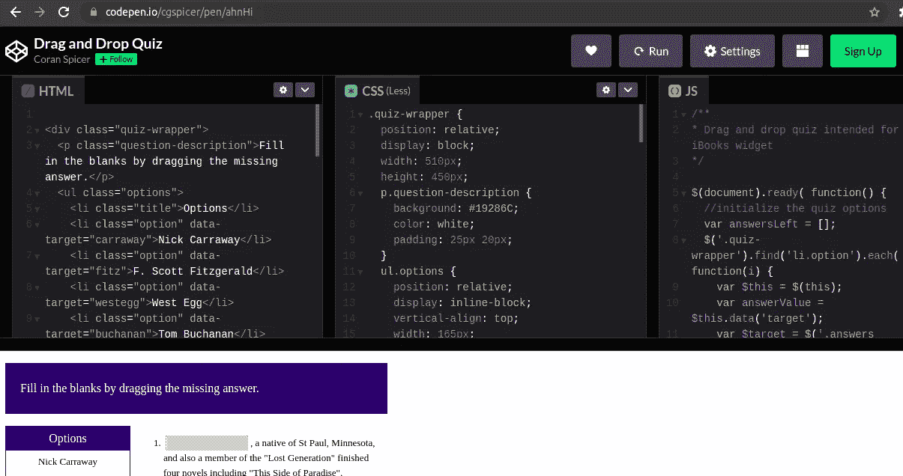
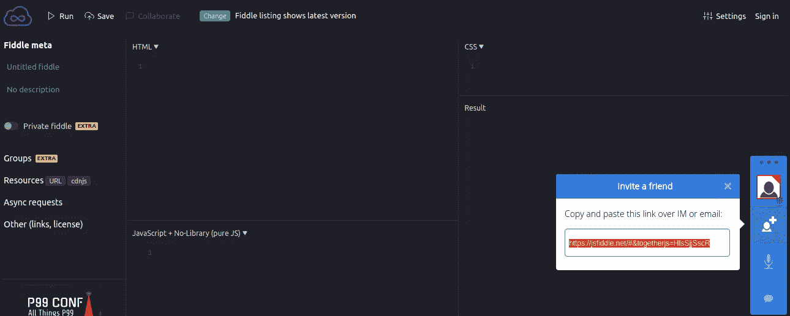
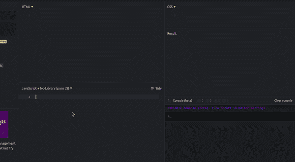

# 面向远程工作者的 5 款有用的开发人员协作工具

> 原文：<https://betterprogramming.pub/5-useful-developer-collaboration-tools-for-remote-workers-39795c3d2ff9>

## 在线与开发伙伴分享代码和想法

克里斯·蒙哥马利在 [Unsplash](https://unsplash.com?utm_source=medium&utm_medium=referral) 上的照片

有时，开发人员需要与其他人共享代码，以便一起教授、解释或解决问题。如果你在一家公司工作，你可以和同事分享你的屏幕。但是，如果你独自工作或建立一个爱好项目，了解方便的协作工具是有好处的。

在本文中，我将向您展示五个有用的协作工具，供开发人员共享代码、想法等。

我们开始吧！

# 1.与我一起编码 IntelliJ 插件

[Code With Me](https://www.jetbrains.com/code-with-me/) 是 JetBrains 推出的一款新插件，旨在促进开发者之间的有效合作。IntelliJ 2021.1 版本支持该功能。

它使您能够邀请他人加入您的 IntelliJ IDEA 工作区并实时共享代码。如果您想进行结对编程，同时在同一个 IDE 中编写代码，或者只是向他人解释代码，这是非常有益的。

在 Community Edition 中，您的会议时间限制为 30 分钟，最多三位客人，但好消息是会议次数是无限的。

插件概述:

IntelliJ IDEA 中的随我编码插件

您只需复制邀请链接，并将其发送给您的朋友，以加入该会话。您还可以使用音频、视频、聊天和屏幕共享。该功能是基于权限的，因此您可以决定是否授予其他人对工作区的只读或完全访问权限。

您的被邀请人不需要安装 IntelliJ IDEA。这减轻了必须克隆存储库、下载代码、建立环境等的负担。

该会话具有端到端加密。如果您选择本地版本，您可以在您的私有服务器上运行它，以获得更高的安全性。

模式下的*特性具有基于上下文的代码自动完成功能。这样，您可以看到被跟踪的客人使用的完成建议。*

# 2.代码共享

当你想与他人分享代码或代码摘录时，Codeshare.io 非常有用。免费使用。

比如你觉得卡住了，想听听别人的看法，就贴上相关代码，分享链接。

代码共享代码摘录

代码共享中的共享代码

如果您授予编辑权限，每当有人修改您的代码时，它都会自动更新。

该链接将持续 24 小时。如果你注册了，你可以保存你的代码片段供以后使用。

一些公司在面试中用它来给开发人员分配任务并实时跟踪进度。

# 3.图表

有时候你需要创建一个数据库模型，设计一个原型，画一个看板等等。Diagrams.net 允许你在浏览器中免费完成所有这些工作。

您可以在多个模板中进行选择:

从模板创建图表的 app.diagrams.net 演示

例如，流程图如下所示:

流程图示例

您可以将图表下载到本地或云端:

保存图的源

你只需要授权给 diagrams.net。例如，您可以选择 GitHub 并将文件立即保存到 repo 中。然后就可以和贡献者分享了。

# 4.密码笔

[Codepen.io](https://codepen.io/) 是一款面向前端开发者的友好代码共享工具。它的在线编辑器支持 HTML、CSS 和 JS 代码。

Codepen 笔示例

它允许你搜索其他人的*笔*，在那里你可以找到现成的原型。

通过共享链接，您可以让其他人访问您的代码。例如，它可以用来举行一个演示，或者如果你需要一个代码审查。

该工具是免费的，但如果你想拥有一个私人*笔*，你必须切换到 Pro 版本。

# 5.JSFiddle

[JSFiffle.net](https://jsfiddle.net/)类似于 Codepen。它面向前端开发者，支持 HTML、CSS 和 JS 代码。

工作区提供了更复杂的功能，如协作。你可以开始一个会话，同样地，你可以邀请其他人加入。还支持聊天和音频。

jsdild 工作区

您也可以使用不同的库。它对语言和扩展有丰富的支持，如下所示:

JSFiddle 语言支持

协作很简单——编写一些代码并与其他人共享 URL。

# 结论

在本文中，我向您展示了一些方便的远程团队协作工具。您可以与其他人共享项目，而无需他们设置任何其他环境。分享只是发送一个邀请网址。

有了这些工具，结对编程、故障排除、项目原型设计变得轻松而有效。

欢迎分享您最喜欢的协作工具。我希望你喜欢这篇文章。感谢您的阅读，下次再见！