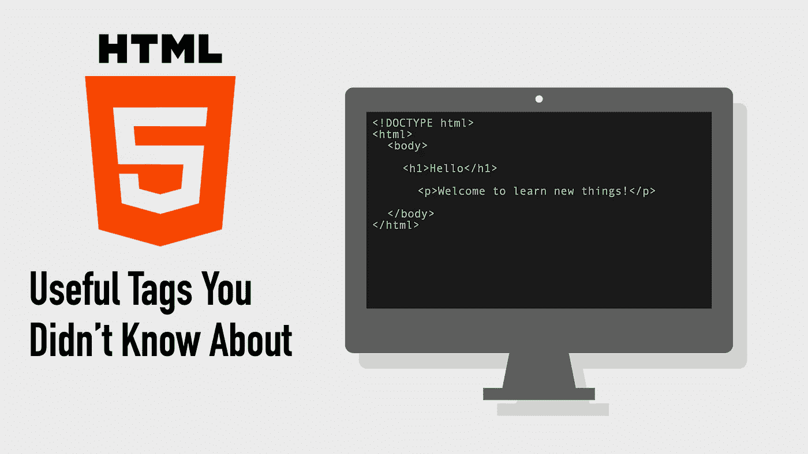
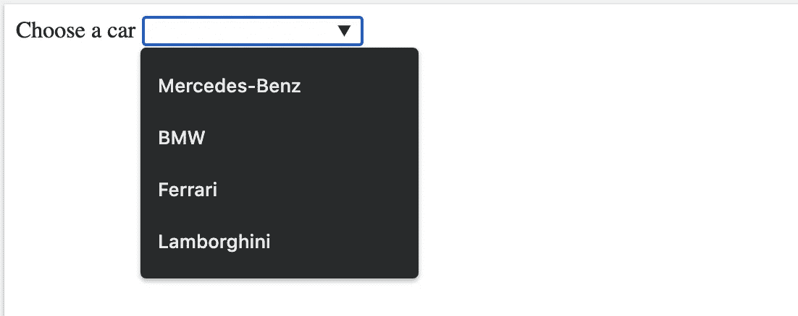
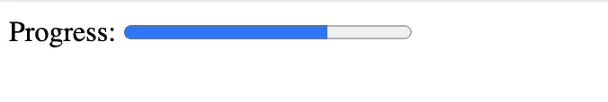
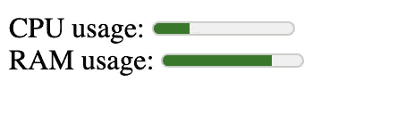
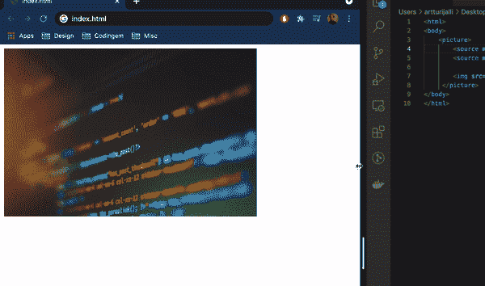
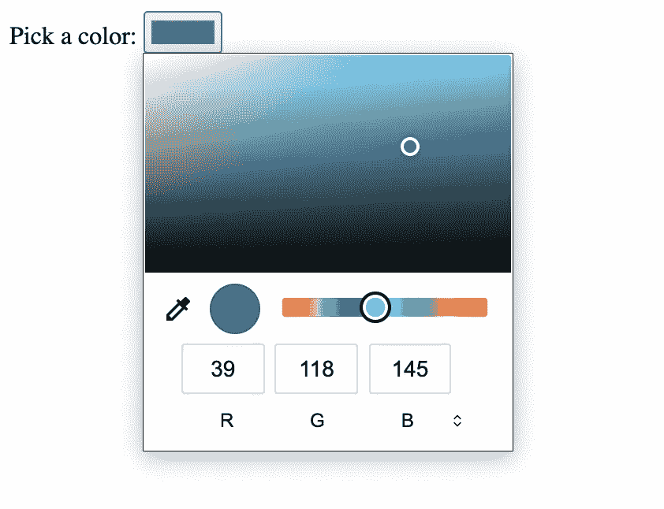

# 你不知道的 5 个有用的 HTML 标签和属性

> 原文：<https://betterprogramming.pub/5-useful-html-tags-and-attributes-you-didnt-know-about-1f07d5ff760e>

## 有用但不受欢迎的 HTML 标签/属性



图片来源:作者

# 1.输入建议

使用`datalist`标签结合输入列表显示建议。为了连接`input`和`datalist`，`input`字段的列表属性必须与`datalist`的 ID 相同:

```
<label for="car">Choose a car</label>
<input list="cars" name="car"><datalist id="cars">
  <option value="Mercedes-Benz">
  <option value="BMW">
  <option value="Ferrari">
  <option value="Lamborghini">
</datalist>
```

结果:



输入字段建议由数据列表提供的值。

# 2.进度条

您知道 HTML 有一个`progress`标签可以用来表示任务的进度吗？

你可以这样使用它:

```
Progress:
<progress value="71" max="100">
</progress>
```

结果:



在 HTML 中使用进度标签的整洁的小进度条

就这么简单！

# 3.测量给定范围内的数据

您可以使用`meter`标记来测量给定范围内的数据:

```
<label for="CPU_usage">CPU usage:</label>
<meter id="CPU_usage" value="5" min="0" max="20">5 out of 20</meter><label for="RAM_usage">RAM usage:</label>
<meter id="RAM_usage" value="0.78">78%</meter>
```

结果:



用两个量表描述 CPU 和 RAM 的使用情况

不要将`meter`与`progress`标签混淆！

# 4.在较小的视图上自动更改图像

您可以使用`picture`标签为较小的视窗显示主图像的替代版本:

```
<picture>
        <source media="(min-width: 600px)" srcset="img_wide.jpg">
        <source media="(min-width: 260px)" srcset="img_narrow.jpg"> 
</picture>
```

这会导致以下行为:



视窗大小的改变触发了图像的改变。 [Unsplash](https://unsplash.com?utm_source=medium&utm_medium=referral) 上 [Roozbeh Eslami](https://unsplash.com/@roozbeheslami) 和 [Shahadat Rahman](https://unsplash.com/@hishahadat) 的功劳。

# 5.颜色选择器

一个`input`标签可以很容易地被配置成显示一个全功能的颜色选择器。只需将输入的`type`属性指定为`"color"`:

```
Pick a color:
<input type="color">
```

结果:



只有一个 HTML 属性的全功能颜色选择器

# 额外收获:N 秒后自动刷新页面

通过配置 meta 标记，您可以定期自动刷新网页，如下所示:

```
<**meta** http-equiv="refresh" content="10">
```

使用这种设置，您的页面每 10 秒刷新一次。

# 结论

感谢阅读。如果你觉得这篇文章有用，请不要犹豫分享。

你有什么不常见但有用的 HTML 标签/属性吗？欢迎在评论区分享它们。

# 资源

[](https://developer.mozilla.org/en-US/docs/Web/HTML) [## 超文本标记语言

### HTML(超文本标记语言)是网络最基本的组成部分。它定义了…的含义和结构

developer.mozilla.org](https://developer.mozilla.org/en-US/docs/Web/HTML)