# 使用 Python OpenCV 的 5 种有用的图像处理技术

> 原文：<https://betterprogramming.pub/5-useful-image-manipulation-techniques-using-python-opencv-505492d077ef>

## 利用 OpenCV-Python 库对图像进行创作

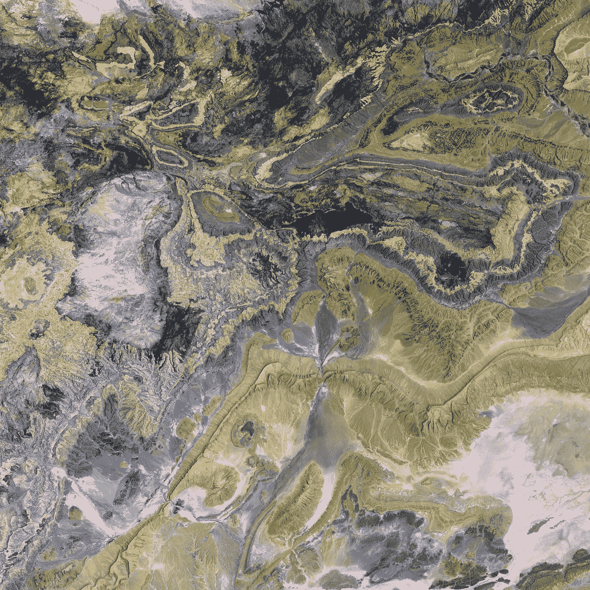

[USGS](https://unsplash.com/@usgs?utm_source=medium&utm_medium=referral) 在 [Unsplash](https://unsplash.com?utm_source=medium&utm_medium=referral) 上拍摄的照片

# 介绍

虽然许多程序员在日常工作中不需要担心处理图像，但我们可能不得不为小工作处理图像。例如，我们可能需要将数以千计的图像调整到特定的大小，或者我们可能需要为特定目录中的所有图像添加一个公共背景。如果没有程序化的解决方案，这些任务将会非常繁琐和耗时。

在这篇文章中，我想介绍五种使用 OpenCV 库的基本图像处理技术，这些技术可以满足一些需求。如果你的电脑上还没有安装 OpenCV，可以用 pip 工具非常方便的安装:`pip install opencv-python`。请注意，我们使用`import cv2`来使用这个库，这只是扩展了用`import cv`导入旧版本 OpenCV 的惯例。

一旦你能够毫无问题地导入库，你就可以在这个简短的教程中尝试一些功能了。出于演示的目的，本文将使用本文开头显示的图像。

在我们可以操作图像之前，首先要做的是读取图像，这可以通过`imread`函数方便地完成，如下所示。

读取图像

*   生成的数据是一个`numpy`数组。使用一个`numpy`数组允许我们像操作数组的数值一样操作数据。
*   图像的形状可以通过它的`shape`属性来访问。它告诉我们图像有多大，也告诉我们它的 BGR 标度的组成(即，蓝色、绿色和红色)。每种颜色构成 3D 阵列的矩阵。例如，如果我们需要得到蓝色刻度，我们可以使用索引`original[:, :, 0]`。
*   总像素数可以通过图像的`size`属性来访问。
*   了解`numpy`数组的数据类型也很重要。在许多其他应用程序中，`numpy`数组使用浮点数据类型。但是，在处理图像时，默认的数据类型是`uint8`。如果您再检查一下这些值的范围，您会发现下面的内容，这就是您对用整数形式的 RGB 值表示的颜色的预期。

```
>>> print("Value Range:", original.min(), '-', original.max())
Value Range: 0 - 255
```

# 1.调整图像大小

一个常见的任务是将图像调整到所需的大小。这可以通过`resize()`功能轻松完成。出于演示的目的，下面的代码只是向您展示如何将图像缩小到特定的大小。

调整图像大小

*   您将原始图像作为第一个参数传递给`resize`函数。
*   您将目标大小指定为一个元组。因为从前面的检查中我们知道图像是正方形的，所以我们通过将大小设置为正方形来保持纵横比。
*   另一个要考虑的有用参数是`interpolation`参数，它指定了我们想要如何为目标图像插值 BGR 值。在大多数情况下，用于较小图像的期望内插方法是线性内插(即 INTER_LINEAR)，而用于较大图像的期望方法是基于局部区域的内插算法(即 INTER_AREA)。
*   调整后的图像如下图所示。请注意，Medium 会自动将图像调整到相同的大小。通过放大较低像素的图像，分辨率会降低。这就是为什么你会看到从左到右分辨率逐渐增加。

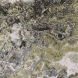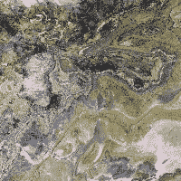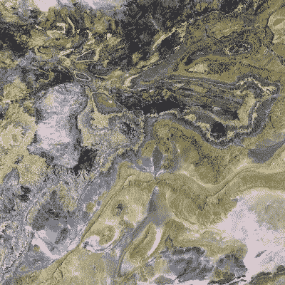

调整大小的图像(100 X 100、200 X 200 和 400 X 400)；作者创作修改自 [Unsplash](https://unsplash.com/@usgs?utm_source=medium&utm_medium=referral)

# 2.颜色变为灰色

要将图像从彩色转换成灰色，我们可以使用`cvtColor`函数，如下所示。

图像转换:彩色到灰度

*   `cvtColor`函数将原始图像作为它的第一个参数。
*   因为原始图像使用 BGR 标度(记住，它们有三个矩阵)，所以我们将颜色编码指定为 BGR2GRAY，这将生成灰度级的图像。
*   转换后，您会注意到图像已经简化为一个 2D 阵列，因为我们只需要单个值来表示灰度。
*   下图显示了彩色图像和灰度图像之间的对比。

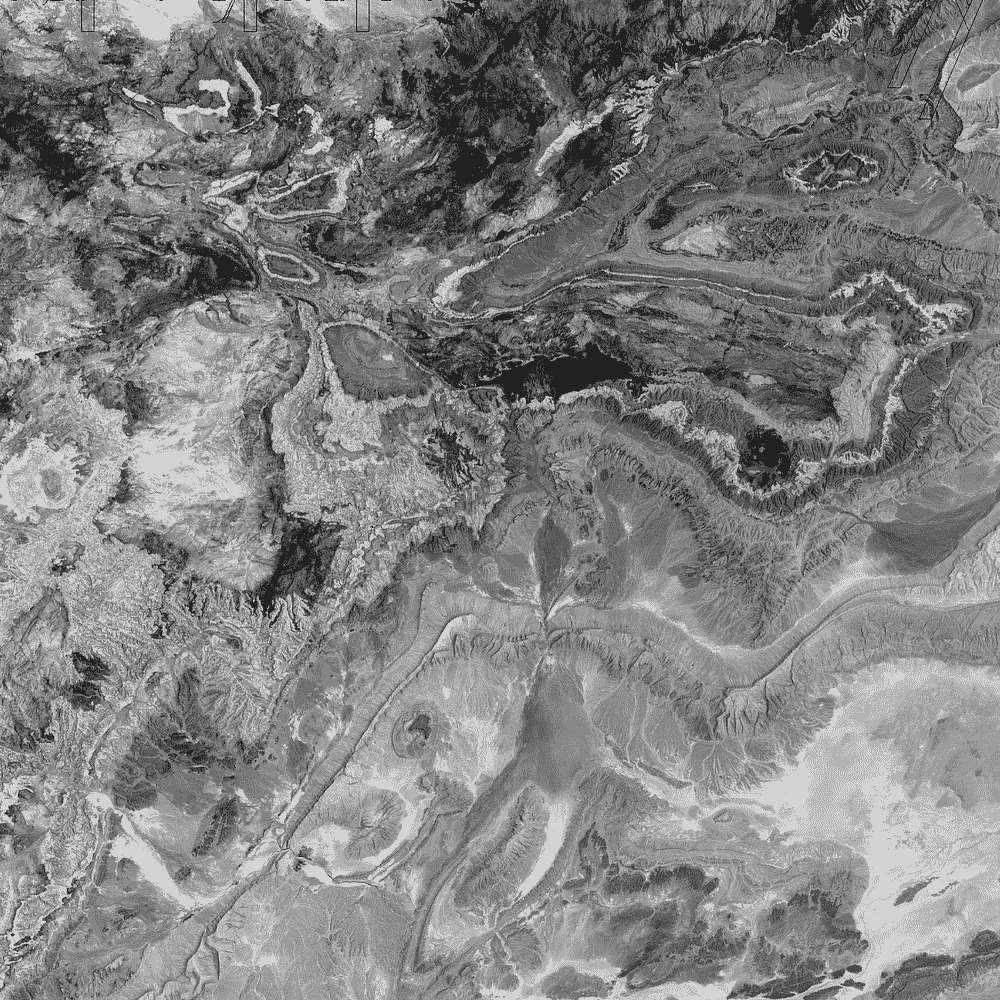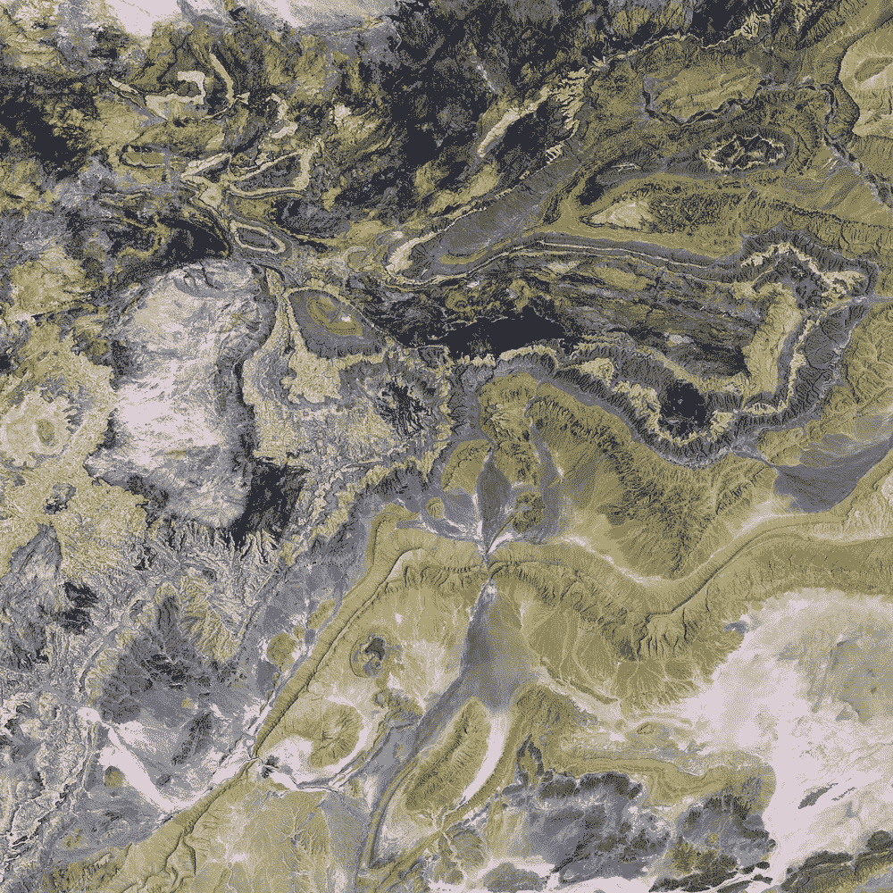

灰度与颜色(来源:[去毛刺](https://unsplash.com/@usgs?utm_source=medium&utm_medium=referral))

# 3.叠加图像

有时，我们需要为现有图像添加背景，以进行格式化。例如，通过填充纯色作为边距，我们可以使许多不同大小的图像变成相同的形状。这里有几种相关的技术。

创建纯色图像

*   上面的代码向你展示了如何创建一个纯色的图像。出于演示的目的，我用蓝色、绿色和红色创建了三个大小为 500×500 的图像。
*   需要注意的是，在正常的图像操作中，当我们提到图像尺寸时，我们通常使用宽度*高度。然而，`numpy`数组的形状使用先行后列进行索引，因此，图像的高度成为形状的第一个元素，而宽度成为第二个元素。
*   尽管被注释掉了，上面的代码还包含了一个字典理解，向您展示了如何在不使用`for`循环的情况下创建相同的字典。

我们已经创建了三个纯色的图像，我们可以使用它们作为背景，并在它们上面覆盖一些图像。

叠加图像

*   `overlay()`功能将正面图像叠加到背面图像上。
*   默认情况下，前面的图像将被放置在左上角，其坐标为(0，0)。如果两个数字都在增加，说明位置向右下角移动。你如何使正面图像居中？你只需要计算出想要的位置。我将把计算留给你，这应该很简单。
*   出于演示的目的，我将调整后的图像叠加到我们在上一节中创建的纯色背景图像上。这些图像的最终结果如下所示。回想一下，调整后的图像的宽度分别为 100、200 和 400。您将看到这些图像在 500 x 500 背景上的比例与您预期的一致。

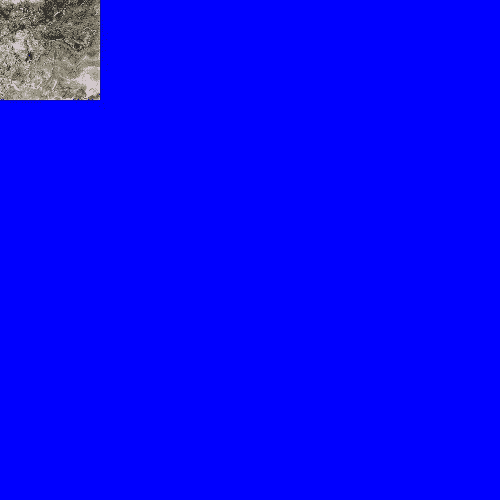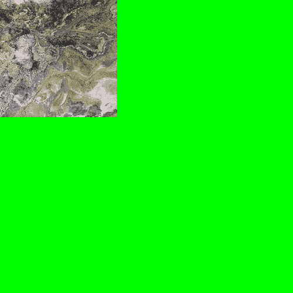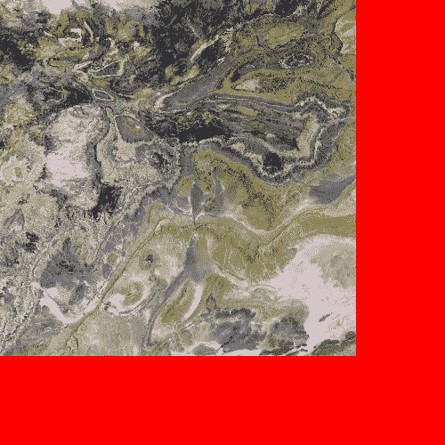

重叠的图像(来源:[去飞溅](https://unsplash.com/@usgs?utm_source=medium&utm_medium=referral)

# 4.添加文本

有时候，我们需要在现有的图片上添加一些文字。`putText()`功能旨在执行该任务。下面的代码向您展示了如何向图像添加字符串。为了使文本更容易被注意到，我将使用下面的代码将文本添加到上一节中创建的带有纯色背景的图像中。

向图像添加文本

*   `putText`函数的第一个参数是要添加文本的图像，第二个参数是要添加的文本。
*   要考虑的一个重要论点是文本的位置。在上面的代码中，我只是用了一些幻数。在许多情况下，我们希望在图像的中心添加文本。我们如何做到这一点？我马上给你看。
*   其他参数包括字体、字体比例和颜色。在上面的代码中，我选择了白色。

要在图像中心添加文本，我们需要计算文本的正确位置。但是，前提是要知道文字在空间中会占据多长时间。下面的代码向您展示了如何做到这一点。

文本居中的图像

*   `getTextSize()`功能将计算指定字体和字体比例下的文本大小。请注意，这个函数返回一个元组，第一个元组表示文本的大小。
*   默认情况下，当我们没有指定 x 或 y 参数时，`draw_text()`函数会将文本添加到图像的中心。
*   之前和这里创建的图像如下所示。

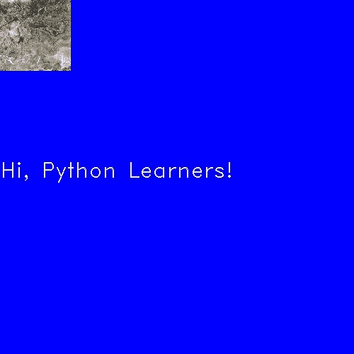

带文本的图像(左对中)

# 5.旋转和翻转图像

也可以通过编程来旋转图像。您可能已经注意到，当我们在 Python 中使用 OpenCV 时，我们正在处理`numpy`数组。因此，旋转图像实质上就是旋转`numpy`阵列。OpenCV 中有一个方便的方法——`rotate()`来实现这种旋转。

旋转图像

*   上面的代码显示了三种旋转:90 度、180 度和 270 度。
*   我在旋转之后添加了文本，所以所有的文本都处于正确的方向。
*   旋转后的图像如下所示。

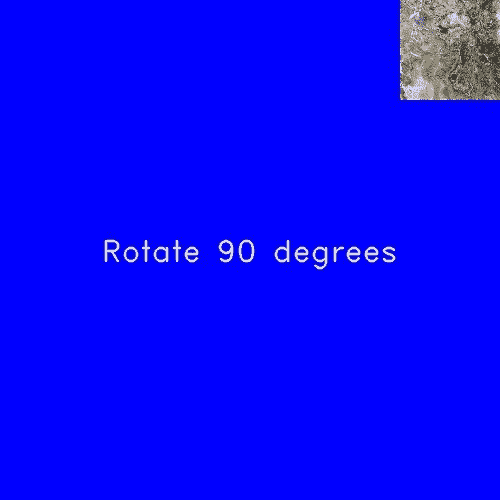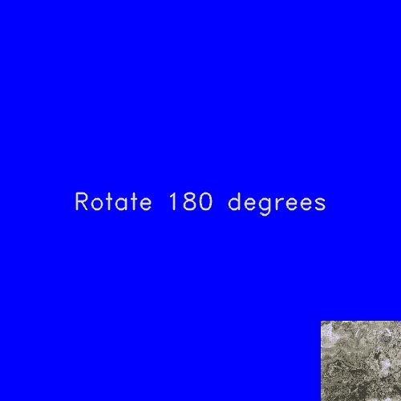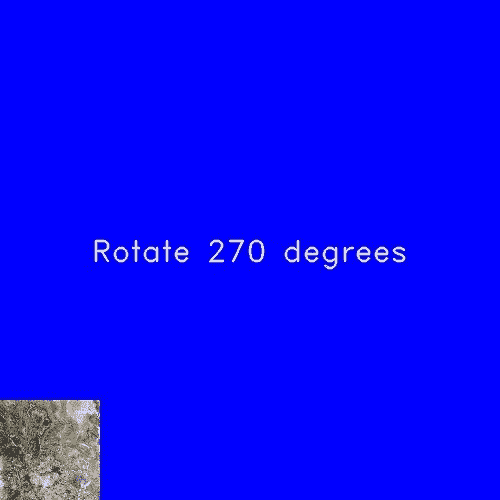

旋转图像(90 度、180 度和 270 度)

除了`rotate()`功能，我们还可以使用`flip()`功能来翻转图像。下面的代码向您展示了这种用法。

翻转图像

*   `flip()`函数将图像作为它的第一个参数。
*   对于翻转代码，当值为正时，翻转将是水平的。当它为 0 时，翻转将是垂直的，而当它为负时，它将水平和垂直翻转。
*   翻转的图像如下所示。请注意，之前显示了原始图像，它是 90 度旋转。

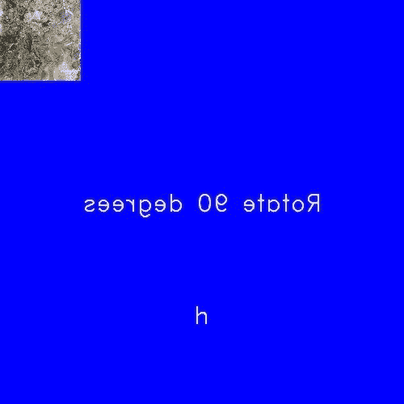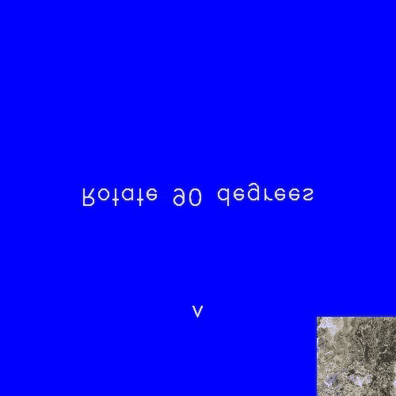

翻转图像(左:水平和垂直；中:横；右:垂直)

# 结论

在本文中，我们回顾了在 Python 中使用 OpenCV 的五种常见图像处理技术。我希望当您在自己的工作中处理图像时，会发现这些技术很方便。