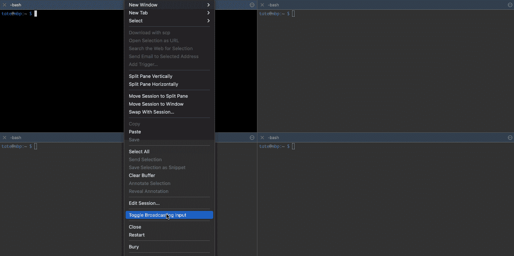
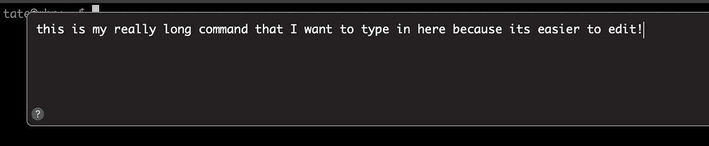
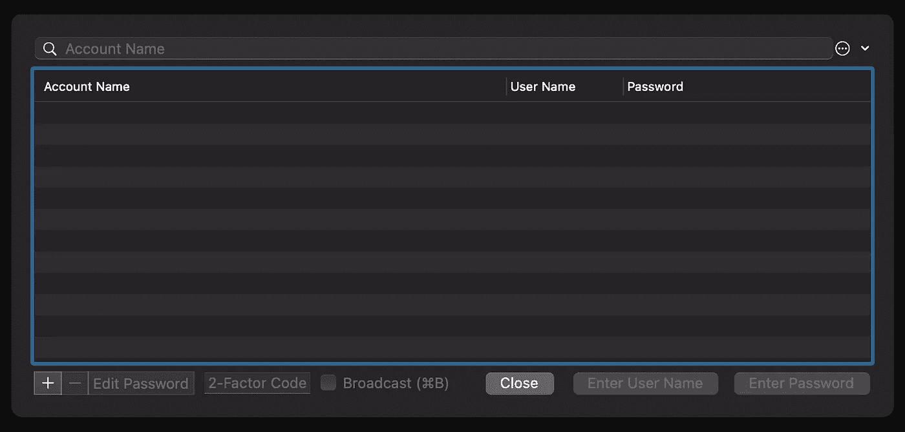

# 对开发人员有用的 5 个 iTerm2 特性

> 原文：<https://betterprogramming.pub/5-useful-iterm2-features-for-developers-bc211d697817>

## 简单而高效的选择，带来更快乐的终端体验

克里斯托夫·高尔在 [Unsplash](https://unsplash.com/s/photos/mac?utm_source=unsplash&utm_medium=referral&utm_content=creditCopyText) 上拍摄的照片

[iTerm2](https://iterm2.com/) 可以说是 macOS 最好的终端仿真器。你会得到一个时尚、高效、更不用说免费的开发平台。iTerm2 的特性集可以与许多其他付费选项相媲美。

强大的热键配置、无尽的分格布局和彩色标签只是众多可用功能中的一部分。

当你利用默认内置的所有小的物质享受时，iTerm2 的真正魔力就来了。在本文中，我们将详细探讨其中一些，以及它们如何真正提高你作为工程师的效率。我们去看看。

# 1.给你的标签着色

这一条乍看起来非常简单，但是相信我。给 iTerm2 中的标签着色可以让你在大脑中把每个标签分成自己整洁的小类别。这使得为特定目的(或语言)分割每个标签更加清晰。

为选项卡选择颜色。

就像在文件夹上贴上不同颜色的便利贴。你所要做的就是向下看一眼正确的颜色并选择它。这比每天盯着灰色标签的海洋要好。一旦我开始像这样组织我的终端，我就不用浪费太多时间筛选我的会议来找到正确的。

一组彩色选项卡。

作为一个额外的奖励，当你给你的标签着色时，你可以更快地在它们之间循环。我注意到，如果所有的选项卡都是默认的灰色，那么实际上很难分辨哪个选项卡被选中了。当你使用漂亮明亮的颜色时，更容易直接找到你想要的标签。

# 2.播散输入

如果您经常发现自己通过 SSH 连接到多台不同的机器，并且想要同时在所有机器上运行命令，那么这个特性将会让您大吃一惊。广播输入将您键入的任何内容同时发送到多个不同的会话。

使用广播输入跨四个会话运行命令。

如果你右击任何窗格并选择*切换广播输入*，它将使特定的窗格被广播到。您可以随意切换任意数量的窗格，一旦添加到组中，它们都将显示为活动状态。当你准备好了，只需输入命令，它们将被发送到所有切换的窗格。

您还可以使用此功能一次快速编辑多个文件，甚至通过同时运行一个命令的多个实例来生成测试数据/流量。

# 3.对长命令使用 Composer

去掉你那些恶心的 Bash 一行程序，因为使用 composer 窗口可以让编辑它们变得不那么烦人。也许您有介于一行程序和完整脚本之间的东西，您只想运行几次？作曲家来了！

使用命令编辑器窗口。

您可以选择*视图>作曲*或点击`Shift + Command + period`打开作曲窗口。你可以点击编辑，复制&粘贴容易，并组成多行命令。当你准备好发送它时，点击 *Shift + Return* 就可以看到奇迹发生了。

窗口中还有一个专用的作曲家命令历史记录。

# 4.使用密码管理器

如果你在想:*“但是我已经有一个密码管理器了！”不要烦恼，因为这不是那个的直接替代。*

当您需要在命令行上输入任何密码时，iTerm2 密码管理器的功能就会大放异彩。如果您经常登录相同的 CLI 服务，或者需要在终端中输入一致的登录密码，那么这将为您节省大量时间。

iTerm2 密码管理器菜单。

打开密码管理器只需选择*窗口>密码管理器*或点击`Option + Command + F`。一旦管理器打开，您可以添加所有您想要的帐户，甚至设置双因素身份验证。

一旦你的密码存储在密码管理器中，你需要做的就是点击`Option + Command + F` *，*使用箭头键选择正确的帐户，然后点击回车。您的密码将自动填入终端。这比不得不切换到您的密码库，复制，然后手动粘贴回终端。

请记住，在纯文本提示中输入您的密码并不是一个好主意，只能在模糊的密码提示中输入。如果您忘记了，iTerm2 会检测到这一点，并在继续之前警告您。

# 5.即时重播

你在 scrollback 丢过东西吗？错过了一些重要的命令输出？即时回放是 iTerm2 中最酷的功能之一，它可以准确地向你展示刚刚发生的事情。准备好回到过去。

即时回放模式。

你所要做的就是选择*查看>开始即时回放*或者点击 *Cmd + Option + B* 。您将看到一个简单的滑动模态窗口和所有最近终端操作的时间戳。你可以回顾每一个动作来详细了解过去。每次你移动滑块，终端窗口将显示当时发生了什么。

另外，您还可以将该录音导出为一个`.itr`文件供他人查看。你运行了你说的命令的最终证据。

感谢阅读！如果你喜欢这篇文章，你可能会喜欢:[开发人员的基本 iTerm2 调整](https://levelup.gitconnected.com/essential-iterm2-tweaks-for-developers-216cd807ad7f)。