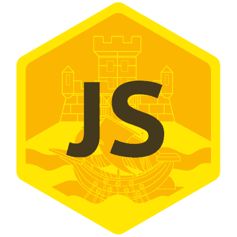

# 3 个有用的 JavaScript 片段

> 原文：<https://betterprogramming.pub/5-useful-javascript-snippets-fb3bafe9dc56>

## 自动提交到 Gitlab，用 X 键和 Y 值创建对象，等等

# **1。自动提交到 Gitlab**

下面的代码片段将文件上传到 Gitlab 仓库。
你可以在你的 CI/CD 管道或者你的后端使用这个代码片段来保持文件在某个事件发生时更新。

以编程方式提交到 Gitlab

# **2。用 X 键和 Y 值创建对象**

如果您将 11 更改为另一个数字，您将更改对象的大小(键的数量),如果您更改“true ”,您将更改所有键的值:

# 3.按顺序运行承诺

下面的 gist 将遍历数字 1 到 150，一次执行一个异步函数。

如果你用 throttle 请求一个 API，或者如果你的异步函数占用了大量的内存或 CPU，那么你不能并行执行它们，这可能是有用的。

感谢阅读。