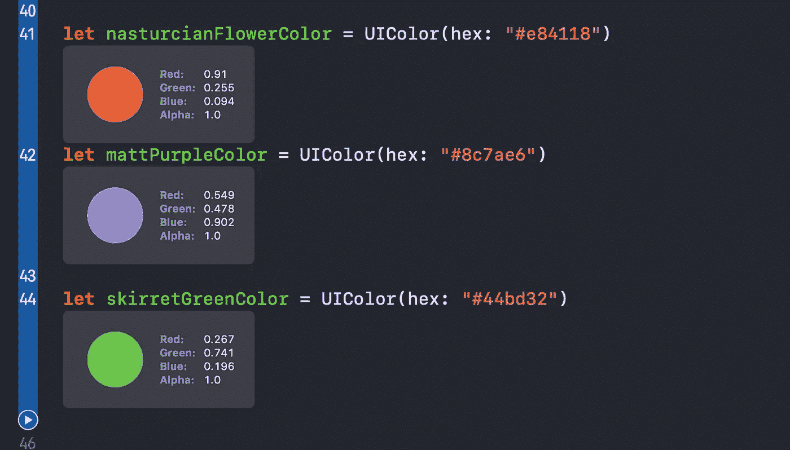
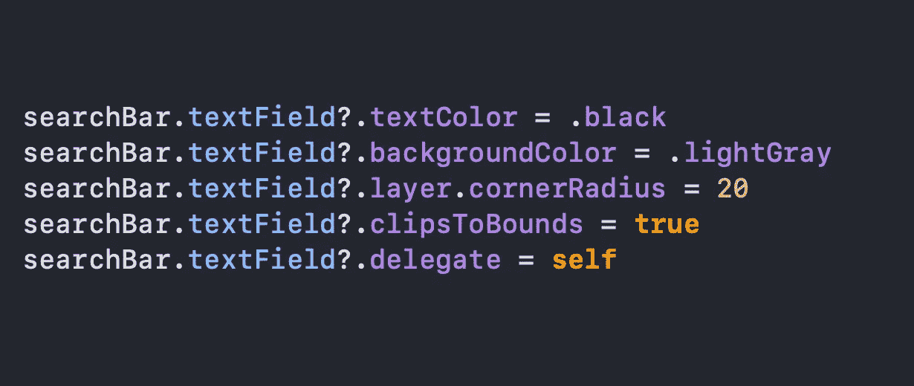
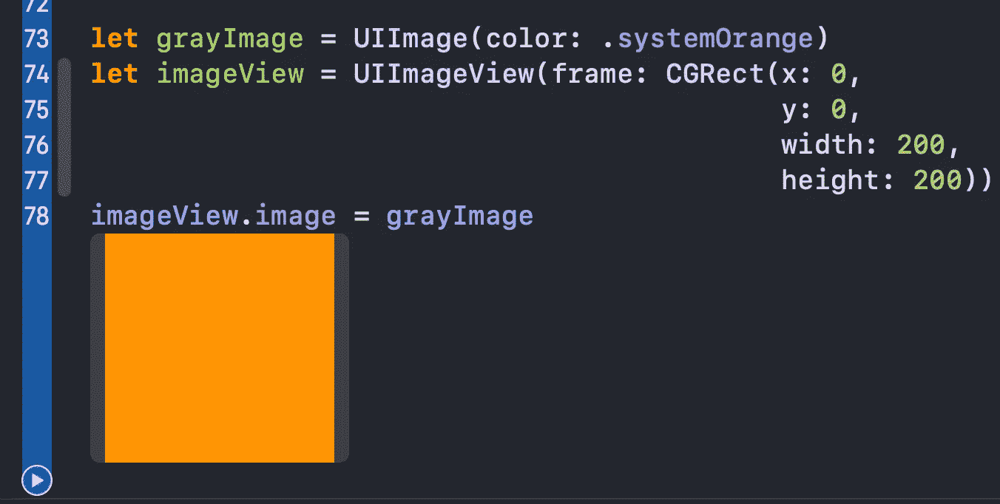

# 在您的 iOS 应用程序中使用的 5 个有用的 Swift 扩展

> 原文：<https://betterprogramming.pub/5-useful-swift-extensions-to-use-in-your-ios-app-f54a817ea9a9>

## 让你的开发过程更快一点

Dmitry Chernyshov 在 [Unsplash](https://unsplash.com?utm_source=medium&utm_medium=referral) 上拍摄的照片

今天，我们将快速探索一些出色的 Swift 扩展，您可以将它们复制并粘贴到您的应用中，以满足您的需求。

所有扩展的源代码都可以在文章的底部找到。

# UIColor

有没有想过使用十六进制的*而不是创建一长串红色的*、*绿色的*、*蓝色的*和*阿尔法的*组合？这个扩展是为了营救:**

下面是我们如何使用它(代码在 Xcode 操场上运行):

我们可以使用伟大的网站[https://flatuicolors.com/](https://flatuicolors.com/)来玩不同的十六进制颜色。

# UISearchBar

你曾经需要访问搜索栏的文本字段吗？在 iOS 13.0 中，我们可以这样直接访问它:

`print(searchBar.searchTextField)`

然而，如果我们的用户有更低的 iOS 版本，应用程序将崩溃。我们可以使用以下代码获得文本字段:

如果我们每次需要访问一个文本字段时都必须编写冗长的`if else`语句，那就不太方便了，所以我们有下面这个强大的扩展来处理这个问题:

现在，我们可以访问文本字段，而不用担心具体的 iOS 版本，因为一切都是在后台完成的:

# UIImage

有时我们想为`UIImageView`显示一个单音占位符，但是我们需要为此提供一个特定的资产。如果我们可以用一种特定的颜色创建一个图像会怎么样？

这个扩展允许我们用`UIColor`创建图像:

# 数字的

我们有时需要在应用程序中显示价格。但是没有空格的值(例如 235000 *)* 看起来不太好，所以我们可能想在数字中插入一个分隔符。这个简短的扩展使我们能够非常容易地做到:

让我们看看如何使用它:

# UITableViewCell 和 UICollectionViewCell

你不需要告诉我你写了多少次这段代码:

我们可以看到，我们需要创建一个属性`cellId`，然后在任何需要的地方传递它。但是怎样才能使这段代码更简洁呢？考虑这个协议和符合它的扩展:

现在我们能够直接从`UITableViewCell`或`UICollectionViewCell`子类中访问`reuseIdentifier`:

# 资源

这些扩展的完整源代码:

# 包扎

对缩短 Swift 代码并提高其效率的其他方法感兴趣吗？考虑看看我的相关文章，可能对你有帮助:

 [## Swift 中的等价协议是什么？

### 轻松比较您的 Swift 对象的平等性

medium.com](https://medium.com/better-programming/what-is-the-equatable-protocol-in-swift-f3238f6821d6)  [## 何时在 Swift 中使用类似协议

### 这个协议对于定制数组的排序非常方便

medium.com](https://medium.com/better-programming/when-to-use-the-comparable-protocol-in-swift-b9f137b07413)  [## Swift 中的 CustomStringConvertible 协议是什么？

### 剧透:它让调试 Swift 对象变得容易多了

medium.com](https://medium.com/better-programming/what-is-the-customstringconvertible-protocol-in-swift-4b7ddbc5785b)  [## Swift 中的 OptionSet 是什么，何时应该使用它？

### 通过实际的列举比较

medium.com](https://medium.com/better-programming/what-is-optionset-in-swift-and-when-you-should-use-it-419777f3c39)  [## Swift 中的 vDSP 框架是什么？

### 优化您使用 Swift vectors 的方式

medium.com](https://medium.com/better-programming/what-is-the-vdsp-framework-in-swift-fe2539693e9a) 

感谢阅读！