# 改写 Git 历史的 5 个有用技巧

> 原文：<https://betterprogramming.pub/5-useful-tricks-to-rewrite-your-git-history-92268f8b6933>

## 挤压、撤消最新提交，等等


[扬西·敏](https://unsplash.com/@yancymin?utm_source=unsplash&utm_medium=referral&utm_content=creditCopyText)在 [Unsplash](https://unsplash.com/?utm_source=unsplash&utm_medium=referral&utm_content=creditCopyText) 上的照片

我相信现在每一个开发都应该和 Git 一起完成，Git 是一个强大的协作工具，可以跟踪项目中发生的每一个变化，这样开发人员就可以有一个很长的历史记录。这是非常有用的，尤其是当我们在团队中工作的时候。但是我个人会把它添加到我所有的项目中，即使我是一个人在工作。为什么？因为我可以很容易地跟踪我过去做了什么，并且很快地跟踪到错误和错误。

在本文中，我们将讨论一些有用的技巧，我们可以用它们来干净地管理我们的 Git 提交。

1.  组合多个提交(挤压)
2.  编辑旧的提交消息
3.  撤消最近的 *N 次*提交
4.  删除旧的提交(在历史列表的中间)
5.  将修改后的提交(之前已经提交过)推送到您的远程存储库

正如 Git [文档](https://git-scm.com/book/en/v2/Git-Tools-Rewriting-History)中提到的，它基本上没有提供修改历史工具，但是我们可以利用`rebase` [工具](https://git-scm.com/docs/git-rebase)来交互式地修改旧的提交。

# 我需要修改我的旧提交吗？

首先，我们来了解一些场景。

## 场景 1。

作为一名开发人员，大多数时候，当更新代码时，我总是希望将它保存在 Git 中，这样我就可以跟踪更改，即使更改非常小(以便轻松跟踪哪些代码工作正常，哪些代码有 bug)。所以我放了一个简单的信息，让我知道发生了什么变化。我不断地为每一个小的变化添加更多的提交。过一会儿，当任务完成时，我需要将所有这些小的更改合并到一个提交中。是的，这需要一个技巧来完成。

## 场景 2。

在第二个场景中，我需要编辑一些提交消息(我之前已经添加了)。例如，开发实践中总是在提交消息前添加一个票证问题编号，如“问题-781:修复了设置页面中按钮动画的小故障”或“#541:已解决的约束错误”

## **小心点**


照片由[马克·里切尔斯](https://unsplash.com/@mriechers?utm_source=unsplash&utm_medium=referral&utm_content=creditCopyText)在 [Unsplash](https://unsplash.com/?utm_source=unsplash&utm_medium=referral&utm_content=creditCopyText) 拍摄

这篇文章中的技巧很简单，但不要太容易。**请仔细阅读每条指令，以防止任何提交丢失**。请至少尝试在一个样本项目(不是至关重要的项目)上做一些练习。此外，为了更安全，您可以在执行修改之前将项目复制或备份到另一个目录。一旦您对修改足够有信心，并且没有发生数据丢失，就可以删除备份项目。

不建议修改已经推送到服务器的提交。它会让其他开发人员对历史变更感到困惑。避免这样做，除非它非常重要，并且其他团队成员知道该修改。

那么，我们如何管理旧的提交呢？

# **1。组合多个提交(挤压)**

正如在上面的第一个场景中提到的，我们不想错过任何更改，所以我们继续为小的更新进行 Git 提交。假设我们有一个任务“创建配置文件页面”，我们有五个提交来执行子任务。最后，一旦模块完成，我们希望将所有的提交合并成一个提交，并重新表述消息。

首先，打开终端并转到特定的项目目录。运行`git log`来检查当前已经完成的提交。在下图中，我有五个与我想要合并的相同任务相关的最新提交。

```
$ git log
```

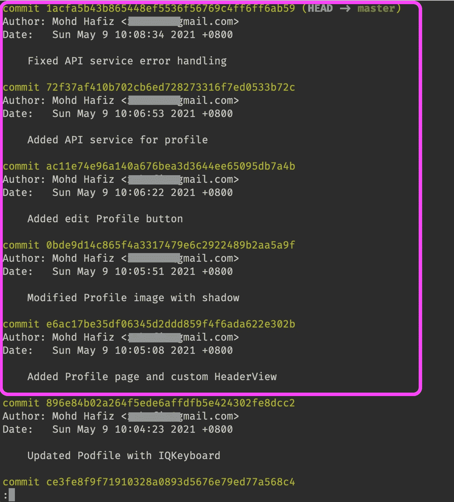

下面是使用 [zsh](https://ohmyz.sh) 的`glog`命令的简单输出。

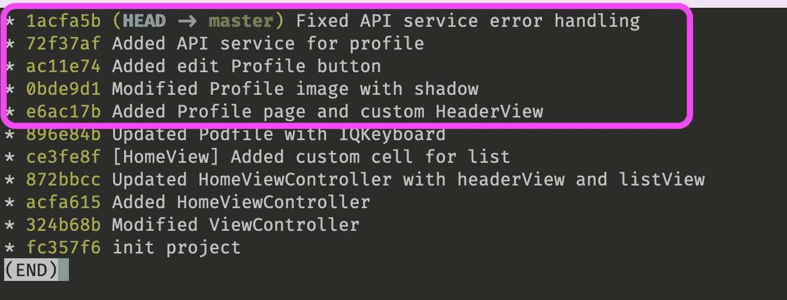

## **第一步。**

运行此命令修改之前的 *N* 次提交。在本例中，我有五个提交需要压缩并合并成一个提交。命令末尾的`5`表示我们要重定多少次提交。它可能会有所不同，这取决于您正在修改的提交数量。

```
$ git rebase -i HEAD~5
```

您将获得类似的输出，如下图所示。它将显示您经常使用的通用终端编辑器(在我的例子中是 vi 编辑器)。顶部显示的五个提交已经准备好进行修改了。底部(黄色框中)是我们可以执行的可用操作。

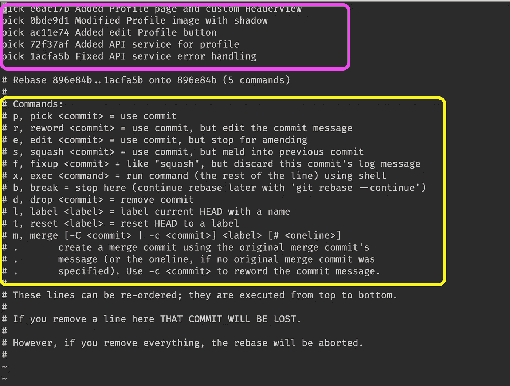

## **第二步。**

将单词`pick`改为`s`或`squash`来压缩这四个提交，并将最早的提交放在顶部。然后保存更改(取决于编辑器—对于 vi 编辑器，是 Esc，然后是`:wq`)。

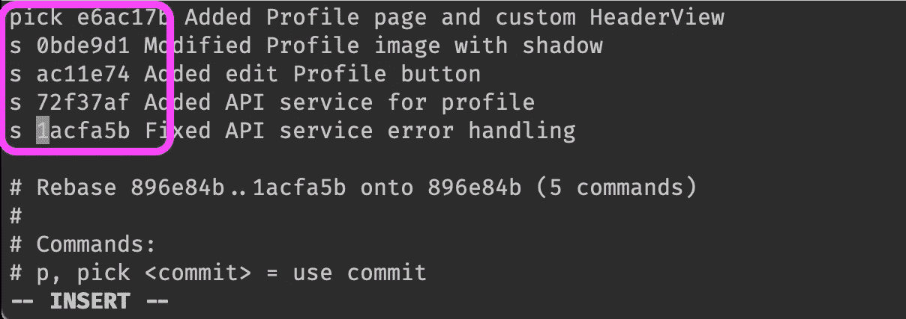

保存后，系统会提示您编写提交消息。

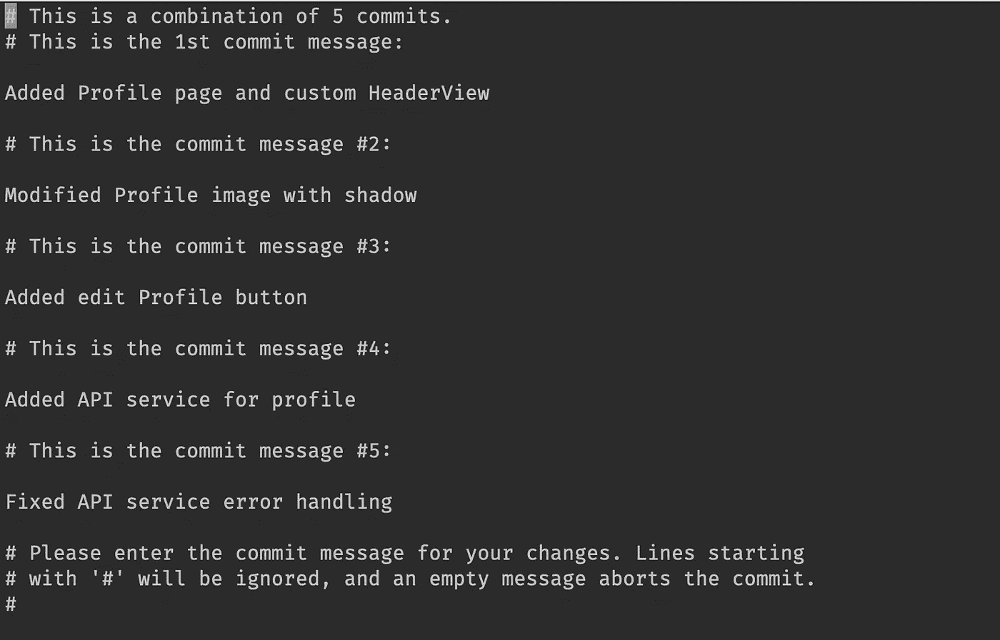

## 第三步。

有三个选项可以更新消息。

1)立即保存，不做任何更改。您将得到的结果是提交所有消息(写在多行中)。

2)删除所有以前的消息，并编写一个新消息。(有时我用这个来简化提交消息。)

3)您可以在顶部修改新消息，并留下其他提交消息(推荐)。例如，添加的新提交是“模块-134:完成的概要文件模块”所以我们仍然可以保留所有以前的消息。最终的提交消息将类似于下图所示。

```
**Module-134: Completed Profile module** // newly addedAdded Profile page and custom HeaderViewModified Profile image with shadowAdded edit Profile buttonAdded API service for profileFixed API service error handling
```

在本教程中，我们将使用第三个选项。您可以在顶部添加一条新消息作为组合消息。输出将是这样的。(注意，`#`之后的文本不会出现在提交消息中，所以可以忽略它。)

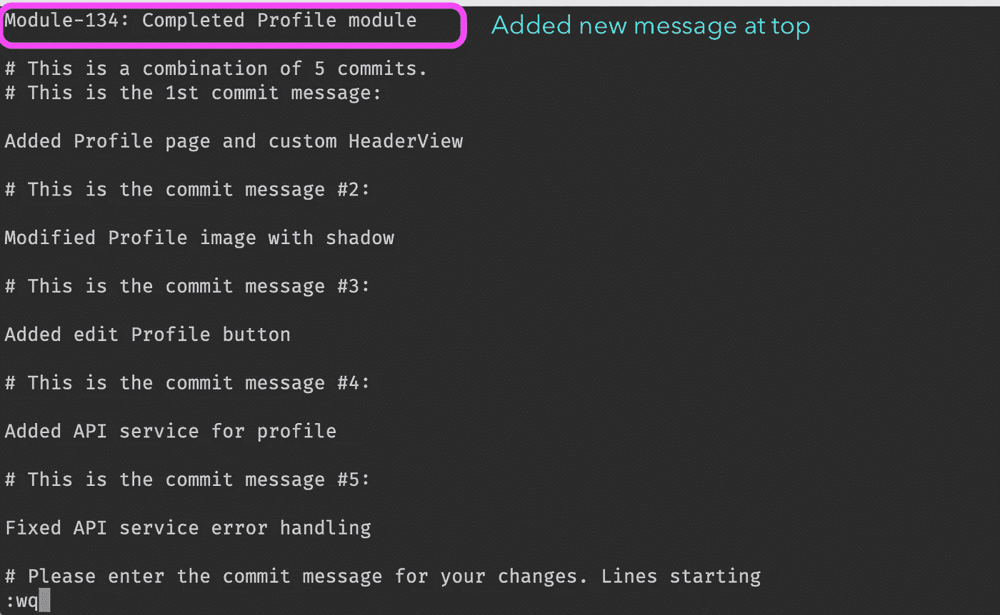

一旦成功保存，终端输出将类似于下图。

```
$ git rebase -i HEAD~5[detached HEAD c4aeecc] Module-134: Completed Profile module
Date: Sun May 9 10:05:08 2021 +08005 files changed, 5 insertions(+)create mode 100644 ProfileViewController.swift
create mode 100644 ProfileHeaderView.swift
create mode 100644 ProfileApiService.swift
Successfully rebased and updated refs/heads/master.
```

很好，让我们检查一下我们修改的提交中发生了什么。您可以使用`git log`或 [Sourcetree](https://www.sourcetreeapp.com) 进行检查。

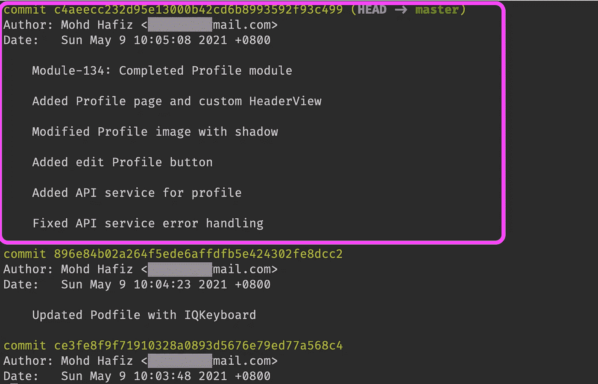

耶，我们做到了。现在，它变成了包含所有五条消息的单个提交。

## 这个怎么样？

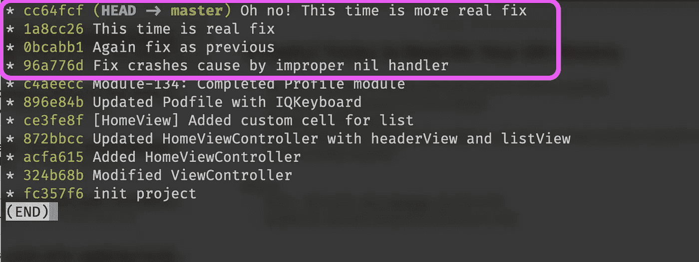

看看上面的图片。它展示了当我们试图修复一些讨厌的 bug 时经常犯的错误。这一招很有用，让它干净。运行这个命令，并遵循上面讨论的相同步骤。厉害！

```
$ Git rebase -i HEAD~4
```

# 2.编辑旧的提交消息

*“哦，不，我只需要更新我提交消息中的错别字！”*

是的，这也是我们经常做的事情，让一个 Git 提交一个错别字。在这一部分，我们将学习如何简单地编辑提交消息。当我们需要在旧消息前添加票据/问题编号时，这是必要的，否则它可能会出现打印错误。

该命令与之前相同，除了您需要选择的选项是`r`或`reword`。

在这个例子中，我需要在所有这四个提交前面加上一个特定于吉拉的问题号，即“WR-453”

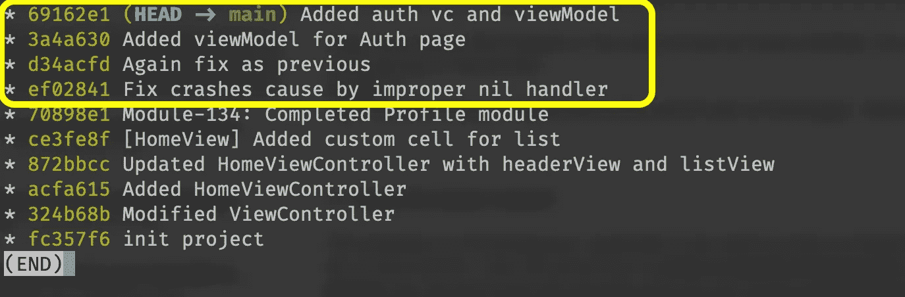

## 第一步。

运行相同的 Git `rebase`命令，其中 *N* 等于`4`。

```
$ git rebase -i HEAD~4
```

## 第二步。

将`pick`更改为`r`或`reword`，并保存。

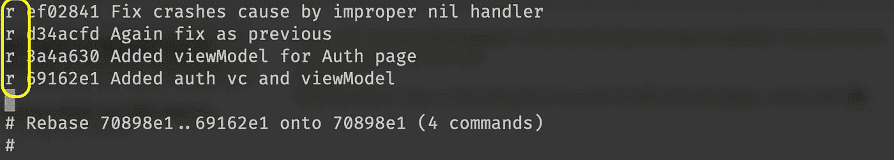

接下来，您将被提示以交互方式一个接一个地编辑这些消息四次。很好。继续编辑每条消息并保存，直到完成所有步骤。

看看下面的屏幕。它在消息的顶部显示我们正在编辑，在底部突出显示已完成和剩余步骤的注释。

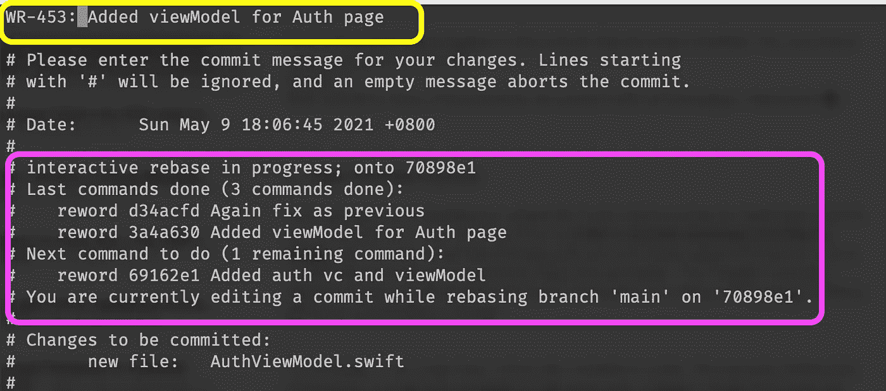

完成后，终端输出中显示的结果将类似于下图。此外，我们可以使用`git log`进行检查，以确保提交消息得到了相应的更新。

```
$ git rebase -i HEAD~4[detached HEAD 71ebada] **WR-453: Fix crashes cause by improper nil** handler
Date: Sun May 9 17:31:47 2021 +0800
1 file changed, 1 insertion(+)
create mode 100644 ViewController.swift[detached HEAD d48428a] **WR-453: Again fix as previous**
Date: Sun May 9 17:32:19 2021 +0800
1 file changed, 1 insertion(+)[detached HEAD 4c74ecc] **WR-453: Added viewModel for Auth page**
Date: Sun May 9 18:06:45 2021 +0800
1 file changed, 1 insertion(+)
create mode 100644 AuthViewModel.swift[detached HEAD a45b5fc] **WR-453: Added auth vc and viewModel**
Date: Sun May 9 20:16:50 2021 +0800
2 files changed, 2 insertions(+)Successfully rebased and updated refs/heads/main.
```

# **3。撤销最近一次提交**

撤销过程有点危险，尤其是当你想要撤销一个重要的或者大的提交时。一般来说，有两种方法可以撤销提交(除了使用`rebase`)。

## 撤消提交并分阶段保存文件(推荐)

使用这种方法，您不会丢失更改，并且您可以再次修改文件以供将来修改，或者干脆将它们扔进储藏室。“stages”通常发生在我们调用 Git add 命令时(记住 [stage 和 unstage](https://githowto.com/staging_changes) )。

该命令背后的过程是将 Git 头重置为先前指向的提交，并将受影响的文件从头之后的提交移动到阶段中。

例如，在我的例子中，我有两个提交要撤销。您可以根据想要撤销的提交数量来更改后面的数字。如果你只需要撤销最后一次提交，那么把它改成`1`。

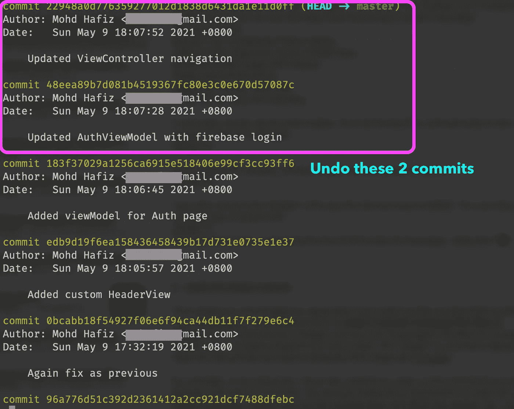

运行下面的命令，并使用`--soft`标志来执行，以保持文件在暂存状态。

```
$ git reset --soft HEAD~2
```

然后，当您运行`git status`来检查结果时，您将会看到撤消的文件仍然在阶段中。太好了！

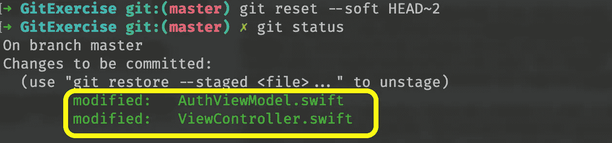

## 撤消提交并放弃所有更改

```
$ git reset --hard HEAD~2
```

**小心**并确保在命令末尾指定了正确的撤销数字。这与之前的安全撤销非常相似，除了这会用`--hard`标志替换`--soft`来忽略撤销提交中的更改。你可以参考[堆栈溢出](https://stackoverflow.com/q/927358/6132334)中关于撤销提交的详细讨论。

# 4.删除旧的提交(在历史列表的中间)

这很少实现，因为我们应该保留旧的提交，尽管提交中有错误。但是对于仍然在本地开发中并且需要一些清理的提交，我们可以使用这个技巧。

同样，我们需要检查我们想要删除哪个目标提交，并从最近的提交中计数 *N* 。然后我们使用与第一个技巧中演示的相同的 git `rebase`命令，但是现在使用了`drop`选项。

在下面的例子中，我想删除旧的提交(“添加的视差头……”)，它有错误，目前不需要。


运行该命令，将目标提交的`pick`更改为`d`或`drop`。在这种情况下，我们必须确保我们`rebase`直到完成六次提交(从顶部开始计数)。

```
$ git rebase -i HEAD~6
```

终端输出将交互提示要修改哪个提交。

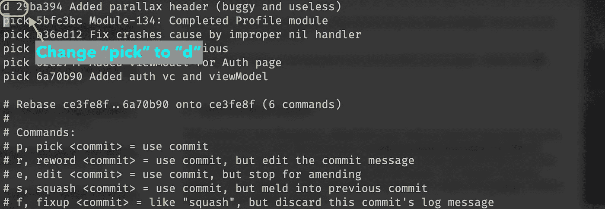

太好了！完成后，终端将显示成功消息:

```
Successfully rebased and updated refs/heads/main.
```

让我们运行 Git 日志来确保提交已经从这个世界上消失了。厉害！

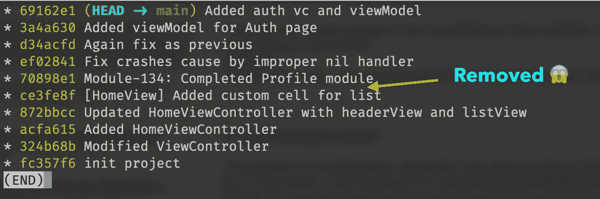

# 5.将修改后的提交(之前已经推送过)推送到远程存储库

在一些情况下，我们需要覆盖远程 Git 记录。例如，我们可能需要编辑我们的提交消息(在前面加上一个吉拉票号或者重新措辞)，删除一个导致项目问题的不必要的提交，或者清除 Git 历史。

因此，我们可以提取所有最近的提交，并开始在本地修改。然而，为了推送至远程服务器，我们需要添加一个标志来通知服务器我们正在强制进行更改。否则，服务器将在更新不同于已记录的历史时回复错误。

```
$ git pushTo github.com:xmhafiz/GitExercise.git
! [rejected] main -> main (non-fast-forward)**error: failed to push some refs** to 'github.com:xmhafiz/GitExercise.git'
```

因此，我们需要运行带有`--force-with-lease`标志的`push`命令，如下所示(成功输出)。

```
$ git push --force-with-lease
...
...
To github.com:xmhafiz/GitExercise.git+ 183f370...b33950e main -> main (forced update)
```

太棒了。现在您了解了如何正确地修改旧的提交。请小心地实现这些技术，并在实际项目中尝试之前做一些练习。

希望本文能帮助您提高开发技能。感谢阅读。非常欢迎反馈。祝你快乐！

# 参考

[https://git-scm.com/book/en/v2/Git-Tools-Rewriting-History](https://git-scm.com/book/en/v2/Git-Tools-Rewriting-History)

[https://git-scm.com/docs/git-rebase](https://git-scm.com/docs/git-rebase)

[https://stackoverflow.com/q/927358/6132334](https://stackoverflow.com/q/927358/6132334)